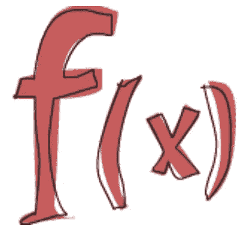

# 短时间学习 Haskell 可以很快提高您的打字技能！

> 原文：<https://itnext.io/a-short-time-learning-haskell-can-shortly-improve-your-typescript-skills-523505900ac0?source=collection_archive---------1----------------------->


几周前，我决定挑战自己学习 Haskell **。**我的动机是更好地掌握功能模式。(这样的**函子**或者**单子**这里还有很多→ [**模式库**](https://github.com/thma/LtuPatternFactory#the-patternopedia) )。在 Haskell 的一行代码中，你可以描述抽象的概念——这是非常强大的。

Haskell 不同于我所熟悉的其他语言。但我最终还是想出了一个在 TS 中实现仿函数的尝试，我称之为 [**【列表仿函数】**](https://stackblitz.com/edit/functor-explained) **。**你可以在我的[上一篇](http://degoes.net/articles/fp-glossary)上找到解释。顺便看看下面这个令人印象深刻的项目 [**fp-ts**](https://github.com/gcanti/fp-ts/blob/master/src/Functor.ts) 。



## 那么，学习一门纯函数式语言如何改进您在 Typescript 中的思维方式呢？

> 在纯粹的函数式编程中，你不告诉计算机做什么，而是告诉它什么东西是。

## 任何东西都可以被输入，让我们重新考虑一下我们的功能:

学习 Haskell 很短的时间，你就会开始到处看到类型。我立即开始在我写的任何 TS 函数上寻找类型模式。

让我们探索下面的 Haskell 片段:

```
add **:: Integer -> Integer -> Integer** *--function declaration* add x y =  x **+** y                       *--function definition*
```

**add** 函数声明的**类型为:**整数，另一个整数输出两个整数中的一部分。

在 TS 中，它将是:

```
**type** Add = (a: **number**, b: **number**) => **number**; *// type signature* **export const** *add*: Add = (num1, num2) => num1 + num2;
*add*(**'foo'**, 1); *// type error
add*(2, 1); *// boom*
```

你可以访问下面的 TS [playground](https://www.typescriptlang.org/play/index.html?e=26#example/typing-functions) 记录函数形状的例子！

## 将类型视为变量给我们带来了灵活性

在 Haskell 中，**类型变量**类似于**泛型**(由**小写字母**定义)。

以下代码片段表示元组的第一个项**:**

```
first :: (a, b) -> a
```

变量' **a** '可以是任何类型。

在 typescript 中，它可能看起来像:

```
**type** first = <T, X> ([a, b]: [T, X]) =>  T
**const** *fst*: first = ([a, b]) => a;
***console***.log(*fst*([**'foo'**, 666]));
```

如果我们要描述一个更复杂的函数，比如 **map()** 函数，它看起来会像:

```
map(transformFn: <T, V> (arg: T) => V ): MyFunctorContext<T> {
    **const** newItems = [];

    **for** (**const** item **of this**.**items**) {
        newItems.push(transformFn(item));
    }

    **return new** MyFunctorContext(newItems);
}
```

放大**变压器 Fn** 类型描述:

```
<T, V> (arg: T) => V 
```

变换函数的**输入**可以是任何类型(T)。因此，变换后的**输出** (V)可以是任何类型，但不同于输入类型！

## **类型约束:**

让我们关注一下 a 类型的某个**行为。如果我们将某个行为包含在一组**类型**中，我们就可以实现一个通用函数(多态函数)来操作它们。**

说一个类型需要的某个**行为(或属性)**实际上是在添加类型“约束”。

下面是一个在 TS 中添加类型约束的例子:(使用“extends”关键字)。

```
**interface** Instrument {
    **play**: () => **void**;
}**type** PlayFn = <I **extends** Instrument>(instruments: I[]) => **void**;**class** Guitar **implements** Instrument {
    play() {}
}

**class** Drums **implements** Instrument {
    play() {}
}

**const** *playPart*:PlayFn = (instrumets) => {
    instrumets.forEach(instrument => instrument.**play**());
};

*playPart*([**new** Guitar(), **new** Drums()]);
```

我们可以看到，在 TS 中，约束可以优雅地添加到函数类型的一行表示中:

```
**type** PlayFn = <I **extends** Instrument>(instruments: I[]) => **void**;
```

在 Haskell 的中，我们通过使用 [**类型类**](http://learnyouahaskell.com/types-and-typeclasses) **，**来引用约束，这通常被比作**接口。**

> 类型类是一种定义某些行为的接口。如果一个类型是 typeclass 的一部分，这意味着它**支持并实现了 typeclass** 描述的行为。

下面是一个使用类型变量约束的单行 Haskell 示例:

```
read :: (Read a) => String -> a
```

Read 是 Haskell lang 标准的一部分，它提供了解析字符串的操作，以获得它们可能表示的值。

函数 **read** 的类型为:[(Read a) = > String - > a]，它可以接受**实现**Read 行为的任何类型(‘a’)(作为约束)。

## 重新思考功能模式:

如果您对模式感兴趣，您将会非常欣赏以下资源:

[](https://github.com/thma/LtuPatternFactory#the-patternopedia) [## thma/LtuPatternFactory

### 我的第一个编程语言是 Lisp、Scheme 和 ML。当我后来开始用面向对象语言工作时，比如 C++和…

github.com](https://github.com/thma/LtuPatternFactory#the-patternopedia) 

函子是不同类型的函数表示，可以被映射。

Haskell 的仿函数 Typeclass 实现是:

```
**class** Functor f where
fmap :: (a -> b) -> f a -> f b
```

[我实现了一个“列表函子”](/recognising-functional-patterns-functors-for-dummies-2a829c875767)，它包含了‘映射’功能，但它仅限于任何类型的列表，列表是一个函子实现。

另一个不是列表的仿函数实现的例子是**或者**仿函数:

```
**instance Functor Maybe where  
    fmap** f (**Just** x) = **Just** (f x)  
    **fmap** f **Nothing** = **Nothing**
```

**也许**“盒子”既可以返回某个值，也可以不返回任何值。

这就是这篇文章的全部内容，

感谢阅读！

如果你喜欢这篇文章，你可能会喜欢:

[](https://dev.to/lironn_h/type-thinking-p2-typeclass-p76) [## 类型思维🤔P2 型

### 在这篇文章中，我简单地比较了一下:多态性-(多种形式)“多态性是提供一个单一的接口给…

开发到](https://dev.to/lironn_h/type-thinking-p2-typeclass-p76) 

干杯！

利伦。