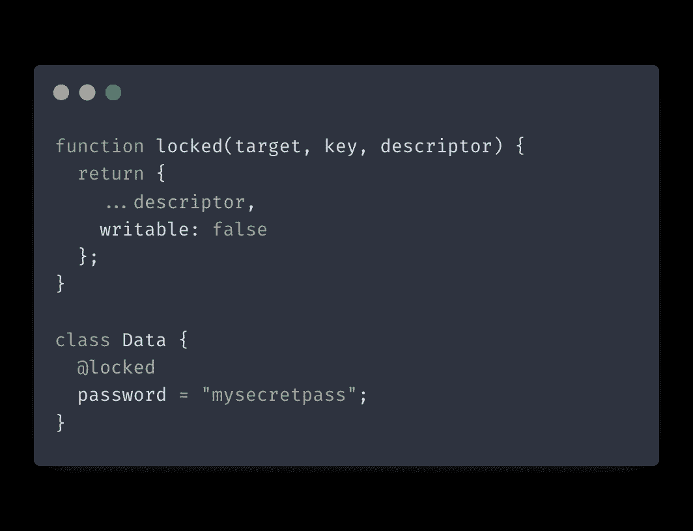
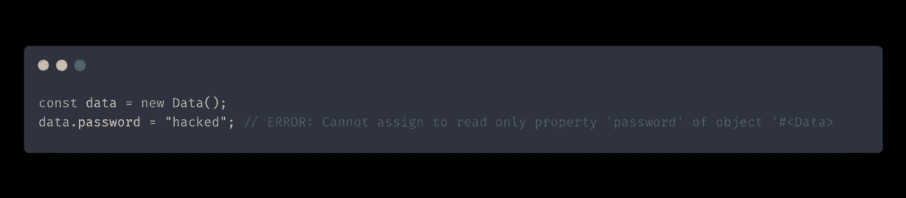
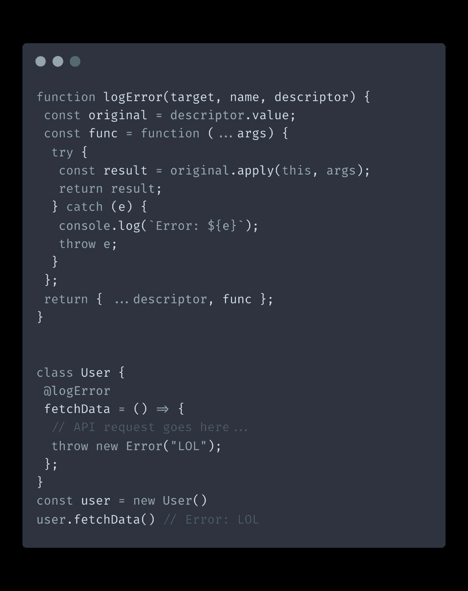
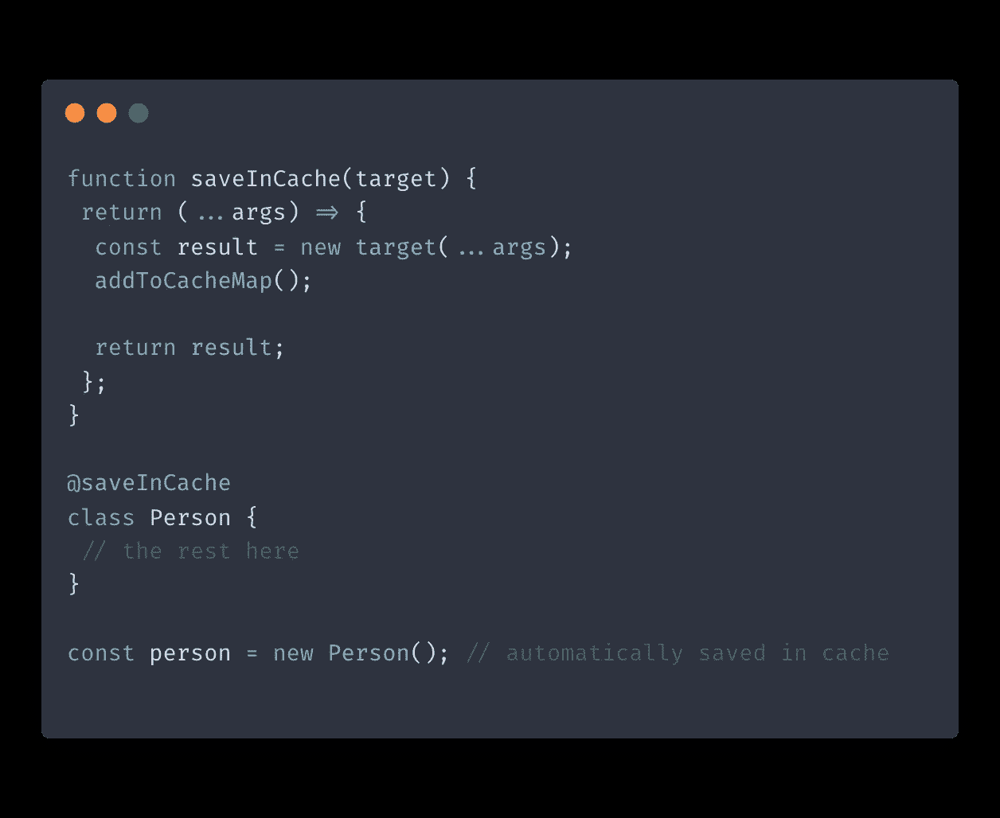

# JavaScript 装饰者简单指南

> 原文：<https://itnext.io/a-simple-guide-to-javascript-decorators-267b96ff3422?source=collection_archive---------0----------------------->

# 介绍

JavaScript decorators 是 JavaScript 中相对较新的特性，它允许在不修改底层代码的情况下向现有函数和对象添加新行为。您可以通过在函数名或对象键前使用@符号的特殊语法来实现这一点。让我们快速看一下它们是什么以及它们是如何工作的。

顺便提一下，装饰器还不是 JavaScript 的标准特性；他们仍然处于 ECMA TC39 [规范阶段](https://github.com/tc39/proposal-decorators)。这意味着我们需要用 Babel 来传输我们的代码

总的来说，decorators 可以被认为是其他代码的包装器，在它上面或者代替它提供额外的功能。装饰者并不完全是新的想法；事实上，它们的功能类似于[高阶函数](https://developer.mozilla.org/en-US/docs/Glossary/First-class_Function)。

你可以对[类的字段](https://developer.mozilla.org/en-US/docs/Web/JavaScript/Reference/Classes/Public_class_fields)、方法甚至整个类应用装饰器。**然而，你不能在普通的 JavaScript 对象上使用 decorators 他们只处理类**。

现在让我们看看如何使用 decorators 来修饰类的属性和方法。

# 装饰类字段

下面是在类字段上使用装饰语法的情况:

在上面的代码中，我们有一个简单的名为`locked`的装饰函数，我们将其应用于`password`类字段。它接受三个参数——目标、键和描述符。`target`是正在被修饰的对象或函数，`key`是指该目标上的属性名。描述符包含目标的所有属性，包括那些被修饰的属性。

类字段装饰器通过返回一个新的描述符来工作。所以我们返回一个新的描述符对象，它包含原始描述符的所有属性和值，除了设置为`false`的`writable`标志。这可以防止在实例化后更改`password`字段。

现在，如果我们尝试改变我们的`password`字段:

正如我们所见，试图改变`password`字段会导致错误，因为现在它是一个只读字段。

# 装饰类方法

现在，让我们看一个在方法上使用 decorator 的例子:

正如我们所见，方法的 decorators 通过获取描述符并返回包含原始方法和任何附加逻辑的对象来工作。

在这种情况下，我们向我们的`fetchData`方法添加了一些错误处理。如果我们的请求或数据解析出现任何问题，都会被捕获并记录到控制台。

# 装饰班级

现在让我们看看如何将一个装饰器应用到整个类:

我们可以看到,`@saveInCache`装饰器被应用到我们的类中，它会自动将`Person`的任何新实例保存在缓存映射中。

# 结论

JavaScript 装饰器是一个强大的特性，可以节省您的时间并减少代码中的冗余。装饰者仍处于提议阶段，所以他们的语法可能会改变。在将它们添加到您的项目之前，请记住这一点。

有许多不同的方式可以在代码中使用 decorators 在类、方法或属性上。Decorators 提供了一种简单的方法，可以在不修改现有代码的情况下，以可重用的方式添加额外的行为或元数据。

*原载于 2021 年 12 月 7 日 https://isamatov.com**的* [*。*](https://isamatov.com/javascript-decorators-tutorial/)