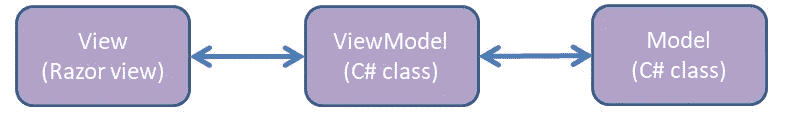
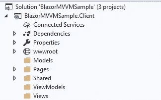
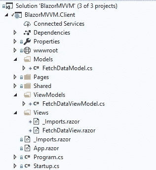
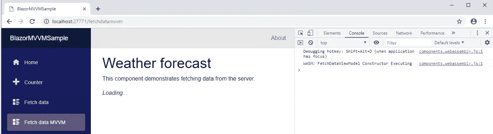
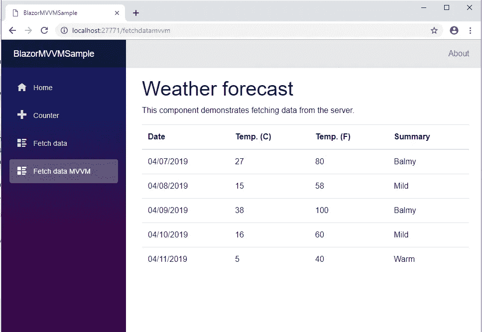

# 客户端 Blazor 中一个简单的 MVVM 实现。

> 原文：<https://itnext.io/a-simple-mvvm-implementation-in-client-side-blazor-8c875c365435?source=collection_archive---------0----------------------->


本文是系列文章的第一篇，我将介绍我目前计划如何创建一个 Blazor 客户端应用程序来替换我的生产 Silverlight 应用程序。本系列的重点是将模型-视图-视图模型模式应用于客户端 Blazor。

在上一篇文章中，我讨论了如何将我的生产 Silverlight 应用程序迁移到一个新的平台。我目前的希望是，我将能够使用 Blazor 作为平台。我谈到了将我的应用程序改为使用 Web API REST 调用，而不是 WCF 服务。如果您对在 Silverlight 中使用 Web API 感兴趣，您可以在这里阅读该文章:

[](https://medium.com/@haywireiv/getting-ready-to-say-goodbye-to-silverlight-and-hello-to-blazor-477d5ca88a32) [## 准备向 Silverlight 告别，向 Blazor 问好

### 我当时不知道的是，2011 年 12 月 9 日发布的 Silverlight 5 将是……

medium.com](https://medium.com/@haywireiv/getting-ready-to-say-goodbye-to-silverlight-and-hello-to-blazor-477d5ca88a32) 

我已经将按照本文中的步骤创建的完整解决方案上传到 GitHub。本文的代码可以从 ArticleOne 分支或 V4.1 版本中检索。该存储库位于:

[](https://github.com/lchendricks/BlazorMVVM) [## lchendrick s/blazormvm

### 一个客户端 Blazor MVVM 实现。通过在…上创建帐户，为 lchendricks/BlazorMVVM 的开发做出贡献

github.com](https://github.com/lchendricks/BlazorMVVM) 

我当前的应用程序是使用视图优先实现构建的 Silverlight MVVM 应用程序。导航到一个页面会打开 Silverlight XAML 页面，该页面实例化它自己的 ViewModel，然后实例化一个视图。Blazor 也可以很容易地做到这一点，使用内置的依赖注入，它甚至比我的 Silverlight 应用程序做得更干净。在 Blazor 中实现的关系如下所示:



MVVM·布拉佐

本文已更新，可与 Visual Studio 2019 预览版一起使用。Net Core 3 preview 4 和 4/18 版的客户端 Blazor。我只关注 MVVM 的一个例子，没有关注任何其他相关的应用程序，比如身份验证或数据访问。我将使用包含的样本模板；如果你已经在你的系统上安装了所有的东西，你可以启动一个新的 Blazor(ASP.Net 核心托管)应用程序，并遵循以下步骤。

# 项目结构

为了开始并保持我们的项目整洁，我们将在。视图、视图模型和模型的客户端项目:



为了使我们的视图看起来和工作起来与现有的示例页面一样，我们将 same _Imports.razor 添加到 pages 文件夹中的 Views 文件夹中。对于此示例，我们将从示例中重新创建 FetchData 页面，因此添加以下三个文件:

*   在视图文件夹中提取数据视图作为新的 Razor 视图
*   将 FetchDataViewModel 作为 ViewModels 文件夹中的新 C#类
*   将 FetchDataModel 作为 Models 文件夹中的新 C#类

我们的解决方案现在看起来像这样:



为了能够在我们开始测试时获得新的视图，进入共享文件夹中的 NavMenu.razor 并修改包含 NavMenu 的 div。只需复制列表项块并将其粘贴为第四项，然后将 href 修改为“fetchdatamvvm”，将 span 文本修改为“Fetch data MVVM”。更新后的导航菜单将类似于下面的代码。

# 视图和视图模型

首先，向 FetchDataView.razor 添加最少的内容。

```
@page "/fetchdatamvvm"<h1>Weather forecast</h1><p>This component demonstrates fetching data from the server.</p>
```

此时，我们可以在 debug 中启动应用程序，看到视图是可访问的，并返回我们添加的静态 HTML:


现在我们的视图已经存在，它需要一个 ViewModel 来绑定。如果我们从示例应用程序返回到 FetchData 页面，我们会看到有一个 WeatherForecast 数组和一个填充该数组的异步方法。转到 FetchDataViewModel.cs，用以下代码更新它:

我们用类中的公共属性创建了一个私有数组来保存和公开我们的 WeatherForecast[]。我们还增加了一个控制台。Writeline()到我们的构造函数中，这样我们就可以在浏览器调试工具中看到我们的对象正在被实例化。不幸的是，我们现在还不能在客户端 C#上的 Visual Studio 中为 Blazor 设置断点，所以这是我们可以使用的选项之一。我们还为我们的类声明了一个公共接口。本着松耦合和可测试性的精神，我们将对所有引用使用接口。

现在我们有了一个视图模型，我们要让它对我们的视图可用。我们将使用。Net 核心内置依赖注入。转到我们的客户端项目中的 Startup.cs，将这行代码添加到 ConfigureServices 方法中(以及必要的 using 语句):

```
services.AddTransient<IFetchDataViewModel, FetchDataViewModel>();
```

这不是一篇关于依赖注入的文章，但是这条语句将为任何请求 IFetchDataViewModel 的类提供一个新的 FetchDataViewModel 实例。AddTransient 方法是接收新实例的原因；还有 AddSingleton 和 AddScoped，我们今天不会用到它们。

既然我们的视图模型已经可以使用了，我们可以更新我们的视图来使用它。返回 FetchDataView，在 page 指令下添加这两行代码:

```
@using  BlazorMVVM.Client.ViewModels@inject IFetchDataViewModel fetchDataViewModel
```

并将这段代码添加到静态 html 的下面:

```
@if (fetchDataViewModel.WeatherForecasts == null)
{
   <p><em>Loading...</em></p>
}
else
{}
```

@using 语句就像 C#类中的语句一样；它使名称空间对我们的视图可用。@inject 语句告诉我们的依赖注入容器给我们一个 IFetchDataViewModel 的新实例。由于我们在 Startup.cs 中添加的语句，这将导致 ViewModel 接收 FetchDataViewModel 的新实例。视图现在看起来像这样:

我们的视图现在连接到我们的视图模型。我们可以通过启动应用程序、打开浏览器控制台并导航到视图来证明这一点。



您可以看到，由于 fetchDataViewModel，我们在视图上收到了加载文本。WeatherForecasts 为 null，符合条件，控制台输出显示了我们添加到调试器中的语句。现在我们有了一个工作视图模型和视图，我们可以实现和连接我们的模型。

# 添加模型

在本文中，我们将构建一个简单的传递模型，而不是讨论在模型中存储数据并让 ViewModel 转换它。我们将在下一篇文章中真正做到这一点。返回到 FetchDataModel 并输入以下代码:

我们已经创建了一个公共方法，并在 IFetchDataModel 接口中公开了它。我们还声明了一个私有变量来保存 HttpClient 实例。请注意，在我们编写的代码中，没有其他地方引用 HttpClient。我们使用构造器依赖注入(与我们在视图中使用的@inject 语句相反)让框架为我们提供一个 HttpClient。这段代码为我们提供了一个 HttpClient，它已经配置好并准备好回调服务器，它与默认模板中的 FetchData 页面中使用的是同一个客户端。“RetrieveForecastsAsync()”方法只是向服务器发出 GET 请求，以获取我们的 WeatherForecast[]。

现在，模型已经具备了我们需要的基本功能，我们可以转到 Startup.cs，并使用这行代码(以及所需的 using 语句)将其添加到 ConfigureServices 中:

```
services.AddTransient<IFetchDataModel, FetchDataModel>();
```

我们现在可以更新 FetchDataViewModel 来实例化模型。我们要做的第一件事是更新我们的构造函数，从依赖注入中获取模型的一个实例。向 ViewModel 添加另一个私有成员以及所需的 using 语句:

```
private IFetchDataModel _fetchDataModel;
```

然后更新 ViewModel 构造函数，用一个实现填充它:

```
public FetchDataViewModel(IFetchDataModel fetchDataModel)
{
   Console.WriteLine("FetchDataViewModel Constructor Executing");
   _fetchDataModel = fetchDataModel;
}
```

既然模型已经实现并可访问，我们将添加一个方法，向模型请求天气预报[]。将以下方法添加到 ViewModel 中:

```
public async Task RetrieveForecastsAsync()
{
 _weatherForecasts = await _fetchDataModel.RetrieveForecastsAsync();
 Console.WriteLine("FetchDataViewModel Forecasts Retrieved");
}
```

还将这一行添加到接口中，以公开新方法:

```
Task RetrieveForecastsAsync();
```

FetchDataViewModel 现在看起来像这样:

既然我们的模型和视图模型连接在一起，我们将让视图向视图模型请求数据。我们将挂钩到 Blazor 视图的生命周期中，所以现在我将它直接包含在视图中。当您需要大量特定于视图的代码时，另一个可能更好的选择是在类后创建代码。为此，声明一个从“ComponentBase”继承的 C#类，然后让视图使用“@inherits”使该类成为视图的代码。然后，您可以重写该代码中的任何生命周期方法。现在，我们将把这段代码添加到 FetchDataView 的底部:

```
@functions {
   protected override async Task OnInitAsync()
   {
      await fetchDataViewModel.RetrieveForecastsAsync();
   }
}
```

这将调用服务器在视图初始化时填充 WeatherForecasts[]。此时，我们可以再次启动应用程序，我们将看到加载消息短暂出现，然后在模型收到 WeatherForecast[]并将其传递给 ViewModel 后消失。

# 将这一切结合在一起

最后一步是更新视图以匹配原始的 FetchData 页面。用以下代码替换视图中的空 else{}块:

这与原始页面中的代码完全相同，只是它现在引用的是 ViewModel，而不是函数块中的页面局部变量。如果我们现在运行应用程序并导航到 FetchDataMVVM 选项卡，我们将看到我们的预测:



在这个小的示例应用程序中，这可能有点矫枉过正，但是一旦应用程序变得更大、更复杂，维护起来就容易多了。将所有的视图模型和模型作为没有具体依赖关系的纯 C#类也将使执行单元测试或根据需要替换依赖关系变得更加容易。随着新的 Blazor 预览版的发布，我会尽量保持更新。

本文的后续部分现在可以在本文中构建的项目的基础上获得:

[](https://medium.com/@haywireiv/building-on-the-simple-mvvm-implemention-in-client-side-blazor-c2e75c703fae) [## 在客户端 Blazor 中构建简单的 MVVM 实现

### 在位于此处的第一篇文章中，我们采用了 Blazor 预览版 0.9.0 附带的默认托管 Blazor 应用程序模板…

medium.com](https://medium.com/@haywireiv/building-on-the-simple-mvvm-implemention-in-client-side-blazor-c2e75c703fae)