# Javascript 中快速排序和霍尔分区方案的快速指南

> 原文：<https://itnext.io/a-sort-of-quick-guide-to-quicksort-and-hoares-partitioning-scheme-in-javascript-7792112c6d1?source=collection_archive---------2----------------------->

今天我要谈谈快速排序。很刺激，对吧？我过去曾经写过关于用 Ruby 实现一个非常基本的 quicksort 版本的文章，但是今天我想使用 Javascript 来构建一个更正确的算法版本。

更正确？是啊！稍后我会解释为什么会这样，并向您展示一个基本版本的 javascript 示例。好吧，让我们开始吧！

## 什么是快速排序？

快速排序是一种分治的、不稳定的比较排序，可以在数组上就地操作。这一切意味着什么？

## **分而治之 **

意思就是它听起来的样子。分而治之算法将一个问题分解成更小的子问题并解决它们，将子问题的解决方案放在一起以得出整个问题的解决方案。

## ***不稳定***

这意味着，如果两个元素具有相同的值，quicksort 可能会切换它们，而不是将它们留在彼此相关的位置。

假设你有三张扑克牌:依次是方块王、梅花 7 和黑桃王。

k♠7♣的 k

你要根据它们的价值把这些卡片按升序排列。

一个稳定的排序会看到两个国王是相同的价值，并会离开方块王**之前**的黑桃王。

k♠7♣

一个不稳定的排序可能会交换两个国王，并把方块国王**放在黑桃国王**之后。

k♠7♣

这就是我们说快速排序不稳定的意思。太好了，下一个！

## 比较排序

比较排序算法将通过一次比较操作读取列表中的所有值。通常，排序是通过检查一个值是否小于或等于另一个值来完成的。

比较操作必须遵循一些规则。首先是 ***传递性*** *。*基本上，你要能够从操作到操作准确地推断逻辑。举个例子:

*a ≤ b ≤ c*

使用小于或等于运算，我们应该能够准确地推断出:

*a ≤ c*

这就是我们所说的传递性。如果你想看的话，下面是韦氏词典的定义:

> 传递性的:属于或关于这样一种关系的:如果这种关系在第一个元素和第二个元素之间以及第二个元素和第三个元素之间成立，它在第一个和第三个元素之间也成立。

另一条规则是，操作必须是**。这意味着对于任何两对，三件事情中的一件必须是真的。因此，为了比较 *a* 和 *b* :**

**a < b，a > b，或者 a = b**

*太好了！继续前进。*

## *原地算法*

*我先说一下，我既不是计算机科学家，也不是数学家。我是一个热爱编程的音乐人，决定转行。所以，对我将要说的每一件事都要持保留态度，要知道，我很可能在某些方面或所有方面都是错误的。*

*我读过一些关于快速排序是否真的是就地算法的争论，因为它具有空间复杂度为 *O(log(n))* 。技术上，从我的理解来说，一个就地算法应该只有 *O(1)* 的空间复杂度。但不知何故，快速排序几乎总是被称为就地算法。*

*因为我不是这个问题的专家，这篇文章的目的也不是确定 quicksort 是否是一个真正的就地算法，所以我将使用一个非常狭窄的、新手友好的就地算法定义。*

*就我们这里的目的而言，就地算法是…*

****被操作的数据不离开其数据结构的算法*。***

*因此，如果你有一个数组传入你的函数，你只需要在数组内移动数组的元素，而不需要将它们从原始数组中移除。对于 Javascript 中的排序函数，返回值应该是传入的原始数组，不应该有 *Array.prototype.pop()* 或*array . prototype . splice()*或其他任何从数组中取出数据的东西。*

*这就是我在 Ruby 中写的基本实现和我将要向您展示的更正确的版本之间的巨大差异。我将在最后详细讨论这个问题，并向您展示相同实现的 JS 版本。*

*太好了！让我们来看看算法。*

## *快速排序步骤*

*我将非常蹩脚地从维基百科页面复制并粘贴这些步骤，因为它们非常清楚。*

1.  *从数组中选择一个元素，称为*枢轴*。*
2.  **分区*:对数组重新排序，使所有值小于支点的元素排在支点之前，而所有值大于支点的元素排在支点之后(两者值相等)。分割完成后，枢轴处于其最终位置。这被称为*分区*操作。*
3.  *递归地将上述步骤应用于具有较小值的元素子阵列，并分别应用于具有较大值的元素子阵列。*

*好了，我们走吧！*

## *第一步*

****取一个元素，称为一个支点，从阵中取出。****

*有点模糊，对吧？我们如何知道选择哪个元素？选择的方式有对错之分吗？*

*没有错的方法。有些人选择第一个元素，有些人选择最后一个或中间的元素，有些人选择三者的中间值。*

*如果你选择了第一个或者最后一个元素，你会在已经排序的数组上得到一个最坏的运行时，这对我来说真的很傻。已经排序了，我的排序函数应该不用做太多工作吧？这个问题可以通过选择一个随机的元素来解决，即中值，或者只是中间的那个。让我们从中间的那个开始:*

*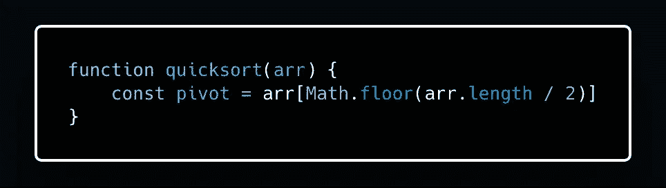*

*太棒了。我们有一个枢纽价值！下一步！*

## *第二步*

****分区:对数组重新排序，使所有值小于支点的元素排在支点之前，而所有值大于支点的元素排在支点之后(相等的值可以是任意方向)。分割完成后，枢轴处于其最终位置。这称为分区操作。****

*我们将使用一种称为霍尔分区方案的分区方法，它是以开发快速排序算法的查尔斯·安东尼·理查德·霍尔爵士的名字命名的。*

*这个方法的工作原理是创建两个指针，称为“左”和“右”，并将它们放在数组的两端。这两个指针向中心移动，直到它们各自找到一对位置错误的元素。这两个元素被交换，并且该过程继续，直到所有元素被分成两个子阵列，左边的值小于或等于主元，而右边的值大于主元。*

*如果这还没有意义，不要担心。我们会用代码分解它。首先，让我们创建我们的分区函数，并设置我们的两个指针。*

*分区将需要接收数组、左指针的索引(我们稍后会看到原因)、右指针的索引和枢轴值。*

*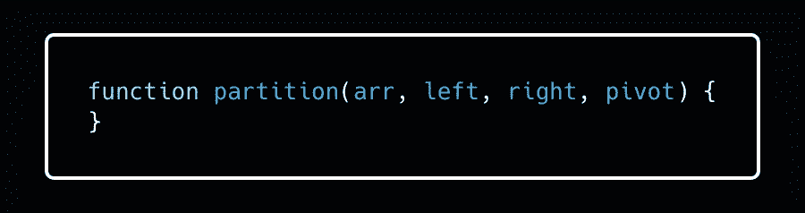*

*所以现在我们需要将指针移向中心，直到它们找到需要切换的元素。*

*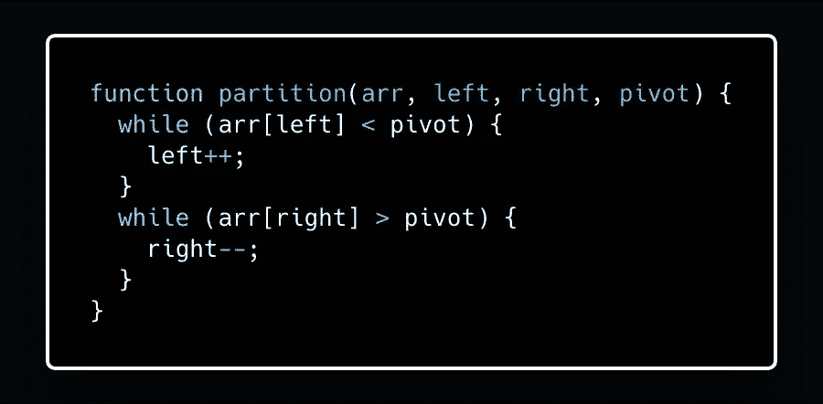*

*太好了！所以一旦那些 while 循环达到了它们的退出条件，我们就会知道它们所指向的元素需要被交换。让我们看看这在实践中会如何发展。*

*假设我们有这个数组:*

```
*let arr = [1, 3, 7, 4, 5, 2, 6]*
```

*假设 4 是我们选择的支点。在第一次调用中，我们将使用 0 作为左边的值，使用 6 作为右边的值，因为我们希望对整个数组进行分区。*

**注意:稍后，当我们开始递归调用 quicksort 时，我们只想对数组的一部分进行分区，这就是为什么我将 left 和 right 设置为要传入的参数，而不是将它们硬编码为 0 和 arr.length -1。**

*因此，我们的第一个 while 循环将继续移动左指针，直到它在索引 2 处到达 7。*

*我们的第二个 while 循环将移动右指针，直到它到达索引 5 处的 2。*

*我们需要做的下一件事是交换这些元素，使我们的数组看起来像这样:*

```
*[1, 3, 2, 4, 5, 7, 6]*
```

*注意元素是如何围绕着 4 被分割的？4 左边的都比较小，右边的都比较大。这就是我们想要的！*

*让我们把它加到我们的配分函数中。我们将首先检查以确保左指针仍然在右指针的左边，然后我们将切换元素。*

*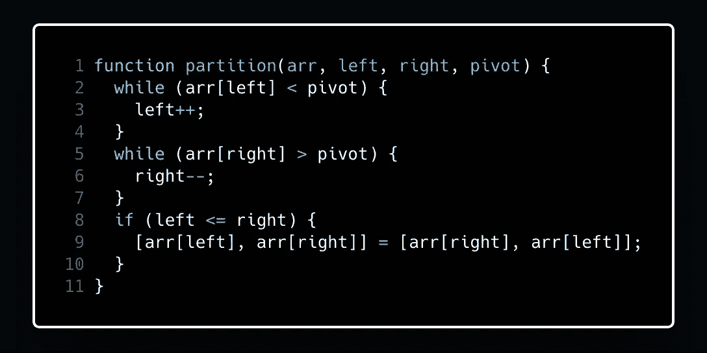*

*对于我们的示例阵列，我们很幸运，因为只进行了一次这样的交换，就以 4 为轴心对整个阵列进行了分区。但是非常重要的是，我们要记住，这个过程会一直持续到所有元素都被分区，这可能不仅仅是一次交换！*

*因此，让我们在交换后开始移动左右指针，因为它们现在指向的两个元素都在正确的位置。然后，我们可以将整个过程包装在一个 while 循环中，当左指针经过右指针时，该循环将退出。这意味着整个阵列已经被分区。*

*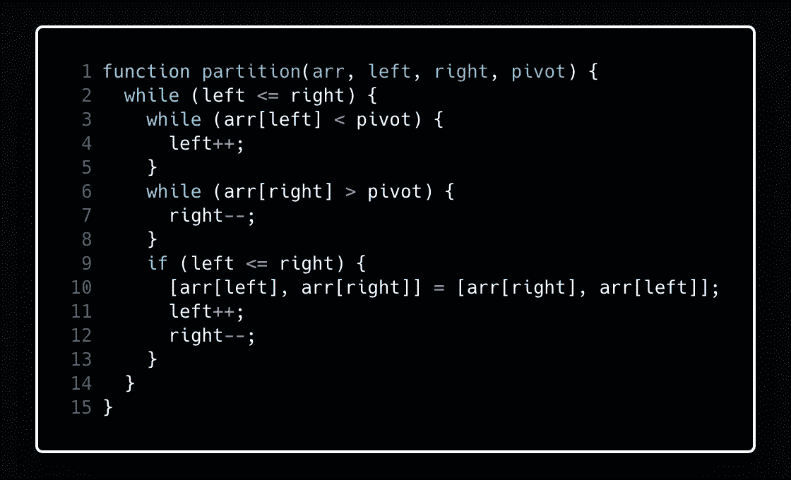*

*太好了！现在，这个过程将重复进行，直到数组真正围绕这个中枢值进行了分区。继续第三步！*

****编辑:*** *见文章底部最后一大块代码。有一个额外的检查来处理所有相同值的数组。这段代码的第 3 行应该是* `*while (arr[left] < pivot && left <= right)*`*

## *第三步*

****递归地将上述步骤应用于具有较小值的元素子数组，并分别应用于具有较大值的元素子数组。****

*好的递归！那很有趣。所以首先我们需要做一个基础案例，防止我们的函数无限次地自称。*

*为此，我们将向 quicksort 函数再传递两个参数。这些将会是更多的“左”和“右”指针，我们将用它们来将数组分成子数组，以备将来的递归调用。*

*让我们从左右指针的默认值开始。这些将是数组的第一个和最后一个索引，因为我们对 quicksort 的初始调用将在整个数组上进行。*

*我们的基本情况是这两个指针相遇(这意味着我们的子数组长度为 1)。*

*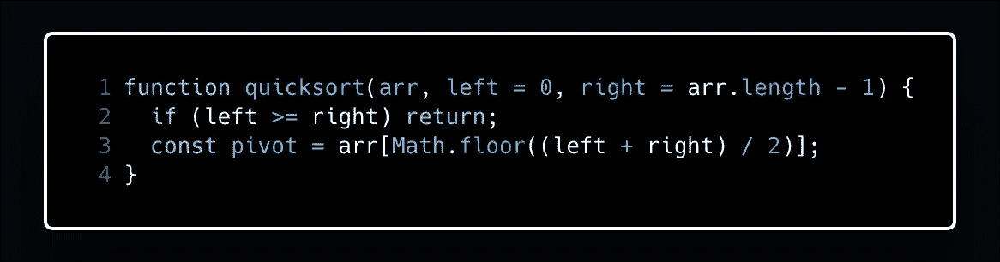*

*请注意，在第 3 行，我们还更改了透视定义。我们需要确保支点在左右指针的中间，而不仅仅是数组的中间。*

*太好了！现在我们有了基础案例和支点。所以让我们插入我们的分区函数吧！*

*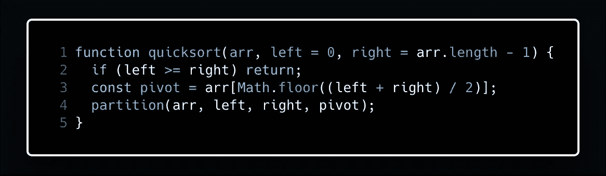*

*厉害！现在我们只需要…*

*嗯嗯…*

*我们需要递归调用左右子数组的快速排序，对吗？但是我们不知道我们的支点在数组中的什么位置，因为所有的东西都被交换和移动了。否则，我们无法知道子数组的开始和结束位置。*

*我们能做什么？*

*如果你再看一下我们的分区函数，你会发现来自那个函数的指针在这里也是有用的。*

**

*当我们在第 2 行跳出 while 循环时，我们的左指针将会在支点右边的索引处！狂野对吗？看一下我们之前的示例阵列:*

```
*[1, 3, 7, 4, 5, 2, 6]*
```

*在我们的 while 循环中断后，数组将如下所示:*

```
*[1, 3, 2, 4, 5, 7, 6]*
```

*当左指针经过右指针时，第 2 行的 while 循环中断，这发生在“左”指向 5(或索引 4)时。这是轴心右侧的元素，意味着这是左侧子数组结束和右侧子数组开始的地方。*

*很有用，是吧？让我们从我们的分区函数返回 left，并将其设置为快速排序函数中的一个变量。*

*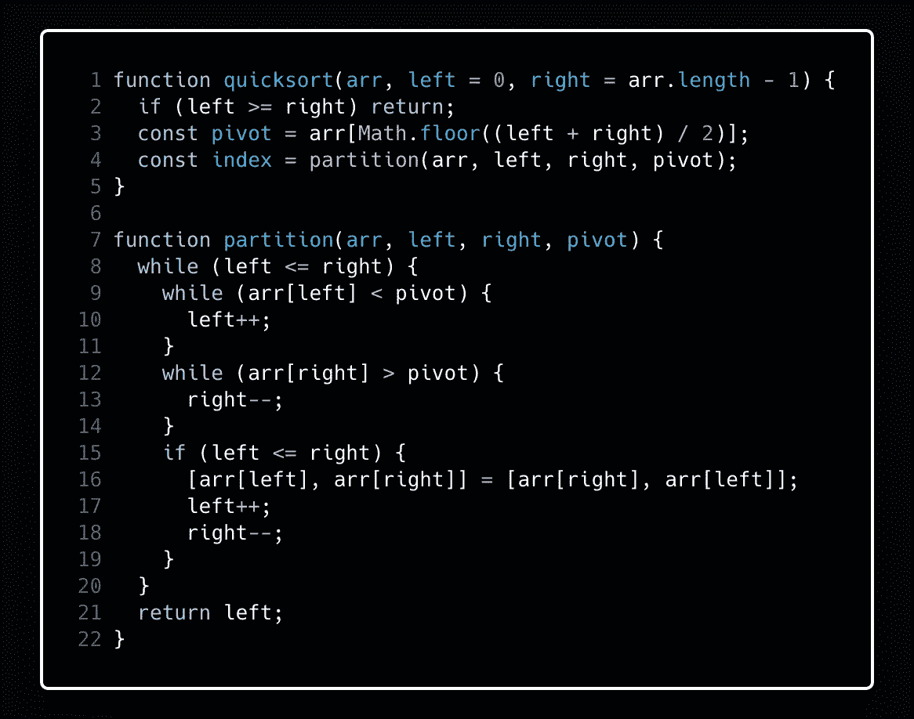*

*再次阅读第三步:*

****递归地将上述步骤应用于具有较小值的元素子数组，并分别应用于具有较大值的元素子数组。****

*现在我们知道了这些子数组的开始和结束位置，我们可以递归地对它们调用 quicksort。我们开始吧！*

*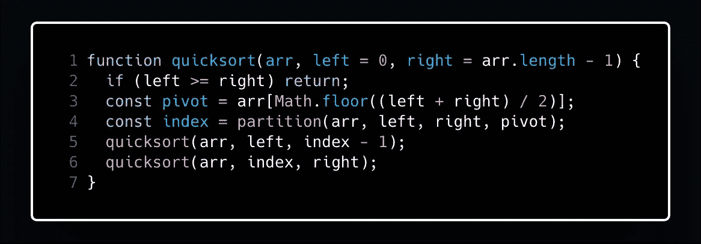*

*现在剩下的就是返回我们的数组。记住，既然我们是操作***就地*** ，我们的返回值将是原来的数组。*

*总之，我们的代码看起来像这样:*

*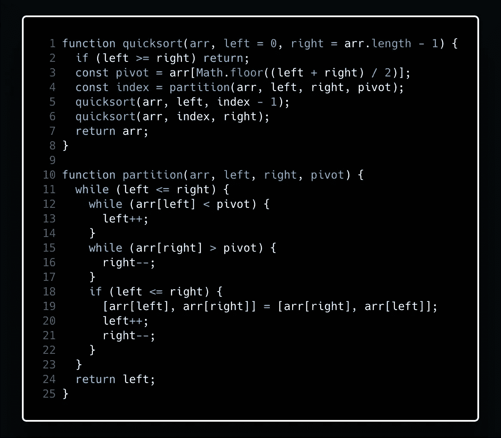*

## *就地 pt 2*

*还记得我说过在就地实现中，数据永远不会离开它的原始数据结构吗？这就是我们通过使用霍尔的分区方案和所有这些指针所实现的。有很多快速排序的实现看起来像这样:*

*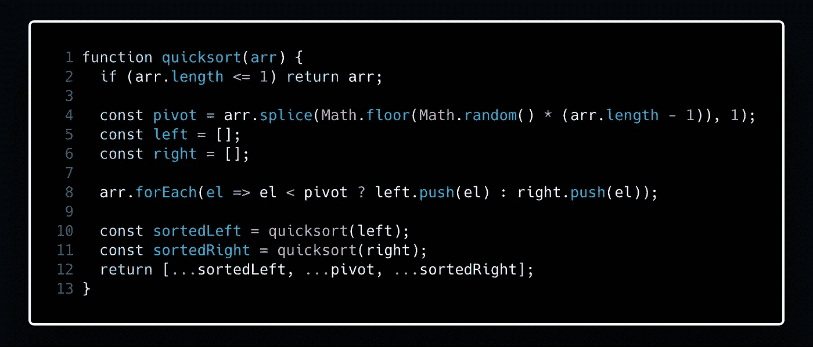*

*看到我们如何将这些元素放到第 8 行的新数组中了吗？这是数据离开其原始数据结构，这意味着这种实现是不适当的。我们还创建了新的数组来存储我们的值，这会占用额外的内存。一旦开始对超过 100 万个条目的列表进行排序，这两种实现之间的性能就会有明显的差异。*

## *结论和代码片段*

*我现在只有这些了！下面是一个 gif 和所有的代码，如果你想玩的话，可以复制。好的再见！*

**

*来自 wikipedia.com*

***基本快速排序***

```
*function basicQuicksort(arr) {
  if (arr.length <= 1) return arr;
  const pivot = arr.splice(Math.floor(Math.random() * (arr.length - 1)), 1);
  const left = [];
  const right = [];
  arr.forEach(el => el < pivot ? left.push(el) : right.push(el));
  const sortedLeft = basicQuicksort(left);
  const sortedRight = basicQuicksort(right);
  return [...sortedLeft, ...pivot, ...sortedRight];
}*
```

***利用霍尔的分区方案进行快速排序***

```
*function quicksort(arr, left = 0, right = arr.length - 1) {
  if (left >= right) return;
  const pivot = arr[Math.floor((left + right) / 2)];
  const index = partition(arr, left, right, pivot);
  quicksort(arr, left, index - 1);
  quicksort(arr, index, right);
  return arr;
}function partition(arr, left, right, pivot) {
  while (left <= right) {
    while (arr[left] < pivot && left <= right) {
      left++;
    }
    while (arr[right] > pivot) {
      right--;
    }
    if (left <= right) {
      [arr[left], arr[right]] = [arr[right], arr[left]];
      left++;
      right--;
    }
  }
  return left;
}*
```