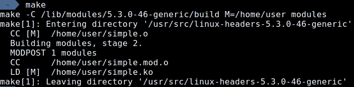
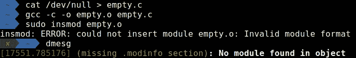
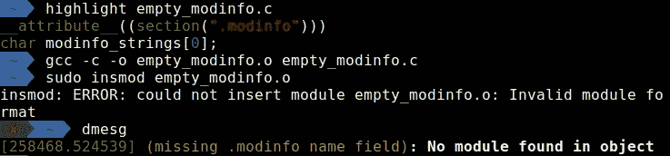
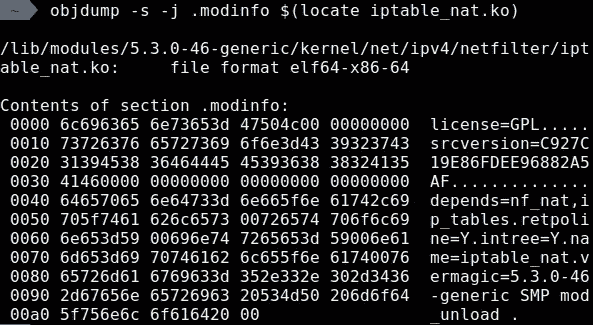
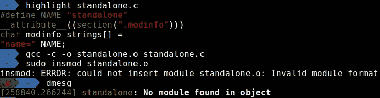
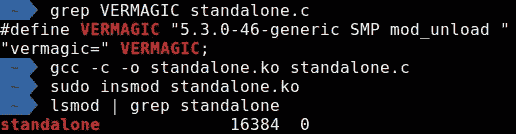

# 独立的 Linux 内核模块

> 原文：<https://itnext.io/a-standalone-linux-kernel-module-df54283d4803?source=collection_archive---------1----------------------->

如果你曾经为 Linux 内核编译过一个模块，你可能会看到(或者假设有)在运行阶段`make`和`insmod`之间有很多巫术在进行。

作为对这个过程中所涉及的魔法的一个快速提醒，看一下下面最简单的内核模块及其相应的 makefile:

一个超级简单的模块

需要一段时间来解释发生了什么

makefile 本身相当晦涩，但是`make`命令才是真正有趣的地方:

这只是冰山一角

从右边开始，我们看不到“标准”编译调用，包括日常用户几乎没有接触过的目录。running`make V=1`揭示了堆积如山的调用，其中一些是对与编译无关的二进制文件和脚本的调用。这是怎么回事？

`.ko`的编译过程可能看起来可怕而复杂，但是通过简单的检查，不难发现到底发生了什么。

在这篇文章中，我们将在不使用任何内核头文件或复杂 makefiles 的情况下，完成编译内核模块**的旅程。我们的目标是编写一个简短、简单、易于理解的`.c`文件，当用`gcc`和一些最小的标志编译时，输出一个可以被`insmod`编辑的有效的`.ko`。**

这可以通过几种不同的方法来实现:

*   阅读文档。
*   检查标准编译过程。
*   查看内核源代码，试图理解`init_module`系统调用(负责加载`.ko`的那个)做什么。

但是我们选择的方法将是第四种，即**黑盒方式**:修补加载器，查看有效模块，编写无效模块，并尝试做任何看起来可行的事情，直到我们最终成功。

在我看来，黑盒是研究未知或未知系统时最有用和最有效的技能，因为通常前一种方法都不适用，或者可能更费时费力。此外，这是最有回报的过程，因为你会毫不费力地得到快速而有趣的回报。

但首先，我们必须了解什么是内核模块**实际上是**。

# 什么是内核模块？

`.ko`后缀的意思是“*内核对象*”，暗示了模块到底是什么——只是一个 **ELF 对象文件**。事实上，在内核版本`2.6`之前，内核模块使用`.o`后缀，就像标准的目标文件一样。

那么传统的`.o`文件和`.ko`文件有什么区别呢？让我们尝试将一个“空”目标文件加载到我们的内核中:

将“空”目标文件加载到内核失败

对我们来说幸运的是，当涉及到关于模块的错误时，内核是非常描述性的。`dmesg`显示我们的空目标文件缺少一个叫做`.modinfo`的部分。让我们将它添加到我们的模块中！

最简单的方法是创建任何变量，并使用`__attribute__((section(<name>)))`告诉`gcc`将它存储在我们选择的部分中。有关属性的更多信息，请参见 [*gcc 文档*](https://gcc.gnu.org/onlinedocs/gcc-10.1.0/gcc/Common-Variable-Attributes.html) 。

“突出显示”类似于“猫”,但带有语法突出显示！

错误改变了！似乎我们的 modinfo 部分缺少一些名称字段。为了了解如何正确设置该字段，让我们来看一个“真正的”内核模块，来自`/lib/modules/$(uname -r)/`，使用`objdump -s -j .modinfo`转储该部分的内容:

在麻瓜世界中，使用便捷的“modinfo”命令

看起来它只是由`key=value`字符串组成，由`null`字节分隔。所以让我们添加`name`字段，看看会发生什么:

我庄严宣誓我不怀好意

成功了！内核成功地将我们的模块名称识别为`standalone`！

下一个错误似乎有点晦涩。由于没有从内核得到有用的提示，是时候再次看看一个“真正的”内核模块了。通过使用`readelf -S`或`objdump -h`检查其部分，我们发现另一个候选名称相当可疑，可能与加载过程有关:`[.rela].gnu.linkonce.this_module`。

(`.rela`部分只是该部分值的重定位数据)

在我的 Ubuntu 18.04 上，这个段的大小是`0x380`字节，有两个可重定位的符号:偏移量`0x178`处的`init_module`，偏移量`0x330`处的`cleanup_module`。转储该节的内容(`objdump -s`)显示，除了模块名，它在偏移量`0x18`处大部分被清零。

这个部分实际上是来自 Linux 内核源代码`include/linux/module.h`的 C `struct module`，作为一个部分嵌入在 ELF 中。它通常被命名为`__this_module`，在加载过程中，内核加载程序初始化 struct 中的其他相关字段。

但是我们没有使用任何内核头文件。幸运的是，我们有所有需要的信息。让我们添加一些`init`和`exit`功能，以及相关部分:

快到了！

Lumos Maxima！

(我们使用`__attribute__((packed))`来强制编译器不要在结构的字段之间添加任何额外的填充，从而强制我们已知的偏移量。)

令人困惑的是，即使`insmod`失败了，在`dmesg`中也没有错误日志。我们可以使用`lsmod | grep standalone`来验证该模块实际上没有被加载。这是怎么回事？

通常内核会提醒我们任何丢失的参数，但是很明显，在一些内核配置中，有时对于一些丢失的字段不会显示任何消息。让我们回头看一个真实的内核模块。我们的模块和真实模块之间唯一的主要区别是`.modinfo`部分中的字段。

在这一部分，我们可以开始一个接一个地复制剩余的字段，直到我们成功或者得到不同的错误消息。然而，对我们来说幸运的是，一个被施了魔法的神谕在晚上悄悄在我们耳边说，我们应该先从复制`.vermagic`字段开始！

`vermagic`是“Version Magic”的缩写，它是一个字符串，加载程序使用它来检查一个模块是否确实是为那个内核版本编译的。我们可以从为内核编译的模块中提取它的内容，或者，让内核为我们把它吐出来！

Makefiles 和 Charms 是我在霍格沃茨最喜欢的两门课

谢谢你的提示！

最后一次更改 vermagic 值会产生:

成功了！

…我们完成了！我们成功地将一个模块加载到内核中，不用任何内核头文件就编译了**！**

要完整观看最终的`standalone.c`文件，请访问[https://github.com/0xEitan/standalone-ko](https://github.com/0xEitan/standalone-ko)。

# 复杂系统的去神秘化

许多人在面对一个复杂且通常不吸引人的系统时会不知所措。无论是他们正在熟悉的某个 collosal 项目，还是他们想要编程的未知嵌入式设备，或者一般的 Linux 内核，潜入深水总是令人生畏的。

尽管我们在这篇文章中没有使用纯黑盒，但我发现像这样的方法在这种情况下非常有效。它可能不会像目前的情况一样产生成功的结果，但它肯定总能揭示重要的见解，并有助于克服面对未知代码库时的第一个障碍。

没有什么太复杂而无法理解，只需要用正确的工具去做。