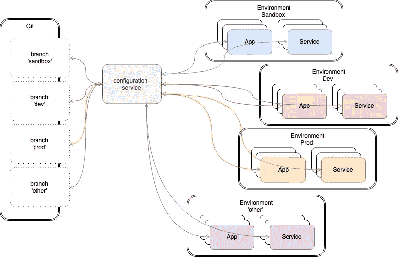
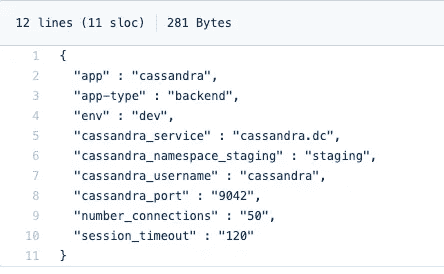
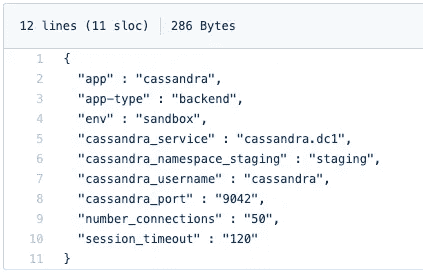
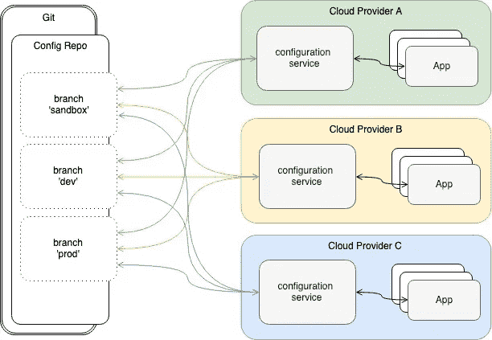

# 管理多种环境(和云)配置的通用方式

> 原文：<https://itnext.io/a-standard-way-of-managing-configurations-for-multiple-environments-and-clouds-ee8d54703efc?source=collection_archive---------1----------------------->

灵感来自 [GitOps](https://www.weave.works/technologies/gitops/) ...

本文旨在分享解决与配置管理相关的一些挑战的想法和解决方案，尤其是在云环境中。希望你觉得这本书有帮助。

本文中描述的方法是几年前概念化的，然后在许多项目中实现和使用，为生产级系统和应用程序构建配置管理组件。

# 使用案例

这个问题很常见，多年来，我们不仅在基于云的部署和环境中看到了它，在本地类型的部署中也看到了它，类似于“隔壁机架中有 3 个刀片”。这个问题适用于任何有不止一个环境的部署，比如 DEV、QA、STG、PROD 等等。

正如您可能已经猜到的，问题在于配置数据及其管理。Wiki 详细讨论了[配置管理](https://en.m.wikipedia.org/wiki/Configuration_management)(CM)——CM 计划和管理、控制、状态，等等，但是作为架构师和开发工程师，我总是谈论细节(嗯，那就是你知道的人在哪里..)以及如何以最快、最有效的方式完成这项工作。

所以，让我们开始吧...

当我提到配置数据时，我指的是不同类型的数据:

*   取一次，用多次
*   不时取来，多次使用
*   每次使用时提取

我不打算深究每种类型的配置数据的细节及其使用案例——如果你是经验丰富的工程师，你很可能对这些很熟悉，如果你不是，[谷歌](http://google.com)随时可以提供帮助:)

首先，当你开始考虑如何管理你的应用或服务的基本配置参数时，问题就出现了，比如端口号、数据库连接字符串或你的 consult DNS——我的意思是你不能硬编码它们！好吧，有办法解决这个问题(配置文件，等等。).但是，如果您的应用程序被容器化或在虚拟机中运行，会发生什么呢？这意味着，为了更改一个配置参数，您必须重新部署应用程序。或者，如果你改变了应用生态系统中的一个东西，它也会级联地重新部署其他组件——有点昂贵，不是吗？现在，随着项目的进行，您会增加解决方案的复杂性，您必须考虑如何管理越来越多的配置，例如 Hadoop 集群、Spark 集群和正在运行的作业，以及整个技术生态系统来运行具有负载平衡和服务发现的 Web 服务，此外，除此之外，您还会有 CI/CD 管道，它有自己的配置。现在，将所有这些乘以你可能拥有的环境数量(即`development`、`prod`、`staging`、`sandbox #1`、`sandbox #2`、`engineering`等)。).而且，如果这还不够的话，可以添加安全性和审计(谁在什么时候做了什么)这样的未来。

最烦人的是，不再有单一版本的真理了——在应用程序或系统的生命周期中，您的配置开始漂移，而且您通常没有清晰的记录，不知道是谁更改了什么。

当我们交付分析项目时，CM 的复杂性达到了一个全新的水平——使数据科学家能够开发、培训和部署模型(有时相当复杂),而无需一群工程师全天候支持他们。换句话说，分析平台必须强大而稳定，同时还要满足数据科学家的需求，以避免在云消费账单上看到 5-6 位数的数字。

在某个时候，我将不得不找时间写文章来描述我们如何构建基于开源、完全容器化和可扩展的分析平台来管理分析模型的整个生命周期(这为我们的一个客户每月节省了数十万美元的云成本…真的不是开玩笑)。

如果以上所述还不够，我们遇到了一些客户的需求，即跨多个云平台(即 GCP + Azure + AWS)实施应用程序或各种 it 组件，这意味着云和应用程序级别的配置管理。

总而言之，我们已经确定了对配置数据的需求:

*   真相只有一个版本。
*   拥有变更的精确记录，以及触发变更的参考(换句话说，审计跟踪)。
*   实现关注点分离，即应用程序应该忙于实现业务逻辑，而不是管理配置。
*   管理各种复杂的配置数据，包括嵌套配置。
*   尽可能与云无关，因此支持跨多个云提供商部署的应用程序。
*   简化部署过程。
*   所有级别的配置数据—应用程序、系统、基础架构、部署、时间表等等。

咳...

# 这一切有解决办法吗？

幸运的是，是的。在本文中，我将描述我们提出的解决上述需求的解决方案。

解决方案亮点如下

*   集中式配置服务以 HA 容量运行，使配置数据用户(客户端)能够使用密钥检索它。配置服务可以作为容器部署在独立的节点/机器或 Kubernetes 集群中。
*   通过 API 检索的配置数据，以键值对的形式。例如，一个应用程序为了检索 Cassandra 数据库端口号，将发出一个类似于

> `curl [http://config-service.mydomain/api/v1/cassandra/sandbox/cassandra_port](http://config-service.mydomain/api/v1/cassandra/sandbox/cassandra_port)`
> 
> 其中`cassandra`是应用配置，`sandbox`是环境，`cassandra_port`是配置参数键。

*   配置数据以 JSON 格式存储，可能采用平面布局的形式，或者相当复杂和嵌套的形式。
*   **我们使用 Github 服务作为后端来存储配置数据。对于每个部署的环境(开发、qa 等)，我们都有一个相应的 Git 分支。**环境与分支机构的联动不仅限于一对一。例如，您可能有一个涉及几个分支的开发环境:一个用于部署，一个用于应用程序 A，一个用于基础设施。正常情况下，分支不会合并。这种方法允许我们对其中一个分支中的配置数据进行更改，这些更改会立即传播到给定环境中运行的应用和服务。此外，跟踪谁做了什么更改也变得非常简单。GitHub 配置数据报告可以是公共的，也可以是私有的。此外，除了 GitHub，你还可以使用 GitLab、GCP 源代码管理等等。
*   根据设计，配置服务具有可插拔的架构——我们可以将其插入任何后端，如 Consul、Cassandra 或 Git-compatible。
*   它很容易与一个秘密管理后端集成，如哈希公司金库，Azure 密钥金库和 AWS KMS。

配置服务架构的概要。



# 具体是怎么运作的？

让我们详细地看一个例子，以便更好地理解这个解决方案。

假设我们有一个应用程序部署在我们正在试验的`sandbox`环境和我们正在开发和测试的`dev`环境中。该应用程序需要连接到 Cassandra 数据库并做一些事情，我们为每个环境都有不同的 Cassandra 部署。因此，在配置数据回购中我们将有 2 个 Git 分支:`dev`和`sandbox.`

在`dev` 分支中，`cassandra.json`文件是这样的



在`sandbox` 分支中，`cassandra.json`文件看起来像这样



差别不大，但键`cassandra_service`包含不同的值——嗯，Cassandra 有不同的部署(`dev`和`sandbox`)，我需要确保我的应用程序连接到 Cassandra，因为该应用程序跨环境部署并完成它的工作。

话虽如此，如果我们这样打一个`curl`电话:`curl [http://config-service.mydomain/api/v1/cassandra/sandbox/cassandra_service](http://config-service.mydomain/api/v1/cassandra/sandbox/cassandra_service.)`

它将返回环境`sandbox`的键`cassandra_service`的值，即`cassandra.dc1`

如果我们调用`dev`环境的端点(`[http://config-service.mydomain/api/v1/cassandra/dev/cassandra_service](http://config-service.mydomain/api/v1/cassandra/sandbox/cassandra_service.)`)并检索同一个键的值`cassandra.dc`，也会发生同样的情况。

因此，您的应用程序使用相同的键从特定于当前运行环境的配置服务中检索配置数据，这使得将应用程序部署到不同的环境变得非常容易。您所要做的就是设置一个全局环境变量(在 CI/CD 的情况下，这可以在 Jenkins 级别完成)来识别环境并将其传递给`curl` call。

演示这一点的快速片段:

```
$ export ENV=sandbox
$ echo $(curl [http://config-service.mydomain/api/v1/cassandra/${ENV}/cassandra_service](http://config-service.mydomain/api/v1/cassandra/sandbox/cassandra_service.))cassandra.dc1$ export ENV=dev
$ echo $(curl [http://config-service.mydomain/api/v1/cassandra/${ENV}/cassandra_service](http://config-service.mydomain/api/v1/cassandra/sandbox/cassandra_service.))cassandra.dc
```

# 在许多云上部署许多应用，但仍然使用相同的配置

如果您需要在一个以上的云提供商上部署多个应用程序，就像我在一次项目中遇到的情况一样，并且您仍然希望维护一个单一的存储库来满足您所有的配置数据需求，这里有一个部署模型的快速绘图。



多云部署模型

多云部署模式提供了配置数据管理方式的一致性，并建立了配置的单一版本。

无论您是在 Kubernetes 上的容器中部署配置服务，在 VM 中运行它，还是在您的笔记本电脑上本地运行它，您仍然连接到同一个配置后端(在本例中是 git repo ),因此它保证了配置的一致性。

# 配置服务部署

快速注意:请记住，所描述的部署过程是非常轻量级的，旨在演示功能点。生产级部署看起来会更复杂一些。

首先，在我们部署任何东西之前，我们必须设置 Git 后端来托管我们所有的配置数据。我确实设置了[Git repo](https://github.com/OlegGorj/config-data)(OlegGorj/config-data)用于演示目的，它包含多个分支(开发、生产、沙箱)和一堆配置数据文件。

接下来，我们将在本地机器上部署配置服务——关于如何在本地和 Google 云平台上部署的所有代码和说明都可以在这里找到。如果您想为这项工作做出贡献，请随时给我写信或在 git 上发表一个问题。非常感谢任何帮助和建议:)

第一步是检查我们在 git 后端提交了哪些配置数据。我将使用`test.json`来演示配置服务的执行([https://github . com/oleggorj/config-data/blob/sandbox/test . JSON](https://github.com/OlegGorj/config-data/blob/sandbox/test.json))

```
{  "hello": "world"}
```

安装主软件包和依赖项:

```
git clone https://github.com/OlegGorj/service-config-data.git
cd service-config-data
```

设置 GOPATH:

```
echo $GOPATH
export GOPATH=$GOPATH:$PWD
echo $GOPATH
```

确保安装了所有依赖项

```
make deps
```

此时，您的目录应该具有以下结构:

```
├── config-data
├── pkg
│   ├── darwin_amd64
│   └── dep
│       └── sources
└── service-config-data
    │   ├── github.com
    │   │   ├── oleggorj
    │   │   │   └── service-common-lib
    │   │   ├── subosito
    │   │   └── tidwall
    │   ├── gitutil
    │   ├── handlers
    │   └── helpers
    ├── vars-gcp.mk
    ├── vars.mk
    └── watch.sh
```

构建`service-config-data`服务二进制文件:

```
make build
```

要让服务在本地机器上运行(确保 docker 正在运行):

```
make run
```

现在，测试服务是否正确运行—打开一个新的终端窗口并运行:

```
$ curl [http://localhost:8000/api/v2/test/sandbox/hello](http://localhost:8000/api/v2/test/sandbox/hello)world
```

服务 API 允许一个指定输出格式的可选参数(`?out`)。例如，要获取 JSON 格式的配置数据，运行:

```
$ curl [http://localhost:8000/api/v2/test/sandbox/hello?out=json](http://localhost:8000/api/v2/test/sandbox/hello?out=json)"world"
```

# 如何使用配置服务

## `config-data`储存库

考虑分支`sandbox`中配置文件`[k8s-cluster.json](https://github.com/OlegGorj/config-data/blob/sandbox/k8s-cluster.json)`的一个例子，如下所示

```
{
  "name" : "jx-sandbox",
  "k8s-name" : "k8s-sandbox",
  "apps": [
    {
      "name" : "jenkins",
      "app-type" : "devops"
    },
    {
      "name" : "grafana",
      "app-type" : "devops"
    },
    {
      "name" : "cassandra",
      "app-type" : "storage"
    }
  ],
  "env" : "sandbox",
  "region" : "us-east",
  "git-org" : "",
  "kubectl-ver" : "v1.13.0",
  "helm-ver": "v2.1.3",
  "docker-ver" : "1.12.6",
  "cloud-provider":{
    "name": "ibmcloud",
    "api-endpoint" : "https://api.us-east.bluemix.net"
  }
}
```

假设在本地运行配置服务容器( [http://localhost:8000](http://localhost:8000/) )

## `service-config-data`服务的几个用例

希望这些例子不言自明:)

```
$ curl http://localhost:8000/api/v2/k8s-cluster/sandbox/regionus-east$ curl http://localhost:8000/api/v2/k8s-cluster/sandbox/apps[
  {
    "name" : "jenkins",
    "app-type" : "devops"
  },
  {
    "name" : "grafana",
    "app-type" : "devops"
  },
  {
    "name" : "cassandra",
    "app-type" : "storage"
  }
]$ curl http://localhost:8000/api/v2/k8s-cluster/sandbox/apps.@3$ curl http://localhost:8000/api/v2/k8s-cluster/sandbox/apps.2{      "name" : "cassandra",      "app-type" : "storage"    }$ curl http://localhost:8000/api/v2/k8s-cluster/sandbox/apps.@.name["jenkins","grafana","cassandra"]$ curl http://localhost:8000/api/v2/k8s-cluster/sandbox/apps.1.name["grafana"]$ curl http://localhost:8000/api/v2/k8s-cluster/sandbox/apps.@(name=="cassandra").app-typestorage$ curl http://localhost:8000/api/v2/k8s-cluster/sandbox/apps.@(app-type=="devops")@.name["jenkins","grafana"]
```

# 使用 Helm chart 在 Kubernetes 集群上部署服务

确保根据模板`./service-config/src/github.com/oleggorj/service-common-lib/docker/values-template.yaml`填充值文件`./service-config/values.yaml`

关于`values.yaml`中应该有什么值的更多细节，请参考`Makefile` 部分`deploy`——它生成`values.yaml`

通过执行以下命令来部署服务:

```
cd service-config-data/charts
helm upgrade — install config-service — values ./service-config/values.yaml — namespace default ./service-config/
```

清理:

```
helm del —-purge config-service
```

# 与詹金斯一起部署

如果您想与 Jenkins 一起运行此部署，请参考 [Jenkinsfile](https://github.com/OlegGorj/service-config-data/blob/master/Jenkinsfile) 。

# 下一步和有用的未来

随着我们的发展，我正在为这项服务添加新的未来，这里有一个快速路线图。

*   将 Git 上提交的配置转换为 Kubernetes 集群上的配置映射并保持同步的选项
*   包装依赖自动化
*   与 KMS 和保险库集成，管理机密
*   插件有不同类型的后端，而不是 Git
*   支持各种配置数据输出格式的服务(纯文本、JSON、XML、Yaml、CSV)

如果你能想到这里没有涉及的未来或用例，请随意发送电子邮件，在下面发表评论或在我的 Git 上提出问题。

干杯！