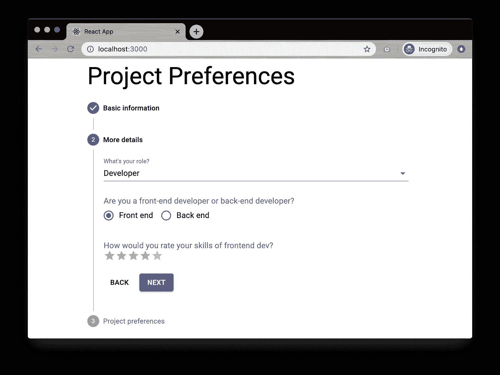
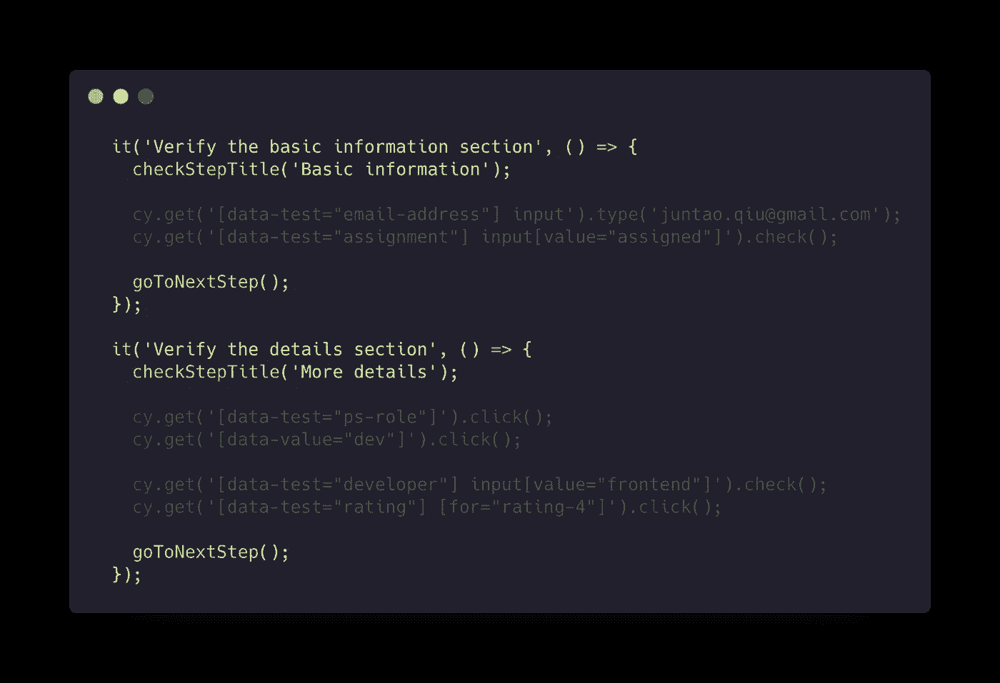
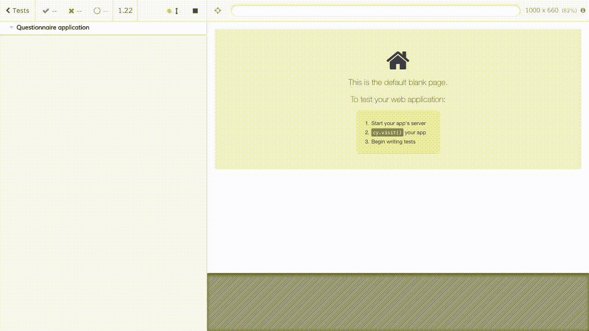

# 一个关于抽象的故事

> 原文：<https://itnext.io/a-story-about-abstraction-f99e53516ca4?source=collection_archive---------6----------------------->

# 抽象

抽象的能力应该是一个开发人员应该拥有的最基本的技能，这一点我怎么强调都不为过。通过抽象，我们可以从铺天盖地的看似不相关的细节中解脱出来，找到一个可以一次性解决所有问题的解决方案。

然而，由于每个抽象都忽略了一些细节，强调了一些其他特征，有时它会阻止我们理解问题(我猜我们的大脑更喜欢有形的东西)。这就是例子跳出来寻求帮助的时候。换句话说，在一个创造性的过程中，无论是编码还是设计，我们一方面需要从具体的例子中提取概念，另一方面，我们需要将我们提取的概念例证回实例。Bret Victor 做了一个[伟大的比喻](http://worrydream.com/LadderOfAbstraction/)把这个过程比作上下梯子——你需要上到一个更高的层次，以便有一个大概的了解，然后回到地面进行测试。只有将这两者结合起来，你才能更好地理解问题，并提出更好的解决方案。

关于抽象的另一个有趣的事实是它有层次。一旦我们摆脱了地面上所有杂乱的细节，有了更高层次的概念，这些抽象就变成了新的细节，我们可以在它们的基础上再次构建抽象概念。这就是为什么我们可以使用`JavaScript`或`Python`来解决业务问题，而不需要知道寄存器地址或机器指令的长度，或者内存是如何分配或释放的。

我知道这听起来已经很抽象了，但是请耐心听我说，看看一个具体的例子。

# 一些背景

在本文中，我将通过重构一个模拟项目的测试套件(使用 cypress)来描述一些模式和重构技术。我将谈论一些常规的重构技巧，但没什么大不了的，我相信看到如何分析和重写一些从`working code`到`concise`和`easy to understand/modify`的测试用例是值得的，并且希望也是有趣的。我希望你能喜欢它。

它模拟了我去年参与的一个项目。从业务的角度来看，所有业务规则和逻辑的难度一般，但是从技术上来说，有很多细节值得回顾。项目中的 UI 测试套件，在几轮重构之后，最终达到了我非常满意的程度，它已经应用了我们将在本文中讨论的模式。

然而，这里的模拟是一个名为`Questionnaire`的服务，它在后端使用一些计算引擎，通过询问一些问题，如角色、技能水平、技术堆栈、项目偏好等，向用户返回一些最合适的提议。我将把`recommendation system`留在后台，只关注本文中的数据收集。

请注意，有些问题是动态的。例如，如果用户对问题`Q1`回答了`A`，那么接下来的问题可能是`Q303`。如果他们回答的是`B`，那么下一个将会是`Q1024`。这意味着在 UI 中有许多可选择的路径，并且每条路径都同样重要(并且每个测试都应该彻底地遍历这条路径，直到计算出结果)。



正如你从上面的 UI 中看到的，`Questionnaire`有 3 个步骤，而在现实世界中，它可能有 10 多个步骤，每个步骤都有一个或多个问题。有些问题可能取决于前面步骤中的答案。收集完所有必填字段后，用户可以点击`next`按钮继续。

# 摘要 101 —功能

从功能测试的角度来看，将每一步视为独立的单元是合理的。每一步都有一些类似的事情要做:

1.  验证步骤**标题**
2.  填写所有**必填字段**
3.  点击**下一个**按钮


我们可以通过使用`cypress`API 来测试第一个`Step`(让我们假设所有的`data-`属性都已经在产品代码中了):

```
it('Verify the basic information section', () => {
  cy.get('[data-test="step-title"]')
    .contains('Basic information');

  cy.get('[data-test="email-address"] input')
    .type('juntao.qiu@gmail.com');
  cy.get('[data-test="assignment"] input[value="assigned"]')
    .check();

  cy.get('button[data-test="next-button"]').click();
});
```

所以第二个非常相似:使用`selector`在页面上定位元素，如果找到元素，我们可以通过`cypress` API 模拟一些用户动作:

```
it('Verify the details section', () => {
  cy.get('[data-test="step-title"]').contains('More details');
​
  cy.get('[data-test="ps-role"]').click();
  cy.get('[data-value="dev"]').click();
​
  cy.get('[data-test="developer"] input[value="frontend"]').check();
  cy.get('[data-test="rating"] [for="rating-4"]').click();

  cy.get('button[data-test="next-button"]').click();
});
```

如果你从字面上比较代码*和*，几乎每一行都是独一无二的，但是你可以*感觉到*有某种重复。删除这些重复可以大大提高可读性。最简单的方法是`extract function`，例如，提取*验证步骤标题*和*点击下一步按钮*到各自的功能:

```
const checkStepTitle = (title) => {
  cy.get("[data-test="step-title"]").contains(title);
}
​
const goToNextStep = () => {
  cy.get("button[data-test="next-button"]").click();
}
```

然后，测试被简化成这样:

```
it('Verify the basic information section', () => {
  checkStepTitle("Basic information");

  cy.get('[data-test="email-address"] input')
    .type('juntao.qiu@gmail.com');
  cy.get('[data-test="assignment"] input[value="assigned"]')
    .check();

  goToNextStep();  
});
​
it("Verify the details section", () => {
  checkStepTitle("More details");

  cy.get('[data-test="ps-role"]').click();
  cy.get('[data-value="dev"]').click();
​
  cy.get('[data-test="developer"] input[value="frontend"]').check();
  cy.get('[data-test="rating"] [for="rating-4"]').click();

  goToNextStep();
});
```

你会*觉得*有一些其他重复的代码，如果你模糊细节，你可以看到相似之处:



当我们将所有的`cypress`动作提取到一个函数中时:

```
const fillOutBasic = () => {
  cy.get('[data-test="email-address"] input')
    .type('juntao.qiu@gmail.com');
  cy.get('[data-test="assignment"] input[value="assigned"]')
    .check();
}
```

然后定义一个*模板函数*来执行以下动作:

1.  验证步骤标题
2.  填写必填字段
3.  单击下一步按钮

```
const verifyStep = (title, verifier) => {
  checkStepTitle(title);
  verifier();
  goToNextStep();
}
```

通过这样做，我们的测试可以进一步简化为:

```
it("Verify the basic information section", () => {
  verifyStep("Basic information", fillOutBasic);
});
```

和第二个一样:

```
it("Verify the details section", () => {
  verifyStep("More details", fillOutDetails);
});
```

# 抽象 102 —再简化一点

正如你在上面看到的，`step 2`有几个分支:对于开发人员，有 3 个必问的问题，而对于 QA/BA，只有 1 个必问的问题。我们需要更多的测试用例来覆盖每个分支:

```
const fillOutDetailsForDev = () => {
  cy.get('[data-test="ps-role"]').click();
  cy.get('[data-value="dev"]').click();
​
  cy.get('[data-test="developer"] input[value="frontend"]').check();
  cy.get('[data-test="rating"] [for="rating-4"]').click();
}
​
const fillOutDetailsForQA = () => {
  cy.get('[data-test="ps-role"]').click();
  cy.get('[data-value="qa"]').click();
}
​
const fillOutDetailsForBA = () => {
  cy.get('[data-test="ps-role"]').click();
  cy.get('[data-value="ba"]').click();
}
```

因为那些杂乱/详细的代码，加上所有像`cy.get`这样的`cypress` API，使得理解每行代码背后的目的变得困难和间接。如果我们能够以某种方式消除这些噪音，测试的清晰度可以提高到一个新的水平。

例如，如果我们有一组像下面这样的`API`来隔离所有的 DOM 细节:

```
const select = (selector, value) => {
  cy.get(`[data-test="${selector}"]`).click();
  cy.get(`[data-value="${value}"]`).click();
}
​
const checkbox = (selector, value) => {
  cy.get(`[data-test="${selector}"] input[value="${value}"]`).check();
}
```

那么函数`fillOutDetailsForDev`可以重写为:

```
const fillOutDetailsForDev = () => {
  select("ps-role", "dev");
  checkbox("developer", "frontend");
  rating("rating", "4");
}
```

而`fillOutDetailsForQA`变成了:

```
const fillOutDetailsForQA = () => {
  select("ps-role", "qa");
}
```

尽管它们的代码量非常相似，但我们在这里做的是分离业务/测试逻辑和底层的`cypress`DOM API。如果将来我们必须升级或更改产品代码中的 UI 库，我们就不必碰上面`test`逻辑中的任何东西。只有`select/checkbox`的实现需要更新。

# 示例 101 —内嵌

但是如果我们足够仔细地观察上面提取的像`fillOutDetailsForDev`和`fillOutDetailsForQA`这样的函数，我们会发现我们失去了一些灵活性。这些`named functions`锁定了一些动作，对于不同的场景，我们可能需要越来越多的功能。可能匿名函数更适合这里。例如，如果我们将这些`fillOutDetailsForDev`内联到匿名函数中:

```
it("Verify the details section for developer", () => {
  verifyStep("More details", () => {
    select("ps-role", "dev");
    checkbox("developer", "frontend");
    rating("rating", "4");    
  });
});
​
it("Verify the details section for QA", () => {
  verifyStep("More details", () => {
    select("ps-role", "qa");
  });
});
```

我认为上面的测试用例比那些与`cypress` API 紧密相关的测试用例要好得多，现在每一行代码都有了更精确的目的，它们在说*需要做什么*，而不是*如何做*。

我们可以仔细看看测试用例中的完整的`User Journey`(记住为了简单起见，这里只有 3 个步骤，但是在真实项目中可能更多)。

```
it("Verify the details section for developer", () => {
  verifyStep("Basic information", () => {
    input("email-address", "juntao.qiu@gmail.com");
    checkbox("assignment", "assigned");
  });

  verifyStep("More details", () => {
    select("ps-role", "dev");
    checkbox("developer", "frontend");
    rating("rating", "4");    
  });

  verifyStep("Project preferences", () => {
    checkbox("expectancy", "frontend");
  });
});
```

如果你和我一样对这 3 行```identical"`重复代码有同感，让我们尝试另一种方法来消除这些重复。

# 摘要 201 —代码和数据

在大多数现代的`functional programming languages`中，`data`和`code`之间的界限是模糊的，通过使用像`eval/apply`这样的内置函数，开发者可以很容易地转换这两者。即使你不能在你的代码中实现`code is data`，至少你可以将那些易变的部分提取到数据或配置中(比如`selector`，问题序列定义，重新安排问题的顺序等等)，并确保稳定的部分作为一个框架被区别对待。

例如，在上面讨论的场景`Verify the details section for developer`中，我们可以将*改写为:*

```
steps.forEach(step => {
  verifyStep(step.title, step.verifier)
});
```

其中`steps`定义为:

```
const steps = [
  {
    title: 'Basic information',
    verifier: () => { /*input, select, checkbox*/ }
  },
  {
    title: 'Basic information',
    verifier: () => { /*input, select, checkbox*/ }
  },
];
```

这样，我们可以将那些`logic`分离成一个静态配置。当然，`verifier`还是动态的(定义为函数)。如果我们可以引入一种机制来将类似于`checkbox("expectancy", "frontend")`的东西转换成静态配置，我们可以宣称数据和代码是完全分离的，它的好处是如果一个`User Journey`需要更新，我们不必接触任何`code`。

## 用户之旅

假设我们需要测试一个定义为以下步骤的`user journey`:

1.  用户输入电子邮件地址
2.  用户选择`beach`作为当前项目
3.  用户将他/她评为中级前端开发人员
4.  他/她想在即将到来的约会中尝试`SRE`

我们可以将这些输入序列描述为以下格式:

```
const steps = [
  {
    "title": "Basic information",
    "fields": [
      "input:email-address:abruzzi.dev@gmail.com",
      "checkbox:assignment:assigned",
    ]
  },
  {
    "title": "More details",
    "fields": [
      "select:ps-role:dev",
      "checkbox:developer:frontend",
      "rating:rating:4",
    ]
  },
  {
    "title": "Project preferences",
    "fields": [
      "checkbox:expectancy:frontend",
    ]
  }
];
```

如果我们有一个映射函数将上面的`fields`解释为我们之前提取的`operation`函数，我们就可以*最终执行*那些`config`:

```
const executeCypressCommand = (field) => {
  const [type, selector, value] = field.split(':');
  switch (type) {
    case 'input': return input(selector, value);
    case 'checkbox': return checkbox(selector, value);
    case 'select': return select(selector, value);
    case 'rating': return rating(selector, value);
    default: return null;
  }
}
```

这意味着字段定义:

```
"fields": [
  "input:email-address:abruzzi.dev@gmail.com",
  "checkbox:assignment:assigned",
]
```

被翻译成:

```
input('email-address', 'abruzzi.dev@gmail.com');
checkbox('assignment', 'assigned');
```

并且在运行时，`input`和`checkbox`将被解释成底层的`cypress`指令:

```
cy.get('[data-test="email-address"] input')
  .type('abruzzi.dev@gmail.com');
cy.get('[data-test="assignment"] input[value="assigned"]').check();
```

这样，当需要新的`User Journey`时，唯一需要的改变是添加一个`json`文件。`json`将被加载和解释，最终能够像这样在`browser`中运行:



在任何旅程中添加/修改/删除步骤都变得毫不费力，确保测试与产品代码的 UI 同步也变得超级容易。

如果说**外部**将所有测试用例放入`json`文件的想法看起来有些激进，那么只有利用提取的**实用函数**才能提高可读性，减少对底层 DOM APIs 的依赖。

```
verifySection('Basic information', () => {
  input('email-address', 'abruzzi.dev@gmail.com');
  checkbox('assignment', 'assigned');
});
​
verifySection('More details', () => {
  select('ps-role', 'qa');
});
```

# 摘要 202 —用户案例

我们已经做了很多，从提取可重用的功能到高度抽象的、特定领域的 API，这些 API 在很大程度上与开发人员和编写测试的人员共享的语言一致。

如果我们检查这些测试用例:

```
it('explore journey for developers', () => {
  runJourney(developerJourney)
});
​
it('explore journey for qas', () => {
  runJourney(qaJourney);
});
```

你会发现它们在某种程度上是重复的代码，你还记得我们上一次对`steps`做的重构吗？一个类似的`forEach`可以消除这些重复。

```
journeys.forEach((journey) => {
  it(journey.title, () => {
    runJourney(journey);
  });
});
```

不管我们有多少只`User Journeys`，我们都不用再换`code`了。对于加载不同的旅程，使用`ES6`中的`import/export`非常简单:

```
import {journey as qaJourney} from "./qa";
import {journey as baJourney} from "./ba";
import {journey as devJourney} from "./developer";
import {journey as devBeachJourney} from "./developer-on-beach";
​
const journeys = [
  qaJourney,
  baJourney,
  devJourney,
  devBeachJourney,
];
​
export default journeys;
```

因为每个`journey`都是普通的静态`JSON`，对于任何进一步的业务逻辑变化，我们只需要更新那些静态文件，而不用担心框架代码的回归。

# 摘要

在本文中，我通过重构测试套件介绍了一些`how to abstract`方法/模式，最后，我们将所有频繁变化的部分隔离到单独的 **json** 中，并使潜在的变化更容易和更集中。

我们已经完成了几种形式的抽象:从将重复代码抽象成函数的基本方式到将逻辑上相关的代码连接成小函数，然后引入高阶函数来进行更高级别的抽象。另外，当出现一些结构相似的语句时，我们可以使用`data+each/map`来分离代码和数据。

正如 Bret Victor 所说的比喻，整个过程可能不是直线的，在大多数情况下可能会螺旋上升。我们很少能看到代码在最开始会是怎样的，在重构的中间，会有很多的来回。那些来回不仅不可避免，而且不可或缺。在大多数情况下，一个好的重构需要在不同的方向上进行大量的尝试，几个回合才能让代码达到理想的状态。但是你必须非常小心这个`ideal state`，因为它通常是不稳定的，一旦下一个突破性的变化到来，我们必须再次将相同的原则应用于*抽象和例证不同层次的*以适应这些变化。