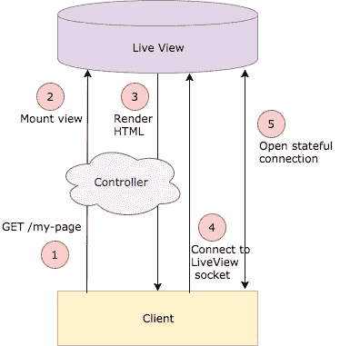
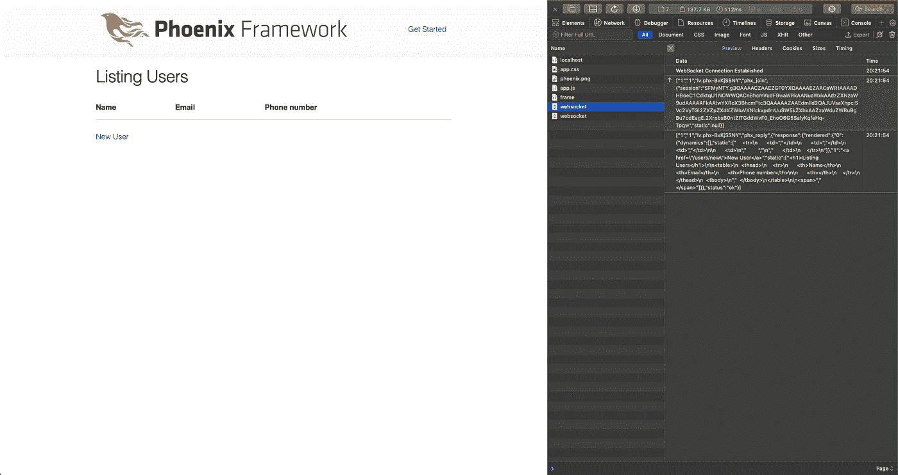
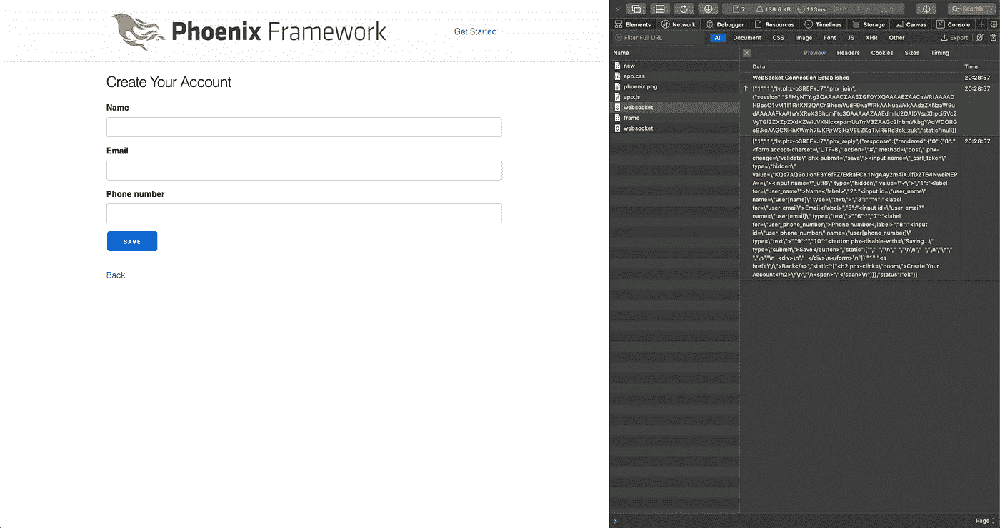
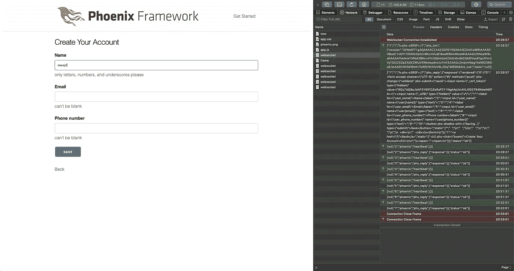
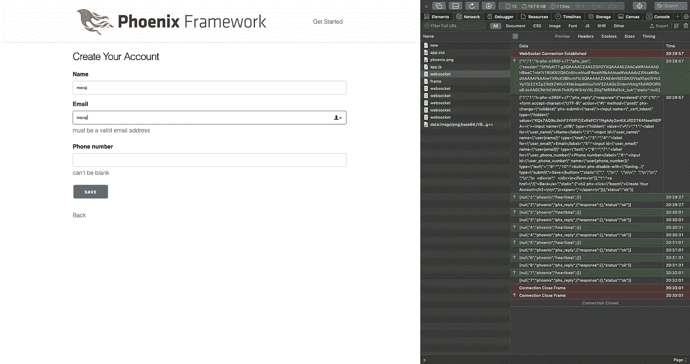
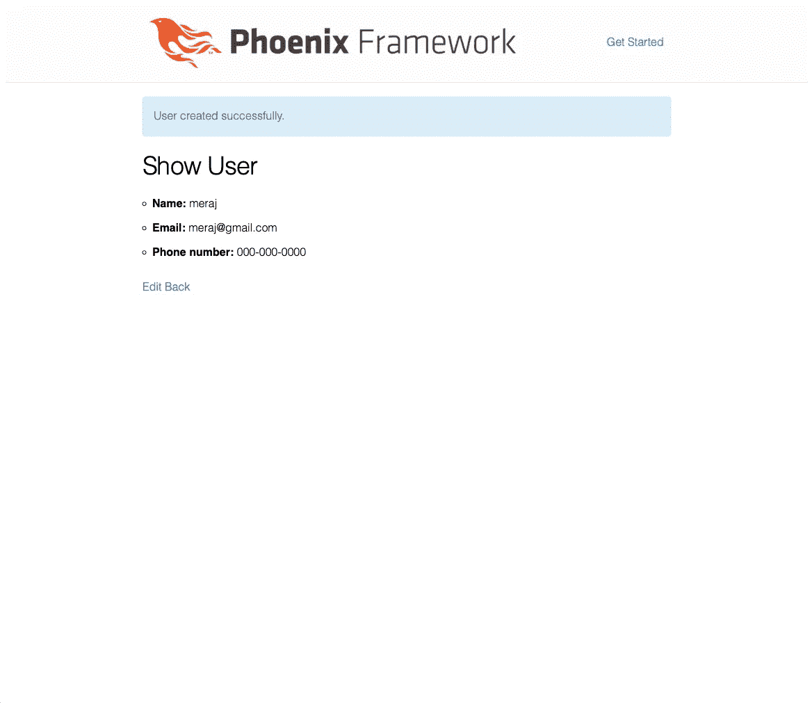

# Phoenix LiveView 的故事:编写 CRUD 应用程序

> 原文：<https://itnext.io/a-story-of-phoenix-liveview-writing-a-crud-application-d938e52894d4?source=collection_archive---------0----------------------->

Phoenix LiveView 是 Elixir/Phoenix 生态系统中一个令人兴奋的新成员。在本文中，我将概述 Phoenix LiveView 及其一些显著的特性，然后是一个使用 Phoenix Framework 1.4 和 LiveView 开发的 CRUD 应用程序示例。

# **什么是凤凰 LiveView？**

正如文章[中所描述的，这里](https://dockyard.com/blog/2018/12/12/phoenix-liveview-interactive-real-time-apps-no-need-to-write-javascript)—“*Phoenix live view 是一个令人兴奋的新库，它通过服务器渲染的 HTML 实现丰富的实时用户体验。LiveView 驱动的应用程序在服务器上是有状态的，通过 WebSockets 进行双向通信，与 JavaScript 替代方案相比，提供了一个大大简化的编程模型。*

如果你不喜欢 Javascript 或者不想写太多的 Javascript，Phoenix LiveView 提供了一个可行的，而且在我看来更好的替代方案，可以用服务器渲染的 HTML 编写实时应用程序。

# Phoenix LiveView 的显著特点:

你可以在 Phoenix LiveView 上阅读许多文章，感受一下它在互联网上的能力，但总的来说—

*   LiveView 提供了更简单的编程模型，用于使用服务器呈现的 HTML 编写实时交互式 web 应用程序
*   LiveView 连接过程如下—



来源:[https://elixirschool.com/blog/phoenix-live-view/](https://elixirschool.com/blog/phoenix-live-view/)

这是一个两步连接过程——

上图中的步骤 1、2、3 表示无状态连接，其中整个静态和动态 HTML 内容从服务器发送到浏览器并呈现。

步骤 4，5 通过 WebSocket 建立一个有状态连接，然后只为动态改变的内容发送更新。**live eex**(joséValim)用于计算已更改的零件，仅将最少量的更新零件发送至浏览器。

如果你想更多地了解这在内部是如何发生的，请查看这里的[和这里的](https://dockyard.com/blog/2018/12/12/phoenix-liveview-interactive-real-time-apps-no-need-to-write-javascript)和[以获取详细信息。](https://www.youtube.com/watch?feature=youtu.be&v=8xJzHq8ru0M&app=desktop)

*   然而，客户端应用程序不会像本文[中提到的那样消失，特别是当你需要离线能力的时候。](https://dockyard.com/blog/2018/12/12/phoenix-liveview-interactive-real-time-apps-no-need-to-write-javascript)

# 使用 LiveView 开发 CRUD 应用程序:

在本节中，我将介绍一个使用 LiveView 开发的 CRUD 应用程序示例。示例应用程序摘自 Phoenix LiveView 示例存储库，这里是[https://github.com/chrismccord/phoenix_live_view_example](https://github.com/chrismccord/phoenix_live_view_example)，但是为了适合本文，对其进行了简化和调整。您可以在上面的 github 资源库中找到许多其他使用 LiveView 的示例。

***完整的应用代码可以在我的 github 这里找到—***[***https://github . com/imeraj/Phoenix _ Playground/tree/master/1.4/user _ live view***](https://github.com/imeraj/Phoenix_Playground/tree/master/1.4/user_liveview)

## 应用概述:

该应用程序是一个简单的 CRUD 应用程序，具有一个**用户**模式、一些模式验证，以及一些操作——添加新用户、列出用户、显示用户、更新用户和删除用户。我添加了必要的代码来使用 LiveView 执行实时验证。

## **第一步**:生成 Phoenix 应用

使用下面的命令用 mysql 数据库生成一个 Phoenix 应用程序—

> mix phx.new user_liveview —数据库 mysql

## **步骤 2:定义模式并添加验证**

使用下面的命令定义一个用户模式

> 混合 phx.gen.html 帐户用户用户名:字符串电子邮件:字符串电话号码:字符串

带有验证的生成的**用户**模式如下所示—

```
defmodule UserLiveview.Accounts.User do
  use Ecto.Schema
  import Ecto.Changeset

  schema "users" do
    field :email, :string
    field :name, :string
    field :phone_number, :string

    timestamps()
  end

  @phone ~r/^(\+\d{1,2}\s)?\(?\d{3}\)?[\s.-]\d{3}[\s.-]\d{4}$/
  @email ~r/\A[\w+\-.]+@[a-z\d\-.]+\.[a-z]+\z/i

  @doc false
  def changeset(user, attrs) do
    user
    |> cast(attrs, [:name, :email, :phone_number])
    |> validate_required([:name, :email, :phone_number])
    |> validate_format(:name, ~r/^[a-zA-Z0-9_]*$/,
      message: "only letters, numbers, and underscores please"
    )
    |> validate_length(:name, max: 12)
    |> validate_format(:email, @email, message: "must be a valid email address")
    |> validate_format(:phone_number, @phone, message: "must be a valid number")
    |> unique_constraint(:email)
  end
end
```

## 第三步:集成 Phoenix LiveView

*   在 **mix.exs** 中:在依赖关系下添加—

{:phoenix_live_view，github:" phoenix framework/phoenix _ live _ view " }

*   在 **config.exs** 中；添加以下签名盐—

```
# Configures the endpoint
config :user_liveview, UserLiveviewWeb.Endpoint,
  url: [host: "localhost"],
  secret_key_base: "jUaYyObybTnU5twQ7xzNA2+cFLkHyNY/I+FMe7wqh8sguXdKryceqWXT+zTrm4yI",
  render_errors: [view: UserLiveviewWeb.ErrorView, accepts: ~w(html json)],
  pubsub: [name: UserLiveview.PubSub, adapter: Phoenix.PubSub.PG2],
  **live_view: [
    signing_salt: "KK4ly8HdzOmhsB+2itWau5xYDIPW8ctk"
  ]**
```

*   在 **router.ex** 中:在:fetch_flash 后添加 LiveView flash 插件—

```
pipeline :browser do
    plug :accepts, ["html"]
    plug :fetch_session
    plug :fetch_flash
    **plug Phoenix.LiveView.Flash**
    plug :protect_from_forgery
    plug :put_secure_browser_headers
  end
```

*   在 **user_liveview_web.ex:** 下面添加导入—

```
def view do
    quote do
      use Phoenix.View,
        root: "lib/user_liveview_web/templates",
        namespace: UserLiveviewWeb

      # Import convenience functions from controllers
      import Phoenix.Controller, only: [get_flash: 1, get_flash: 2, view_module: 1]

      **import Phoenix.LiveView, only: [live_render: 2, live_render: 3]**

      # Use all HTML functionality (forms, tags, etc)
      use Phoenix.HTML

      import UserLiveviewWeb.ErrorHelpers
      import UserLiveviewWeb.Gettext
      alias UserLiveviewWeb.Router.Helpers, as: Routes
    end
  end

  def router do
    quote do
      use Phoenix.Router
      import Plug.Conn
      import Phoenix.Controller

      **import Phoenix.LiveView.Router**
    end
  end
```

*   在 **endpoint.ex** 中:添加 LiveView socket 信息—

```
defmodule UserLiveviewWeb.Endpoint do
  use Phoenix.Endpoint, otp_app: :user_liveview

  **socket "/live", Phoenix.LiveView.Socket**

  ...
end
```

*   在 **package.json** 中:添加 LiveView NPM 依赖项—

```
"dependencies": {
    "phoenix": "file:../deps/phoenix",
    "phoenix_html": "file:../deps/phoenix_html",
   ** "phoenix_live_view": "file:../deps/phoenix_live_view"**
  },
```

用于安装 NPM 依赖项— **cd 资产& & npm 安装**

*   在 **app.js** 中:增加 LiveView socket 的连接能力—

```
import LiveSocket from "phoenix_live_view"

let liveSocket = new LiveSocket("/live")
liveSocket.connect()
```

*   在 **dev.exs** 中:添加动态页面重新加载支持—

```
config :user_liveview, UserLiveviewWeb.Endpoint,
  live_reload: [
    patterns: [
      ~r{priv/static/.*(js|css|png|jpeg|jpg|gif|svg)$},
      ~r{priv/gettext/.*(po)$},
      ~r{lib/user_liveview_web/views/.*(ex)$},
      ~r{lib/user_liveview_web/templates/.*(eex)$},
     ** ~r{lib/user_liveview_web/live/.*(ex)$}**
    ]
  ]
```

*   在 **app.css** 中:添加(可选)LiveView CSS —

```
@import "../../deps/phoenix_live_view/assets/css/live_view.css";
```

在这个阶段，LiveView 与应用程序的集成已经完成。

LiveView 代码将驻留在—**lib/user _ live view _ web/live**文件夹下。因为它不存在，所以需要创建它。

## **第四步:添加 LiveView 路线**

修改 **router.ex** 并指定路线如下—

```
scope "/", UserLiveviewWeb do
    pipe_through :browser

    **live "/", UserLive.Index
    live "/users", UserLive.Index
    live "/users/new", UserLive.New
    live "/users/:id", UserLive.Show
    live "/users/:id/edit", UserLive.Edit**
  end
```

## 步骤 5:添加必要的 LiveView 代码

在 **live/user** 目录下，添加 edit.ex、index.ex、new.ex 和 show . ex([https://github . com/imeraj/Phoenix _ Playground/tree/master/1.4/user _ live view/lib/user _ live view _ web/live/user](https://github.com/imeraj/Phoenix_Playground/tree/master/1.4/user_liveview/lib/user_liveview_web/live/user)

在**模板/用户**目录下，添加必要的 LiveView 模板(带扩展名。leex) — edit.html.leex，form.html.leex，index.html.leex，new.html.leex，show . html . leex([https://github . com/imeraj/Phoenix _ Playground/tree/master/1.4/user _ live view/lib/user _ live view _ web/templates/user](https://github.com/imeraj/Phoenix_Playground/tree/master/1.4/user_liveview/lib/user_liveview_web/templates/user))

更新 **user_view.ex** 如下—

```
defmodule UserLiveviewWeb.UserView do
  use UserLiveviewWeb, :view

  **alias UserLiveviewWeb.UserLive**
end
```

在此阶段，使用以下命令运行应用程序—

*   混合 deps.get
*   混合环境设置
*   mix phx.server

启动您的浏览器，点击 localhost:4000，您应该会看到下面的屏幕。如果您打开了浏览器的 WebInspector，您应该会看到一个加入事件(到 LiveView WebSocket ),如下图右侧所示



应用程序主页

## 应用程序流和代码演练

在这一节中，我将解释应用程序流和代码演练。我将只解释带有验证部分代码的新用户创建。在这个解释之后，剩下的代码应该很容易理解。

我们创建新用户的途径是—

> live "/用户/新建"，UserLive。新的

一旦我们在主页上点击“**新用户**”或输入路由—**localhost:4000/users/New**，我们应该会看到下面的屏幕—



新用户创建屏幕

这里发生的是—

*   **mount** 函数后跟 **new.ex** 中的 **render** 被调用——

```
defmodule UserLiveviewWeb.UserLive.New do
  use Phoenix.LiveView

  alias UserLiveviewWeb.UserLive
  alias UserLiveviewWeb.UserView
  alias UserLiveviewWeb.Router.Helpers, as: Routes
  alias UserLiveview.Accounts
  alias UserLiveview.Accounts.User

  **def mount(_session, socket) do**
    {:ok,
     assign(socket, %{
       changeset: Accounts.change_user(%User{})
     })}
  end

  **def render(assigns), do: UserView.render("new.html", assigns)** 
  def handle_event("validate", %{"user" => params}, socket) do
    changeset =
      %User{}
      |> Accounts.change_user(params)
      |> Map.put(:action, :insert)

    {:noreply, assign(socket, changeset: changeset)}
  end

  def handle_event("save", %{"user" => user_params}, socket) do
    case Accounts.create_user(user_params) do
      {:ok, user} ->
        {:stop,
         socket
         |> put_flash(:info, "User created successfully.")
         |> redirect(to: Routes.live_path(socket, UserLive.Show, user))}

      {:error, %Ecto.Changeset{} = changeset} ->
        {:noreply, assign(socket, changeset: changeset)}
    end
  end
end
```

**渲染**函数渲染模板**new.html**，本质上是渲染**form.html**—

```
<%= f = form_for @changeset, "#", [phx_change: :validate, phx_submit: :save] %>
  <%= label f, :name %>
  <%= text_input f, :name %>
  <%= error_tag f, :name %>

  <%= label f, :email %>
  <%= text_input f, :email %>
  <%= error_tag f, :email %>

  <%= label f, :phone_number %>
  <%= text_input f, :phone_number %>
  <%= error_tag f, :phone_number %>

  <div>
    <%= submit "Save", phx_disable_with: "Saving..." %>
  </div>
</form>
```

这个表单生成两个事件——

1.  :**验证** —由于 **phx_change** 无论何时检测到任何字段中的任何变化
2.  :**保存** —由于点击“保存”按钮时 **phx_submit**

每个事件都会导致对 **new.ex** 中 **handle_event** 的相应调用

```
def handle_event("**validate**", %{"user" => params}, socket) do
    changeset =
      %User{}
      |> Accounts.change_user(params)
      |> Map.put(:action, :insert)

    {:noreply, assign(socket, changeset: changeset)}
  end

  def handle_event("**save**", %{"user" => user_params}, socket) do
    case Accounts.create_user(user_params) do
      {:ok, user} ->
        {:stop,
         socket
         |> put_flash(:info, "User created successfully.")
         |> redirect(to: Routes.live_path(socket, UserLive.Show, user))}

      {:error, %Ecto.Changeset{} = changeset} ->
        {:noreply, assign(socket, changeset: changeset)}
    end
  end
end
```

因为我们输入的每个字符都会导致一个服务器端的**验证**事件，如果任何验证失败，我们可以通过**变更集**在 UI 中立即得到错误消息。

当我们在所有验证通过后点击**保存**按钮，相应的用户被创建并保存在 DB 中。

一些验证失败的截图—



名称验证失败



电子邮件验证失败

如果所有验证都通过，点击“保存”按钮后，应出现以下屏幕—



验证通过，用户已创建

对于其余的路线，流程基本相同，在这一点上应该是可以理解的。如果你遇到新的 LiveView 相关函数/符号，这些文档可能会派上用场——[https://github . com/phoenix framework/phoenix _ live _ view/blob/master/lib/phoenix _ live _ view . ex](https://github.com/phoenixframework/phoenix_live_view/blob/master/lib/phoenix_live_view.ex)，[https://github . com/phoenix framework/phoenix _ live _ view/blob/master/assets/js/phoenix _ live _ view . js](https://github.com/phoenixframework/phoenix_live_view/blob/master/assets/js/phoenix_live_view.js)

我希望这篇文章为感兴趣的读者澄清了 Phoenix LiveView，并为一些读者提供了一个起点。希望这将鼓励更多的开发者关注 Phoenix LiveView，并提出有趣的用例。

# 参考资料:

1.  [https://dock yard . com/blog/2018/12/12/phoenix-live view-interactive-real-time-apps-no-need-to-write-JavaScript](https://dockyard.com/blog/2018/12/12/phoenix-liveview-interactive-real-time-apps-no-need-to-write-javascript)
2.  [https://www.youtube.com/watch?feature=youtu.be&v = 8 xjzhq 8 ru 0m&app =桌面](https://www.youtube.com/watch?feature=youtu.be&v=8xJzHq8ru0M&app=desktop)
3.  [https://elixirschool.com/blog/phoenix-live-view/](https://elixirschool.com/blog/phoenix-live-view/)

*如需更多详细和深入的未来技术帖子，请关注我这里或上*[*Twitter*](https://twitter.com/meraj_enigma)*。*