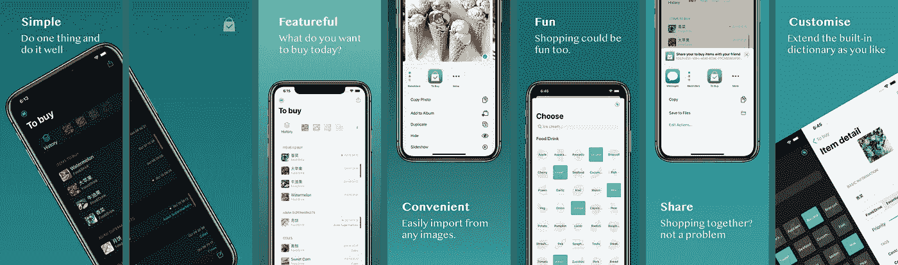
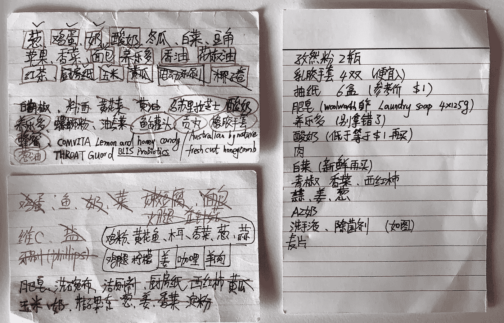
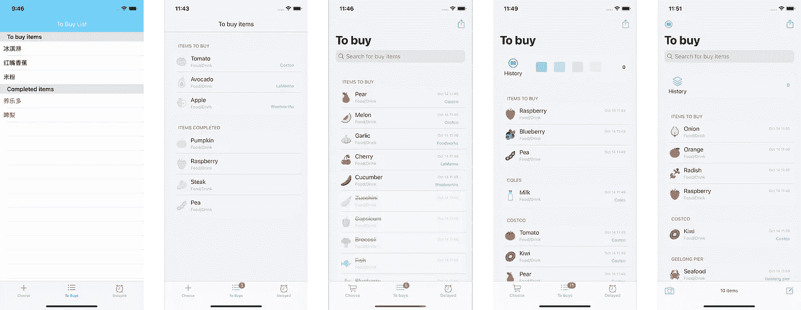
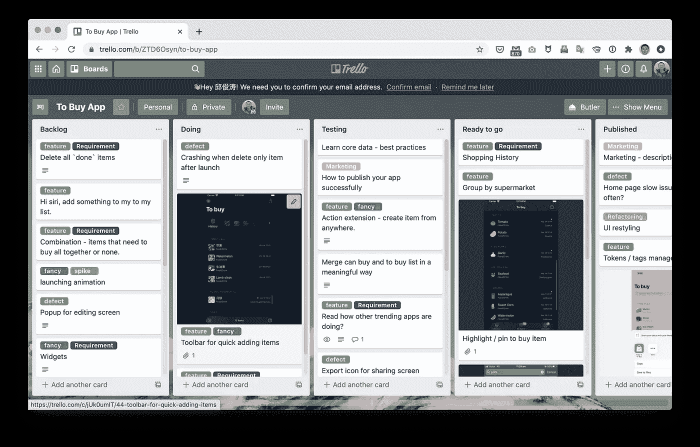
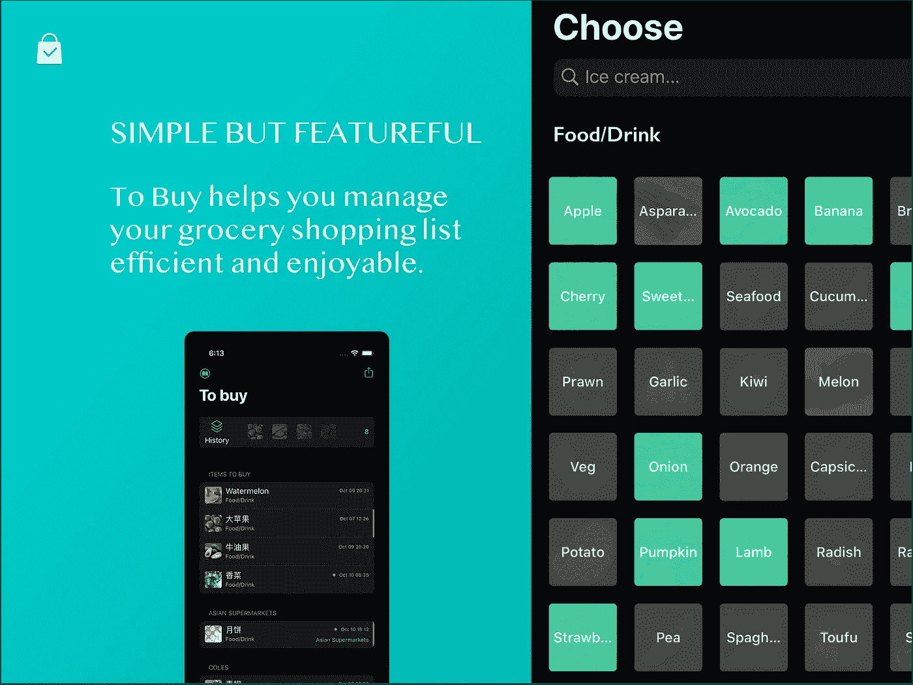

# “购买”的故事:从创意到产品

> 原文：<https://itnext.io/a-story-of-to-buy-from-idea-to-product-85a1e0c9658d?source=collection_archive---------2----------------------->

购买截图

毫无疑问，新冠肺炎在许多方面深刻地影响了我们的生活。外出喝咖啡时强制戴口罩，公共场合的社交距离，如何用 6 个步骤洗手，或者在家工作造成的身体隔离带来的负面精神影响等等。这些变化正在塑造我们的生活。

我今天分享的内容与新冠肺炎有关。这是关于在丹尼尔·安德鲁斯宣布维多利亚进入灾难状态两个月后，我如何从头开始建立并发布了一个移动应用程序，我必须每天呆在家里几乎 24 小时。所有这些，当然都是从一个单一的需求出发。

# 需求分析

事实上，这是我妻子的老要求了。为了避免在超市花太多时间，我们中的一些人有一个购物清单，就像下面这些索引卡一样:

索引卡片

我打赌你可能有类似的东西。这些单子有一堆优点:便于携带，使用和脱落，超级方便。然而，也有一些缺点:使用后很容易丢失一个。如果你不使用带笔的索引卡，你必须多次检查一些项目，以确保你没有遗漏。此外，小卡片上的信息可能是有限的，有时你需要更多的描述性信息，例如，如果价格是三个买五个，就从*拉曼纳&的儿子*那里买一些甜玉米。或者你需要一种特定类型的番茄。

所以我需要一个应用程序来帮我处理这些列表。主要原因是我一直带着手机，在待办事项中，它是纸和笔的完美替代品。此外，多媒体(照片、视频、网站)比索引卡有很多优势。

另一个典型的购物场景是:我一轮逛很多超市去购物。一家超市有新鲜的蔬菜和水果，另一家有所有的生活必需品，还有一些特定的东西你只能在亚洲超市买到。这就是为什么我需要应用程序按超市对商品进行分组，以便我可以在一个超市购买所有商品，然后我去下一个超市。

阶段 4 封锁在某种程度上促进了这个想法的实现:首先，因为封锁，我突然有了比平常更多的时间(不锻炼，不通勤，什么都没有)；其次，每次购物都必须迅速，以避免在人群中暴露太久。最后，由于一个家庭每天只能出去购物一次，我们需要仔细计划购物(软件可以大大简化这些过程)

你可能认为`Notes`或`Reminder`可以减轻这些痛苦，因为它们都内置了`Todo`管理，但问题是它们都是通用工具，不是专门为购物设计的。在实现方面，我不打算从`Swift`101 或者任何`Hello world`app 开始，而是先设定目标，然后通过实践来学习，最终发布成一个大家都能用的工具。

# 履行

所以现在我在 ***我有一个绝妙的想法，我需要一个开发者*** 阶段。巧合的是，我自己也是一名开发人员，现在唯一的问题是我对`Swift`或移动应用程序开发毫无经验。此外，我知道在一个产品中有很多杂七杂八的项目，比如用户界面设计、图标、法律相关的内容、发布过程等等，这些对我来说都是未知的。

# 从做中学的方法

总的来说，我更喜欢逐步学习新技术。从一个简单的演示开始，一个接一个地学习所有的科目(用户界面设计、使用数据库、通过网络请求资源等等)，这种方法可以打下坚实的基础，并充分练习各种细节。然而，掌握一项技术通常需要很长时间，可能几个月都没有任何实际出版或有形的东西。而且很容易被其他任务打断，重新开始会很有挑战性。

另一方面，你也可以边做边学，这意味着你首先要有一个明确的目标，然后用这个目标来推动你要学的东西。例如，如果你只需要一个独立的图像编辑器应用程序，就没有必要学习网络或数据库。这种方式的好处是可以提供及时的反馈，而且你总是有一个明确的目标。

当然，也有一些缺点:

*   谷歌搜索或阅读堆栈溢出答案可能需要很长时间
*   你找到一些资源可能已经过时了，比如那些在我使用`Swift`的时候用`Object-c`写的组件
*   人们分享的大部分内容都太简单了，所以基本上你不能在你的项目中直接使用它们

所以我一直试图将这两者融合在一起。例如，在第一个里程碑中。我主要使用结果驱动的方法，粗略地学习了一些必要的知识，如 TableView，iOS 中的 MVC，如何使用导航等。这些源代码主要来自 youtube 频道，主要是教你如何用 Xcode 实现一个简单的 Todo。你可以熟悉 XCode，key-maps，`Swift`的基本语法，界面设计器的基础等等。

然后你可以写你的产品代码，没有规则。你要么用 JavaScript 方式写 swift，要么用 Java 方式写，现阶段无所谓。如果一切顺利，你应该很快就能造出原型。在这个阶段出现了大量的具体问题:如何向 XCode 项目添加图标，如何配置颜色，或者两个视图如何相互对话，如何在父视图和子视图之间同步数据。但是作为一个有经验的开发人员，所有这些都可以由`Google + Stack overflow`解决(也许不是全部，但是是大部分，至少你现在可以带着一些难看的解决方案到处走)。

过了这个阶段，你就有了一个可操作的原型，就到了打磨的时候了。我用一杯豆奶拿铁的价格从`udemy`购买了在线课程[完整的 iOS 应用程序开发训练营](https://www.udemy.com/course/ios-13-app-development-bootcamp/)。然后我开始学习更详细的内容，比如如何使用`protocol`，如何使用`MVVM`模式，如何定义`segue`等等。与此同时，我修复了一些缺陷，并做了一些重构。

下图展示了用户界面是如何从原型发展到最新版本的。它从一个默认的外观和感觉`TableView`开始，然后是一些自定义的`TableCell`，每次都比上一步复杂一点，每次变化都基于真实的用户反馈。

用户界面是如何发展的

在这里我想提的一个建议是:如果你有充足的时间，从基础开始，一步一步的建立你的知识，这样你就可以对整个结构有一个扎实的了解。但是如果你没有那么多时间，担心被分散注意力，那你就边做边学。同样重要的是，当你有积极的反馈(或更多的时间)时，你需要回到基础。

# 项目管理

在这个过程中，我发现一个可视化的、可追踪的故事板真的很有帮助。当然，你需要一套规则，并确保你遵守这些规则。例如，所有的故事必须从待办事项栏开始(这意味着它必须被分析)，并且你需要在开始一项任务之前确认它的优先级，你需要对一项任务的完成有一个清晰的定义。此外，你必须在实施时收集反馈。换句话说，你应该像对待其他正常项目一样，更认真地对待副业项目。

此外，我还注意到，在开始时，我倾向于违反一些敏捷实践，我观察到人们在客户端站点上一直忽视这些实践。比如没有按时更新故事，没有控制在制品数量，或者直接将临时任务插入到“正在做”栏中，没有正确地对它们进行优先排序，没有明确的验收标准等等。但是经过几次迭代，我改变了流程，试图让它更正式。这确实有助于我关注高优先级、高价值的特性(而不是那些花哨的特性)

特雷罗项目管理委员会

我认为这是你投资一个项目最便宜的选择，也是最有效的选择。特别是当你被一些意想不到的任务打断时(长周末，或者你必须赶上客户项目)，一个简单的故事板可以帮助你重建上下文并继续进行。

# 启动

经过大约两周的学习/开发，我注册了一个苹果开发者账户，并提交了我的第一个原型。它包含三个列表(产品目录、待购列表和延期项目列表)，由于[缺乏功能](https://developer.apple.com/app-store/review/guidelines/#minimum-functionality)，它被悲惨地拒绝了。所以我再次更仔细地分析了它，我相信这可能是因为用户界面，它太粗糙了，有许多地方需要调整。然后我花了大约一周的时间用字体、字体大小、间距、颜色对比和其他小的 UI 细节来美化它。此外，我还添加了一个共享列表功能(这样你就可以通过 Airdrop 与他人共享你的列表)。第二次提交 3 小时后，就通过了。

对 V1 来说，我花了大约三个星期，每晚 2-3 个小时，周末会多一点。V2 也花了我 2-3 周的时间，除了功能性之外，还有很多支持性的工作，比如海报设计(更多细节见下一节)。顺便说一下，我刚刚在 iOS 14 上发现了一个严重的问题(因为苹果没有正确地实现`NSFetchedResultsControllerDelegate`，如果你碰巧知道如何绕过它，请让我知道)，如果你发现任何异常，请给我一些反馈。所有的源代码都在 [Github](https://github.com/abruzzi/to-buy) 上，所以如果你对它感兴趣或者想投稿，也请告诉我。

# 买还是*不买？*

这款应用名为[购买:杂货购物清单](https://apps.apple.com/au/app/to-buy-grocery-shopping-list/id1531070172)，已经在[应用商店](https://apps.apple.com/au/app/to-buy-grocery-shopping-list/id1531070172)发布。这是我设计、编码、构建和维护的第一个 iOS 应用程序(尽管当时我和妻子是两个主要用户)。我认为这是一个很好的开始，我对它目前的状态很满意。

# 特征表

经过几个版本(目前的版本 2.5.0)的迭代，现在购买本质上是维护一个杂货店购物清单。它允许用户:

*   通过从相机中拍摄照片或键入名称来添加项目
*   按超市对商品进行分组，这样他们就可以同时访问多个超市并关注每一个超市
*   将购物项目添加到字典中，这样他们下次就可以很容易地找到
*   直接从“照片”应用程序添加照片作为购买项目
*   所有数据都会自动同步到 iCloud 中，以便他们可以在多个设备之间共享这些数据
*   只需轻轻一点，即可与其他人共享项目

我注意到的另一件有趣的事情是:无论我第一次设计它时有多确定，最终的形式都将与我开始时大相径庭。例如，originally To Buy 有一个内置的字典，里面包含了几乎所有的内容，我发现它并不经常使用。挑战在于，当我只想直接输入一些东西时，我必须(在几个屏幕上)点击几次。

所以最后，`To Buy`有多个入口，用户可以只按名称添加一个项目(如果他们愿意，以后可以填写所有细节)，或者拍照或从其他应用程序导入。还有一些功能根本不考虑但最终还是被用户问了。此外，三个选项卡的设计现在简化为一个屏幕。

# 一些经验教训

在这个从想法到实现，再到发布产品的过程中，我对如何孵化一个产品(哪怕是一个小的，只为自己解决一个特定的问题)有了一些新的看法。所以我把它们总结成几类，希望也能给你一些启发。

# 不要想太多

与那些编程世界的新手相比(他们总是好奇并渴望学习任何东西)，有经验的开发人员通常会平衡/思考太多。他们倾向于分析一项新技术的投资回报，或者该技术的前景如何。在你花太多钱在某个框架上之前做一些功课绝对是明智的，但是你需要注意的是不要想太多。

首先，对不同候选人进行比较本身就需要时间。其次，在几轮*理性*分析和比较之后，你可能会忘记你是从哪里开始的，或者更糟糕的是，你可能会有一些错觉，认为你已经通过学习概述掌握了技术。最后，有太多不可见的部分隐藏在细节中，只有当你开始做时，你才能意识到它有多深。

解决方法很简单，在最初的短暂研究之后，开始用你刚刚学到的新东西来解决一个具体的问题。试着用你正在解决的问题来和技术互动。

# 不要追求完美

正如你一直听到的:*完美是好的敌人*。当你实现一个想法时，这是千真万确的。它可能是一种更健壮的架构风格，或者最高的代码覆盖率，或者自动化所有的测试，以在所有视图中测试金字塔或实现 MVVM。所有这些都应该比你正在制造的主要特征优先级低。而且我真的很怀疑你以后是不是真的能有那种完美。我认为追求完美应该是一个渐进的过程，从一个具体问题的一些简单解决方案开始，逐渐使它变得更好。

我们确实需要反复打磨产品的每一个细节，有时可能需要对其中一个屏幕上的`view`进行像素级的调整。但是建立可增强的工作原型总是具有更高的优先级。

# 如果你不知道该走哪条路，选择最简单的一条

一开始就选择一个合适的技术解决方案可能很有挑战性；这就是为什么你应该选择简单的东西。当本地文件系统足够时，不要使用数据库；如果本地计算足够，不要尝试网络。在工程领域，每多一个集成点就意味着更高的失败可能性。这些集成点的失败率会累积并放大，最终几乎肯定会出错。

换句话说，你需要等到迫不得已的时候再做决定。另外，我们总有机会回去调整方向。也正因为如此，我们应该选择最直接的方法，即使将来重写是不可避免的，也会容易得多。

# 细节决定成败

有一件事让我惊讶了很多次，那就是那些令人兴奋和新奇的特性通常很容易实现。它们是那些乏味/简单的，如`i18n`或`accessibility`，从异常中恢复比我想象的要花更长的时间。

黑暗模式

一个很好的例子是当我在设计中实现`dark mode`时。我不得不多次调整背景色、高亮颜色、文本背景对比度等等，以使它看起来正确。我需要确保它在每种情况下都能工作，并且不要让用户注意到我的设计。这些隐藏的细节可能需要大量的时间和精力，但是你必须接受这个事实，把它们当作正常的功能来对待。

要做出好的产品，你需要静下心来，仔细考虑那些*边缘案例*。那些*吃力不讨好的*特征就像你午餐中的第二个汉堡——你不能忽视第一个让你 70%饱的汉堡。当你做计划时，你也需要考虑所有这些因素。

# 摘要

俗话说:所有伟大的事情都有小的开始。即使是最复杂的产品也是从一个小而简单的想法开始的。而且在实现的过程中，即使是像买这样简单的 App，也有很多细节需要考虑和打磨。

首先，除了艰苦的工作，一旦你有了明确的目标，你还需要有意识地*将它分解*成更小的部分，并分别对它们进行优先排序，然后实施。在上面的故事中，我是**利益相关者**之一，学习 iOS 是项目目标之一，因此这将影响我们对任务进行优先排序的方式。在客户项目中，这可能并不总是正确的。

其次，当你有了一个大致的目标，你可以开始设计几个实验，用最简单的方式实现一个原型。一旦你有了一个原型，那么增强它比仅仅有一个完美的理论要容易得多。当你不确定该走哪条路时，总是选择最简单的方法。你应该意识到，只有当你钻得足够深时，共谋才会出现，从这一点做出的决定比你预先计划的要可靠和可行得多。

更重要的是，如果你将整个过程视为一系列实验，那么你可以调整不同的参数并观察你的结果，并动态地调整它们，最终达到可行的阶段。不要把最终产品看得太重。这可能是一次有趣的探索，最糟糕的情况是你学到了关于这个主题的大量知识，也获得了一些优秀的第一手经验，你可以在下一次冒险中依靠这些经验。