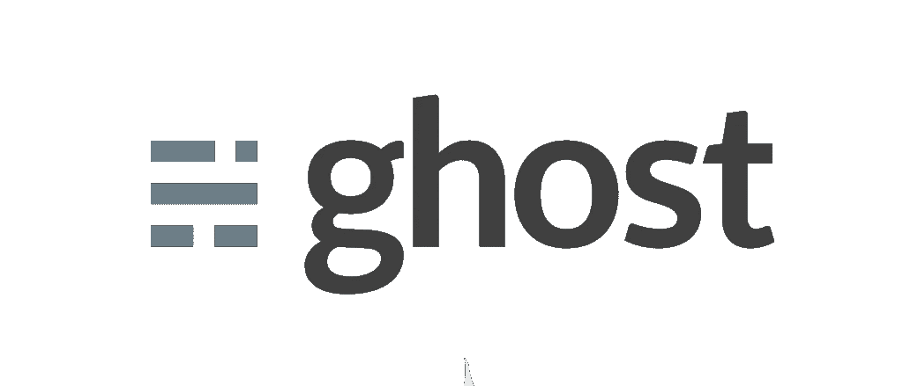
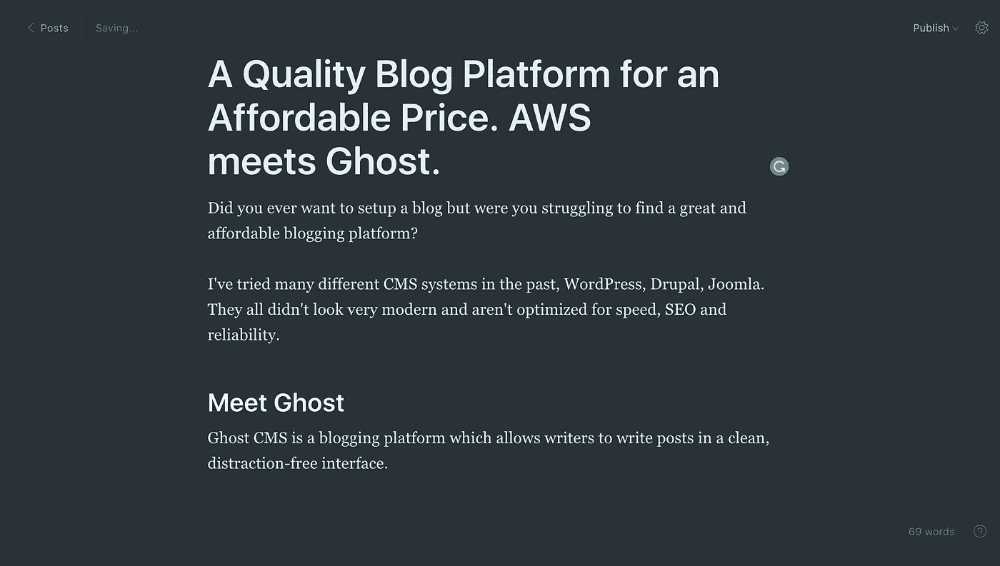
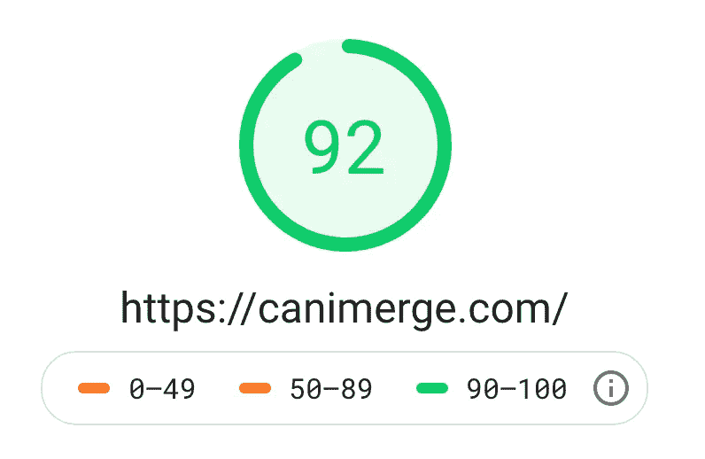
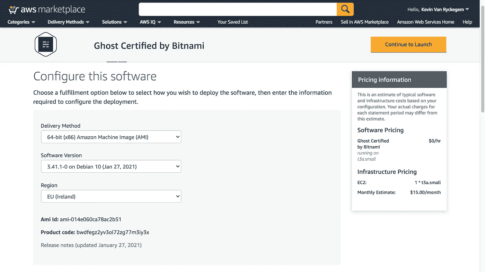
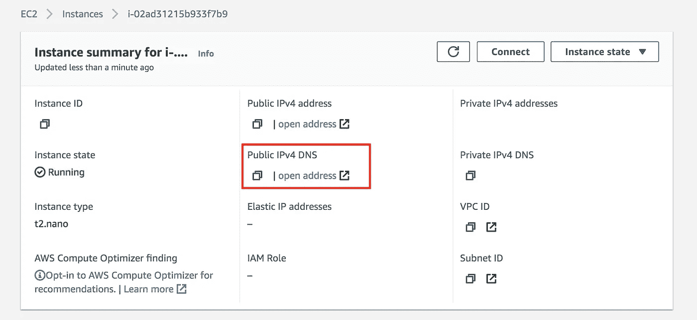
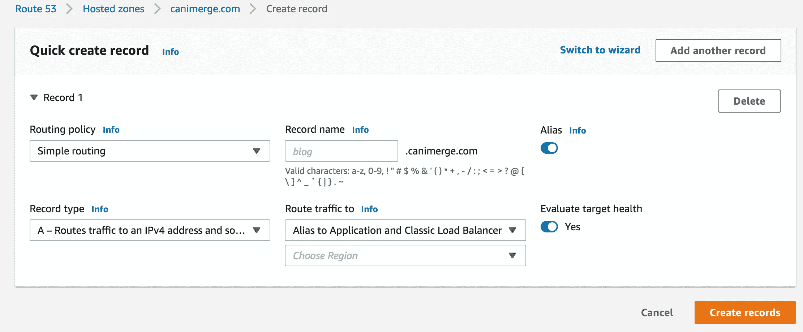

# 一个超值的博客。AWS 遇到幽灵。

> 原文：<https://itnext.io/a-superb-blog-for-a-great-price-aws-meets-ghost-b96caedc842?source=collection_archive---------3----------------------->



## 您是否曾努力寻找一个伟大的博客平台？

这些年来，我尝试了很多不同的 CMS 系统，WordPress、Drupal、Joomla 等等。它们看起来都不太现代，也没有在速度、搜索引擎优化和可靠性方面进行优化。通常，这些甚至需要插件被完全优化。

其他选项通常相当昂贵，但并不能提供最好的功能。在本文中，我们将了解 Ghost CMS 以及如何在 AWS 上轻松设置它。

# 遇见幽灵

Ghost CMS 是一个内容驱动的博客平台，允许用户以专注于内容的方式阅读博客文章，而作者可以在一个干净、不受干扰的界面上撰写文章。看看下面截图中的样子。



幽灵界面的书写部分，是的，**有一个黑暗模式！**

它非常简单，但很有效。Ghost 功能自动谷歌放大器集成，这可以给你的网站在搜索引擎优化方面一个很好的推动。此外，它在速度方面也非常优化！让我们看看这个运行 Ghost 的网站的 PageSpeed Insights。Ghost 显然是非常优化的。



我的幽灵网站的页面速度洞察。

谷歌 PageSpeed insights 的得分为 92%。如果你不熟悉这个，这是一个非常惊人的分数，一点也不容易得到。许多著名网站的页面速度得分要低得多。我们已经知道一个事实，谷歌的确根据页面速度得分对网站进行排名！

> 速度现在是谷歌搜索和广告的登陆页面因素；[谷歌开发者](https://developers.google.com/web/updates/2018/07/search-ads-speed)

顶端的樱桃，这个 PageSpeed 分数是在一个 AWS T2 Nano EC2 实例上获得的！如果您不熟悉它，这是您能从亚马逊获得的最便宜、功能最弱的服务器之一，每年大约花费 36 欧元。总之，非常实惠，同时拥有高质量的软件，以最佳方式优化您的博客，以吸引更多的读者。

# 确信吗？让我们开始吧！

这不仅是一个非常强大的博客软件，它是负担得起的，也很容易设置使用 AWS！首先，您需要一个 AWS 帐户。

*请注意，在本部分，我们将设置服务器，您需要从您的 AWS 帐户中支付这些服务器的费用。EC2 实例、负载平衡器和 Route53 区域不是空闲的。*

Ghost 由 Bitnami 在 AWS Marketplace 上提供。这意味着，我们可以在您的 AWS 帐户上一键安装 Ghost。在这里可以找到幽灵的市集物品。跟随链接点击*继续订阅*设置*。订阅*然后继续*配置该软件。*



Ghost 的 AWS 市场配置

将所有设置保留为默认值。请确保区域设置正确。每个地区在 AWS 上都有不同的定价。选择一个靠近你预期用户群中心的地区。如果你希望在欧洲有很多读者，欧盟-西方-可能是一个不错的选择。我个人喜欢 eu-west-1，也称为爱尔兰地区，因为大多数 AWS 服务都在那里提供。其他一些地区可能在服务方面受到限制。

请注意，它说 T3 . small。T3 . small 实例非常昂贵，而且对于创建一个新的 Ghost 博客来说太大了。设置好之后，让我们将它简化为一个 T2 纳米实例，它便宜得多，但如果您刚刚开始，它可以提供很好的性能。一旦你注意到你有很多读者，你的博客开始增长，你可能会考虑选择一个更强大的服务。在那之前，虽然博客运行得又快又流畅，但没有必要超过 T2.Nano。

T3 或 T4 纳米实际上是首选，因为这些都是较新的版本，但是，在撰写本文时，幽灵实例不兼容 T3。纳米选项。这很可能是由于 Bitnami 在市场上设置的配置。

按下*继续启动*并将所有设置留空或默认。你不需要改变这些，除非你知道你在做什么，并且想要改变。

# 查找您的网站 URL

第一次启动时，你的服务器需要一些时间来初始化，所以请耐心等待。让我们来看看你的网站网址是什么。

在 AWS 中，浏览到 EC2 实例，并找到 Ghost 实例。



您的 Ghost 博客的可公开访问的 URL 将出现在*公共 IPv4 DNS* 字段中。在这个网址上，你会找到你的博客。要登录，请访问您的-ghost-blog/ghost/。有不同的方法可以找到安装后的第一个管理员用户名和密码。

# 查找管理员凭据

我发现找到管理员凭证的最简单的方法是 SSH 到 EC2 实例。为此，请回到 AWS 中的 EC2 实例列表。选择您的实例，然后按操作->连接按钮。点击 *SSH 客户端*选项卡，并按照说明进行操作。通过 SSH 连接到 EC2 实例所需的用户名是 *bitnami。*与 AWS 提供的私有 SSH 密钥一起使用。

一旦连接到您的实例，输入以下命令来查找管理员凭证。

```
$ sudo cat /home/bitnami/bitnami_credentialsWelcome to the Bitnami Ghost Stack********************************************************************
The default username and password is '[user@example.com](mailto:user@example.com)' and '-redacted-'.
********************************************************************You can also use this password to access the databases and any other component the stack includes.Please refer to [https://docs.bitnami.com/](https://docs.bitnami.com/) for more details.
```

# 减少实例大小

我们现在正在运行一个 t3.small 实例，对于我们所需要的来说，这个实例非常昂贵，而且功率过大。让我们将其简化为 t3 或 t2 nano 实例。转到 AWS 中的 EC2 仪表板，再次选择您的实例。选择*实例状态*->-*停止实例*。


接下来，再次选择您的实例，并按下*操作*->-*实例设置*->-*更改实例类型*。


您会发现一个实例类型列表。搜索 t2、t3 或 t4 nano。版本越高越好，但需要 Bitnami 提供的 Ghost 镜像支持。在写这篇文章的时候，这只有在 t2 nano 上才有可能。

完成后，以停止实例的相同方式重新启动实例。你会发现你的幽灵网站仍然很快，尤其是如果你刚刚开始。

# 使用 Route53 设置 DNS

我们现在已经用 Ghost 设置了 EC2 实例，您可以作为管理员登录。太好了！接下来，我们必须设置 DNS，这样您就可以使用自己的域名，而不是来自 AWS 的很长的公共 DNS。首先，你应该已经拥有一个域名。

做这件事有不同的方法。你有自己的 SSL 证书吗？然后，您必须通过在机器上设置一个 shell 会话，将这个 SSL 证书手动配置到 EC2 实例中。

要不要用内置的亚马逊 SSL？那么你将被迫建立一个昂贵的负载平衡器。负载平衡器的起价约为每月 15 美元，即使它只是用于设置一个证书。很遗憾，但这是亚马逊目前的工作方式。好消息是，负载平衡器可以重复用于多达 5 个应用程序。让我们来设置负载平衡器。

# 负载平衡器设置


找到 EC2 的负载平衡器部分，创建一个新的负载平衡器。选择 HTTP/HTTPS 应用程序负载平衡器。确保您为 HTTPS 设置了一个监听器，如下图所示。


保持加速器未选中，并选择至少 2 个您选择的可用性区域，继续并创建负载平衡器。

# 证书管理器安装程序

接下来，我们需要为您的域创建一个免费的 amazon SSL 证书。转到 AWS 中的证书管理器，也称为 ACM。选择*申请证书- >申请公共证书* - >填写您的域名。


亚马逊将要求您使用 DNS 或其他方法验证您的域名。按照亚马逊提供的说明来验证您的域名。最简单的方法是在你的域名上添加一个 DNS 条目，让亚马逊知道你是这个域名的所有者。保留此 DNS 条目，即使在验证之后，也不要删除它。

# 在 Route53 中设置 DNS

最后，确保您的域名在 AWS 中设置为托管区域。如果没有，选择*创建托管区域*，填写您的域名，并设置您的域名的 DNS 以指向 AWS 将为您提供的 4–5 个域名服务器。

完成后，点击您的托管区域，选择*创建记录*，并按照截图所示进行填写。确保别名被选中，选择*别名到一个应用负载平衡器*。选择 EC2 实例的区域，最后选择 EC2 实例的名称。



创造记录。你现在可以走了！访问您的网站在选定的域名，鬼应该会出现。如果没有，请尝试隐姓埋名模式，或者再等一会儿，直到所有 DNS 更改都传播完毕。

# 结论

Ghost 是一个非常现代的博客/CMS 平台，对网络进行了很好的优化。在 AWS 上设置它可以非常便宜，同时为作者和读者提供良好的体验。

请注意，我与 Ghost 没有任何关系，我只是他们开源产品的忠实粉丝。

[订阅我的媒介](https://kevinvr.medium.com/membership)到**解锁** **所有** **文章**。通过使用我的链接订阅，你是支持我的工作，没有额外的费用。你会得到我永远的感激。