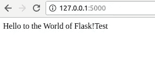
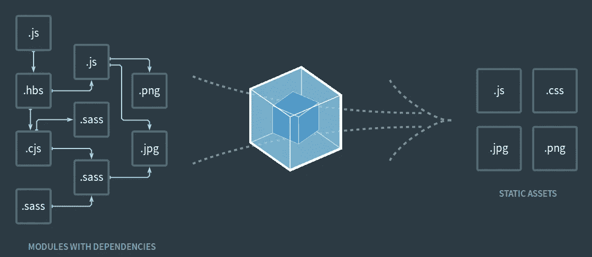
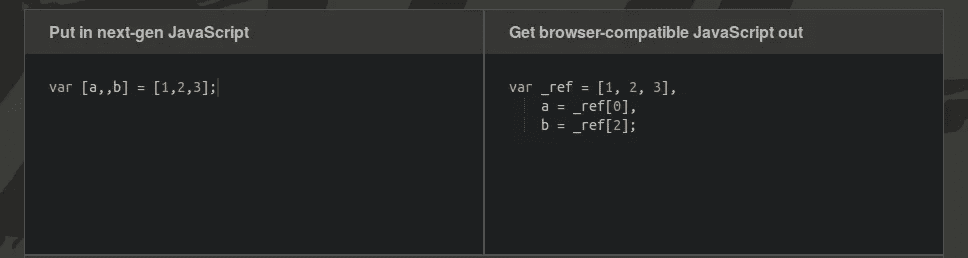
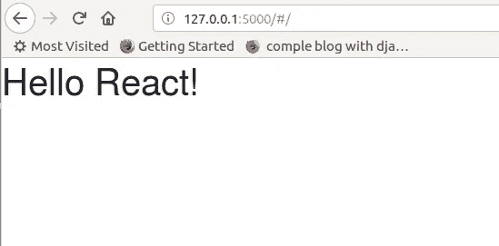

# 使用 Flask、NPM、Webpack 和 Reactjs 创建全栈 Web 应用程序的模板

> 原文：<https://itnext.io/a-template-for-creating-a-full-stack-web-application-with-flask-npm-webpack-and-reactjs-be2294b111bd?source=collection_archive---------0----------------------->


为什么有些人比其他人更成功？为什么有些人比大多数人赚更多的钱，过更快乐的生活，在同样的时间里完成更多的事情？真正的“成功秘诀”是什么？

除非你成为一个实干家而不是思想家，否则你会发现很难完成任何有意义的事情。创建全栈 web 应用程序的能力将使您能够自由地快速实现您的伟大想法，并让每个人都能看到，因为我们都知道我们的世界是由互联网驱动的。

**本文的目的是帮助你用 Python Flask 服务器和 React 前端**启动自己的全栈 web 应用。这篇文章适合任何对编程和技术有基本了解的人，他们想探索一下 [python-flask](https://www.fullstackpython.com/flask.html) 、 [npm](https://www.npmjs.com/) 、 [webpack](https://webpack.js.org/) 和 [reactjs](https://reactjs.org/) 构建全栈 web 应用程序的美妙之处。

这个博客将会详细介绍这个 GitHub 链接[中的实现。然而，如果你跟随这篇博文，你会收获更多。](https://github.com/Eyongkevin/hello_template)

## 文件夹和文件组织

我们将从组织项目的文件和文件夹开始。有效地组织静态文件，比如 JavaScript、样式表、图像等等，一直是所有 web 框架关心的问题。Flask 推荐了一种在我们的应用程序中组织静态文件的特定方法

```
.
├── hello_template
    ├── configurations.py
    ├── __init__.py
    ├── README.md
    ├── run.py
    └── templates
        ├── hello
        │   ├── __init__.py
        │   └── views.py
        ├── __init__.py
        ├── public
        │   ├── css
        │   ├── fonts
        │   ├── images
        │   └── js
        └── static
            ├── index.html
            ├── __init__.py
            ├── js
               ├── components
               ├── index.jsx
               └── routes.js 
```

我们以模块化的方式安排了我们的应用程序。我们通过使用文件夹中的`__init__.py`文件实现了这一点，这些文件将被用作模块。

## 烧瓶配置


烧瓶蟒

> Flask 是一个基于 Werkzeug、Jinja2 和 good intentions 的 Python 微框架

**为什么微？**简单来说就是 Flask 旨在保持框架核心小但高度可扩展的事实。这使得编写应用程序或扩展非常容易和灵活，并使开发人员能够为他们的应用程序选择所需的配置，而不会对数据库、模板引擎等的选择施加任何限制。

这里我假设您已经设置了 Python 环境。如果没有，按照这个[链接](https://realpython.com/installing-python/)来安装 python 并做好准备。让我们通过运行下面的命令`pip install Flask`继续安装 Flask

为了确保一切正常，让我们创建一个快速简单的基于 Flask 的 web 应用程序。复制下面的代码并粘贴到`hello_template/run.py`文件中并保存。

```
from flask import Flask
app = Flask(__name__)
[@app](http://twitter.com/app).route('/')
def hello_world():
 return 'Hello to the World of Flask!'
if __name__ == '__main__':
 app.run()
```

> 在这段代码以及本文的任何其他代码中，确保在适当的地方缩进代码

在根目录`hello_template/`中打开一个终端，执行下面的命令来运行应用程序:
`python run.py`
如果一切正常，你会得到一个地址`[http://127.0.0.1:5000/](http://127.0.0.1:5000/)`，你可以在你最喜欢的浏览器中打开它，看到我们的应用程序正在运行。



我们在 Chrome 上运行的 Flask 应用程序

> 要查看 Flask 依赖的所有包，你可以用命令`pip install -U flask.`安装 Flask，`-U`指的是升级安装。同样，这会列出 Flask 依赖的所有包，恰好是`flask, Werkzeug, Jinja2, itsdangerous`，和`markupsafe`。如果缺少其中任何一个，烧瓶都不会工作

**基于类的设置:**我们应该记住这只是一个模板，然而，随着项目变大，您可以有不同的部署模式，例如生产、测试、试运行等等，其中每个模式可以有几个不同的配置设置，而一些设置将保持不变。
对于这个项目，我们将使用基于类的设置，其中我们将有一个默认的设置基类，其他类可以继承这个基类并覆盖或添加特定于部署的配置变量。

打开`hello_template/configurations.py`文件，粘贴以下代码。

```
class BaseConfig(object):
 '''
 Base config class
 '''
 DEBUG = True
 TESTING = Falseclass ProductionConfig(BaseConfig):
 """
 Production specific config
 """
 DEBUG = Falseclass DevelopmentConfig(BaseConfig):
 """
 Development environment specific configuration
 """
 DEBUG = True
 TESTING = True
```

现在，在通过`hello_template/run.py`中的`from_object()`加载应用程序的配置时，我们可以使用前面的任何类，如下所示:

```
from templates import app
**#Load this config object for development mode
app.config.from_object('configurations.DevelopmentConfig')**
app.run()
```

> 启用调试模式将使服务器在任何代码更改的情况下重新加载自己，并且它还在出错时提供了非常有用的 Werkzeug 调试器。
> 
> 另外，注意这里我们从模板中导入了`app`。我们将在`hello_template/templates/`文件夹的`__init__.py`文件中定义我们的`app object`。这里的导入是可能的，因为我们已经以模块化的方式安排了我们的应用程序

**加载静态文件:**如果在应用的根级存在一个名为`static`的文件夹，也就是和`run.py`在同一个级别，那么 Flask 会自动读取该文件夹的内容，不需要任何额外的配置。或者，在`hello_template/templates/__init__.py`文件中定义应用程序时，我们可以向应用程序对象提供一个名为`static_folder` 的参数

```
from flask import Flaskapp = Flask(__name__,
 static_folder = './public',
 template_folder="./static")import templates.hello.views
```

然后，我们将有一个空的`hello_template/templates/hello/__init__.py`文件，仅仅是为了使包含的文件夹成为 Python 包。最后，`hello_template/templates/hello/views.py`将是:

```
from templates import app
from flask import render_template[@app](http://twitter.com/app).route('/')
[@app](http://twitter.com/app).route('/hello')
def index():
 return render_template("index.html")
```

> 我们可以识别出`hello_template/templates/__init__.py`和`hello_template/templates/hello/views.py`之间的循环导入，在前者中，我们从后者导入视图，在后者中，我们从前者导入应用程序。所以，这实际上使得两个模块相互依赖。

在我们的 hello 文件夹中，我们使用视图来呈现一个 HTML 文件，每当它看到 url `/`和`/hello`的末尾时就会显示这个文件。因此，正常的执行过程将是:

*   从`*hello_template/*run.py`启动应用程序
*   `hello_template/run.py`从`*hello_template/templates/__init__.py*`导入 app
*   `hello_template/templates/__init__.py`初始化应用程序并导入所有视图
*   `hello_template/templates/hello/views.py`监听 url `/`和`/hello`并呈现一个 html 文件。

我们使用`render_template(“index.html”)`来呈现 HTML 文件，而不是从 Python 中生成 HTML，这一点都不好玩，而且实际上相当麻烦，因为你必须自己进行 HTML 转义来保证应用程序的安全。我们会注意到，我们已经用`template_folder=”./static”,`配置了我们的应用程序，因此静态文件夹将包含我们的 HTML 模板文件，无需再次指定路径即可直接加载。你可以从[这里](http://flask.pocoo.org/docs/1.0/quickstart/#rendering-templates)阅读更多内容

> `hello_template/templates/hello/views.py`是反应特异。我们将在后面介绍如何安装 React

**使用蓝图使我们的 web 应用模块化:**蓝图是 Flask 中的一个概念，它有助于使更大的应用真正模块化。它实际上是一组可以在应用程序上注册的操作，并表示如何构造或构建应用程序。我们将修改视图以使用蓝图工作。

首先，我们的`hello_template/templates/__init__.py` 将修改为

```
from flask import Flaskapp = Flask(__name__,
 static_folder = './public',
 template_folder="./static")**from templates.hello.views import hello_blueprint****# register the blueprints
app.register_blueprint(hello_blueprint)**
```

接下来，将`*hello_template/templates/hello/views.py*` 修改为

```
**from flask import render_template, Blueprint****hello_blueprint = Blueprint('hello',__name__)**[**@hello_blueprint**](http://twitter.com/portfolio_blueprint)**.route('/')** [**@hello_blueprint**](http://twitter.com/portfolio_blueprint)**.route('/hello')**
def index():
 return render_template("index.html")
```

> 我们已经在视图文件中定义了一个蓝图，这里不再需要 app 对象，我们的完整路由是在名为`hello_blueprint`的蓝图上定义的。所以我们没有用`[@app](http://twitter.com/app).route`，而是用了`[@hello_blueprint](http://twitter.com/hello_blueprint).route`。相同的蓝图被导入`hello_template/templates/__init__.py`并在应用对象上注册。根据经验，每个视图都应该有自己的蓝图。

## 安装和配置 Webpack



webpack 如何工作的图示来自其官方网站

[webpack](https://webpack.js.org/) 是一个模块捆绑器，将用于 [JSX](https://reactjs.org/docs/introducing-jsx.html) 转换和模块/依赖捆绑。模块的使用通过将 JavaScript 代码分成多个文件来帮助组织代码，每个文件声明自己的依赖项。然后，模块捆绑器会自动按照正确的加载顺序将所有内容打包在一起。

处理这个中间步骤的很多工具，包括[咕噜](https://gruntjs.com/)、[大口](https://gulpjs.com/)和[早午餐](https://brunch.io/)等等。但是总的来说，React 社区已经将 webpack 作为这项工作的首选工具。

**安装 Webpack** :可以通过`npm`安装 Webpack。使用`npm install -g webpack`进行全局安装，或者使用`npm install — save-dev webpack.`将其作为依赖项添加到您的项目中

在这个项目中，我们将添加 webpack 作为依赖项。所以我们首先创建一个`hello_template/templates/static/package.json`文件。要创建这个文件，您可以在`hello_template/templates/static/`文件夹中打开一个终端并运行命令`npm init`

> `package.json`文件是一个标准的 npm 清单，它保存了关于项目的各种信息，让开发人员指定依赖项(可以自动下载和安装)并定义脚本任务。

`init`命令会问你一系列关于你的项目的问题(比如项目名称、描述、作者信息等等)。).

准备好 package.json 文件后，安装 **webpack** 和 **webpack cli** ,其中包含

`npm install --save-dev webpack && npm install -D webpack-cli`

> **注意**:我们要用`npm`做的每一个安装都应该在`package.json`所在的`hello_template/templates/static/`目录下打开的终端上。

**定义配置文件**:web pack 的基本命令行语法是“`webpack {entry file} {destination for bundled file}`”。Webpack 要求您只指向一个条目文件——它会自动找出项目的所有依赖项。此外，如果您没有像我们这样全局安装 webpack，您将需要引用项目的`node_modules`文件夹中的 webpack 命令。该命令将如下所示:
`node_modules/.bin/webpack js/index.jsx public/bundle.js`

然而，webpack 有许多不同的高级选项，并允许使用加载器和插件对加载的模块进行转换。尽管可以像上面一样在命令行中使用 webpack 的所有选项，但是这个过程会变得很慢并且容易出错。更好的方法是定义一个配置文件——一个简单的 JavaScript 模块，您可以在其中放置与您的构建相关的所有信息。

创建一个文件`*hello_template/templates/static/*webpack.config.js`。它必须引用入口文件和捆绑文件的目标，如下所示:

```
const webpack = require('webpack');
const resolve = require('path').resolve;const config = {
 entry: __dirname + '/js/index.jsx',
 output:{
      path: resolve('../public'),
      filename: 'bundle.js',
      publicPath: resolve('../public')},
 resolve: {
  extensions: ['.js','.jsx','.css']
 },
};module.exports = config;
```

> `__dirname` 是一个 node.js 全局变量，包含当前正在执行的脚本所在的目录名。
> 
> 由 webpack 创建的`bundle.js`文件将存储在公共文件夹中，如上面的`path: resolve('../public')`所示。

**添加运行命令**:为了让开发过程更加流畅，我们将在 package.json 文件中添加一些运行命令 *(build、dev-build、*和 *watch* )。

*构建*用于生产构建，*开发构建*用于非精简构建。 *Watch* 类似于 *dev-build* ，额外的好处是它可以监控你的项目文件。任何更改的文件都将自动重建，刷新浏览器将显示您刚才所做的更改。

这是 package.json

```
{
  "name": "hello_template",
  "version": "1.0.0",
  "description": "A template for creating a full stack wep app with Flask, NPM, Webpack, and Reactjs",
  "main": "index.js",
  "scripts": {
    "test": "echo \"Error: no test specified\" && exit 1",
 **"build": "webpack -p --progress --config webpack.config.js",
    "dev-build": "webpack --progress -d --config webpack.config.js",
    "watch": "webpack --progress -d --config webpack.config.js --watch"**
  },
  "repository": {
    "type": "git",
    "url": "git+[https://github.com/Eyongkevin/my-portfolio.git](https://github.com/Eyongkevin/my-portfolio.git)"
  },
  "keywords": [
    "portfolio",
    "template",
    "python",
    "react",
    "npm",
    "webpack"
  ],
  "author": "Eyong Kevin",
  "license": "ISC",
  "bugs": {
    "url": "[https://github.com/Eyongkevin/my-portfolio/issues](https://github.com/Eyongkevin/my-portfolio/issues)"
  },
  "homepage": "[https://github.com/Eyongkevin/my-portfolio#readme](https://github.com/Eyongkevin/my-portfolio#readme)",
  "devDependencies": {
    "webpack": "^4.19.1",
    "webpack-cli": "^3.1.0"
  },
}
```

> 您的`package.json`可能与我的不同，因为您可能在使用`npm init`创建此文件时提供了答案
> 
> 你可能会注意到我的个人信息的一些变量，如`url`、`author`和`homepage`。您可能希望将其更改为您自己的个人信息。

**生成源地图**:web pack 最重要和最常用的配置之一是[源地图](https://blog.teamtreehouse.com/introduction-source-maps)。虽然将项目的所有 JavaScript 模块打包到一个(或几个)捆绑文件中以便在浏览器上使用有很多优点，但一个明显的缺点是，在浏览器中调试时，您将无法引用原始文件中的原始代码。准确定位您试图调试的代码映射到您最初创作的代码的位置变得非常困难。这就是源映射的用武之地——源映射提供了一种将捆绑文件中的代码映射回其原始源文件的方法，使得代码在浏览器中可读且更易于调试。

为了配置 Webpack 来生成指向原始文件的源映射，我们使用了 `devtool`设置。它有许多选项，但对于这个项目，我们将使用'【T1]'作为它生成一个完整的源地图。虽然它有一些缺点，但我们将只在开发模式中使用它。

```
const webpack = require('webpack');
const resolve = require('path').resolve;const config = {
 **devtool: 'eval-source-map',**
 entry: __dirname + '/js/index.jsx',
 output:{
      path: resolve('../public'),
      filename: 'bundle.js',
      publicPath: resolve('../public')},
 resolve: {
  extensions: ['.js','.jsx','.css']
 },
};module.exports = config;
```

> devtool 甚至有更快的选项。虽然速度更快，但这些
> 选项不会将捆绑代码直接映射到原始的源文件
> ，并且更适合构建时间
> 受到关注的大型项目。您可以在
> webpack 的[文档](https://webpack.js.org/configuration/devtool/)中了解更多可用选项

**加载器**:web pack 最激动人心的特性之一就是加载器。通过使用加载器，webpack 可以在加载源文件时通过外部脚本和工具对其进行预处理，以应用各种更改和转换。这种转换在很多情况下都很有用，例如将 JSON 文件解析成普通的 JavaScript，或者将下一代的 JavaScript 代码转换成当前浏览器可以理解的普通 JavaScript。可以在`webpack.config.js`中的`modules`键下配置装载机。

装载机配置设置包括:

*   **test** :一个正则表达式，匹配应该通过这个加载器运行的文件扩展名(必需)。
*   **加载器**:加载器名称(必填)。
*   **包含/排除**:手动设置加载器应该显式添加或忽略哪些文件夹和文件的可选设置。
*   **查询**:查询设置可用于将附加选项传递给加载器。

在这个项目中，我们将使用 babel 作为我们的加载器，将 React 的 JSX 转换为普通的 JavaScript，如下所示:

```
const webpack = require('webpack');const config = {
        devtool: 'eval-source-map',
 entry: __dirname + '/js/index.jsx',
 output:{
  path: __dirname + '/dist',
  filename: 'bundle.js',},
 resolve: {
  extensions: ['.js','.jsx','.css']
 },
 **module: {
  rules: [
  {
   test: /\.jsx?/,
   loader: 'babel-loader',
   exclude: /node_modules/,
  }]
 }**
};module.exports = config;
```

> 上面代码中使用的加载程序是“`Babel`”。下面继续看如何安装和配置 babel。
> 
> 我们在这里排除了`node_modules`,因为我们不希望 babel 转换任何节点模块，从而加快加载速度。

## 添加巴别塔支持



Babel 如何将下一代 Javascript 转换为浏览器兼容的 Javascript 的代码示例，如 [Babel 网站](https://babeljs.io/)所示

[Babel](https://babeljs.io/) 是一个 JavaScript 编译和工具平台。它让你；

*   使用下一版本的 JavaScript (ES6、ES2015、ES2016 等)，尚不完全受所有浏览器支持
*   使用 JavaScript 语法扩展，比如 React 的 JSX

虽然 babel 是一个独立的工具，我们将在这个项目中使用它作为一个加载器，因为它与 Webpack 配合得非常好。

巴别塔分布在不同的 npm 模块中。核心功能在“`babel-core`”NPM 包中可用，与 webpack 的集成通过“`babel-loader`”NPM 包可用，对于我们希望代码可用的每种类型的功能和扩展，我们将需要安装一个单独的包(最常见的是`babel-preset-es2015`和`babel-preset-react`，分别用于编译 ES6 和 React 的 JSX)。

打开一个终端目录下的`*hello_template/templates/static/*` *和 I*install babel 和这个项目需要的所有特性作为开发依赖，命令:
`npm install --save-dev babel-core babel-loader babel-preset-es2015 babel-preset-react`

现在我们已经安装了 babel，我们可以通过在 `webpack.config.js`文件中添加预置来使我们的项目使用 ES6 模块和语法，以及 JSX。

```
const webpack = require('webpack');const config = {
        devtool: 'eval-source-map',
 entry: __dirname + '/js/index.jsx',
 output:{
  path: __dirname + '/dist',
  filename: 'bundle.js',},
 resolve: {
  extensions: ['.js','.jsx','.css']
 },
 module: {
  rules: [
  {
   test: /\.jsx?/,
   loader: 'babel-loader',
   exclude: /node_modules/,
 **query:{
     presets: ['react','es2015']
   }**  }]
 }
};module.exports = config;
```

然而，许多开发人员选择创建一个单独的 babel 资源配置——即一个`.babelrc`文件(带有一个前导点)。到目前为止，我们仅有的特定于巴别塔的配置是 presents 定义——这可能无法证明创建特定于巴别塔的配置文件是正确的。但是由于额外的 webpack 和 babel 特性会随着时间的推移而增加，我们最好使用 babel 配置文件。

在`*hello_template/templates/static/*`目录中创建一个`.babelrc`文件:
在 Linux 中，您可以使用`gedit .babelrc`
这将创建一个未保存的文件，您可以在其中填入下面的代码并保存

```
{
 “presets”: [“react”, “es2015”]}
```

> Babel 将在正在传输的文件的当前目录中寻找一个 `.babelrc`。如果不存在，它将沿着目录树向上移动，直到找到一个`.babelrc,`或一个带有`“babel”: {}`散列的`package.json`。你可以从[官网](https://babeljs.io/docs/en/config-files#file-relative-configuration)了解更多

## 添加反应堆


Reactjs 徽标

React 是脸书创建的一个开源项目。它提供了一种用 JavaScript 构建用户界面的新方法。

现在有很多 JavaScript MVC 框架。那么，为什么脸书 build React，为什么我们要在这个项目中使用它呢？

*   **反应式渲染很简单**:大多数 JavaScript 框架使用数据绑定来保持界面与状态同步，这在可维护性、可伸缩性和性能方面都有缺点。React 允许您以声明的方式编写组件的外观和行为。而当数据发生变化时，React 在概念上再次渲染整个界面。从概念上来说，它使用内存中的轻量级 DOM 表示，称为“`virtual DOM`”。
*   **使用纯 JavaScript 的面向组件开发:**在 React 应用中，一切都是由组件构成的，组件是自包含的、关注点特定的构建块。它允许一种“分而治之”的方法，其中没有特定的部分需要特别复杂。因此，很容易用更小的组件创建复杂的、功能更丰富的组件。这些组件是用普通的 JavaScript 编写的，而不是模板语言，这给了你一个全功能的编程语言来呈现视图，因为模板语言可能是有限的

**安装 Node.js** :要继续操作，您需要安装 Node.js。JavaScript 天生就是在浏览器上运行的，但是 Node.js 使得在本地计算机和服务器上运行 JavaScript 程序成为可能。如果你还没有安装 Node.js，现在可以在这里下载 Windows、Mac 或 Linux 的安装程序来安装。

**安装 React:在** `hello_template/templates/static/`打开一个终端，运行命令

```
$ npm i react react-dom --save-dev
```

**创造。js 和。jsx 文件**:我们记得我们的`hello_template/templates/__init__.py`文件从`hello_template/templates/hello/`文件夹中导入了我们的视图。hello 文件夹中的 `view.py`文件将监听一个 url 并呈现一个模板文件`‘index.html`，该文件位于`hello_template/templates/static/`目录中。这个 HTML 文件几乎是空的，它只是加载捆绑的 javaScript 并提供一个 Div 来呈现 react 组件。

```
<!— index.html —>
<html>
  <head>
    <meta charset="utf-8">
    <!-- Latest compiled and minified bootstrap CSS -->
    <link rel="stylesheet" href="[https://maxcdn.bootstrapcdn.com/bootstrap/latest/css/bootstrap.min.css](https://maxcdn.bootstrapcdn.com/bootstrap/latest/css/bootstrap.min.css)">
    <title>Creating a Full-Stack Python Application with Flask, NPM, React.js and Webpack</title>
  </head>
  <body>
    <div id="content" />
    <script src="public/bundle.js" type="text/javascript"></script>
  </body>
</html>
```

这个 HTML 文件的位置在`hello_template/templates/__init__.py`中用变量`template_folder='./static`指定

> 这里的 `bundle.js`文件是 webpack 的单个 JavaScript 文件，包含所有按正确顺序打包的模块。其位置在`hello_template/templates/__init__.py` 中被指定为`static_folder=’./public’`

现在，我们将用一个简单的 React 应用程序填充文件`*hello_template/templates/static/js/*index.jsx`，并让它将路由器文件`*hello_template/templates/static/js/*routes.js`中的适当组件加载到我们的`index.html`文件中

```
import React from 'react';
import ReactDOM from 'react-dom';
import routes from "./routes";ReactDOM.render(routes, document.getElementById("content"));
```

我们的`hello*_template/templates/static/js/*routes.js` 文件将完成调用适当组件的工作，并因此显示我们的" **Hello React！**"消息。

**安装 react 路由器:** React 路由器是向 React 应用程序添加路由的最流行的解决方案。它通过将组件与路由相关联(在任何嵌套级别)来保持 UI 与 URL 同步。当用户更改 URL 时，组件会自动卸载和装载。

路由器是一个外部库，它必须与 npm 一起安装(以及历史库，这是一个反应路由器对等依赖项

使用 npm:

`$ npm install --save react-router-dom history`

将以下代码添加到`routes.js`文件中:

```
import React from 'react';
import { HashRouter, Route, hashHistory } from 'react-router-dom';
import Home from './components/Home';
// import more components
export default (
    <HashRouter history={hashHistory}>
     <div>
      <Route path='/' component={Home} />
     </div>
    </HashRouter>
);
```

> `routes.js`从`hello*_template/templates/static/js*/components/Home.jsx`导入了`Home`类，所以这个类需要被导出才能导入。
> 
> 记得我们说过`index.html`文件包含一个 Div，在其中呈现 react 组件。我们看到`index.html`有一个 Id 为“`content`”的 Div，其中`index.jsx`呈现来自`routes.js`的路线

**React 组件**:在 React 应用程序中，一切都是由组件组成的，这些组件是自包含的、特定于关注点的构建块。使用组件开发应用程序允许“分而治之”的方法，其中没有特定的部分需要特别复杂。它们很小，因为它们可以组合，所以很容易用更小的组件创建复杂的、功能更丰富的组件。

使用 React 组件架构有一些优点，例如:

*   它支持使用相同的原则为 Web 以及原生 iOS 和 Android 视图呈现 HTML
*   事件在所有浏览器和设备中以一致、符合标准的方式运行，自动使用委托。
*   React 组件可以在服务器上呈现，以获得 SEO 和感知性能

因此，React 组件只是 React UIs 的构建块，它只是由一个 JavaScript 类和一个返回组件 UI 描述的 render 方法组成。

在这个项目中，我们将只创建一个组件来描述我们的 web 应用程序主页。然而，我们应该为每个 UI 创建一个组件，它将负责描述指定的 UI。

将以下代码输入到`*hello_template/templates/static/js/components/Home.jsx*` 文件中

```
import React, { Component } from 'react';
export default class Home extends Component {
    render() {
       return (
          <h1>Hello React!</h1>
       )
    }
}
```

> 我们可以注意到 JavaScript 代码中间的 HTML 标签。如前所述，React 对 JavaScript 有一个语法扩展，叫做 JSX，它让我们可以编写内嵌代码的 XML(以及 HTML)。因此，我们使用巴别塔将 JSX 转换成普通的 JavaScript。

**样式表** : Webpack 提供了两个加载器来处理样式表:`css-loader`和`style-loader`。每个加载器处理不同的任务:当 css 加载器寻找`[@import](http://twitter.com/import)`和`url` 语句并解析它们时，样式加载器将所有计算出的样式规则添加到页面中。结合在一起，这些加载器使您能够将样式表嵌入到 Webpack JavaScript 包中。

用 npm 安装 css 加载器和样式加载器

`npm install — save-dev style-loader css-loader`

依次更新 webpack 配置文件，如下所示:

```
const webpack = require('webpack');
const config = {
        devtool: 'eval-source-map',
 entry: __dirname + '/js/index.jsx',
 output:{
  path: __dirname + '/dist',
  filename: 'bundle.js',
},
 resolve: {
  extensions: ['.js','.jsx','.css']
 },
 module: {
  rules: [
  {
   test: /\.jsx?/,
   loader: 'babel-loader',
   exclude: /node_modules/,
  },
 **{
         test: /\.css$/,
         loader: 'style-loader!css-loader?modules'
  }**]
}
};
module.exports = config;
```

> 感叹号("！")可以在加载器配置中用来将不同的加载器链接到相同的文件类型
> 
> 从 webpack v4 中，自动加载器模块名称扩展已被删除。引用装载机时不再可能省略`-loader`扩展。所以不是以前的`loader: style!css`现在是
> `loader: ‘style-loader! css-loader`

现在让我们写一个简单的 css 文件来说明。将下面的代码复制到文件`*hello_template/templates/public/css/main.css*`

```
html {
 box-sizing: border-box;
 -ms-text-size-adjust: 100%;
 -webkit-text-size-adjust: 100%;
}
*, *:before, *:after {
 box-sizing: inherit;
}
body {
 margin: 0;
 font-family: 'Helvetica Neue', Helvetica, Arial, sans-serif;
}
h1, h2, h3, h4, h5, h6, p, ul {
 margin: 0;
 padding: 0;
}
```

最后，我们应该记住，Webpack 从其配置文件中定义的条目文件开始，并通过遵循诸如 import、require、url 等语句来构建所有的依赖树。这意味着主 CSS 文件也必须导入到应用程序中的某个地方，以便 webpack 能够找到它。

让我们将我们的`main.css`导入到`index.html`中

```
<!- index.html ->
<html>
  <head>
    <meta charset="utf-8">
    <!-- Latest compiled and minified bootstrap CSS -->
    <link rel="stylesheet" href="[https://maxcdn.bootstrapcdn.com/bootstrap/latest/css/bootstrap.min.css](https://maxcdn.bootstrapcdn.com/bootstrap/latest/css/bootstrap.min.css)">
    **<link rel="stylesheet" href="public/css/main.css">**
    <title>Creating a Full-Stack Python Application with Flask, NPM, React.js and Webpack</title>
  </head>
  <body>
    <div id="content" />
    <script src="public/bundle.js" type="text/javascript"></script>
  </body>
</html>
```

## 运行应用程序



我们在 Firefox 网络浏览器上运行的网络应用

打开`hello_template/templates/static/`文件夹中的终端，启动开发观察服务器

```
npm run watch
```

> 如果你在这里得到一个类似于**的错误***NPM warn babel-loader @ 8 . 0 . 2 需要一个对等的***[***@ babel/core***](http://twitter.com/babel/core)***@⁷.0.0 但是没有一个被安装*。** **，那么您应该将您的 babel-loader 降级到 7.x，如下所示:
> 
> `npm install babel-loader@^7 --save-dev`

在这个项目的根目录下打开一个终端，启动 python 服务器

```
python run.py
```

如果一切正常，您将获得一个地址`[http://127.0.0.1:5000/](http://127.0.0.1:5000/)`，您可以在您最喜欢的浏览器中打开该地址，并看到我们的应用程序运行并显示" **Hello React！**

## 仅此而已。您刚刚创建了您的 ***基本全栈应用*** 。

谢谢你的时间，我会相应地更新这篇文章。你可以通过评论、建议和分享这篇文章来做出贡献，这样我们就可以一起教育这个世界。

答同样，如果你喜欢这篇文章，你可能想继续学习这篇文章[这里](/react-and-flask-full-stack-web-app-component-oriented-and-data-driven-dd60e005266)，在这里我们将看到如何使我们的 web 应用程序**面向组件**和**数据驱动**

我会发布更多这样的文章，所以请确保你在媒体上关注我，这样你就不会错过我的任何新发布。