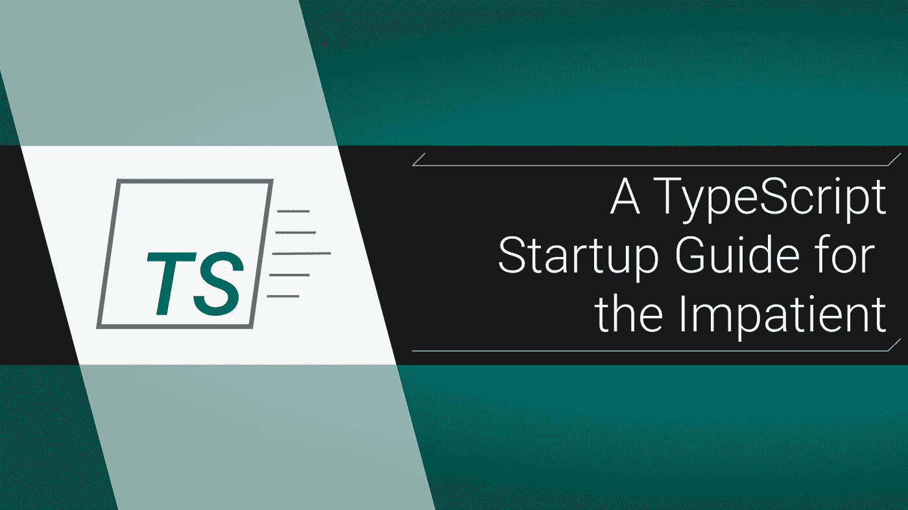

# 为没有耐心的人准备的打字稿启动指南

> 原文：<https://itnext.io/a-typescript-startup-guide-for-the-impatient-43dc4063d1cb?source=collection_archive---------5----------------------->

## 你有地方要去，我们快点编码吧



你知道 JavaScript 但是想试试[***TypeScript***](https://www.typescriptlang.org/)吗？当你花时间去学习正确的语法时，你只是想建立一个快速的项目吗？那么你就是目标受众，所以让我们开始编码吧。

# 安装和设置

安装 TypeScript 超级简单，使用`npm`全局安装它:

```
npm i -g typescript
```

**搞定**。接下来，创建以下文件夹和空白文件:

```
ts-playground/
 └ build/
   └ index.html
 └ src/
   └ index.ts
 └ tsconfig.json // always in root of project
```

`cd`进入`ts-playground`并运行`npm init -y`以获得一个`package.json`文件(我们稍后将在其中添加一些内容)。

# **你的第一个打字稿代码**

在`src/index.ts`里面写一些排版:

```
const **helloPlace** = (**place:** ***string***): ***string*** => {
  return `Hello ${**place**}!`;
}**document.write(helloPlace**(*'World'*));
```

熟悉，却又陌生，对吗？基本上你只是声明你的参数和函数返回值的数据类型。在伪代码中，它是这样的:

```
**functionName** = (**param:** ***paramType***): ***returnValueType*** => {
 *// function stuff;*
}
```

本教程实际上只是建立一个游戏场和运行代码，但要开始语法，我真心推荐罗伯特·库珀的伟大的 TS 指南。

# 制作您的 tsconfig.son

我们可以手动告诉 typescript 编译我们的代码，但是天啊，谁有时间做这些呢？如果我们在项目的根目录中给它一些配置，我们可以让它在保存时运行。让我们填写我们的空白`[tsconfig.json](https://www.typescriptlang.org/docs/handbook/tsconfig-json.html)`:

```
{
  "compilerOptions": {
    "module": "es6",
    "target": "es5",
    "outDir": "./build/",
    "sourceMap": true
  },
  "include": [
    "src/**/*"
  ],
  "exclude": [
    "node_modules"
  ]
}
```

还有很多 tsconfig 选项，但这些都是很好的开端。最重要的是`include`和`exclude`。如果没有这些，TypeScript 将自动编译项目中的每个`.ts`和`.tsx`。这些属性采用通常的文件模式，可以是相对的，也可以是绝对的。

`module`决定[你将使用什么样的模块系统](https://stackoverflow.com/questions/41326485/difference-between-module-type-in-tsconfig-json)(需求 vs 导入)。`target`是您希望编译到的 JS 级别，`es3`是默认值。`outDir`是你希望你编译的`.js`文件去的地方。如果没有指定目标，那么`.js`文件将紧挨着它们的`.ts`文件。`[sourceMap](https://developer.mozilla.org/en-US/docs/Tools/Debugger/How_to/Use_a_source_map)` [是为了调试](https://developer.mozilla.org/en-US/docs/Tools/Debugger/How_to/Use_a_source_map)，它给你开发中更好的错误。

# 编译您的代码

要编译您的代码，使用`tsconfig`设置，您只需在项目根目录下的终端中键入`tsc`即可。不过，那是*瘸腿*。通过执行`tsc --watch`或`tsc -w`使其在保存时运行。这将使用控制台来监控您的项目并自动编译。尽管它很短，我还是把这样的命令复制到我的`package.json`脚本部分。这是一种不用做外部笔记就能记住命令的有用方法。

# 最后一步:把它放入索引

最后，将编译后的脚本复制到您的`index.html`文件中:

```
<!DOCTYPE html>
<html lang="en">
<head>
  <title>TypeScript</title>
</head><body>
  <script src="./index.js"></script>
</body>
</html>
```

在浏览器中打开该文件，这就是您的代码！干得好，这是你的第一个打字稿项目。现在去把它写进你的简历吧，找份工作，买猫，买车，买房，再养一只猫，开始你的新生活。

大家编码快乐，

麦克风