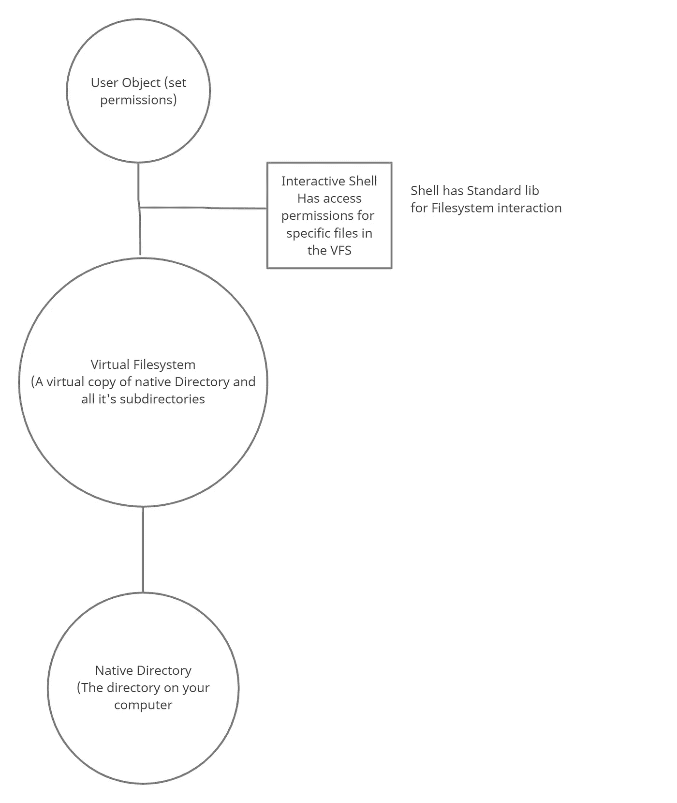

# Go 中的虚拟文件系统——创建我们的基础

> 原文：<https://itnext.io/a-virtual-filesystem-in-go-creating-our-foundation-9af62b0e82db?source=collection_archive---------5----------------------->

关于文件系统实现的第一篇官方文章。


找到这些普通图片真的很难:(

我们终于到了第一天的读者，希望你已经准备好在 Go 中创建一个不可思议的漂亮而又不是超级快的虚拟文件系统，因为我们是在计划的同时进行构建的。为什么不在我的 GitHub repo 上跟进这个项目，并在[https://github.com/AlysonBee/GoVirtualFilesystem](https://github.com/AlysonBee/GoVirtualFilesystem)让我知道你的想法或分享你的想法。

有了这些简单的介绍，在我们进入实际的文件系统之前，让我们确保我们拥有了在这个项目中编码所需的一切。先决条件时间到了！

**免责声明**:我将在 Windows 10 上编写这个项目，但会在 Windows 10 和它附带的 Ubuntu 子系统上进行测试，以确保两个操作系统都支持它。这应该不是问题，但这是我第一次参加安全第一的竞技表演。

## 设置好一切

编辑:原来我用的是过时的 Go 版本，从 1.14 升级到了 1.16。

我们清单上的第一项也是最明显的一项就是确保你已经安装了 Go(我正在使用的是 Windows 版的 1.16)。你可以根据你的具体操作系统在 https://golang.org/dl/[下载。安装是一个简单的解压和双击，但具体的说明，你也可以在主要的 Go 网站上找到(](https://golang.org/dl/)[https://golang.org/doc/install](https://golang.org/doc/install))。

这实际上是你最需要的东西。我们会尽可能的保密。

每篇文章发表几天后，我会对每一步进行总结并添加到我的 GitHub repo 中。如果您只是想要代码本身，您可以跟随项目，而这些文章将进入我的设计决策的“如何”和“为什么”。请注意，回购结构将每个部分分为标记为数字(01，02…)的文件夹。这些文件夹的代码都是我们创建时的代码，没有其他的了。这些文件夹都不相互依赖，所以可以随意地将它们视为同一个项目的不同迭代版本。如果你跟着做的话，你可以把所有的工作放在一个文件夹里。

这就是我们的准备工作。让我们开始吧。

# 设计



项目的设计概述

这是所有事物的整体结构以及各部分之间的关系。四个组件之间的关系非常简单。每个组件可以描述如下:

*   **用户对象** —这代表用户以及与该特定用户身份相关的所有访问权限。我认为谷歌云是光秃秃的，而且严重不发达。这必须是充实和无缝的，因为这是用户体验应用程序的一部分，因为它将决定他们能做什么，不能做什么。
*   **交互式外壳** —用户将用来与文件系统交互的外壳。该结构包含将用于与虚拟空间交互的函数库。像 open、close、mkdir 和 ls 这样的函数只是列举了几个实用程序，我们将为它们制作虚拟文件系统等价物。
*   **虚拟文件系统** —这是从您的原生文件系统提取到 RAM 中的文件和目录的集合，从您启动应用程序的目录开始，向下遍历嵌套的子目录。这里有很多发挥创造力的空间，因为我们的大多数性能瓶颈和/或问题(如延迟和冻结)都来自于最终的实现方式。
*   **本地目录** —文件系统将从中克隆自身的目录。当您完成编辑时，这也是您编辑的副本将保存到的位置。就我们与本机目录的交互而言，我们将从虚拟文件系统实现检查，以验证遍历深度以及在克隆文件时消耗的内存，从而检查内存溢出等问题。

在本文中，我们现在的目标是对这些组件有一个基本的布局。每一部分都需要尽可能独立，以便于调试，同时确保以后添加功能时不会遇到大规模重构的麻烦；理想情况下，根本不需要重构，但是现在超越我们自己还为时过早。

## 用户对象

用户对象既是最容易立即开始的方面，也是可以扩展到最大程度并变得最复杂的组件，因为这是安全性和易用性必须齐头并进的地方。像设置权限、向其他用户授予权限和继承访问权限等功能都将在这里发生。这些特性不会出现在第一个版本中，但是假设我们已经做到了，增加这些特性不会迫使我们放弃大部分之前的工作，所以我们将来会在这里花很多时间。

代码(`user.go`):

```
package mainimport (
 "fmt"
 "math/rand"
)// The main user object.
type user struct {
 userID uint64             // A randomized integer representing the users's unique ID.
 username string           // The user's onscreen name.
 accessList map[string]int // A map containing the unique hashes and access rights for each file.
}// generateRandomID generates a random userID value.
func generateRandomID() uint64 {
 return uint64(rand.Uint32()) << 32 + uint64(rand.Uint32())
}// createUser creates a user object.
func createUser(username string) *user {
 return &user{
  userID: generateRandomID(),
  username: username,
 }
}// updateUsername updates the name of the current user.
func (currentUser * user) updateUsername(username string) {
 currentUser.username = username
}
```

最初，这种结构的影响只能在 shell 级别感受到，因为它允许用户设置自己的用户名来标记 shell 提示符。比如说；使提示符看起来像这样`AlysonV$>`或`VivianS$>`等等。我们文件系统的第一个版本没有定义访问权限，所以`accessList`方法暂时不会被使用。不过，让我们稍微讨论一下最后一个细节，因为这是一个重要的文件系统概念。

**一些技术背景—Inode**

大多数类似 Unix 的文件系统都使用称为 Inodes 的数据结构。这些基本上负责存储填充系统的文件和目录的信息。它们保存信息，如文件和目录的访问权限、哪些文件属于哪些目录和子目录、文件大小和文件类型数据等。我们将从 Inode 概念中使用的一个小设计思想是`accessList`成员。这个想法是，创建的每个唯一的文件都有一个附带的哈希值。假设当前用户对目标文件有一定的访问限制，该信息将被存储在`accessList`变量中；键是文件的唯一散列(唯一的无符号 64 位数字)，值是用户对该散列所属文件的唯一权限。

这就是处理权限的最终想法。现在，每个人都可以访问任何东西，不管是谁。所以我们暂时把它放在一边。

## 交互式外壳

外壳是一种结构，它包含用户用来与文件交互的所有功能。它分为两部分:需要与系统和 shell 循环交互的库函数，用户将在 shell 循环中输入命令。

图书馆(`lib.go`):

```
package mainimport (
 "fmt"
)// the base library object.
type library struct {
}// initLibrary initializes the library functions.
func initLibrary() *library {
 fmt.Println("Importing library.")
 return &Library{}
}// open will allow for opening files in virtual space.
func (session * library) open() error {
 fmt.Println("open() called")
 return nil
}// close closes open virtual files.
func (session * library) close() error {
 fmt.Println("close() called")
 return nil
}// mkDir makes a virtual directory.
func (session * library) mkDir() error {
 fmt.Println("mkDir() called")
 return nil
}// removeFile removes a file from the virtual filesystem.
func (session * library) removeFile() error {
 fmt.Println("removeFile() called")
 return nil
}// removeDir removes a directory from the virtual filesystem.
func (session * library) removeDir() error {
 fmt.Println("removeDir() called")
 return nil
}// listDir lists a directory's contents.
func (session * library) listDir() error {
 fmt.Println("listDir() called")
 return nil
}
```

以上是基本骨架。可以轻松地添加和删除功能，而不会破坏其他所有功能。下面是这些函数在 shell 中的工作方式。我希望有一种方法能使调用函数比一长串 switch 语句一个接一个地排列起来更容易，但是现在，这种方法是可行的。

外壳循环代码(`shell.go`):

```
package mainimport (
 "fmt"
 "bufio"
 "os"
)// shellLoop runs the main shell loop for the filesystem.
func shellLoop() {library := InitLibrary()
 reader := bufio.NewReader(os.Stdin)
 for {
  fmt.Printf("$>")
  input, _ := reader.ReadString('\n')

  if input == "\r\n" {
   continue 
  }input = input[:len(input) - 2]switch input { 
  case "open":
   library.Open()
  case "close":
   library.Close()
  case "remove":
   library.RemoveDir()
  case "ls":
   library.listDir()
  default:
   fmt.Println(input, ": Command not found")
  }
 }
}
```

这个循环可能会因为它要做的所有工作而发生变化。这个版本只是给出了它将拥有的基本控制流的概述；它将读取用户的输入，并根据传入的命令运行某个库函数，或者在没有传入命令的情况下继续运行。像命令历史和自动完成这样的细节将被添加进来，使它更像 Unix。

## 文件系统

文件系统实际上只有两个主要特性，这两个特性有可能以多种方式实现；这是初始化和拆卸。我怀疑我将有最大的麻烦，使这些工作合理地快，而不是在启动和退出时暂停系统。初始化将涉及递归遍历应用程序所在的目录及其所有子目录；克隆它遇到的每个文件，以便在虚拟空间中访问。这一步需要在检测失败的副本、内存溢出和最大打开文件描述符违反等方面有一定的健壮性(如果您不知道这意味着什么，现在没关系，我会解释何时有必要直接担心它们)。违规这么多，时间这么少。

就优化而言，这一步可能会有很多创意。当我们开始一次将焦点缩小到一个组件时，将会更详细地讨论这一点。

代码(`filesystem.go`):

```
package mainimport (
 "fmt"
)// A global list of all files created and their respective names for
// ease of lookup.
var globalFileTable map[uint64]string// The data structure for each file.
type file struct {
 name string         // The name of the file.
 pathFromRoot string // The absolute path of the file.
 fileHash uint64     // The unique file hash assigned to this file on creation.
 fileType string     // The type of the file.
 content byte        // The file's content in bytes.
 size uint64         // The size in bytes of the file.
}//  The core struct that makes up the filesystem's file/directory
type fileSystem struct {
 directory string         // The name of the current directory we're in.
 files []file             // The list of files in this directory.
 directories []fileSystem // The list of directories in this directory.
 prev *fileSystem         // a reference pointer to this directory's parent directory.
}// Root node.
var root *fileSystem// initFilesystem scans the current directory and builds the VFS from it.
func initFilesystem() * fileSystem {
 // recursively grab all files and directories from this level downwards.
 fmt.Println("Welcome to the tiny virtual filesystem.")
 return root
}// reloadFilesys Resets the VFS and scraps all changes made up to this point.
// (basically like a rerun of initFilesystem())
func (root * fileSystem) reloadFilesys() {
 fmt.Println("Refreshing...")
}// tearDown gracefully ends the current session.
func (root * fileSystem) tearDown() {
 fmt.Println("Teardown")
}// saveState aves the state of the VFS at this time.
func (root * fileSystem) saveState() {
 fmt.Println("Save the current state of the VFS")
}
```

我们有占位符，用于存放初始化和拆卸代码，以及保存和刷新状态代码。在写这篇文章的时候还没有考虑保存和加载的系统，但是由于保存和加载可能对磁盘空间有很大的影响，它可能没有那么复杂。

## 原生目录(荣誉奖)

因此，它没有自己的代码，但它值得考虑与虚拟文件系统本身的关系。因为从本质上来说，我们的应用程序是与文件进行交互的，所以它绝不会对将要处理的原始文件做任何有潜在破坏性的事情，这一点很重要，所以必须非常注意文件系统部分。请注意，文件系统代码可能需要花费最多的时间来完成，并且可能需要最多的修订(如果有的话)。

# 结论——继续第 2 部分

这将是我们文件系统的总体布局。你的目录结构不一定是疯狂的；像这样的简单结构就足够了。

```
./src/
    filesystem.go
    user.go
    lib.go
    shell.go
```

如果您有兴趣了解这些单独的结构此时是如何运行的，我将在 GitHub 上为我的代码编写单元测试，并添加测试每个文件及其功能的指令。这些会让你更好地理解执行是什么样子的。

这就是我们的入门基础。接下来，我们将从处理用户对象以及它如何与 shell 交互开始。在进一步发布之前，我将花时间研究文件系统部分的实现细节。我想这会占用我们大部分时间。

编辑:另外，我以后会坚持将“虚拟文件系统”简称为 VFS；这句话我已经输入了很多次，现在大声说出来听起来很奇怪。

下次见。

项目回购:[https://github.com/AlysonBee/GoVirtualFilesystem](https://github.com/AlysonBee/GoVirtualFilesystem)