# web API 架构的视觉历史

> 原文：<https://itnext.io/a-visual-history-of-web-api-architecture-c36044df2ac7?source=collection_archive---------0----------------------->

## 剧透:还是🤷30 年后

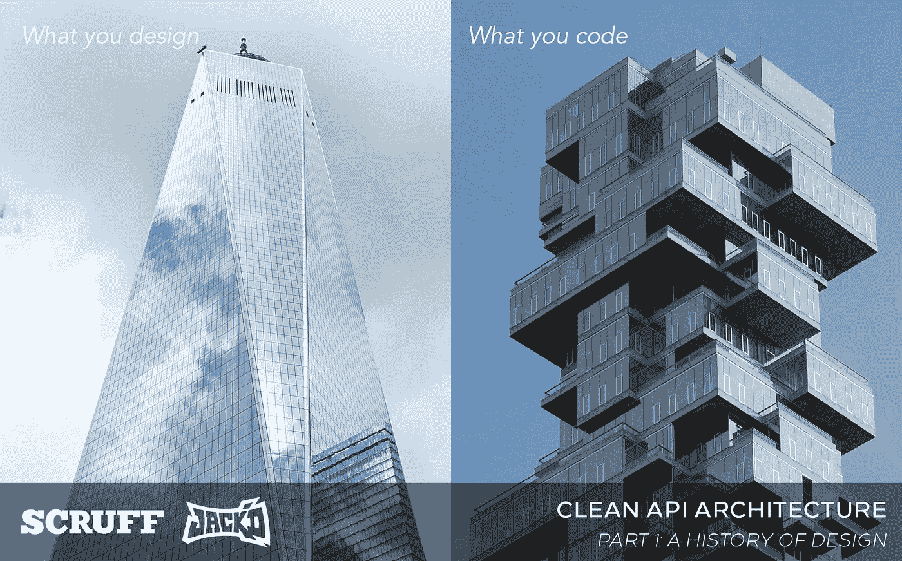

公平地说，它们都是美丽的建筑！在 [Unsplash](https://unsplash.com/s/photos/new-york-architecture?utm_source=unsplash&utm_medium=referral&utm_content=creditCopyText) 和 [Shinya 铃木](https://www.flickr.com/photos/shinyasuzuk)上由 [Jene Yeo](https://unsplash.com/@jeneyeo?utm_source=unsplash&utm_medium=referral&utm_content=creditCopyText) 拍照。

那么，您的 web 应用程序的架构是什么？这听起来像一个看似简单的问题——甚至可能是垒球首轮面试的问题。

事实证明，经过近 30 年的互联网发展，答案远非简单明了，在谷歌搜索的[页面第一页，上面的术语显示:](https://www.google.com/search?q=web+application+architecture)

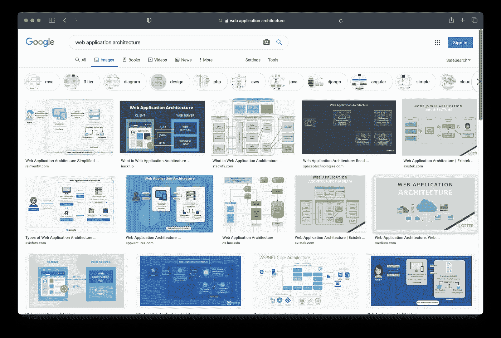

我们应该从澄清“架构”这个词的含义开始在最基本的情况下，这是一个问题，它的答案只是一张图片和一些箭头。

> 最基本的，软件架构只是简单的带箭头的形状——只是一张地图和一条路径

[干净的架构](https://blog.cleancoder.com/uncle-bob/2012/08/13/the-clean-architecture.html)看起来是这样的:

谷歌提出的[Android 应用架构是这样的:](https://developer.android.com/jetpack/guide)

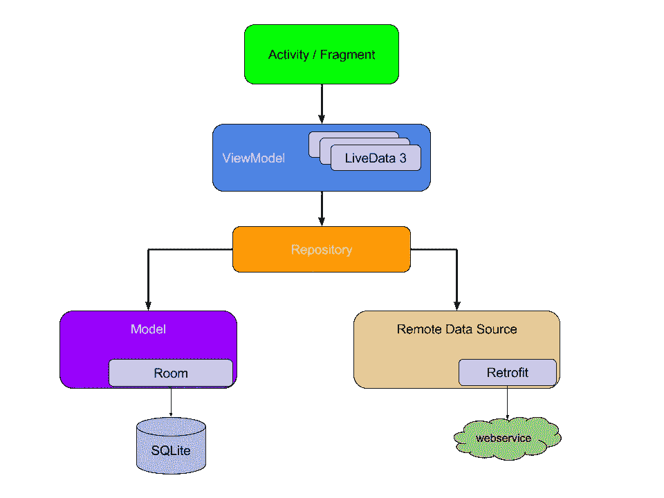

web 应用程序架构怎么样？像 web 应用程序这样简单的东西——我们在 20 世纪 90 年代中期构建的基础软件之一——到 21 世纪 20 年代肯定会成为类、层次结构和数据流的胜利圈吗？

# Ruby web 应用架构

现代固执己见的 web 应用架构的教父可能是[Ruby on Rails](https://guides.rubyonrails.org/)——那么当我们去搜索时会发生什么呢？(可能会跳过 2021 年 4 月的[结果](https://discuss.rubyonrails.org/t/effect-of-the-last-week-on-ruby-on-rails/77702)😬).没有多少[有用的结果](https://www.google.com/search?q=ruby+on+rails+application+architecture):

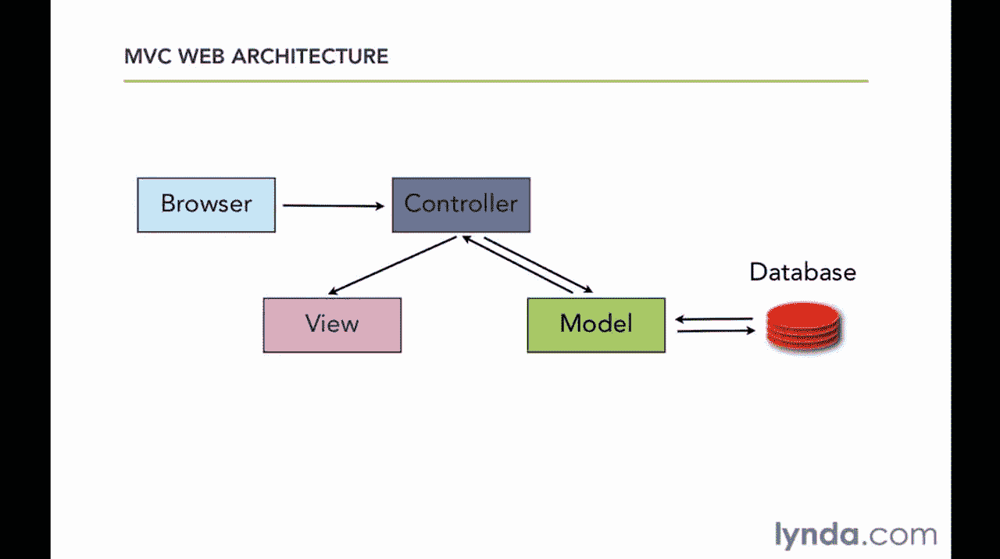

互联网通常认为 Rails 架构是基于 [MVC](https://en.wikipedia.org/wiki/Model%E2%80%93view%E2%80%93controller) 的，尽管这样的图表并不能为如何构建一个中等复杂的应用提供太多指导。 [Rails Guides](https://guides.rubyonrails.org/) 网站与其说是一个指南，不如说是 Rails 宇宙中每个类的索引，几乎没有解释它们是如何组合在一起的。以下是[截至 2017 年的最新照片:](https://1sherlynn.medium.com/ruby-on-rails-beginner-adventures-simple-blog-application-6dffd6dcb11a)

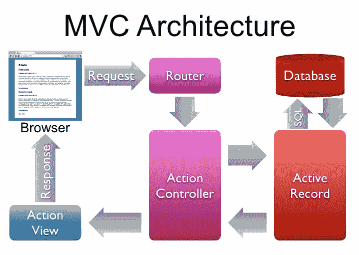

即使这样，这似乎表明我们的应用程序需要 3(也许 4？)类，以动作控制器和活动记录(又名模型)为主。

# JavaScript web 应用程序架构

到目前为止，希望您已经了解了 JavaScript 事件循环。没有吗？不用担心，因为每个 [nodejs 架构图](https://scoutapm.com/blog/nodejs-architecture-and-12-best-practices-for-nodejs-development)都是这样的:

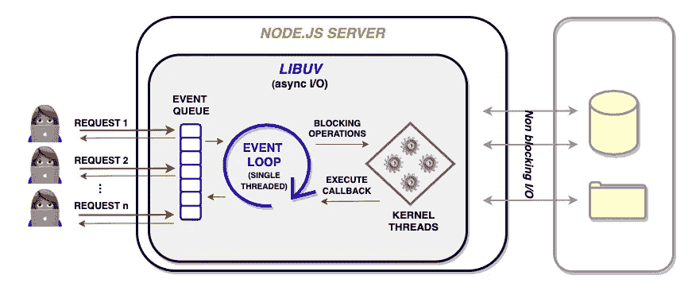

你的 nodejs web API 的架构是什么？**事件循环**。

我们得到了它节点。你为你的事件循环感到骄傲。

当[搜索 nodejs web 应用程序架构](https://www.google.com/search?q=nodejs+web+application+architecture)时，剩下的 web 结果是 SEOd 链接的大杂烩，供新开发人员学习编程，其中还夹杂着一些可疑的认证程序。我通常会建议你自己看看，但我怀疑这些结果给你间谍软件的可能性高于正常水平。

# Java web 应用程序架构

当谈到描述应用程序架构时，Java 世界更加成熟，尽管 Java 在 2000 年代末和 2010 年代初因其感知的复杂性和其主要开发 IDE 的过度紧张性而受到广泛嘲笑。

或者任何 IDE，真的

这个关于 Spring Boot 的古老博客显示了至少 4 层，可能有 6-7 种不同的阶级类型:

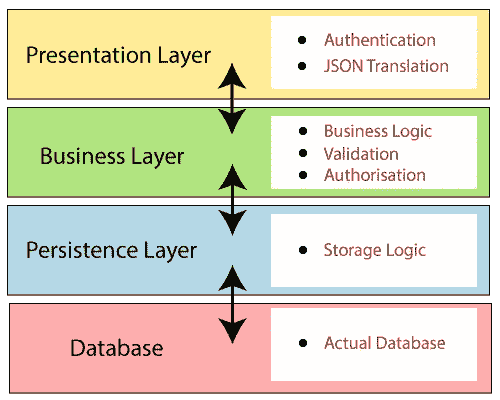

更多[最近的博客文章](https://openclassrooms.com/en/courses/5684146-create-web-applications-efficiently-with-the-spring-boot-mvc-framework/6156961-organize-your-application-code-in-three-tier-architecture)试图用 Rails MVC 架构方法合理化这种分层方法:

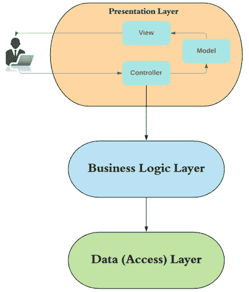

奥赖利不出所料地给了我们[一个关于 Java EE 架构的更有条理的讨论](https://www.oreilly.com/library/view/software-architecture-patterns/9781491971437/ch01.html):

但感觉上我们离解决软件开发者面临的主要问题[还有一步之遥。](https://idioms.thefreedictionary.com/meat+and+potatoes#:~:text=Concerned%20with%20or%20pertaining%20to,unfairly%20target%20lower%2Dclass%20workers.)

> 构建 web 应用程序或 API 时，我应该编写哪些类，它们是如何组合在一起的？

# 大公司 Web 应用架构

我们可以向巨人寻求指导吗？微软对通用网络应用架构有很多话要说。以至于，事实上，它们包含了 14 张图来帮助你理解。

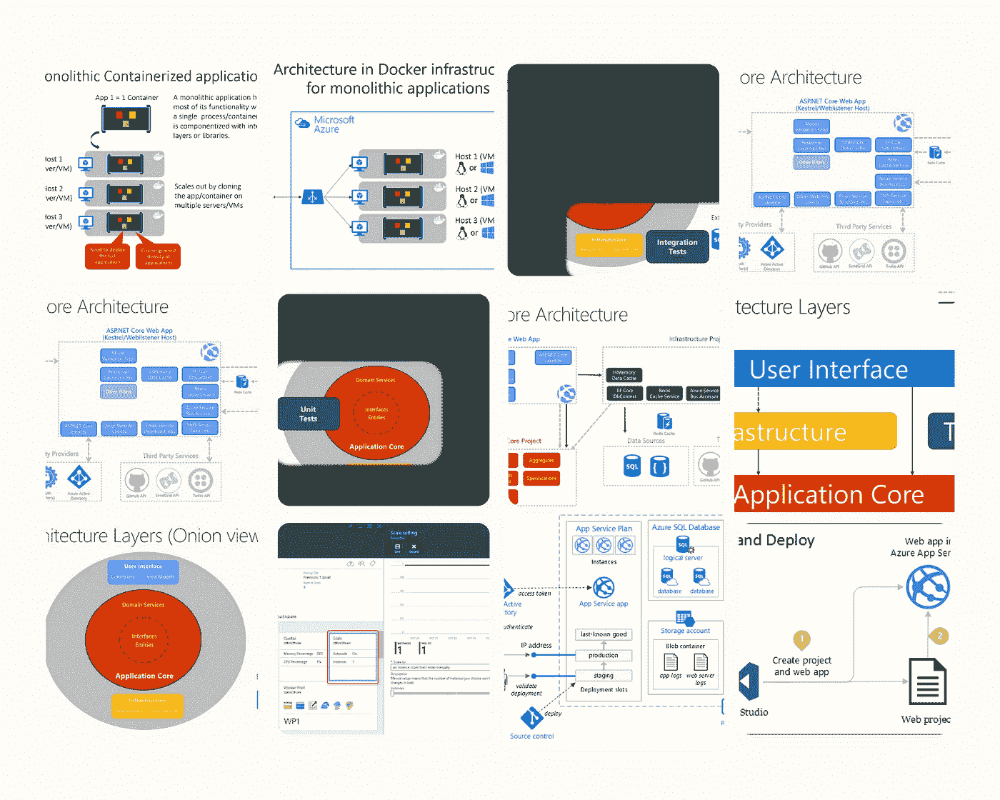

公平地说，微软确实有一些聪明的地方，包括使用干净的架构、依赖性反转和可测试性的重要性。然而，这些观点被 ASP.NET 和 Azure 部署模型的术语掩盖得如此之深，以至于在非 MSFT 开发者世界中很大程度上被忽视了。

此外，他们需要更多的动画 GIFs

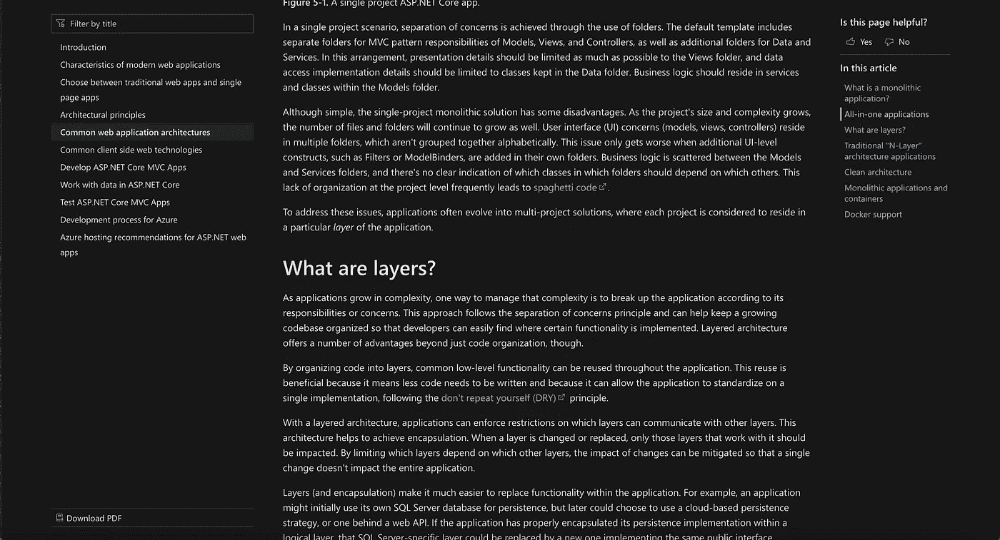

也是。很多。文字。

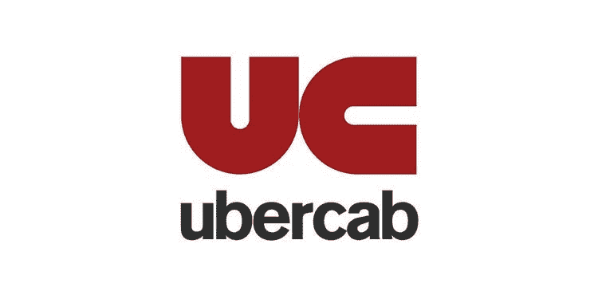

优步最近[用下面的栈记录了它的 API 方法](https://eng.uber.com/architecture-api-gateway/):

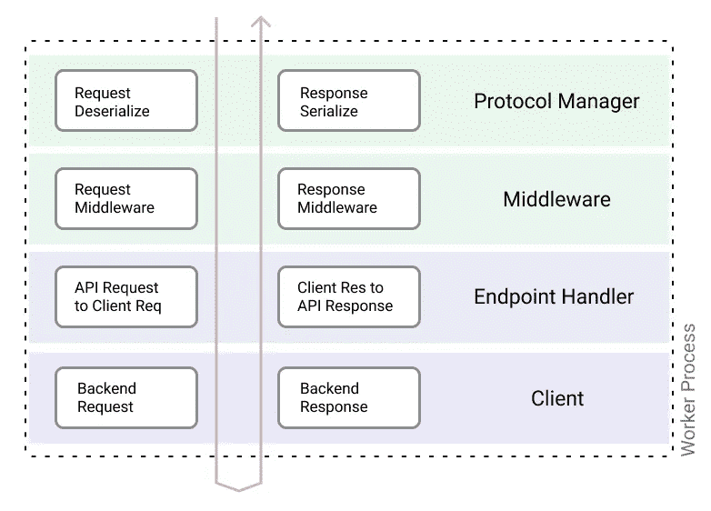

我认为，这种方法最接近于提供实用的建议，但它是基于像[微服务](https://dwmkerr.com/the-death-of-microservice-madness-in-2018/)这样的大公司模式。

汽车=微服务

例如，****客户端*** *向后端服务发出请求……用户可以配置客户端的内部功能，如请求和响应转换、模式验证、电路中断和重试、超时和截止日期管理以及错误处理*。*

*那么…你如何写“后端服务？”服务不也有与顶级 API 网关相同的考虑因素(验证、参数提取等)吗？根据[康威定律](https://en.wikipedia.org/wiki/Conway%27s_law)，你的 API 结构就是你的团队结构。*

*大多数公司不会为他们的 API 的每个方面都有专门的团队，所以优步描述的“客户端”层可能不会在你的公司存在——它将是一个“服务”层，做 API 应该做的事情，我们现在需要知道，如何设计服务。*

# *为什么这么难？*

*事实是，大多数 web 应用程序都很小，它们的架构无关紧要。它们将每 N 年重写一次，因此它们将成为一个由一个或几个开发者维护的[庞然大物](https://en.wikipedia.org/wiki/Monolithic_application)……**，这很好**。*

**

*一旦比特币基地在 2025 年发布它的 JavaScript 框架，我就重写它*

*FANG 开发的大型应用程序有专门的团队负责堆栈的每一部分，加上工具、安全性、源代码管理等。但是对于那些想要构建可测试、可维护、可伸缩的大型生产应用程序的开发人员和项目来说呢？我们应该期望构建什么样的类、数据流和层次结构？*

# *走向干净的 API 架构*

*在佩里街软件公司(Perry Street Software)的过去十年里，我们一直在构建一个大型 API，为我们的约会应用家族提供动力。我们最近花了一些时间来编码和升级我们的服务器 API 架构，这种方式实际上非常接近于[干净的架构](https://blog.cleancoder.com/uncle-bob/2012/08/13/the-clean-architecture.html)，其灵感来自于最近变得[流行的函数/](https://www.quora.com/Why-has-reactive-programming-become-so-popular) [反应式编程](http://reactivex.io/)范例。*

*我们称之为我们的**清洁 API 架构**。然而，在我们开始之前，我们需要简单了解一下典型 web 应用程序的执行流程。记住，任何建筑都只是一张图片和一些箭头，一张地图和一条路径。*

*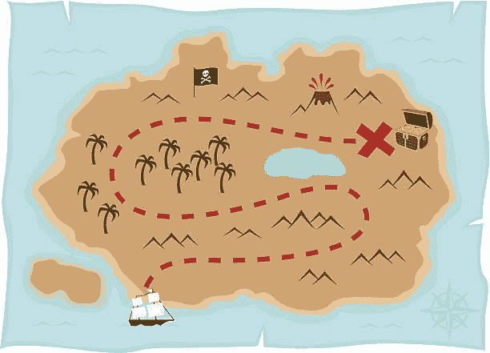*

*这个岛是代码；红线是执行路径；地图是一种建筑。*

*线和/或箭头经常被跳过——我们应该停下来探索箭头本身的本质。*

# *接下来*

*阅读更多关于[三种 web API 执行流程](https://medium.com/p/9d65232e8a24/)的信息。*

# *本系列的更多内容*

*   *web API 设计的视觉历史←你在这里*
*   *[web API 执行流程的模式](https://medium.com/p/9d65232e8a24/)*
*   *[面向铁路的编程](https://medium.com/geekculture/better-architecture-with-railway-oriented-programming-ad4288a273ce)*
*   *[干净的 API 架构](https://medium.com/perry-street-software-engineering/clean-api-architecture-2b57074084d5)*
*   *[端点责任清单](https://medium.com/nerd-for-tech/the-endpoint-responsibility-checklist-d7763449f44a)*
*   *[代码示例:保存收藏夹](https://medium.com/perry-street-software-engineering/clean-api-example-save-a-favorite-d45ca6aeba4c)*

# *你可能喜欢的其他系列*

*[**Android 活动生命周期被认为是有害的**](https://proandroiddev.com/android-activity-lifecycle-considered-harmful-98a5b00d287)**【2021】** Android 进程死亡、无法解释的 NullPointerExceptions，以及你现在需要的 MVVM 生命周期*

*[**Xcode 中的 Kotlin？安卓工作室**里的 swift](https://medium.com/swlh/kotlin-in-xcode-swift-in-android-studio-26a4ace6fc72)？ **(2020)**
关于在 iOS 上使用 Clean + MVVM 实现一致架构的系列& Android*

# *还有一件事…*

*如果你是一名喜欢应用架构的移动开发者，有兴趣为一家服务于酷儿群体的[价值观至上的](https://www.youtube.com/watch?v=-QCSI46mO3Y)应用公司工作，请与我们联系！访问[https://www.scruff.com/careers](https://www.scruff.com/careers)了解[佩里街软件](https://www.perrystreet.com)的工作信息。*

# *关于作者*

**埃里克·西尔弗伯格是佩里街软件* [*的首席执行官，LGBTQ+约会应用*](https://www.perrystreet.com/)[*SCRUFF*](https://www.scruff.com/)*和*[*Jack ' d*](https://www.jackd.com/)*的发行人，在全球拥有超过 2000 万会员。**