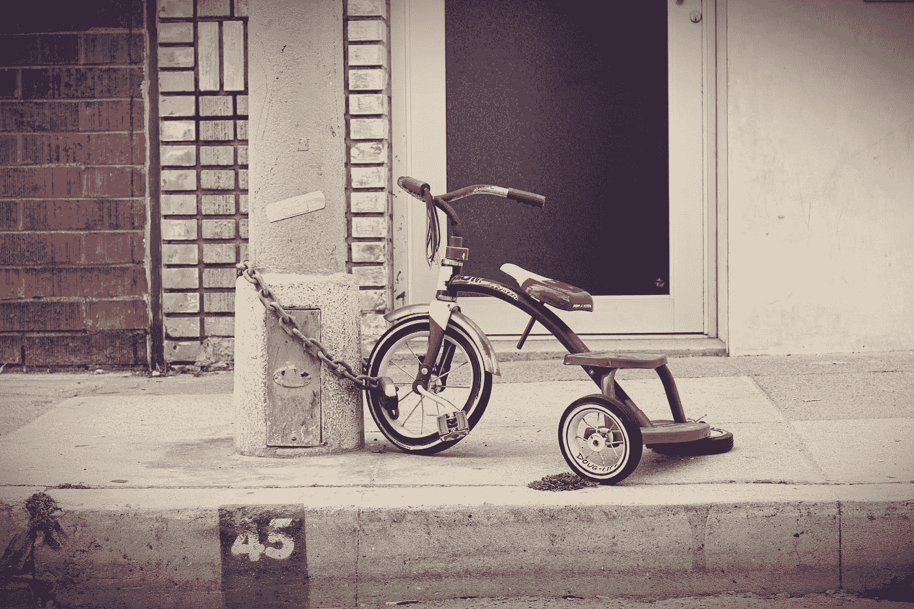

# 如何阻止用户对你的 iOS 应用进行截图或录音

> 原文：<https://itnext.io/a-way-to-protect-your-app-content-from-screenshots-in-ios-ea23153a3bc7?source=collection_archive---------0----------------------->

## 到目前为止，在 iOS 中保护你的应用程序内容不被截图和记录并不是一件容易的事情，在我们从苹果获得官方 API 之前，这种变通方法暂时会帮助我们。



弗洛里安·克劳尔在 [Unsplash](https://unsplash.com?utm_source=medium&utm_medium=referral) 上拍摄的照片

让我们假设你是一名 iOS 开发者，正在开发一个应用程序，其中有一些安全/敏感的内容，比如手机号码/银行信息等。其中一个安全问题是，当有人按下*(旧款 iPhones 中的 home+lock 键，新款 iOS 设备中的音量增加+lock 键)*时，视图/视图控制器会被捕获。对于 iOS 开发者来说，保护应用程序内容不受截图影响是一个挑战。在本文中，让我们来看看如何克服这个问题。

## 使用通知来防止屏幕截图:

苹果公司提供了“**userDidTakeScreenshotNotification**”通知，但这只是在截屏后通知我们。所以这不是我们想要的。

## 屏蔽套件:

“ScreenshieldKit”按照我们想要的方式工作，但它是有许可证的，我们必须付费。所以不是所有的开发者/企业都能做到这一点。我们必须使用他们简单的 UI 组件。相信我，我谷歌了很多来了解 ScreenshieldKit 是如何工作的，但这仍然只是一个胡乱的猜测，有些人说 ScreenshieldKit 使用 DRM 视频覆盖模式，但我不相信。但是我对实现它的渴望仍然存在。因此，我尝试了各种方法来保护我们的 iOS 应用程序内容不被截图。

## 那么，我试图保护应用程序视图不被截屏和录制的替代方法是什么？

我在堆栈溢出和各种论坛上做了很多冲浪，尝试了一些事情来使它像 ScreenshieldKit 一样工作..

1.  截图后从库中删除照片，啊哈，这不好，需要用户许可，而不是好的，所以这根本不是一个选项:
2.  当用户要截屏时，监听出现的覆盖图。这似乎是一个选项，但窗口的变化也发生在截图之后。而且在截图之前我是无法察觉的。
3.  观察是一种被捕获的属性，嗯，它对镜像/记录起作用。

## 从 iOS 屏幕截图和镜像中保护应用程序屏幕的工作解决方案？

你有没有注意到截图时的安全文本输入..如果没有，请看看这个视频。

[https://www.youtube.com/watch?v=YJKqtv8aj_w](https://www.youtube.com/watch?v=YJKqtv8aj_w)

所以，这个想法是从那里来的，并感谢 stackoverflow 帖子触发了这一点。

我们在这里所做的是，将我们的窗口或 UIView 添加到 UITextField 的层中(这支持安全进入)，然后就这样了，剩下的事情将由操作系统本身来处理。下面是作为 UIView 扩展的一小段代码。通过这种方式，我们可以保护内容不被截图、录音和镜像。

```
**private** **extension** UIView {**func** setScreenCaptureProtection() {**guard** superview != **nil** **else** {**for** subview **in** subviews { //to avoid layer cyclic crash, when it is a topmost view, adding all its subviews in textfield's layer, TODO: Find a better logic.subview.setScreenCaptureProtection()}**return**}**let** guardTextField = UITextField()guardTextField.backgroundColor = .redguardTextField.translatesAutoresizingMaskIntoConstraints = **false**guardTextField.isSecureTextEntry = **true**addSubview(guardTextField)guardTextField.isUserInteractionEnabled = **false**sendSubviewToBack(guardTextField)layer.superlayer?.addSublayer(guardTextField.layer)guardTextField.layer.sublayers?.first?.addSublayer(layer)guardTextField.topAnchor.constraint(equalTo: **self**.topAnchor, constant: 0).isActive = **true**guardTextField.bottomAnchor.constraint(equalTo: **self**.bottomAnchor, constant: 0).isActive = **true**guardTextField.leadingAnchor.constraint(equalTo: **self**.leadingAnchor, constant: 0).isActive = **true**guardTextField.trailingAnchor.constraint(equalTo: **self**.trailingAnchor, constant: 0).isActive = **true**}}
```

> 对于镜像和录制，Apple 通过观察 UIScreen 的 isCaptured 属性，提供了一个适当、优雅的解决方案。

感兴趣的全部源代码，有能力保护从屏幕截图或一个完整的窗口的特定视图？。完整的源代码是[这里](https://github.com/devCracker/ScreenGuard-iOS)并且这个也是作为 cocoapod 发布的，你可以简单地在你的项目中插入。

> **一句话:**视图层次可能有一些问题，我有一些工作要做。我会根据我对那个库的反应来花时间。谢谢！！！。编码快乐！！！。

希望在我们从苹果公司得到一个简单的 API 之前，这个小小的解决方法可以暂时帮助你。我必须回到 workspace 去思考 SwiftUI 应用程序的相同逻辑。
你可能会对我的其他文章感兴趣，比如[迅捷演员](https://devcracker.medium.com/swift-actors-e80ff0dc1832)、[主要演员](https://devcracker.medium.com/mainactor-in-swift-detailed-walkthrough-94044c83118b)、[螺纹消毒剂](/thread-sanitizer-in-ios-8438ee3c8c76)等。

从[这里](https://devcracker.medium.com/membership)升级您的中级会员资格，阅读大量文章并提升您的技能。