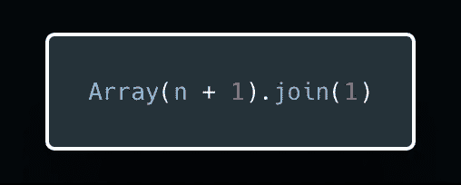
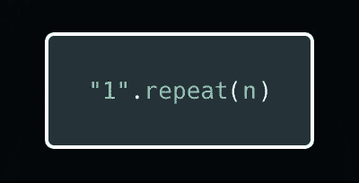
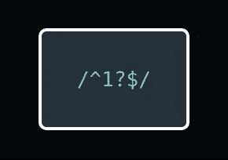
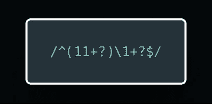
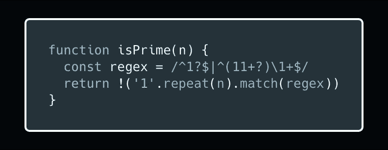

# 使用正则表达式检查一个数是否是质数的一种简单方法

> 原文：<https://itnext.io/a-wild-way-to-check-if-a-number-is-prime-using-a-regular-expression-4edfb725f895?source=collection_archive---------0----------------------->

在你过去搜索素数算法的某个地方，你可能会遇到这样的情况:

这是什么？这是一种检查一个数是否是质数的方法！而且你连 for 循环都不用写！

很狂野，对吧？

我也这么认为。所以我想如果有人好奇的话，把这个正则表达式分解并一步一步地解释可能会很有趣。

*注意:我知道正则表达式(在/'之间的东西)可能看起来很神奇，但是坚持我的观点，我保证它是有意义的。*

## 好吧，发生了什么事？

因此，这个功能基本上遵循三个步骤:

1.  把这个数变成一元形式
2.  查看它是 0 还是 1
3.  检查它是否是任何大于 1 的数的倍数

## 第一步

所以首先我们要把我们要检查的数字转换成一元形式。“一元”基本上是计数标记的一种花哨说法(即 3 变成“111”，4 变成“1111”，等等。).

这是通过这段代码实现的:

这基本上就是说，“创建一个有 n + 1 个空槽的数组，并用 1 连接所有这些空值。”

我更喜欢使用 ES6 中的 String.prototype.repeat()方法，如下所示:

这样做可以让您不必首先创建一个数组，然后将数组的所有元素连接成一个字符串。它读起来也更直观，但更老的方法是在互联网上到处都是，所以我想我会展示这两者。

太好了！继续前进。

## 第二步

所以现在我们要开始看看这个一元版本的数是否匹配正则表达式。正则表达式可以分为两部分，在`|`(它的工作方式类似于 OR 操作符)左边的部分和右边的部分。

左边是:

所以让我们一个字一个字的来。

首先是`^`。

这告诉正则表达式它需要匹配字符串的开头，所以它不能找到从中间、结尾或除了开头以外的任何地方开始的模式。这个家伙是`$`的对等物，它告诉我们的正则表达式字符串的结尾必须在哪里。基本上，这意味着整个字符串必须匹配正则表达式，不能有任何余数。

接下来我们有`1`。

这里的 1 只是说在字符串中查找字符“1”。我们可以制作一个全是 2 的一元字符串(例如，3 变成了“222”等等。)并且这个字符需要是 2。它只需要和你用来创建字符串的字符一样。

接下来是`?`。

这意味着它前面的字符是可选的，因此正则表达式将匹配零个“1”或一个“1”(即“或“1”)。

最后一个字符是`$`。

就像我说的，它是`^`的对应。这就是我们如何知道最后没有余数！

因此，正则表达式的这一部分完成了步骤 2，检查传入的数字是 0 还是 1。

太好了！下一个！

## 第三步

这就是乐趣的开始。现在我们需要看看这个数是否是大于 1 的倍数。如果是，那就不是质数！所以让我们看看正则表达式的右边:

这里我们有和以前一样的`^...$`模式，说字符串必须在这些地方开始和结束，匹配才能工作。所以首先让我们看看括号在做什么。

`(11+?)`

这里的括号创建了一个分组，这很重要，因为我们要检查倍数。如果我们想看到我们的数字不是 2 的倍数，我们需要把所有的“1”分组为“11 ”,并找出是否有余数。

括号内的前两个`1`与之前的`1`相同。它们只是匹配数字的一元字符串版本中的“1”。

`+`表示匹配它前面的一个或多个字符。因此，至少需要两个“1”才匹配，但是任何大于这个数的“1”也匹配。

`+`后面的`?`超级重要。它让`+`变得“不贪婪”这意味着它将首先匹配字符串中可能的最小部分。它将从只匹配两个“1”开始，然后是三个“1”，然后是四个，依此类推。如果`?`丢失，那么`+`将会贪婪地匹配尽可能多的字符串，对我们来说是整个字符串，因为我们的字符串只包含一个字符。

现在我们有了两个或更多“1”的分组，我们需要检查分组的倍数是否匹配字符串的其余部分，没有余数(即，直到字符串的最末尾)。这就是它的由来:

`\1+?`

第一位是`\1`，称为反向参考。它将引用正则表达式中的第一个分组。把它想象成一个正则表达式变量。它指的是那些括号之间的东西。

后面的`+?`应该看着眼熟。这是非贪婪地检查我们的反向引用可能有一次或多次迭代。

所以如果`(11+?)`匹配字符串“11 ”,我们的反向引用也将匹配“11 ”,所以我们的正则表达式正在寻找任何是“11”的倍数的东西，从“1111”开始，然后是“111111 ”,等等。如果失败了(如果我们的数字是奇数)，那么它将返回并向括号内的位添加另一个“1”，并尝试匹配任何是“111”倍数的值。

如果我们的正则表达式在匹配时返回 true，这意味着我们的数字是 1)0 或 1，或者 2)大于 1 的倍数。那说明它不是(即`!`)素数！很酷，对吧？

再看一遍代码，看看你是否理解了全部内容:

在这里，您可以看到一个具有一些不错的 ES6 语法的版本，它消除了创建不必要的阵列的需要:

我目前只有这些了。感谢阅读！希望你喜欢自己，并准备好做一些自己的正则表达式魔术。

*编辑:*

*一些人问我用这种方法检查质数的效率。我应该从一开始就提到并为 not 道歉，这是一种非常低效的检查一个数是否是质数的方法。*

确定一个数是否是质数的典型方法是只检查数的平方根以内的约数，但在这里我们检查数的一半。

*正则表达式本身也只是问题的一部分。String.prototype.repeat()是一个将重复 n 次的迭代，对于非常大的数字，仅这一项就要花费很多时间。*

大多数浏览器中字符串的最大长度大约是 2.68 亿，所以你不能检查大于这个长度的素数(比如我最喜欢的素数，1000000000000066000000001)。

*总而言之，从实用的角度来看，正则表达式的做法非常糟糕。我只是觉得把它作为学术练习会很有趣。感谢所有提问的人！*