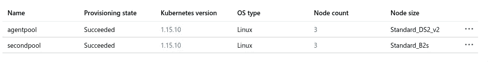
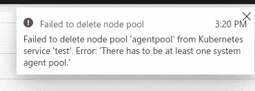
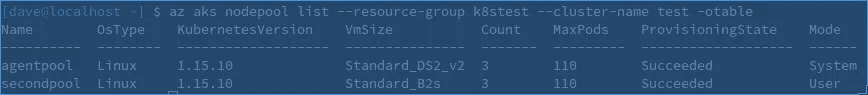
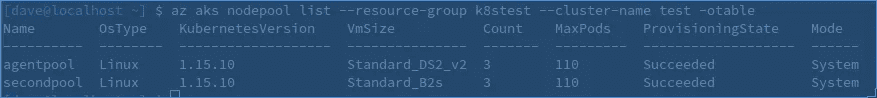
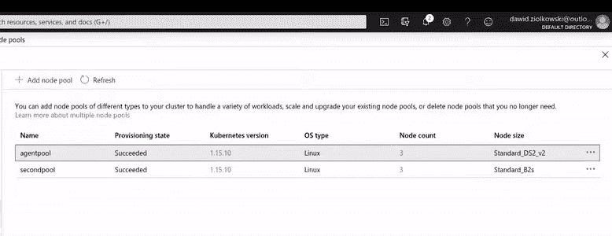

# 关于 Azure AKS 默认节点池

> 原文：<https://itnext.io/about-azure-aks-default-node-pool-2067d03ef1bc?source=collection_archive---------1----------------------->


泰勒·维克在 [Unsplash](https://unsplash.com?utm_source=medium&utm_medium=referral) 上的照片

如果您曾经使用过 Azure Managed Kubernetes 服务，您可能需要至少更改或删除一次默认节点池——这是在创建集群时创建的节点池，本质上是集群中的第一个节点池。如果你没有，那我就告诉你——Azure 不会允许你这么做的。让我们深入 Azure AKS 节点池，看看如果需要的话，如何删除默认节点池。

**什么是节点池，为什么需要多个节点池:**

顾名思义，节点池将 x 个节点组成一个逻辑组。每个组都可以有不同的配置，这就是节点池的意义所在。一个池中的节点可以有不同的虚拟机 SKU(不同的虚拟机类型)、不同的 Kubernetes 版本、不同的每节点 pod 限制等。从 Kubernetes 的角度来看，默认情况下它们都在同一个篮子里——例如，如果你在 Azure 中创建 3 个节点池——你会在 *kubectl get nodes 的输出中看到所有 3 个节点池中的所有节点。那还有什么意义呢？我提到了“默认”。但是，通过使用一些 Kubernetes [机制](https://kubernetes.io/docs/concepts/configuration/assign-pod-node/)，您可以将不同的节点池用于不同的目的。几个例子:*

*   对您的工作流进行逻辑分组，例如一个节点池用于生产应用程序，另一个节点池用于开发/测试。
*   按虚拟机类型对节点池进行分组—一个节点池包含标准计算机，另一个额外节点池包含更大的计算机(更多 CPU/RAM) —例如，用于保存需要更多计算能力的特定应用程序。
*   按“重要性”对节点池进行分组，例如，有一个节点池具有较低的每节点 pods 限制，并运行较旧的 Kubernetes 版本以保留最重要的微服务，另一个节点池具有较高的每节点 pods 限制和最新的 Kubernetes 版本。
*   通过自动扩展限制对节点池进行分组。例如，将一个节点池的自动扩展设置为某个合理的数字，并将所有非关键应用程序保留在该节点池中，而将另一个节点池的自动扩展限制设置为非常高，以用于关键应用程序。通过这种方式，当流量出现峰值时，您的主要微服务(例如运行 API 的微服务)将相应地扩展，但将系统的非关键部分保留在节点池中，该节点池将在一定范围内扩展，但不会扩展太多以节省成本。

这些只是几个例子，说明了为什么您希望 AKS 集群有多个节点池。这完全取决于您的具体使用情形和需求，但底线是，通常情况下，多节点池是有用的。

现在，让我们讨论一下“默认”节点池。它实际上已经不再被官方这样称呼了，但是你可能会找到这个名字的引用。基本上，我们讨论的是在创建 AKS 集群时创建的节点池。从 Azure 的角度来看，该节点池被创建为“系统”节点池，每当您添加新的节点池时，它都被创建为“用户”节点池。这两个有什么区别？“系统”节点池只是运行 AKS 正常工作所需的 pods(CoreDNS、Kuberentes Dashboard、tunnelfront、metrics-server、omsagentetc)，而正如您可能猜到的那样，用户节点池在创建后在节点上只有 kube-proxy pods，没有其他。

不幸的是，在 Azure 门户中你不会看到哪个是哪个。从那里看，两者看起来一样:



“代理池”—默认节点池

然而，如果你试图删除“secondpool”节点池，Azure 会很好地删除它，但如果你试图对“agentpool”做同样的事情，Azure 会抱怨:



由于“系统”节点池包含 Azure 创建的 pods，AKS 需要这些 pods 才能正常工作，因此防止删除该节点池是有意义的，对吗？但有时您确实需要删除该默认节点池(例如，使用不同的每节点 pod 限制或不同的虚拟机类型来重新创建它)。在这种情况下，你唯一的选择就是使用 [Azure 命令行工具](https://docs.microsoft.com/en-us/cli/azure/?view=azure-cli-latest)“az”。

我之前提到过，在 Azure Portal 中，两个节点池看起来是一样的。但是，当使用“az”命令列出节点池时，您会看到哪个是系统，哪个是用户模式:



现在我们有两个选择:

1.  将一个现有用户节点池更改为系统节点池，然后删除默认节点池
2.  创建新的节点池作为系统节点池。

第一个选项与执行以下命令一样简单:

```
az aks nodepool update --mode System --name [your_node_pool] --resource-group [resource_group] --cluster-name [cluster_name]
```

同样，第二个选项是在创建新节点池时传递相同的“模式”参数:

```
az aks nodepool add --mode System --name [your_node_pool] --resource-group [resource_group] --cluster-name [cluster_name]
```

如果您执行其中一项操作并再次列出您的节点池，您现在应该会看到我们有多个系统节点池:



…这让我们可以毫无问题地删除默认节点池(通过 Azure 门户或 CLI):



就是这样。总结:为了删除 AKS 默认节点池，您需要创建或指定另一个节点池处于“系统”模式，只要至少有一个系统节点池，那么对于 Azure 来说，您想要删除哪个节点池就不再重要了。