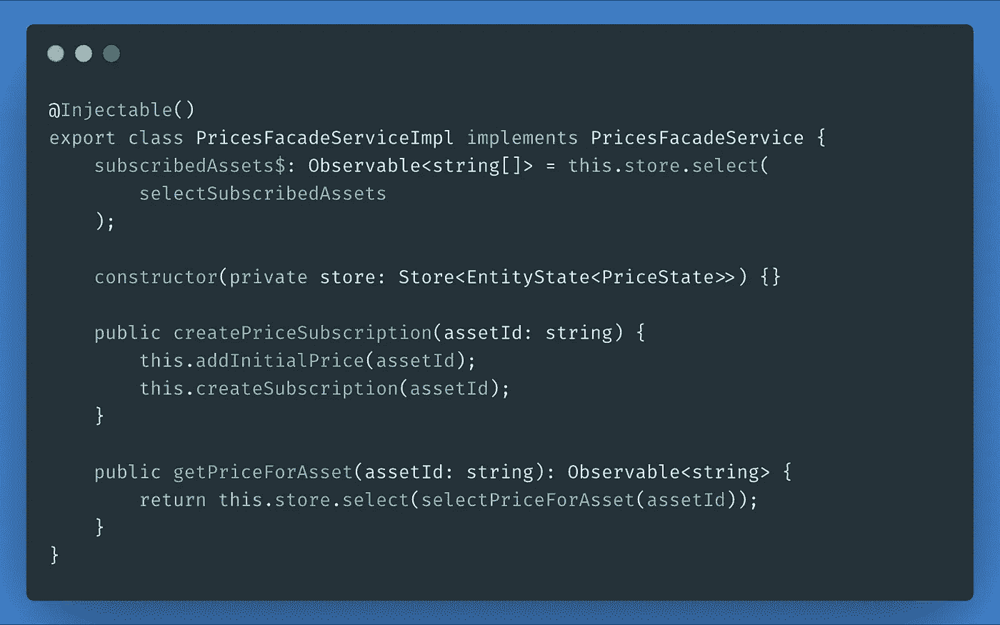

# 用 NGRX 外观抽象状态

> 原文：<https://itnext.io/abstracting-state-with-ngrx-facades-4f1f2491041c?source=collection_archive---------8----------------------->

这是系列文章的第四篇，也是最后一篇，旨在详细解释用 NGRX 构建 Angular 应用程序的一步一步的方法。

*   在本系列的第一篇文章中，我写了一篇关于 NGRX 平台所有概念的概述。
*   在[这个系列的第二篇文章](/architecting-the-store-in-ngrx-e4955641d746)中，我开始编写应用程序的存储和状态的实体。
*   在[这个系列的第三篇文章](/building-side-effects-in-ngrx-deb0d856096d)中，我们构建了负责从 Coincap 的 API 获取资产和价格的效果

## 摘要

总结一下我在以前的文章中介绍的内容，我们有一个应用程序，旨在显示一个带有加密货币价格的仪表板。

该应用程序的逻辑是使用三个服务模块构建的，每个模块管理我们商店的不同功能。

这些是:

*   **dashboard** ，它管理仪表板及其平铺的逻辑
*   **资产，**从 [Coincap 的](https://coincap.io) API 获取的资产列表
*   **价格，**来自 Coincap 的 WebSocket API 的价格流

**应用程序的外观:**

## 在本文中，我们将学习:

*   什么是门面服务，以及我们如何将它应用到 NGRX
*   使用**外观**创建与*商店*连接的精益 UI 组件

# 什么是门面？

从软件工程的角度来看，门面是作为一个对象来实现的，它在一个更复杂的系统背后提供了一个统一的、更简单的接口。

换句话说，它将复杂的系统( *NGRX* )抽象为单一的*服务*。

这对我们有什么用？

*   我们从使用的状态管理中抽象出 UI 组件
*   我们使用清晰的小方法来简化界面
*   我们最小化一个组件所使用的依赖项的数量
*   我们提供一个中央服务来获取数据和分发命令

## 优势

*   **抽象**
    假设我们使用 *NGRX* 开始这个项目，有一天我们决定切换到 *NGXS* 、 *Akita* ，或者其他一些状态管理工具。通过使用 facades，我们永远不必重构依赖于所用库的组件和服务。
*   **简单性** 一个 facade 将对消费者隐藏我们使用的库的技术细节和实现，这导致组件变得精简和简单。
*   可重用性
    facade 将有助于重用一些用于分派和创建动作的代码，或者从存储中选择片段，因为你永远不需要写两次。

当然，在 NGRX 中使用 Facade 服务也有一些缺点，我建议您阅读文章 [NgRx Facades:利与弊](https://auth0.com/blog/ngrx-facades-pros-and-cons/)以获得更好的解释。

# 实践中的门面服务

但是现在，让我们回到我们的应用程序，应用我们所学的关于立面的知识。

我们将为我们在前几篇文章中构建的每个商店模块实现一个门面服务。

Facade 服务将是导入商店模块的模块与其内部智能组件之间的接口。

我们需要构建的唯一功能模块是仪表板功能模块，它将负责定义 UI 容器和组件，这些组件将通过从商店模块导出的外观服务进行连接。

我们将构建 4 个组件:

*   **仪表板组件**，它将向商店查询已订阅的资产。最初，没有选择任何资产。
*   **Tile 组件，**将包含资产选择器，如果该 Tile 没有资产被订阅，否则，如果用户订阅了资产，它将显示资产价格
*   **资产选择器，**用户可以用来选择资产(例如比特币)
*   **资产价格器，**显示所选资产的价格以及每个价格的趋势

开始前有几件事:

*   这些组件将由[角形材料](https://material.angular.io/)提供动力
*   为了简洁起见，省略了所有的导入，但是将提供到源代码的链接

## 仪表板组件

仪表板组件将负责两件事:

*   初始化时加载资产，使用*资产外观*
*   使用*仪表板外观*查询并显示商店中的所有瓷砖

在我们构建组件之前，让我们看一下外观。

我们首先创建**仪表板外观**:

让我们来分解一下:

*   **tiles$** 是一个从商店中选择所有牌的可观察对象
*   我们有两个方法， **addTile，**和 **updateTileAsset，**将向商店发送添加和更新磁贴的操作

我们首先创建**资产外观**:

这个很简单，我们有:

*   从商店中选择的资产列表
*   使用 API 调度到效果以获取资源的动作

现在来看看 UI 方面的东西。我们定义了仪表板组件的控制器，它将使用我们上面定义的两个外观:

*   该组件的模板将使用角形材料的网格列表组件显示瓷砖
*   每个图块的状态被传递给组件 **cf-tile**
*   按钮(`mat-icon-button`)显示在它自己的区域中，用于添加新的空区域

## 瓷砖组件

tile 组件负责显示资产下拉列表或资产价格(如果已经订阅)。这个组件需要两个立面:

*   我们之前定义的仪表板外观
*   价格外观，以便在选择资产后创建订阅

让我们继续定义 Pricer 外观:

现在，让我们打破我们的定义:

*   我们为分派动作定义了两个私有方法:方法`addInitalPrice`将为订阅的资产创建初始价格，该价格最初为空；另一个方法`createSubscription`将启动 WebSocket 订阅，正如我们在上一篇文章中定义效果时看到的[。](/building-side-effects-in-ngrx-deb0d856096d)

瓷砖组件非常简单:

在模板中，如果定义了`assetId`，我们简单地使用一个`ngSwitch`来显示价格，如果没有定义，则使用选择器。

当用户选择一个资产时，组件`cf-asset-selector`将发送一个输出，该输出将调用方法`updateTile`，该方法将通过为其分配一个`assetId`来更新 tile，然后将调用该方法来创建价格订阅并开始传输资产价格。

## 资产选择器组件

资产选择器组件只是一个带有可用资产的下拉列表，当选择了一个资产时，它将发送一个输出。从资产外观中查询资产。简单吧？

该模板由角形材料制成的`mat-select`组件驱动，尽管简单的选择就可以完成这项工作。我们只需创建一个 select 并迭代资产来创建可用选项。

当一个选项被选中时，输出`assetSelected`将发出一个新的事件。

## 资产定价组件

Asset Pricer 组件负责显示价格，并显示价格何时上涨或下跌 2 秒钟。

你可能已经注意到了，这个组件很酷。我们接收一个资产 ID 作为输入，并创建一个对商店的订阅，以便将价格传递给组件。

> 从技术上讲，这是一个智能组件，应该将数据传递给非智能组件，但是为了简洁起见，我认为最好在一个组件中显示所有代码

这个组件稍微复杂一点，所以我们可能需要分解一下。我们的目标是:

*   当价格下跌时显示红色价格
*   价格上涨时显示绿色价格
*   2 秒钟后价格回到正常状态(白色)

事情是这样的:

*   我们通过 facade 方法`getPriceForAsset`得到一个价格，并简单地映射到它的格式化版本
*   我们将通过`shareReplay(1)`收到的最新价格存储在内存中，这样我们可以重用订阅来计算趋势
*   每当我们得到一个新价格，我们就创建一个计时器，将价格状态映射到`Stale`
*   我们使用运算符`pairwise`,它给出了当前订阅的当前值和以前值，因此我们可以计算出价格是上涨了还是下跌了
*   趋势是价格变化时发出的可观察信号，通过合并计时器和趋势结果获得。每当我们有一个价格变化时，它首先变成红色或绿色，然后在 2 秒钟后当可观察的`timer$`发出一个值时回到正常状态

该模板非常简单，就是商店获得的价格，在价格未定义时由微调器替换，这意味着订阅仍在进行中。

添加了类`trend-up`和`trend-down`来设计价格的颜色。

# 最后的话

NGRX 是一个非常强大的工具。当然，有时它可能需要一些 RxJS 的深入知识，但是只要有一点耐心，它真的可以彻底改变你编写软件的方式。

我希望这篇教程能帮助你理解如何建立一个基本的(可扩展的)文件夹结构，以及开始用 Angular 和 NGRX 编写强大的反应式应用程序的基础知识。

对于任何澄清或如果有事情你会做得不同，随时给我发电子邮件或评论如下。

## 源代码

该项目的完整源代码可以在[https://github.com/Gbuomprisco/cryptofolio](https://github.com/Gbuomprisco/cryptofolio)看到

希望你喜欢这篇文章，如果你同意，不同意，或者如果你想做任何不同的事情，请留言！

如果你喜欢这篇文章，请关注我的[*Medium*](https://medium.com/@.gc)*或*[*Twitter*](https://twitter.com/home)*以获得更多关于 Angular、RxJS、Typescript 等的文章！*

*最初发布于*[*https://frontend . consulting*](https://frontend.consulting/abstracting-state-with-ngrx-facades)*。*