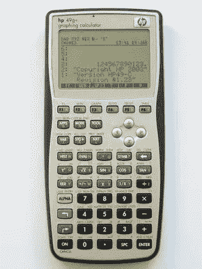

# 反射和代码世界中的抽象

> 原文：<https://itnext.io/abstraction-in-reflex-and-codeworld-a1b42ad36923?source=collection_archive---------1----------------------->

我最近整理了一个使用 FRP ( [函数式反应式编程](https://en.wikipedia.org/wiki/Functional_reactive_programming))来清晰地分离和建模交互应用程序各部分的交互的简洁例子:在这个例子中，是一个 RPN ( [反向波兰符号](https://en.wikipedia.org/wiki/Reverse_Polish_notation))计算器。在本文中，我使用 [Reflex FRP 库](https://reflex-frp.org/)和 [CodeWorld](https://code.world/haskell) 图形 API 展示了这个应用程序的 Haskell 代码。



RPN 计算器

因为 CodeWorld 是一个相对低级的图形 API，我们将重新发明像数字输入字段这样的抽象。不要以为那是玻璃钢的基础部分！事实上，像 reflex-dom 这样的库为您提供了使用相同 FRP 的传统高级组件库的所有功能。但是我认为从零开始是一个很好的学习经历；我们可以看到如何从非常简单的原语开始构建更高级别的组件，并且您可以在自己的代码中应用相同的抽象技术来构建特定于应用程序的抽象。

我们将在本系列结束时获得的计算器位于以下链接:

 [## Reflex 和 CodeWorld 中的 RPN 计算器

代码.世界](https://code.world/haskell#PP_y0l9mQepdeIvwDXWfNOQ) 

它肯定有一些不足之处:

*   缺乏非常精确的数字。
*   您不能输入负数。
*   许多重要的操作都丢失了。

为感兴趣的读者考虑这些练习。我只实现了足够的抽象技术，从来没有打算把它变成一个产品质量计算器！

## 基本定义

如果你不熟悉 FRP，这个想法是根据两个抽象来建模你的软件的交互部分:*事件*和*行为*。*事件*是发生在离散时刻的事情，例如按键或鼠标点击。(如果你习惯于传统的 GUI 编程，请注意:在 FRP 中，一个事件不是一件事情的单次*发生*，而是可能发生多次的整个*事件。)一个*行为*是一个随时间变化的值，比如鼠标位置。(同样，一个行为并不是某个特定的*时间的值，而是整个*概念，就像鼠标位置会随着时间而变化。)*

Reflex 增加了第三种抽象，是两者的混合体。*动态*值是仅在离散时间点改变的值。因为它确实随时间变化，所以它的当前值形成了一种*行为*。但是因为它在离散的时间点改变，它的更新形成了一个*事件*。

## 从按钮开始

我们需要一个 CodeWorld 没有提供的计算器，那就是按钮！一方面，按钮是非常简单的东西:你点击它们，它们就会做一些事情。然而，正如我们将会看到的，获得一个直观和用户友好的按钮体验是不平凡的，值得抽象出来！

下面是一个使用 CodeWorld 创建简单(不太用户友好)按钮的 Reflex 程序。

 [## Reflex 和 CodeWorld 中的简单按钮

代码.世界](https://code.world/haskell#Px5T48q9KCouvmkmmyGNHig) 

源代码是:

```
{-# LANGUAGE OverloadedStrings #-}import CodeWorld.Reflex
import Control.Monad.IO.Class
import Data.Functor (($>))
import Data.Text (Text)
import Reflexbutton :: ReflexCodeWorld t m => Text -> m (Event t ())
button label =
  do
    draw (pure (rectangle 5 2 <> lettering label))
    clicks <- getPointerClick
    return (ffilter inButton clicks $> ())
  where
    inButton (x, y) = abs x < 2.5 && abs y < 1foreign import javascript "window.alert('clicked!');"
  notify :: IO ()app :: ReflexCodeWorld t m => m ()
app = do
  clicks <- button "Click me!"
  performEvent (clicks $> liftIO notify)
  return ()main :: IO ()
main = reflexOf app
```

如果您已经做到这一步，您可能对 OverloadedStrings 很熟悉，它只是让我们在 Haskell 中为文本值编写字符串文字。其余的我现在会解释。

首先，*按钮*的类型说你必须提供一个标签，你得到一个*事件*，它的发生是按钮点击。ReflexCodeWorld 只是一个类，它封装了编写与 CodeWorld 交互的 Reflex 程序所需的所有约束。任何时候你需要使用 CodeWorld 类型访问基本的绘图和事件处理，你都需要这个类。按钮被吸引到屏幕上并监听鼠标点击，所以这里需要这个类。

*按钮*的实现通过使用一个名为 *draw* 的函数在屏幕上绘制按钮。如果你查一下*画*的类型，就是`ReflexCodeWorld t m => Dynamic t Picture -> m ()`。*动态*图意味着你可以画一幅随时间变化的图。但在这种情况下，我们的按钮没有变化，所以我们使用*纯*绘制一个矩形和刻字的不变图片。下一个任务是确定按钮何时被单击。我们使用 *getPointerClick* 来检索一个告诉我们鼠标何时被点击的事件，然后只过滤那些发生在按钮边界内的点击(使用 *ffilter* )，并用()(使用`$>`仿函数运算符)替换指针事件中的点，因为客户端并不关心哪个特定像素被点击。

在这一点上，你可能开始想知道所有这些组合子是从哪里来的。与绘图和 UI 事件直接相关的事件来自代码世界。Reflex 模块，其文档可以在[https://hackage . haskell . org/package/codeworld-API-0 . 6 . 0/docs/code world-reflex . html](https://hackage.haskell.org/package/codeworld-api-0.6.0/docs/CodeWorld-Reflex.html)中找到，或者通过单击 code world 选项卡中的 Guide 按钮找到。事件和行为的通用组合器来自 Reflex，一个很好的参考是 [Reflex 快速参考](https://github.com/reflex-frp/reflex/blob/develop/Quickref.md)。请记住，也有实例:事件、行为和动态都是函子，行为和动态也是适用的函子和单子。(注意，动态的 monad 实例可能很昂贵，所以尽可能避免它！)

这就完成了按钮的一般实现。接下来，我使用 JavaScript FFI 定义一个简单的动作，这样我们就可以知道按钮事件何时触发，并使用 *performEvent* (另一个反射组合器)将 IO 动作附加到从*按钮*返回的事件。总而言之， *reflexOf* 是一个 CodeWorld 函数，它在 CodeWorld 环境中运行 ReflexCodeWorld 网络。

## 打造更好的按钮

这个按钮起作用了，但是它很丑而且功能有限。它总是相同的大小和位置，对用户按下它完全没有反应，并且通常不像用户习惯于现代用户界面中的按钮那样工作。我们可以做得更好！

首先，为了使大小和位置可配置，我们应该为按钮配置属性定义一个类型，并将所有这些选项捆绑在一起。看起来像这样:

```
data ButtonConfig = ButtonConfig
  { buttonLocation :: Point,
    buttonWidth :: Double,
    buttonHeight :: Double,
    buttonText :: Text
  }
```

重写*按钮*来获取一个 ButtonConfig 并在任意大小和位置呈现它自己是一个很简单的练习。看起来是这样的。

 [## Reflex 和 CodeWorld 中的可配置按钮

代码.世界](https://code.world/haskell#PbmFTi_WhFj_mRHnwqGn3DQ) 

这个按钮的源代码是:

```
button :: ReflexCodeWorld t m => ButtonConfig -> m (Event t ())
button (ButtonConfig (x, y) w h label) =
  do
    draw (pure pic)
    clicks <- getPointerClick
    return (ffilter inButton clicks $> ())
  where
    inButton (xx, yy) = abs (xx - x) < w / 2 && abs (yy - y) < h / 2
    pic =
      translated x y $
        clipped w h (lettering label)
          <> rectangle w h
```

我使用了名为*的 CodeWorld 函数翻译了*和*剪辑了*来移动按钮的视觉外观，并确保标签不会超出现在可配置的大小。除此之外，这都是直截了当的。

更复杂的是让按钮响应用户输入，并表现出现代用户界面中按钮的行为。如果您在您最喜欢的 GUI 程序中尝试一些按钮，您可能会注意到它们的行为如下:

*   当您的指针在按钮上时，可能有也可能没有悬停效果来指示。
*   当您按下指针时，按钮被按住，但是它的动作还没有被触发。
*   如果您在释放前将指针拖离按钮，则动作是由*而不是*触发的。类似地，如果你点击其他地方并拖动到按钮上，动作是*而不是*触发的。
*   只有当*在*按钮上*释放*指针，并且*和*在按钮上被按下时，按钮的动作才被触发。但是，无论指针被按住时是否暂时离开按钮，该操作都会触发。

那是一个复杂的行为！但最终，考虑到人类使用按钮的体验，每个细节都是合理的。我们希望在我们的按钮中复制这种行为。

当处理这样一个复杂的问题时，我喜欢从命名开始！我以下面的代码结束，我将逐行解释。

```
do
  over <- fmap inButton <$> getPointerPosition
  down <- isPointerDown
  click <- getPointerClick
  lastAnchored <- holdDyn False $ fmap inButton click
  let anchored = (&&) <$> down <*> lastAnchored
  let releases = ffilter not (updated anchored) $> ()
  let triggers = gate (current over) releases
```

事情是这样的:

*   *over* 是一个动态布尔值，指示指针是否位于按钮上。我们从 *getPointerPosition* 开始，这是一个动态指针，然后从上面 fmap*in button*函数得到一个动态 Bool。
*   *down* 是一个动态布尔值，指示指针当前是否被按住，而不管它是否在按钮上。这是使用 *isPointerDown* 定义的，它是一个 CodeWorld 反射原语。
*   *点击*是指示指针被按下的事件，不管它是否在按钮上。与每个事件关联的值是指针被单击的点。这是使用 *getPointerClick* 定义的，这也是一个 CodeWorld 反射原语。
*   *lastAnchored* 是一个动态布尔值，它记住最后一次指针按压是否发生在按钮上。我们从所有的指针按下( *click* )、fmap *inButton* 开始获取一个 Bool 值而不是 Point 值的事件，最后使用 *holdDyn* (一个标准的反射操作)来构建一个动态值，它会记住最近发生的事件。
*   *anchored* 是 *lastAnchored* 和 *down* 的组合，一个动态布尔值，它告诉是否有一个正在进行的指针按下开始于按钮之上。它使用应用运算符来组合两个更简单的值。
*   *releases* 是一个事件，它将所有对*锚定的*的更新，然后只过滤掉那些将其更改为 False 的更新。这里， *updated* 是一个标准的反射组合器，它将更新事件提取为一个动态值。
*   最后，*触发*门*释放*，只保留那些在按钮上发生的释放。在这里， *current* 是一个标准的反射组合器，它获取表示动态值的当前样本的行为。然后 *gate* 是另一个标准的反射组合器，通过一个行为选通一个事件。

*触发*事件是我们想要的:一个代表按钮的效果应该被触发的精确时间的事件。

接下来，我们希望按钮的呈现根据状态而有所不同。具体来说，我们希望根据锚定在上的*和锚定在*上的*进行不同的渲染。为了实现这一点，我们将使用应用组合器向渲染函数传递参数，而不是使用纯*和*绘制*。**

```
draw (render <$> anchored <*> over)
```

我选择的渲染函数使用这两个参数来选择按钮的背景颜色。

```
render anchored over =
  translated x y $
    clipped w h (lettering label)
      <> rectangle w h
      <> colored (color anchored over) (solidRectangle w h)color _ False = white
color False True = RGB 0.9 0.9 0.9
color True True = RGB 0.8 0.8 0.8
```

你可以在这里玩“完成”按钮:

 [## Reflex 和 CodeWorld 中的高级按钮

代码.世界](https://code.world/haskell#Pmls2_rsLWm34f2wcF9CWmw) 

这个按钮的好处是 API 和之前的可配置按钮完全一样。使按钮行为更加用户友好的逻辑变化完全封装在可重用组件的实现中。尽管有一些非常激进的改变，比如触发鼠标释放的效果而不是鼠标按下的效果，但事实就是如此！这种抽象是可能的，因为事件抽象可用于用户定义的事件。

## 输入数字

下一个挑战是数字输入字段。因为这是一个计算器，所以输入数字是你能做的最重要的事情之一，这项任务变得有点复杂并不奇怪。我们确定了以下要求。

*   如果还没有输入数字，我们可以输入一个带或不带小数点的数字，来输入这个数字。
*   我们可以将当前输入的数字设置为我们想要的任何数字。例如，数字输入字段有时充当堆栈的顶部元素，所以当我们从堆栈中弹出一个数字时，我们会将输入字段设置为该数字。
*   也有可能没有输入数字。例如，在执行数学运算后，没有数字被输入。

根据前面从 button 示例中学到的经验，我们将从一个配置结构开始，该结构给出了关于数字输入字段的配置选项。不过，还有一个新问题:

```
data NumFieldConfig t = NumFieldConfig
  { numFieldLocation :: Point,
    numFieldWidth :: Double,
    numFieldHeight :: Double,
    setNumField :: Event t (Maybe Rational)
  }
```

什么是 *setNumField* ？与按钮不同，我们需要能够在字段本身之外设置数字字段的值。我们在反射中这样做的方式是在中传递*控件需要知道的关于外部世界的信息，比如当外部世界希望它改变当前值时。附加到事件上的值是一个可能值，因为外界有可能(事实上，这是最常见的情况)想要将字段重置为根本不输入数字。*

现在，构建数字字段的函数具有以下类型:

```
numField ::
  ReflexCodeWorld t m =>
  NumFieldConfig t ->
  m (Dynamic t (Maybe Rational))
```

也就是说，您传入一个 NumFieldConfig(包括一个用于设置该值的事件)，然后您得到一个动态的当前值(该值可能不存在，因此有可能)。

这里的一种方法可能是实现一个任意的文本输入字段，然后在需要值时从中解析一个数字。相反，我们将采取不同的策略:只要有当前的数字被编辑，就保持一个流水号。为了输入小数，除了数字本身之外，我们还需要跟踪是否输入了小数点，如果输入了小数点之后还有多少位小数(双关语)。因此，我们可以为数字字段的内部状态定义一个状态类型，如下所示:

```
data NumFieldState = NumFieldState
  { numFieldValue :: Rational,
    numFieldDecimalPlaces :: Maybe Int
  }
```

现在我们需要实现这一点。我们将转向 Reflex 中状态机的一个非常常见的技巧:使用 *foldDyn* (一个标准的 Reflex 组合器)和函数应用操作符将状态转换函数的事件应用到初始状态。通过用函数组合合并许多较小的事件来构建事件。这一次是这样的:

```
numField (NumFieldConfig (x, y) w h set) =
  do
    text <- getTextEntry
    key <- getKeyPress
    state <-
      foldDyn ($) Nothing $
        mergeWith
          (.)
          [ const . fmap initState <$> set,
            ffilter (== "0") text $> digit 0,
            ffilter (== "1") text $> digit 1,
            ffilter (== "2") text $> digit 2,
            ffilter (== "3") text $> digit 3,
            ffilter (== "4") text $> digit 4,
            ffilter (== "5") text $> digit 5,
            ffilter (== "6") text $> digit 6,
            ffilter (== "7") text $> digit 7,
            ffilter (== "8") text $> digit 8,
            ffilter (== "9") text $> digit 9,
            ffilter (== ".") text $> dot,
            ffilter (== "Backspace") key $> backspace
          ]
    draw (render <$> state)
    return (fmap numFieldValue <$> state)
```

我们过滤掉任何输入数字或点号、按退格键或使用配置中的事件设置当前值的时间。如上所述，当这些事情发生时，我们构造一个状态转移函数，并使用 *mergeWith* 从合并的事件中产生它，使用函数组合来组合同时发生的事件。然后我们使用 *foldDyn* 来折叠状态转换函数的事件，以获得一个动态的当前状态。

这里使用了四个辅助函数来构造状态转换: *initState* 、 *digit* 、 *dot* 和 *backspace* 。还有一个辅助的*渲染*函数用于调用*绘制*。这些根本不使用任何反射功能，因为它们只是状态上的普通函数，并且它们也不使用任何新的 CodeWorld 函数。所以我不会一一解释，而是链接到一个包含完整代码的演示，您可以在闲暇时查看。

 [## Reflex 和 CodeWorld 中的数字字段演示

代码.世界](https://code.world/haskell#PLvBvf4iLvSAXMz_rw9LXUA) 

stack display 组件根本没有引入任何新概念，实际上是同一模式的一个更简单的应用程序，因为除了配置中的 setter 函数之外，它没有任何输入。我在这里省略了，但是你可以在最终的计算器程序中浏览它的代码。

## 操作

现在我们已经有了基本的组件，我们将开始把它们连接在一起。这里我们还可以定义一个特定于应用程序的抽象来使这个过程更加可组合: *operations* 。运算包括加法、减法等。但是它们也包括将值压入堆栈，将它们弹出堆栈，也许将来会更像 dup、swap 等。

最终，一个操作有两种效果:设置当前数量，和设置当前堆栈。

```
data OpEffect t = OpEffect
  { entryEffect :: Event t (Maybe Rational),
    stackEffect :: Event t [Rational]
  }
```

您可以开始看到这些是如何被设置为连接到数字字段和堆栈显示组件的，但是我们还有一些工作要做。一个操作只是影响数字字段和堆栈的一种方式，一个完整的计算器需要将许多不同的可能操作连接在一起。幸运的是，OpEffect 形成了一个幺半群，这让我们可以将它们组合在一起！

```
instance Reflex t => Semigroup (OpEffect t) where
  OpEffect c1 s1 <> OpEffect c2 s2 =
    OpEffect (leftmost [c1, c2]) (leftmost [s1, s2])instance Reflex t => Monoid (OpEffect t) where
  mempty = OpEffect never never
```

空的 OpEffect 根本不会设置任何东西。为了合并两个操作效果，我们使用最左边的*来合并它们的效果。(如果两个效果同时触发，这个实现将优先选择左边的一个，放弃右边的一个，但是在这种情况下，不清楚什么是正确的行为，所以这是一个很好的选择。)*

这里有一点值得一提:这里没有 ReflexCodeWorld 类；只是反射。这是因为我们已经超越了处理低级图形 API 的层次，正在构建与堆栈和数字交互的逻辑层。从这些 RPN 计算器的概念到绘图和指针事件的转换已经在前面实现了。缺少 ReflexCodeWorld 是我们在抽象方面成功的标志。

至此，我们可以开始实施操作了。例如，将当前数字字段值推送到堆栈上:

```
pushStack ::
  Reflex t =>
  Event t a ->
  Dynamic t (Maybe Rational) ->
  Dynamic t [Rational] ->
  OpEffect t
pushStack occurred entryVal stackVal =
  OpEffect
    { entryEffect = occurred $> Nothing,
      stackEffect =
        tag
          ( (:)
              <$> (fromMaybe 0 <$> current entryVal)
              <*> current stackVal
          )
          occurred
    }
```

这里，*发生*是一个事件，表示我们希望*推栈*发生的时间。为了推送，我们需要访问以前的数字条目和堆栈，并且我们产生一个相应地设置新的数字条目和堆栈的操作效果。Reflex combinator *标签*在这里非常有用:它让我们获取事件的所有出现，并用一些行为替换事件值，我们可以从当前的数字输入字段和堆栈中构建这些行为。

我们还可以从堆栈中弹出顶部的值，并用它替换数字输入字段。这是*标签*的另一个简单用法。请注意，我们需要以前的堆栈，但不需要以前的数字字段，因为我们将用一个新的字段清除它的值。

```
popStack ::
  Reflex t =>
  Event t a ->
  Dynamic t [Rational] ->
  OpEffect t
popStack occurred stackVal =
  OpEffect
    { entryEffect = tag (listToMaybe <$> current stackVal) occurred,
      stackEffect = tag (drop 1 <$> current stackVal) occurred
    }
```

最后，我们将有许多修改堆栈的操作。我们希望它们以一致的方式工作:如果输入了一个当前的数字，首先将它压入堆栈并清除数字输入字段，然后在堆栈上执行操作。我们可以这样概括地说:

```
stackOp ::
  Reflex t =>
  ([Rational] -> [Rational]) ->
  Event t a ->
  Dynamic t (Maybe Rational) ->
  Dynamic t [Rational] ->
  OpEffect t
stackOp f occurred entryVal stackVal =
  OpEffect
    { entryEffect = occurred $> Nothing,
      stackEffect = tag (f <$> input) occurred
    }
  where
    input =
      (\s -> maybe s (: s))
        <$> current stackVal <*> current entryVal
```

我们将需要一些二元运算(如加法和减法)和一些一元运算(如平方根)。让我们为它们制作包装器，这样我们可以更容易地定义具体的操作。

```
binaryOp ::
  Reflex t =>
  (Rational -> Rational -> Rational) ->
  Event t a ->
  Dynamic t (Maybe Rational) ->
  Dynamic t [Rational] ->
  OpEffect t
binaryOp op = stackOp f
  where
    f (x : y : xs) = op y x : xs
    f other = otherunaryOp ::
  Reflex t =>
  (Rational -> Rational) ->
  Event t a ->
  Dynamic t (Maybe Rational) ->
  Dynamic t [Rational] ->
  OpEffect t
unaryOp op = stackOp f
  where
    f (x : xs) = op x : xs
    f other = other
```

这给了我们连接计算器所需的所有部件。

## 把所有的放在一起

现在是时候将所有这些连接在一起了。因为我们的组件之间存在循环数据依赖，所以我们需要 RecursiveDo 语言扩展来实现这一点。这个扩展只是让我们定义 do 符号的递归块，其中绑定的值可以相互引用。然后我们把它全部插上:

```
calculator :: ReflexCodeWorld t m => m ()
calculator = do
  key <- getKeyPress
  text <- getTextEntry sqrtButton <- button (ButtonConfig (-3.5, -3) 3 1.25 "sqrt")
  sinButton <- button (ButtonConfig (0, -3) 3 1.25 "sin")
  cosButton <- button (ButtonConfig (3.5, -3) 3 1.25 "cos") rec let OpEffect entryEff stackEff =
            mconcat
              [ pushStack (ffilter (== "Enter") key) num stk,
                popStack (ffilter (== "Esc") key) stk,
                binaryOp (+) (ffilter (== "+") text) num stk,
                binaryOp (-) (ffilter (== "-") text) num stk,
                binaryOp (*) (ffilter (== "*") text) num stk,
                binaryOp (/) (ffilter (== "/") text) num stk,
                unaryOp (approx sqrt) sqrtButton num stk,
                unaryOp (approx sin) sinButton num stk,
                unaryOp (approx cos) cosButton num stk
              ]
      num <- numField (NumFieldConfig (0, 5) 10 1.5 entryEff)
      stk <- stack (StackConfig (0, 1) 10 6 stackEff) return ()
```

mconcat 将所有单独的操作组合成一个组合效果，然后连接到数字字段和堆栈组件。为了证明这是可能的，我将一些操作绑定到了按键上，将一些操作绑定到了屏幕上的按钮上。操作代码不关心它的事件来自哪里，这就是为什么事件是一个很好的抽象。这将所有这些都结合到一个大计算器中，只剩下一个步骤:

```
main :: IO ()
main = reflexOf calculator
```

我们完事了。

你可以在这里阅读最终的计算器代码:

 [## Reflex 和 CodeWorld 中的 RPN 计算器

代码.世界](https://code.world/haskell#PP_y0l9mQepdeIvwDXWfNOQ)