# 验收测试驱动的开发。带 Specflow 的网络核心

> 原文：<https://itnext.io/acceptance-test-driven-development-in-net-core-with-specflow-dcb17fb7a893?source=collection_archive---------0----------------------->

测试驱动的开发非常棒，它给了你一个可以依赖的安全网，所以你可以放心地重构代码。TDD 学习者通常从单元测试开始，单元测试涵盖了软件的独立部分的细节，这是一件很棒的事情，但是当你把所有的类粘在一起时，有什么保证它们像预期的那样工作呢？

为了测试所有的东西都能一起工作，我们需要不同类型的测试。

## 在我们深入 ATDD 之前

您必须对 TDD 有一个基本的了解，如果您不熟悉它，可以在这里学习:

*   [为什么 TDD 会改变你的开发者生活](https://medium.com/@raphaelyoshiga/why-tdd-will-change-your-developer-life-b0bf234e15ac)
*   [实用 TDD —第一课](https://medium.com/@raphaelyoshiga/practical-tdd-first-lesson-1c689fffe4ec)
*   [实用 TDD —第二课](https://medium.com/@raphaelyoshiga/practical-tdd-lesson-2-d9d48283b0c4)
*   [实用 TDD——第三课课堂协作](https://medium.com/@raphaelyoshiga/practical-tdd-3-9a76b3e045d8)

# 什么是 ATDD？

ATDD 是验收测试驱动的开发，测试将驱动实现。我在双环 TDD 的概念中使用这些，所以外环是验收测试:

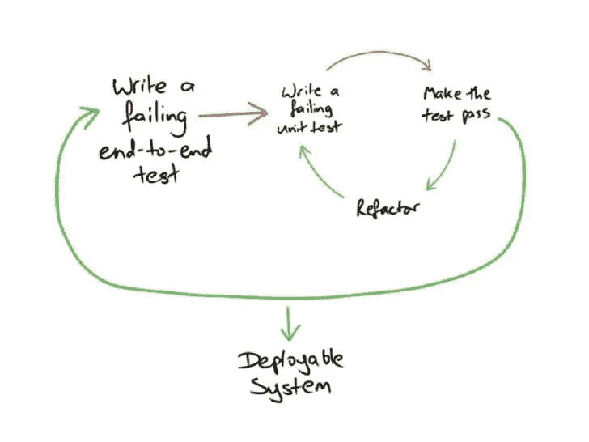

双环 TDD 循环—图像[来源](http://myscribbledthoughts.info/page/a/atdd-tdd.html)

我们将对此做一个外部循环，使验收测试失败，然后为单元测试实现多个 TDD 循环，直到验收测试通过，而不是只有红色>绿色>重构的小 TDD 循环。

验收测试可以表示为:

## 正常测试代码

示例测试计算器

这些都是用你写单元测试的同一种语言写的，你可以从测试中提取许多方法，使它更容易被人理解，因为范围会变得相当大。

**BDD 语言**

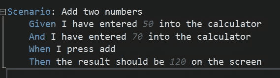

用 Specflow 编写的示例测试

因为它是以人类可读的格式编写的，所以很好地记录了应用程序的特性，并且是向业务部门举例说明您试图为他们开发什么的好方法。

我发现 BDD 测试更适合验收测试，因为范围通常很大，并且 BDD 可以更有效地显示更多的数据。

## 测试示波器

当创建您的验收测试时，您将不得不定义您要模拟多少系统，如果有的话:

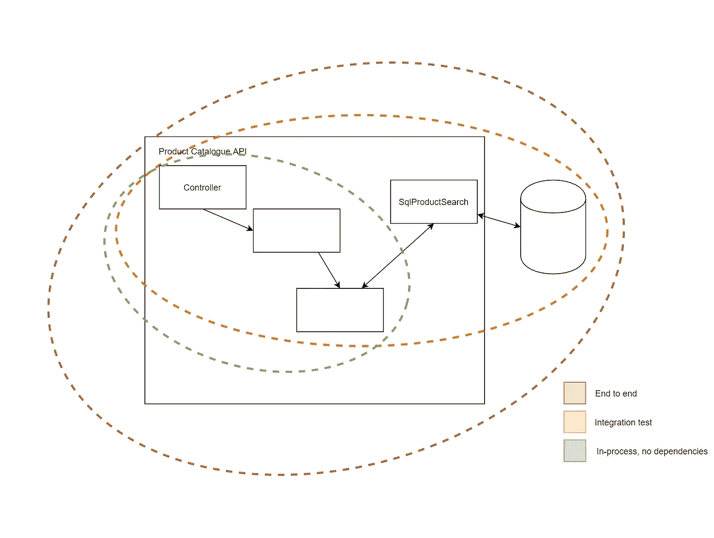

测试范围—使用 [http://draw.io](http://draw.io) 创建

**端到端**

这些将是黑盒测试，这意味着测试是针对一个已部署的实例运行的，而没有系统如何工作的内部知识。这对以后的技术迁移很有用。

这提供了您所能获得的最佳覆盖率，但是它们也带来了测试执行速度的缺点，不得不依赖于预先存在的数据，并且由于依赖失败而得到误报。

**集成测试**

这些不会在已部署的实例上运行，而是在应用程序的某种引导中运行，使用真正的依赖项，如数据库和外部系统。这些依赖项可以是模拟实例，模拟另一个团队 API，但是通过 HTTP 与它们通信的方式将是真实的。这些测试从头到尾都有一些相同的问题

**进程内，没有被称为**的依赖项

在集成测试中，我们将引导应用程序入口点，但不调用任何真正的依赖，我们将在最后一级模拟所有的依赖。例如，在图中，SqlProductSearch 类超出了测试覆盖范围。

这样做的好处是测试会运行得非常快，你甚至可以用 NCrunch 这样的工具连续运行它们。此外，它们不会因为依赖失败而出现误报。坏处是你在嘲讽的东西，有时候你把真正的依赖塞住了，意想不到的事情就发生了。

虽然没有一个正确的答案，但是我会为每个应用程序和团队经验评估使用什么范围和测试结构。我个人的偏好通常是进程内 BDD，所以这就是我接下来要展示的:

# 使用设置规格流。网络核心

首先，我们需要一个控制台应用程序和一个 Xunit 测试项目。net core with Visual Studio 2019:

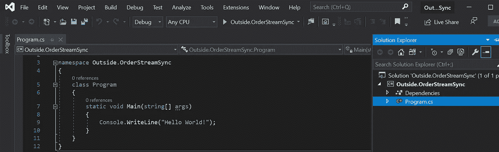

Visual Studio 2019 中的控制台应用程序

向其中添加一个新的 XUnit 项目:

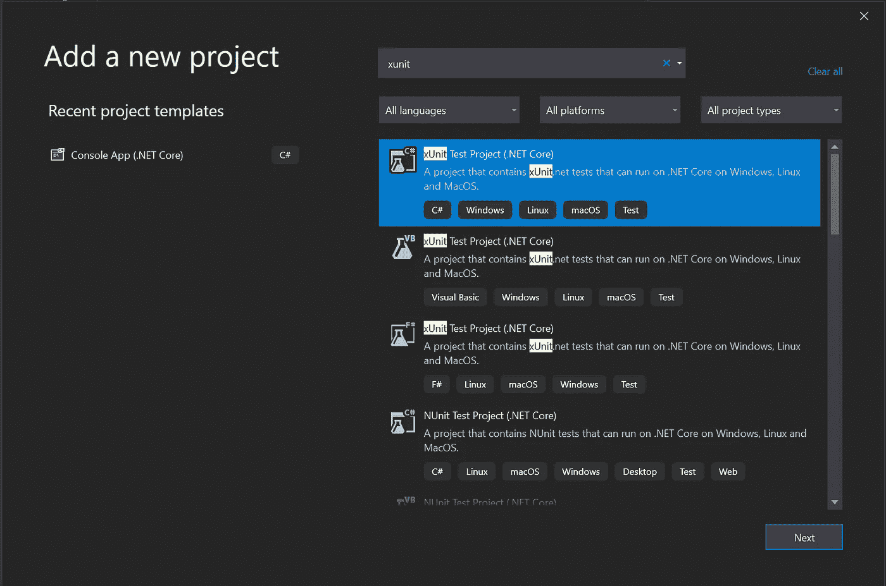

新 xUnit 项目— Visual Studio 2019

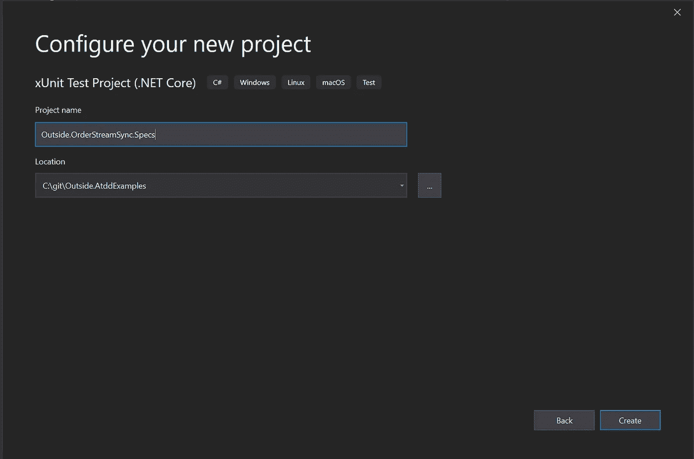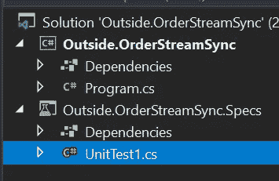

控制台加 XUnit 项目示例

## 安装 SpecFlow Visual Studio 扩展:

对于使用 SpecFlow 进行开发来说，拥有像语法突出显示和自动格式化这样的 IDE 优势是非常有用的，因此我们需要安装一个 Visual Studio 扩展，如下所示:

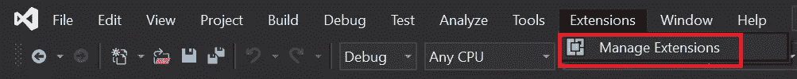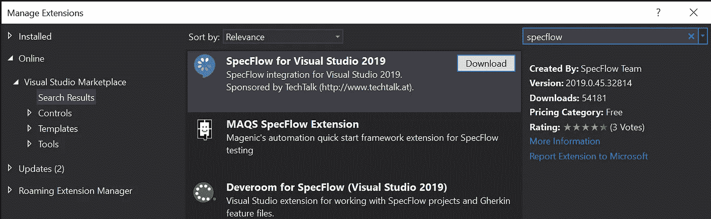

下载后，需要关闭 Visual studio，以便触发安装程序:

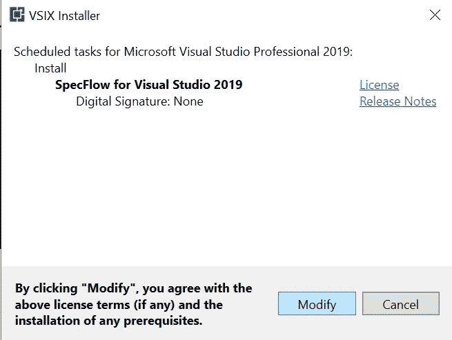

安装完成后，重新打开解决方案。右键单击项目，添加>新建项目…

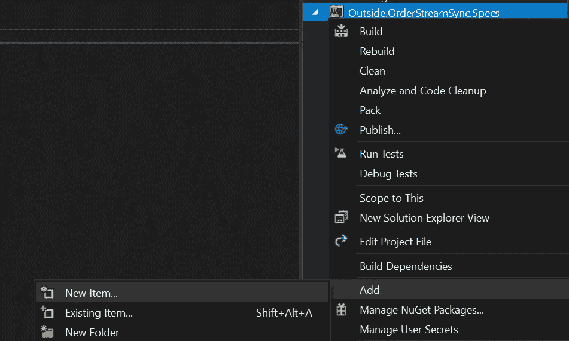

现在已经添加了 Specflow 扩展，在添加新项目时，您可以看到一个 Specflow 部分:

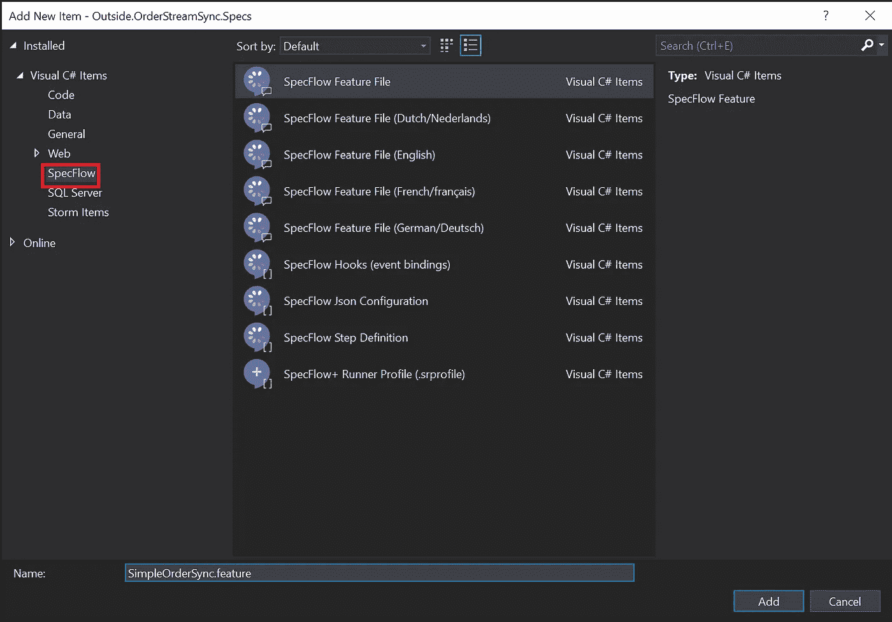

## **包依赖关系**

在将扩展安装到 visual studio 中之后，我们仍然需要配置我们的测试项目来使用 SpecFlow，并使用正确的测试运行程序。(XUnit、NUnit、MsTest 等)。我们会用 XUnit 做这个教程。

右键单击项目依赖项，管理 NuGet 包…

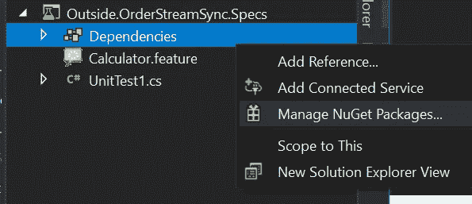

搜索 SpecFlow 并安装 Specflow.xUnit 包:

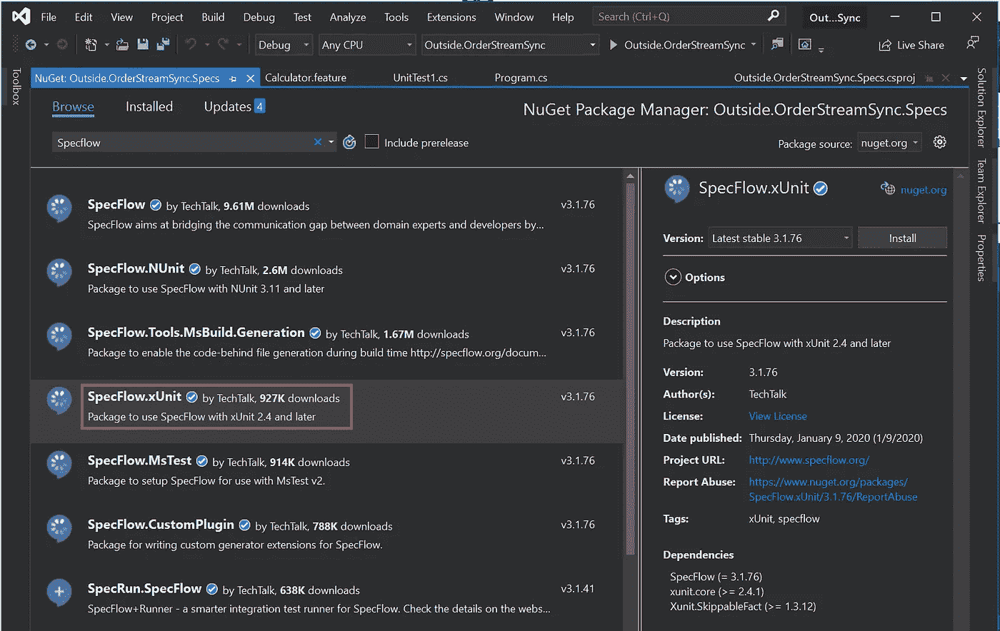

这给了我一个错误:

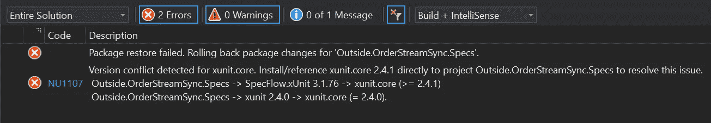

所以我更新添加了 XUnit 这个包。核心到 2.4.1，安装完成。

## 代码隐藏

在以前的 Specflow 实例中，有一个代码隐藏的概念，这是一个 C#文件，是。特征文件 Feature.cs 通常在每次更改。特征文件。

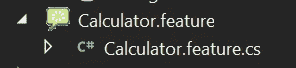

随着 Specflow 的发展，这些文件现在是在构建时通过安装包 SPE flow . tools . msbuildgeneration 生成的。

> 因为这些是在构建时生成的，所以我建议您不要对它们进行源代码控制。通过将*.feature.cs 添加到. gitignore。

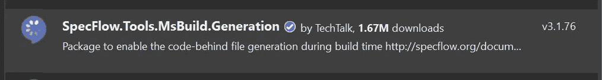

至此，我们终于可以在 Test Explorer 中看到并运行我们的 Specflow 测试了。

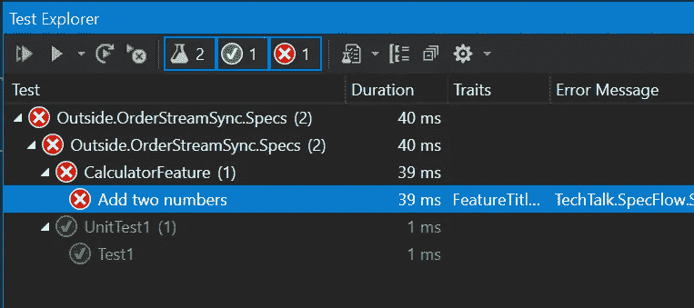

或者，可以从命令行安装这些软件包:

# 实施简单的 SpecFlow 测试:

Specflow 附带了一个用于创建计算器的默认示例，这将非常有用，因此我们可以使用一个非常基本的示例:

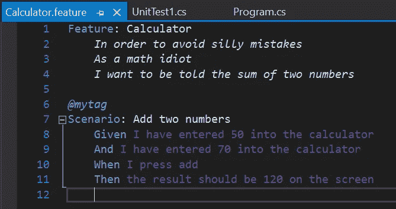

如您所见，我们的场景“添加两个数字”，所有步骤都以紫色突出显示，这意味着 SpecFlow 不知道在其中做什么。为了告诉 SpecFlow 每个步骤要运行什么代码，我们需要生成步骤定义:

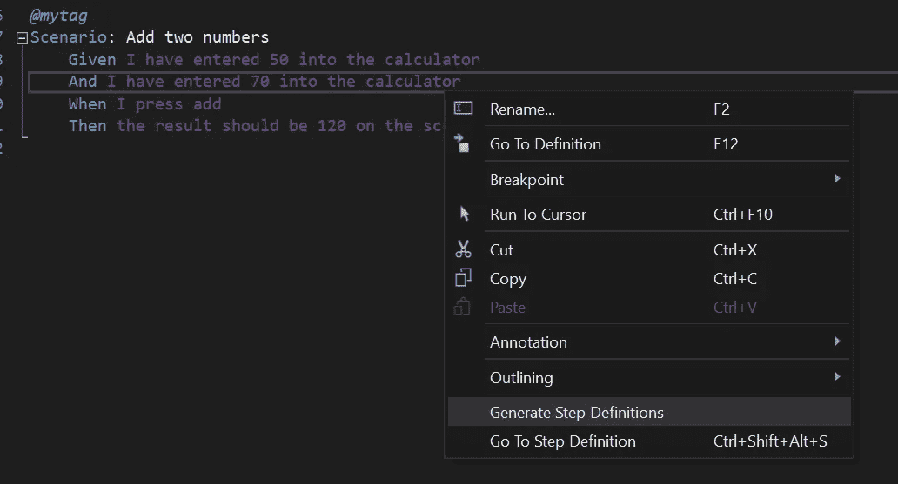

Specflow 生成步骤定义菜单项

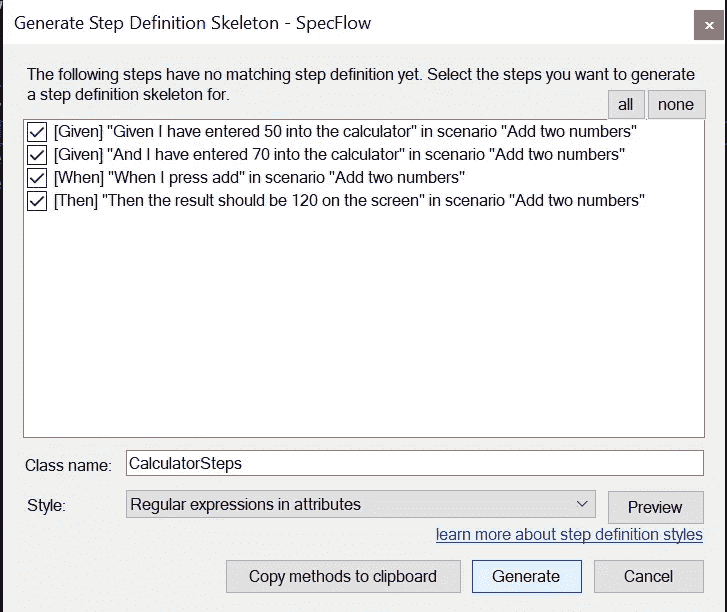

Specflow 生成步骤定义弹出窗口

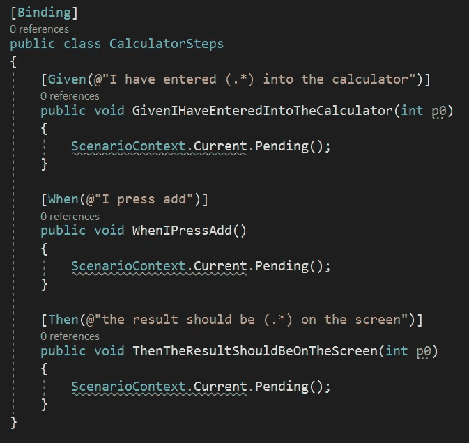

默认生成的 Specflow 步骤文件

现在，特征文件应该如下所示:

> 初始设置有点不稳定，所以您可能需要重新启动 visual studio 并进行一些重建，直到它看起来正确为止。

这里有几点:

*   白色的所有步骤意味着 SpecFlow 知道每个步骤要执行哪个代码。您可以右键单击它们并“转到步骤定义”来测试它的映射是否正确。
*   深灰色的数字表示这些是步进方法的参数。

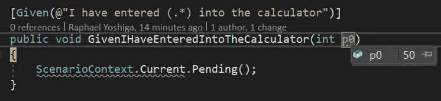

Specflow 知道如何通过在绑定字符串中执行正则表达式来接收参数，因此任何进入该字符串的内容(。*)位置将被转换为方法签名中定义的 int。您可以将多个参数接收到一个方法中，这些参数将根据顺序传递给该方法。参数名并不重要，所以可以随意添加有意义的名称。

场景。context . current . pending()；是测试失败的 SpecFlow 方式，因为这是待定的实现。

因此，如果我们开始链接，每一步代码应该做什么，我们应该得到这样的东西:

CalculatorSteps.cs

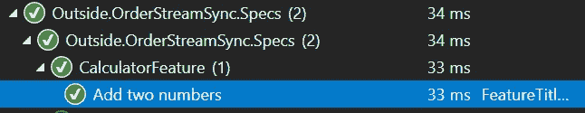

规格通过测试图片

## 更真实的规格流量测试

很好，我们的第一个基本测试运行并通过了！耶！

现在让我们开始接近生产测试的样子。假设我们有一个简单的需求，我们需要将订单从消息队列同步到我们的后台:

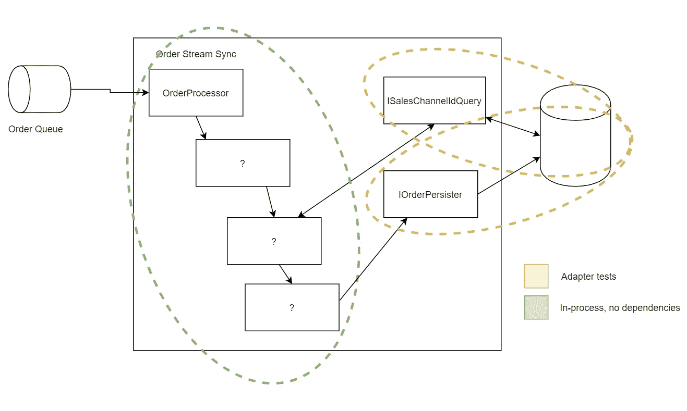

这里重要的一点是我们的测试范围，我们不一定预先知道将订单同步到数据库需要哪些类，但是我们知道我们的外部依赖性:

*   我们流程的 OrderProcessor 入口点
*   ISalesChannelQuery —根据描述获取销售渠道 id
*   IOrderPersister —将它插入数据库的类
*   ？我们还不知道我们的设计。

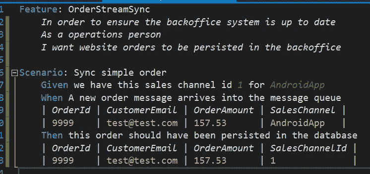

Specflow —依赖性测试示例

Specflow 依赖性测试示例默认步骤

测试完美地描述了，软件从外部世界接收到什么，以及期望向外部世界发送什么。

需要注意的其他事情是，我们使用了 Specflow 的一些更高级的概念，我们在给定的中使用了两个参数，其中一个是字符串(就像以前的 regex 一样)。

关于“何时”,我们对所有这些管道使用了一种奇怪的语法，那就是 SpecFlow 表。当您需要传递多个参数或多行时，这很有用。

双环 TDD 循环—图像[来源](http://myscribbledthoughts.info/page/a/atdd-tdd.html)

就像在双循环 TDD 中一样，我们将首先让验收测试失败，原因是正确的。

我们得到了这样的东西:

Specflow —依赖性测试实施步骤

我们失败的原因是正确的:

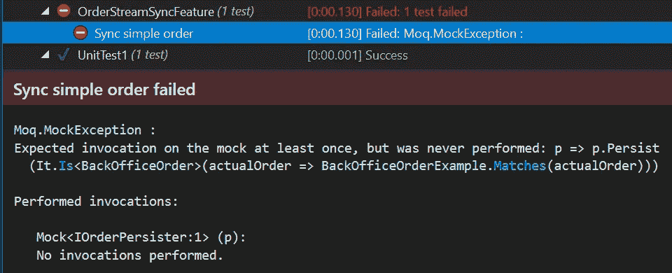

## 解释实施步骤:

“Given”是一种简单的类协作技术，我们正在存根销售渠道查询，以便在需要时返回正确的 id。

“何时”是您的“行为”，我们需要在测试中执行该行为，在这种情况下，它是软件入口点。你可以看到一张“桌子。创建实例”:

这就像 MVC 绑定一样，它通过反射基于属性名解析属性。如果表中有多行，可以使用 CreateSet 而不是 Create Instance。

对于“Then ”,你会看到我没有通过引用相等来处理参数名，所以我必须单独检查每个属性。这是因为不像单元测试，我不能访问存根对象创建。

模拟验证调用中比较属性的示例

## 履行

在很好地建立了规范之后，我们得到了驱动实现的测试，通过每个失败指出了实现中缺少的东西。为了不把博文延长太久，我就不一步一步来了。我按照步骤解释了这里的[和](https://medium.com/@raphaelyoshiga/practical-tdd-3-9a76b3e045d8)。你仍然可以在 [Github](https://github.com/RaphaelYoshiga/Outside.OrderStreamSync) 中看到最终的结果。

## 我的依赖关系是否被测试过？

如果你使用进程内无依赖的策略，那么我如何测试我的依赖呢？

例如，为了测试我们是否可以获得正确的销售渠道 id，我们必须在数据库中设置数据或者使用预先存在的数据，这样我们就可以在通过销售渠道描述进行查询时进行检查，然后获得预期的 id。

# 结论

对我来说，内存中的那些验收测试就像第一次发现 TDD，以前没有它我怎么工作？我如何测试我的应用程序？花了几个小时试图设置数据，这样我就可以检查特定的场景工作，或者修复那些测试会发现的明显错误。

我希望这篇文章能让你:

*   了解 ATDD 及其变体的基本概念
*   能够使用引导 Specflow 单元测试项目。网络核心
*   找到在日常工作中应用 ATDD 的切入点

干杯，为了更好的编程行业=)

## 参考

*   [示例代码](https://github.com/RaphaelYoshiga/Outside.OrderStreamSync)
*   在测试中，我用[的 Moq](https://www.nuget.org/packages/moq/) 表示模拟，用[的 Shouldly](https://github.com/shouldly/shouldly) 表示断言。

干杯，为了更好的编程行业=)

## 参考

*   [示例代码](https://github.com/RaphaelYoshiga/Outside.OrderStreamSync)
*   在测试中，我用 [Moq](https://www.nuget.org/packages/moq/) 表示模拟，用 [Shouldly](https://github.com/shouldly/shouldly) 表示断言。