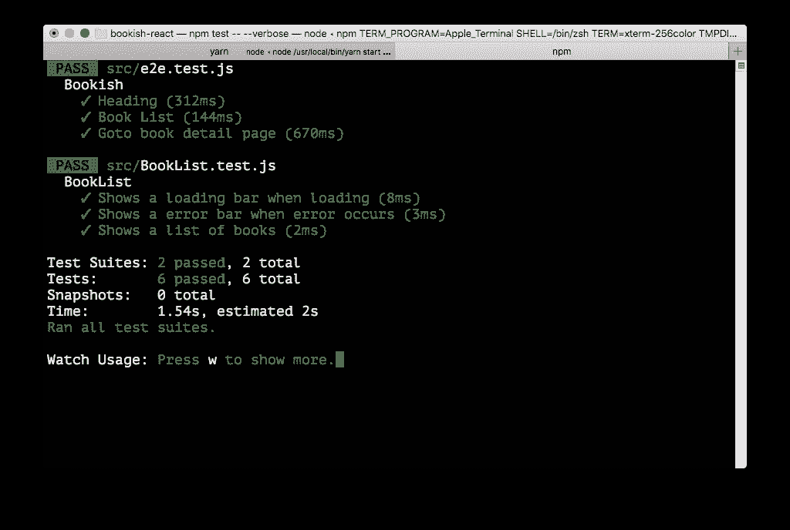
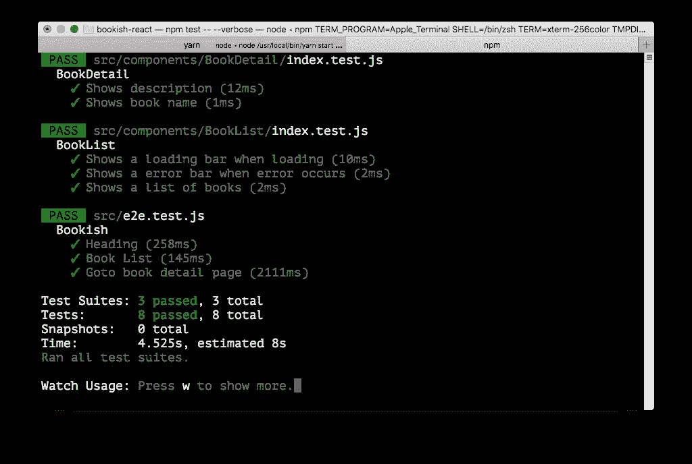
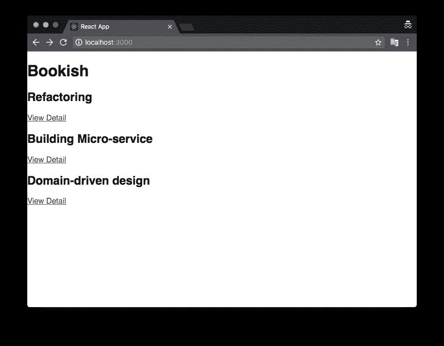
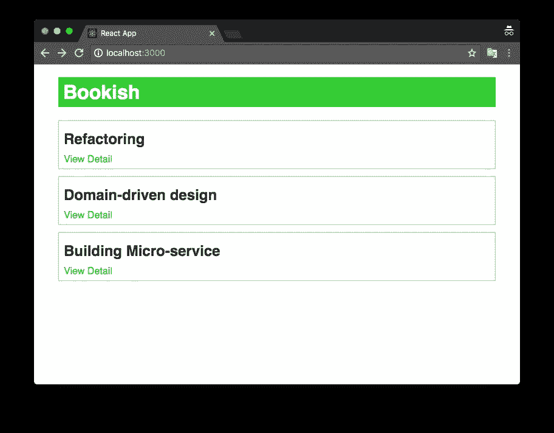
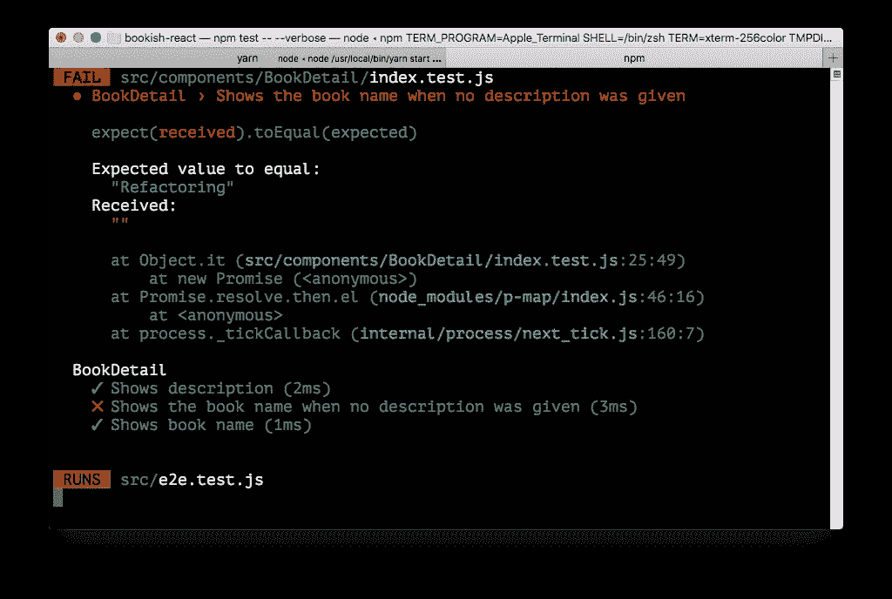

# 使用 React/Redux 的验收测试驱动开发—第 4 部分

> 原文：<https://itnext.io/acceptance-test-driven-development-with-react-redux-part-4-5db545953ed3?source=collection_archive---------2----------------------->

***更新 1*** : *本文是一个系列的一部分，查看完整系列:* [第一部分](https://medium.com/@juntao.qiu/acceptance-test-driven-test-with-react-redux-part-1-7ae8cb4fab00)、[第二部分](https://medium.com/@juntao.qiu/acceptance-test-driven-test-with-react-redux-part-2-127949a6e47e)、[第三部分](https://medium.com/@juntao.qiu/acceptance-test-driven-test-with-react-redux-part-3-903e1e58e706)、[第四部分](https://medium.com/@juntao.qiu/acceptance-test-driven-development-with-react-redux-part-4-5db545953ed3)和[第五部分](https://medium.com/@juntao.qiu/acceptance-test-driven-development-with-react-redux-part-5-995577d28eff)。

***更新 2*** :我出版了一本名为 [*用验收测试驱动开发构建 React 应用*](https://leanpub.com/build-react-app-with-atdd) 的书，涵盖了更多关于 ATDD 和 React 的话题和实践，[请查看](https://leanpub.com/build-react-app-with-atdd)！

# 书籍详细信息

对于图书列表中的每一项，我们希望有一个超链接，当用户点击这个链接时，浏览器将重定向到详细页面。详细页面包含更多详细内容，如图书封面图片、图书描述、评论等。


由 [SpaceX](https://unsplash.com/@spacex?utm_source=medium&utm_medium=referral) 在 [Unsplash](https://unsplash.com?utm_source=medium&utm_medium=referral) 上拍摄的照片

# 接收试验

我们可以把这个需求描述成这样一个验收测试:

```
test('Goto book detail page', async () => {
    await page.goto(`${appUrlBase}/`)
    await page.waitForSelector('a.view-detail') const links = await page.evaluate(() => {
      return [...document.querySelectorAll('a.view-detail')].map(el => el.getAttribute('href'))
    }) await Promise.all([
      page.waitForNavigation({waitUntil: 'networkidle2'}),
      page.goto(`${appUrlBase}${links[0]}`)
    ]) const url = await page.evaluate('location.href')
    expect(url).toEqual(`${appUrlBase}/books/1`)
  })
```

运行测试，它失败了。我们还没有`/books`路线，也没有链接。为了让测试通过，我们只需在`BookList`组件中添加一个超链接:

```
books.map(book => {
     return (<div className="book" key={book.id}>
       <h2 className="title">{book.name}</h2>
+          <a href={`/books/${book.id}`} className="view-detail">View Detail</a>
     </div>)
   })
 }
```

为了确保页面在导航后显示预期的内容，我们需要在`e2e.test.js`中添加这些行:

```
const url = await page.evaluate('location.href')
     expect(url).toEqual(`${appUrlBase}/books/1`)
+
+    await page.waitForSelector('.description')
+    const result = await page.evaluate(() => {
+      return document.querySelector('.description').innerText
+    })
+    expect(result).toEqual('Refactoring')
```

这确保页面有`.description`部分，并且它的内容是`Refactoring`。测试再次失败，让我们通过在应用程序中添加客户端路由来解决这个问题。

# 按指定路线发送

首先，我们需要添加`react-router`和`react-router-dom`作为依赖项，它们为我们提供客户端路由机制。

```
yarn add react-router react-router-dom
```

在`index.js`中，我们导入`BrowserRouter`并用它包装`<App />`。然后整个应用程序可以共享全局`Router`配置。

```
-ReactDOM.render(<App />, document.getElementById('root'));
+import {BrowserRouter as Router} from 'react-router-dom'
+
+ReactDOM.render(<Router>
+  <App />
+</Router>, document.getElementById('root'));
```

然后我们在`App.js`定义两条路线:

```
+import BookDetailContainer from './BookDetailContainer'
+
+import {Route} from 'react-router-dom'

 function App() {
   return (
     <div className="App">
       <h1>Bookish</h1>
-      <BookListContainer />
+      <main>
+        <Route exact path="/" component={BookListContainer} />
+        <Route path="/books/:id" component={BookDetailContainer} />
+      </main>
     </div>
   )
 }
```

最后，我们需要创建一个新文件`BookDetailContainer.js`，它与`BookListContainer.js`非常相似，除了书的`id`将通过`match.params.id`中的`react-router`传递。一旦我们有了 id，我们就可以发送 HTTP 请求来加载 book detail，并将获取代码放在`componentDidMount`钩子中:

```
import React, {Component} from 'react'
import axios from 'axios'class BookDetailContainer extends Component {
  constructor(props) {
    super(props)
    this.state = {
      book: {}
    }
  } componentDidMount() {
    const id = this.props.match.params.id
    axios.get(`http://localhost:8080/books/${id}`).then((res) => {
      this.setState({
        book: res.data
      })
    })
  } render() {
    const {book} = this.state
    return (<div className="detail">
      <div className="description">{book.description}</div>
    </div>)
  }
}export default BookDetailContainer
```

还有一点，我们需要在端到端测试的`beforeEach`块中为夹具添加`description`字段:

```
beforeEach(() => {
    const books = [
      {"name": "Refactoring", "id": 1, "description": "Refactoring"},
      {"name": "Domain-driven design", "id": 2, "description": "Domain-driven design"},
      {"name": "Building Micro-service", "id": 3, "description": "Building Micro-service"}
    ] return books.map(item => axios.post('http://localhost:8080/books', item, {headers: { 'Content-Type': 'application/json' }}))
  })
```

太好了，我们的测试通过了！



# 单元测试

在端到端测试中，我们只需确保页面中有一个`.description`部分。如果我们想要验证所有的字段都被正确地呈现在页面上，我们可以将它们添加到较低层次的测试单元测试中。单元测试运行速度快，检查比端到端测试更具体。

在我们为`BookDetailContainer`添加单元测试之前，让我们先做一个小的重构，因为`BookDetailContainer`是和`axios.get`结合在一起的，我们不想在单元级测试中涉及这个。

让我们先从`BookDetailContainer`中提取一个`BookDetail`组件:

```
import React from 'react'function BookDetail({book}) {
  return (<div className="detail">
    <div className="description">{book.description}</div>
  </div>)
}export default BookDetail
```

而`BookDetailContainer`的`render`方法则简化为:

```
render() {
    return <BookDetail {...this.state}/>
  }
```

现在我们可以轻松地在文件`BookDetail.test.js`中添加单元测试，并尝试驱动实现:

```
it('Shows book name', () => {
    const props = {
      book: {
        name: "Refactoring",
        description: "The book about how to do refactoring"
      }
    }
    const wrapper = shallow(<BookDetail {...props}/>)
    expect(wrapper.find('.name').text()).toEqual("Refactoring")
  })
```

实现可能非常容易:

```
import React from 'react'function BookDetail({book}) {
  return (<div className="detail">
    <h2 className="name">{book.name}</h2>
    <div className="description">{book.description}</div>
  </div>)
}export default BookDetail
```

# 文件结构

目前，文件结构非常扁平，根本没有层次结构，所有文件都在一个文件夹中。这是某种不好的味道，它让我们很难找到我们要找的东西，让我们重新构建它们。

```
src
├── App.css
├── App.js
├── BookDetail.js
├── BookDetail.test.js
├── BookDetailContainer.js
├── BookList.js
├── BookList.test.js
├── BookListContainer.js
├── e2e.test.js
├── index.css
├── index.js
└── setupTests.js
```

在`React`社区中，一种非常常见的组件分类模式是将它们分成`container`组件和`presentational`组件。而`container`组件负责获取和转换数据，而`presentational`组件只渲染外部传来的数据。

我们将所有的`containers`放到`containers`文件夹中，对于`presentational`组件，我们简单地将它们放到一个名为`components`的文件夹中:

```
src
├── App.css
├── App.js
├── components
│   ├── BookDetail
│   │   ├── index.js
│   │   └── index.test.js
│   └── BookList
│       ├── index.js
│       └── index.test.js
├── containers
│   ├── BookDetailContainer.js
│   └── BookListContainer.js
├── e2e.test.js
├── index.css
├── index.js
└── setupTests.js
```



# 用户界面

到目前为止，我们已经完成了两个有趣且具有挑战性的功能。但是用户界面过于简单和丑陋，让我们添加一些风格。



让我们在`App.css`中定义一些布局相关的东西:

```
.container {
    max-width: 720px;
    margin: 20px auto;
}h1 {
    background: limegreen;
    color: white;
    padding: 6px 8px;
}
```

然后在`BookList/index.css`中列出相关的书单样式

```
.book {
    border: 1px solid lightgreen;
    margin-bottom: 12px;
    padding: 6px 8px;
    box-shadow: 0 0 2px #ccc;
}h2 {
    margin: 10px 0;
    color: #333;
}.view-detail {
    color: limegreen;
    text-decoration: none;
}
```



# 处理默认值

嗯，有一个需求调整:由于后端服务提供的数据可能在一些字段中包含一些意外的空值。例如，不能保证`description`字段总是出现(它可能只是一个空字符串或 null 值)，在这种情况下，我们需要使用图书名称作为描述作为后备。

我们可以添加一个测试来描述这种情况，注意 props 对象根本不包含`description`字段:

```
it('Shows the book name when no description was given', () => {
    const props = {
      book: {
        name: "Refactoring"
      }
    }
    const wrapper = shallow(<BookDetail {...props}/>)
    expect(wrapper.find('.description').text()).toEqual("Refactoring")
  })
```

然后我们的测试又失败了:



我们可以通过条件运算符来解决这个问题:

```
function BookDetail({book}) {
  return (<div className="detail">
    <h2 className="name">{book.name}</h2>
    <div className="description">{book.description ? book.description : book.name}</div>
  </div>)
}
```

# 又一个变化

很快又有一个新的变化来了:如果`description`的长度大于 300，我们需要将内容截断到 300 个字符，并显示一个`show more...`链接。当用户单击该链接时，将显示完整的内容。

我们可以为这种情况添加一个新的测试:

```
it('Shows *more* link when description is too long', () => {
    const props = {
      book: {
        name: "Refactoring",
        description: "The book about how to do refactoring ...."
      }
    }
    const wrapper = shallow(<BookDetail {...props}/>)
    expect(wrapper.find('a.show-more').length).toEqual(1)
    expect(wrapper.find('.description').text()).toEqual("The book about how to do refactoring ....")
  })
```

这促使我们编写/修改代码以满足需求，一旦所有测试通过，我们就可以进行重构:提取新方法，创建新文件，移动方法/类，重命名变量或更改文件夹结构，等等。

这是一个无止境的过程，总会有一些改进，当我们有足够的时间时，我们可以一次又一次地保持这个过程，直到我们达到代码清晰和自我解释的程度。