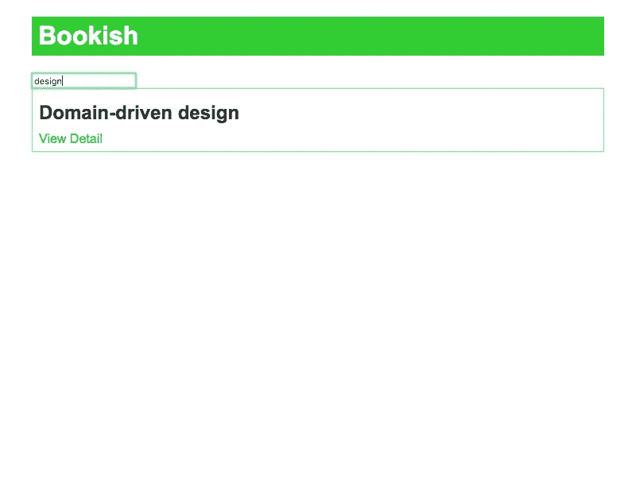
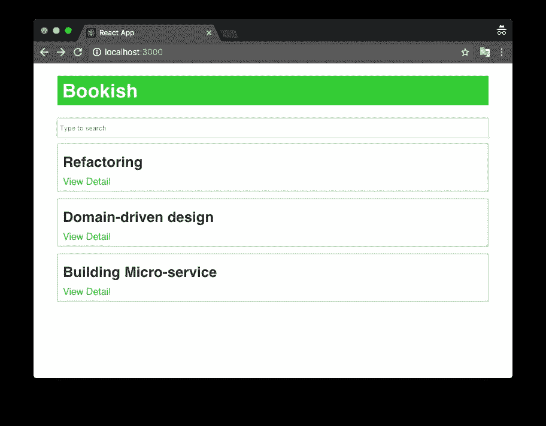

# 使用 React/Redux 的验收测试驱动开发—第 5 部分

> 原文：<https://itnext.io/acceptance-test-driven-development-with-react-redux-part-5-995577d28eff?source=collection_archive---------4----------------------->

***更新 1*** : *本文是一个系列的一部分，查看完整系列:* [第一部分](https://medium.com/@juntao.qiu/acceptance-test-driven-test-with-react-redux-part-1-7ae8cb4fab00)、[第二部分](https://medium.com/@juntao.qiu/acceptance-test-driven-test-with-react-redux-part-2-127949a6e47e)、[第三部分](https://medium.com/@juntao.qiu/acceptance-test-driven-test-with-react-redux-part-3-903e1e58e706)、[第四部分](https://medium.com/@juntao.qiu/acceptance-test-driven-development-with-react-redux-part-4-5db545953ed3)和[第五部分](https://medium.com/@juntao.qiu/acceptance-test-driven-development-with-react-redux-part-5-995577d28eff)。

***更新 2*** :我出版了一本名为 [*用验收测试驱动开发构建 React 应用*](https://leanpub.com/build-react-app-with-atdd) 的书，涵盖了更多关于 ATDD 和 React 的话题和实践，[请查看](https://leanpub.com/build-react-app-with-atdd)！

# 搜索

我们的第三个特性是用户可以通过名字搜索书籍。当图书列表变得很长时，这非常有用(当内容超过一个屏幕或一页时，用户很难找到他要找的内容)


[Sabri Tuzcu](https://unsplash.com/@sabrituzcu?utm_source=medium&utm_medium=referral) 在 [Unsplash](https://unsplash.com?utm_source=medium&utm_medium=referral) 上拍摄的“一张桌子的特写，上面有一台 iMac 和一部显示时间的智能手机”

# 接收试验

类似地，我们从编写一个`acceptance test`开始:

```
test('Show books which name contains keyword', async () => {
    await page.goto(`${appUrlBase}/`) const input = await page.waitForSelector('input.search')
    page.type('input.search', 'design') // await page.screenshot({path: 'search-for-design.png'});
    await page.waitForSelector('.book .title')
    const books = await page.evaluate(() => {
      return [...document.querySelectorAll('.book .title')].map(el => el.innerText)
    }) expect(books.length).toEqual(1)
    expect(books[0]).toEqual('Domain-driven design')
  })
```

我们尝试在`.search`输入框中键入关键字`design`，并期望只有`Domain-driven design`出现在图书列表中。

最简单的实现方法是修改`BookListContainer`并添加一个`input`:

```
render() {
    return (
      <div>
        <input type="text" className="search" placeholder="Type to search" />
        <BookList {...this.state}/>
      </div>
    )
  }
```

然后为`input`组件定义一个`change`事件的处理方法:

```
filterBook(e) {
    this.setState({
      term: e.target.value
    }) axios.get(`http://localhost:8080/books?q=${e.target.value}`).then(res => {
      this.setState({
        books: res.data,
        loading: false
      })
    }).catch(err => {
      this.setState({
        loading: false,
        error: err
      })
    })
  }
```

并将其绑在`input`组件上:

```
<input type="text" className="search" placeholder="Type to search" onChange={this.filterBook}
               value={this.state.term}/>
```



请注意，我们使用`books?q=${e.target.value}`作为获取数据的 URL，这是由`json-server`提供的全文搜索 API，你只需要将`books?q=domain`发送到后端，它将返回所有包含`domain`的内容。

您可以像这样在命令行上尝试:

```
curl [http://localhost:8080/books?q=domain](http://localhost:8080/books?q=domain)
```

现在我们的测试又变绿了。让我们跳到`Red-Green-Refactoring`的下一步。

# 重构

显然，`filterBook`与`componentDidMount`中的代码几乎相同，我们可以提取一个函数`fetchBooks`来消除重复:

```
componentDidMount() {
    this.fetchBooks()
  } fetchBooks() {
    const {term} = this.state
    axios.get(`http://localhost:8080/books?q=${term}`).then(res => {
      this.setState({
        books: res.data,
        loading: false
      })
    }).catch(err => {
      this.setState({
        loading: false,
        error: err
      })
    })
  } filterBook(e) {
    this.setState({
      term: e.target.value
    }, this.fetchBooks)
  }
```

Emm，比以前好。由于`fetchBooks`将网络请求和`state`的变化结合在一起，我们可以将它们分成定义 2 个功能:

```
updateBooks(res) {
    this.setState({
      books: res.data,
      loading: false
    })
  } updateError(err) {
    this.setState({
      loading: false,
      error: err
    })
  } fetchBooks() {
    const {term} = this.state
    axios.get(`http://localhost:8080/books?q=${term}`).then(this.updateBooks).catch(this.updateError)
  } filterBook(e) {
    this.setState({
      term: e.target.value
    }, this.fetchBooks)
  }
```

现在代码变得清晰易读了。

# 更进一步

比方说，别人可能想在他自己的页面上使用我们刚刚完成的搜索框，我们该如何重用它？实际上，这非常困难，因为当前搜索框与`BookListContainer`中的 rest 代码紧密相关，我们需要提取到另一个组件`SearchBox`:

```
import React from 'react'function SearchBox({term, onChange}) {
  return (<input type="text" className="search" placeholder="Type to search" onChange={onChange}
                 value={term}/>)
}export default SearchBox
```

提取后，`BookListContainer`的`render`方法变为:

```
render() {
    return (
      <div>
        <SearchBox term={this.state.term} onChange={this.filterBook} />
        <BookList {...this.state}/>
      </div>
    )
  }
```

对于单元测试，我们可以简单地这样测试:

```
import React from 'react'
import {shallow} from 'enzyme'
import SearchBox from './SearchBox'describe('SearchBox', () => {
  it('Handle searching', () => {
    const onChange = jest.fn()
    const props = {
      term: '',
      onChange
    } const wrapper = shallow(<SearchBox {...props}/>)
    expect(wrapper.find('input').length).toEqual(1) wrapper.simulate('change', 'domain')

    expect(onChange).toHaveBeenCalled()
    expect(onChange).toHaveBeenCalledWith('domain')
  })
})
```

注意，我们使用`jest.fn()`来创建一个`spy`对象，它可以记录调用的轨迹。我们使用`enzyme`提供的`simulate` API 来模拟一个`change`事件，以`domain`作为它的有效负载。然后，我们可以期待`onChange`方法已经被数据`domain`调用。

现在我们注意到`SearchBox`只是一个演示组件，我们可以将它移动到`components`文件夹:

```
src
├── App.css
├── App.js
├── components
│   ├── BookDetail
│   │   ├── index.js
│   │   └── index.test.js
│   ├── BookList
│   │   ├── index.css
│   │   ├── index.js
│   │   └── index.test.js
│   └── SearchBox
│       ├── index.js
│       └── index.test.js
├── containers
│   ├── BookDetailContainer.js
│   └── BookListContainer.js
├── e2e.test.js
├── index.css
├── index.js
└── setupTests.js
```


# 一些风格更新

```
.search {
    box-sizing: border-box;
    width: 100%;
    padding: 2px 4px;
    height: 32px;
}
```

现在我们的用户界面看起来很像一个真正的应用程序:



此外，让我们重组`container`文件夹，使其与`component`文件夹保持一致:

```
src
├── App.css
├── App.js
├── components
│   ├── BookDetail
│   │   ├── index.js
│   │   └── index.test.js
│   ├── BookList
│   │   ├── index.css
│   │   ├── index.js
│   │   └── index.test.js
│   └── SearchBox
│       ├── index.css
│       ├── index.js
│       └── index.test.js
├── containers
│   ├── BookDetailContainer
│   │   └── index.js
│   └── BookListContainer
│       └── index.js
├── e2e.test.js
├── index.css
├── index.js
└── setupTests.js
```

我们在每个文件夹中定义了一个`index.js`,然后您可以简单地通过文件夹名称导入它，就像

```
import BookListContainer from "./containers/BookListContainer/"
```

否则，您可能会看到路径中的一些重复，如下所示:

```
import BookListContainer from "./containers/BookListContainer/BookListContainer"
```

太好了，我们已经完成了所有 3 个功能！让我们看看这里有什么:

*   3 表示组件(BookDetail、BookList、SearchBox)及其单元测试
*   2 个容器组件(BookDetailContainer、BookListContainer)
*   3 个验收测试，涵盖最有价值的路径(列表、细节和搜索)