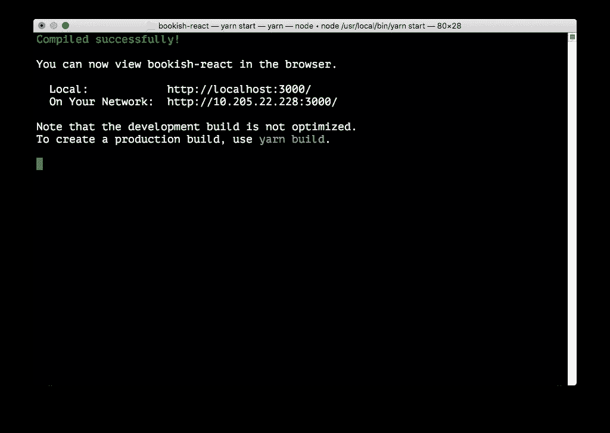
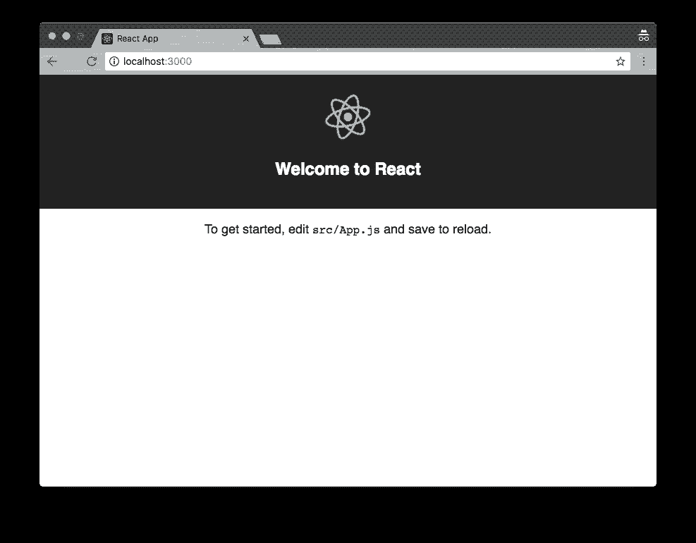
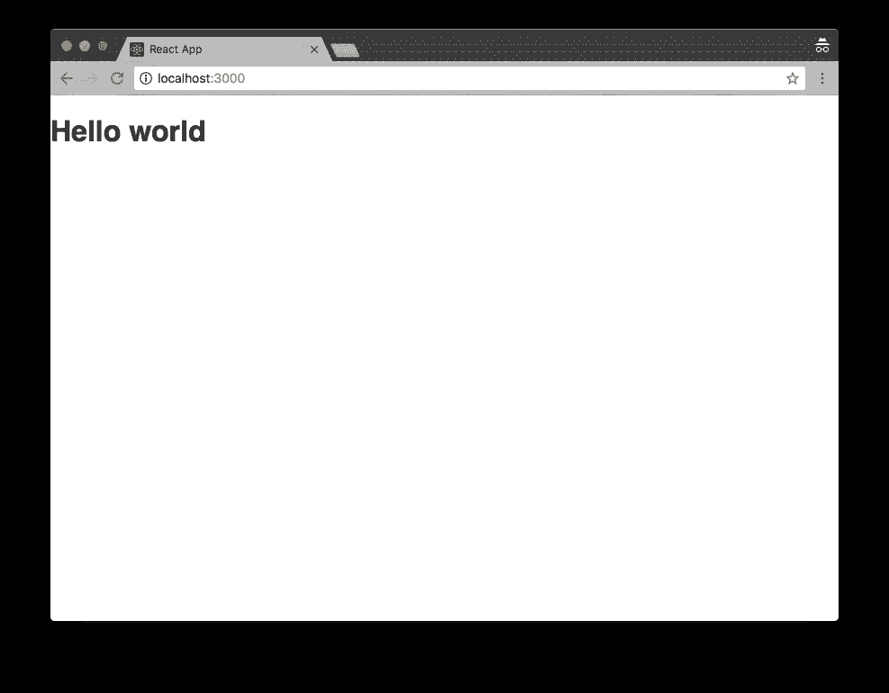
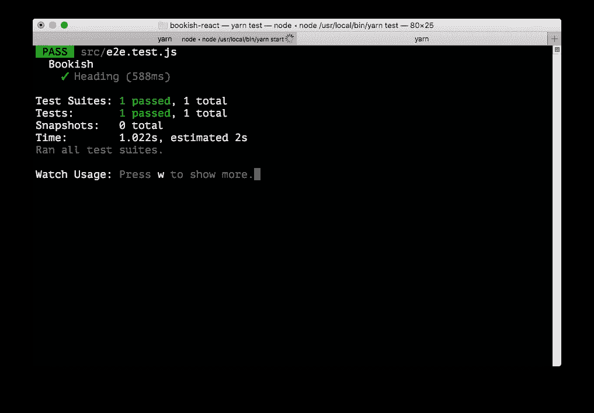

# 使用 React/Redux 的验收测试驱动开发—第 2 部分

> 原文：<https://itnext.io/acceptance-test-driven-test-with-react-redux-part-2-127949a6e47e?source=collection_archive---------3----------------------->


[安德鲁·尼尔](https://unsplash.com/@andrewtneel?utm_source=medium&utm_medium=referral)在 [Unsplash](https://unsplash.com?utm_source=medium&utm_medium=referral) 上发表的“一个带着笔记本电脑、记事本、智能手机和一杯咖啡的平板电脑”

***更新 1*** : *本文是一个系列的一部分，查看完整系列:* [第一部分](https://medium.com/@juntao.qiu/acceptance-test-driven-test-with-react-redux-part-1-7ae8cb4fab00)、[第二部分](https://medium.com/@juntao.qiu/acceptance-test-driven-test-with-react-redux-part-2-127949a6e47e)、[第三部分](https://medium.com/@juntao.qiu/acceptance-test-driven-test-with-react-redux-part-3-903e1e58e706)、[第四部分](https://medium.com/@juntao.qiu/acceptance-test-driven-development-with-react-redux-part-4-5db545953ed3)和[第五部分](https://medium.com/@juntao.qiu/acceptance-test-driven-development-with-react-redux-part-5-995577d28eff)。

***更新 2*** :我出版了一本名为 [*用验收测试驱动开发构建 React 应用*](https://leanpub.com/build-react-app-with-atdd) 的书，涵盖了更多关于 ATDD 和 React 的话题和实践，[请查看](https://leanpub.com/build-react-app-with-atdd)！

# 包装管理

让我们先从一些简单的包安装和配置开始。确保您已经在本地安装了`node.js`，之后，您可以使用`npm`来安装构建我们的`Bookish`应用程序所需的工具:

```
npm install yarn create-react-app --global
```

# 创建-反应-应用

安装完成后，我们可以使用脸书提供的`create-react-app`来创建我们的项目:

```
create-react-app bookish-react
```

`create-react-app`会默认帮我们安装`react`、`react-dom`和一个名为`react-scripts`的命令行工具。并且它会自动下载那些库和它们的依赖项，比如`webpack`、`babel`等等。通过使用`create-react-app`,我们基本上可以进行零配置来启动和运行应用程序。

创建完成后，按照控制台日志的建议，我们需要跳转到`bookish-react`文件夹，并运行`yarn start`:

```
cd bookish-react
yarn start
```



并且将会有一个新的浏览器标签自动打开，地址为`http://localhost:3000`，用户界面应该是这样的:



# 项目结构

我们不需要所有由`create-react-app`生成的文件，让我们先做一些清理工作。我们可以这样删除`src`文件夹中所有不相关的文件:

```
src
├── App.css
├── App.js
├── index.css
└── index.js
```

并按如下方式修改文件内容:

```
import React, { Component } from 'react';
-import logo from './logo.svg';
 import './App.css';

 class App extends Component {
   render() {
     return (
       <div className="App">
-        <header className="App-header">
-          
-          <h1 className="App-title">Welcome to React</h1>
-        </header>
-        <p className="App-intro">
-          To get started, edit <code>src/App.js</code> and save to reload.
-        </p>
+        <h1>Hello world</h1>
       </div>
     );
   }import React from 'react';
 import ReactDOM from 'react-dom';
 import './index.css';
 import App from './App';
-import registerServiceWorker from './registerServiceWorker';

-ReactDOM.render(<App />, document.getElementById('root'));
-registerServiceWorker();
+ReactDOM.render(<App />, document.getElementById('root'));
```

也清理 CSS 文件内容:

```
- .App {
-   text-align: center;
- }
-
-.App-logo {
-  animation: App-logo-spin infinite 20s linear;
-  height: 80px;
-}
-
-.App-header {
-  background-color: #222;
-  height: 150px;
-  padding: 20px;
-  color: white;
-}
-
-.App-title {
-  font-size: 1.5em;
-}
-
-.App-intro {
-  font-size: large;
-}
-
-@keyframes App-logo-spin {
-  from { transform: rotate(0deg); }
-  to { transform: rotate(360deg); }
-}
```

然后我们得到了这样的用户界面:



# 操纵木偶的人

之后，我们需要首先设置`acceptance tests`环境。在本书中，我们将使用`Puppeteer`来做 UI 测试。来自 Google 的`Puppeteer`是建立在 Headless Chrome 之上的，它提供了很多 API 来做 DOM 操作、JavaScript 评估，这些可以用来运行`UI`测试。

首先，我们需要在本地安装它:

```
yarn add puppeteer --dev
```

使用`--dev`选项意味着我们只是将它作为开发阶段的依赖项添加，我们不想将它包含在生产代码中。

# 我们的第一个 2 端测试

TDD 最困难的事情可能是从哪里开始，我们如何编写第一个测试？

我们的第一个测试可能是:

*   确保页面上有一个`Heading`元素，内容是`Bookish`

乍一看，这个测试看起来毫无用处，但实际上，它可以确保:

*   前端代码可以编译和翻译
*   浏览器可以正确地呈现我们的页面(没有任何脚本错误)

因此，首先我们创建一个包含以下内容的文件`e2e.test.js`:

```
import puppeteer from 'puppeteer'const appUrlBase = 'http://localhost:3000'let browser
let pagebeforeAll(async () => {
  browser = await puppeteer.launch({})
  page = await browser.newPage()
})describe('Bookish', () => {
  test('Heading', async () => {
    await page.goto(`${appUrlBase}/`)
    await page.waitForSelector('h1')
    const result = await page.evaluate(() => {
      return document.querySelector('h1').innerText
    }) expect(result).toEqual('Bookish')
  })
})afterAll(() => {
  browser.close()
})
```

我知道这看起来有点吓人，但实际上很简单。我们一块一块来回顾一下。

```
import puppeteer from 'puppeteer'
```

首先，我们导入`puppeteer`，然后指定`devServer`地址，因此`Puppeteer`知道是否访问应用程序

```
const appUrlBase = 'http://localhost:3000'
```

在`beforeAll`钩子中，我们以`headless`模式启动 Chrome:

```
beforeAll(async () => {
  browser = await puppeteer.launch({})
  page = await browser.newPage()
})
```

然后停在`afterAll`钩上。

```
afterAll(() => {
  browser.close()
})
```

## 异步和等待

注意这里我们将`beforeAll`中的匿名函数标记为`async`，并在`puppeteer.launch()`前放置一个`await`关键字。

`async`和`await`是 ES6 语法，可以使 JavaScript 中的异步编程更加容易。让我们看一个简单的例子:

```
function fetchContactById(id) {
  return fetch(`http://localhost:8080/contacts/${id}`).then((response) => {
    return response.json()
  })
}
```

在函数`fetchContactById`中，我们使用`fetch`发送 http 请求并返回 json 响应(作为一个`Promise`对象)。然后我们可以通过以下方式消费这个`Promise`对象:

```
function main() {
  fetchContactById(1).then((contact) => {
    console.log(contact.name)
  })  
}
```

但是通过使用`async/await`，我们可以简单地定义一个`variable`来等待函数调用的返回——进程被阻塞——一旦底层的`Promise`被解析，contact 就有了正确的值，控制进程返回并对`console.log`进行求值。

```
async function main() {
  const contact = await fetchContactById(1)
  console.log(contact.name)
}
```

你可能会说没有太大的区别，但是如果我们稍微增强一下上面的例子，比如说，通过添加另一个 API 调用`fetchUserById`，我们需要该 API 的返回值来发送`fetchContactById`:

```
function fetchUserById(id) {
  return fetch(`http://localhost:8080/users/${id}`).then((response) => {
    return response.json()
  })  
}
```

然后代码变成了这样:

```
function main() {
  fetchUserById('juntao').then((user) => {
    fetchContactById(user.id).then((contact) => {
      console.log(contact.name)
    })
  })
}
```

如果一个接一个地发送请求，缩进可能会不断增加，但是通过使用`await/async`对，代码将会非常清楚，如下所示:

```
async function amain() {
  const user = await fetchUserById('juntao')
  const contact = await fetchContactById(user.id)
  console.log(contact.name)
}
```

那就紧凑利落多了！

然后让我们来看看主程序块:

```
describe('Bookish', () => {
  test('Heading', async () => {
    await page.goto(`${appUrlBase}/`)
    await page.waitForSelector('h1')
    const result = await page.evaluate(() => {
      return document.querySelector('h1').innerText
    }) expect(result).toEqual('Bookish')
  })
})
```

在测试用例中，我们使用`puppeteer`访问端口`3000`，等待`h1`出现，然后调用`evaluate`调用原生 DOM 脚本:

```
document.querySelector('h1').innerText
```

一旦我们得到了`h1`的内容，我们就可以做一个断言:

```
expect(result).toEqual('Bookish')
```

由于`create-react-app`已经在中构建了`jest`测试框架，我们可以简单地运行以下命令来运行测试:

```
yarn test
```

当然，我们还没有任何实现，测试失败了:


还记得`red-green-refactor`周期吗？既然测试现在失败了(红色)，我们应该让它先通过。我们可以简单地修改`h1`到`Bookish`中的内容:

```
class App extends Component {
  render() {
    return (
      <div className="App">
        <h1>Bookish</h1>
      </div>
    );
  }
}
```



太好了，测试通过了。循环往复，emm，重构。但是现在，看起来没问题，所以我们可以跳过这个。

# 将代码提交到 CVS

好了，我们现在有了一个验收测试及其实现，我们可以将代码放入版本控制中，以防将来需要回顾。

```
git init
```

在本地提交

```
git add .
git commit -m "make the first e2e test pass"
```

现在看看我们得到了什么:

*   运行验收测试
*   一个页面可以把`Bookish`渲染成一个`heading`

太好了，我们可以开始真正的需求实现了。