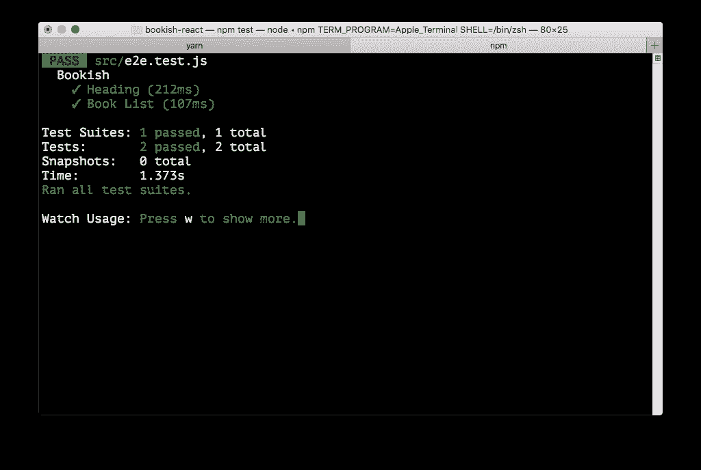
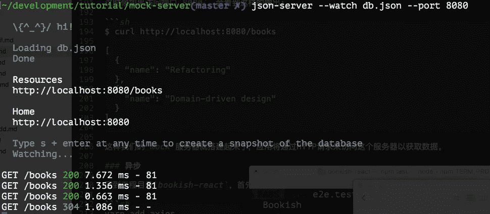
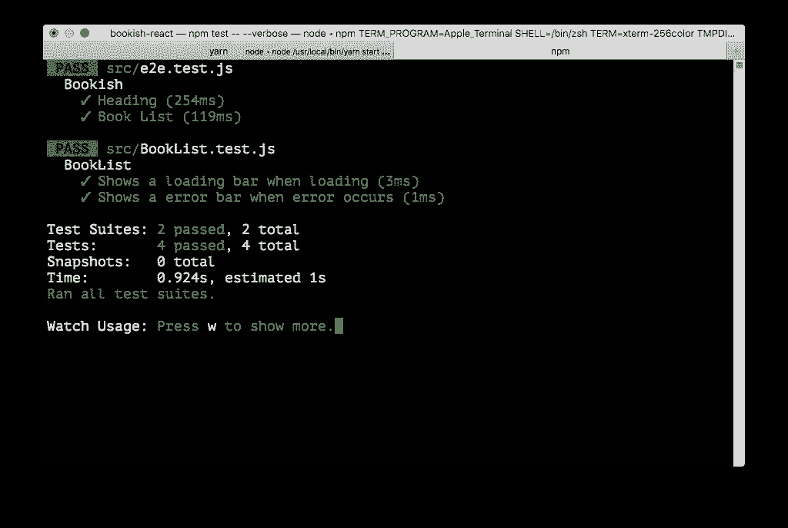
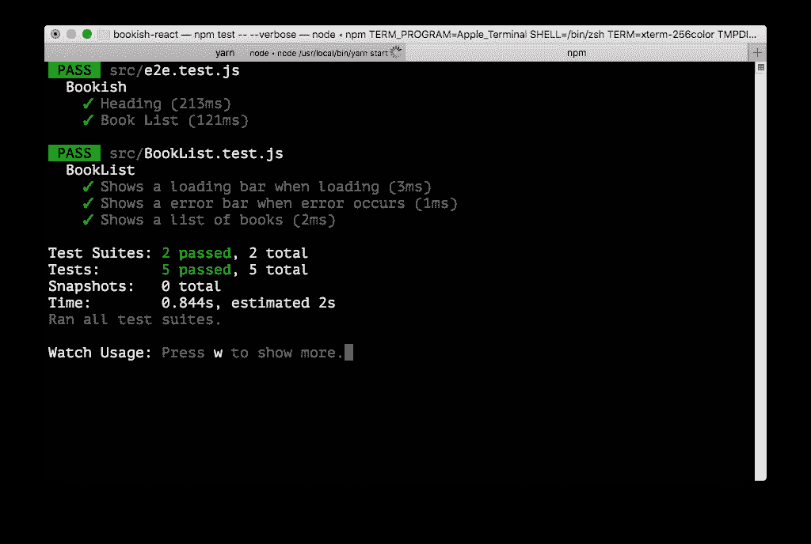

# 使用 React/Redux 的验收测试驱动开发—第 3 部分

> 原文：<https://itnext.io/acceptance-test-driven-test-with-react-redux-part-3-903e1e58e706?source=collection_archive---------4----------------------->


"佳能相机部件的零件拆卸或等待安排在良好的状态."在 [Unsplash](https://unsplash.com?utm_source=medium&utm_medium=referral) 上由 [Vadim Sherbakov](https://unsplash.com/@madebyvadim?utm_source=medium&utm_medium=referral)

***更新 1*** : *本文是一个系列的一部分，查看完整系列:* [第一部分](https://medium.com/@juntao.qiu/acceptance-test-driven-test-with-react-redux-part-1-7ae8cb4fab00)、[第二部分](https://medium.com/@juntao.qiu/acceptance-test-driven-test-with-react-redux-part-2-127949a6e47e)、[第三部分](https://medium.com/@juntao.qiu/acceptance-test-driven-test-with-react-redux-part-3-903e1e58e706)、[第四部分](https://medium.com/@juntao.qiu/acceptance-test-driven-development-with-react-redux-part-4-5db545953ed3)和[第五部分](https://medium.com/@juntao.qiu/acceptance-test-driven-development-with-react-redux-part-5-995577d28eff)。

***更新 2*** :我出版了一本名为 [*用验收测试驱动开发构建 React 应用*](https://leanpub.com/build-react-app-with-atdd) 的书，涵盖了更多关于 ATDD 和 React 的话题和实践，[请查看](https://leanpub.com/build-react-app-with-atdd)！

我们的第一个要求是制定一个书单。从验收测试的角度来看，我们需要做的就是确保页面包含一个图书列表，我们不需要担心我们将使用什么技术来实现页面，只要测试通过，页面是动态生成的还是静态的 HTML 并不重要。

# 书单

我们需要在`e2e.test.js`中添加一个测试用例，如下所示:

```
expect(result).toEqual('Bookish')
   })
+
+  test('Book List', async () => {
+    await page.goto(`${appUrlBase}/`)
+    await page.waitForSelector('.books')
+    const books = await page.evaluate(() => {
+      return [...document.querySelectorAll('.book .title')].map(el => el.innerText)
+    })
+
+    expect(books.length).toEqual(2)
+  })
 })

 afterAll(() => {
```

我们期望有一个包含几个`.book`元素的`.books`容器，而`.book`包含一个`.title`元素。现在，如果我们运行测试，它将失败。根据`TDD`原理，我们可以快速实现，修改`App.js`如下:

```
return (
       <div className="App">
         <h1>Bookish</h1>
+        <div className="books">
+          <div className="book">
+            <h2 className="title"></h2>
+          </div>
+          <div className="book">
+            <h2 className="title"></h2>
+          </div>
+        </div>
       </div>
     );
   }
```

# 图书名称

很好，测试现在通过了，如你所见，我们已经通过测试用*驱动了*HTML 结构，现在我们可以添加另一个期望:

```
})

     expect(books.length).toEqual(2)
+    expect(books[0]).toEqual('Refactoring')
+    expect(books[1]).toEqual('Domain-driven design')
   })
 })
```

要通过测试，最简单的方法仍然是使用硬代码:

```
<div className="books">
           <div className="book">
-            <h2 className="title"></h2>
+            <h2 className="title">Refactoring</h2>
           </div>
           <div className="book">
-            <h2 className="title"></h2>
+            <h2 className="title">Domain-driven design</h2>
           </div>
         </div>
       </div>
```

太棒了，我们的测试又通过了。



现在该看一下代码了，看看有没有代码味，有就做相应的重构。首先，我们发现将所有的`.book`放在方法`render`中可能不是一个好主意，我们可以使用 for 循环来生成这个 HTML。

# 重构

我们可以定义一个名为`renderBooks`的新函数，然后使用`map`来生成列表

```
renderBooks(books) {
    return (<div className="books">
      {
        books.map(book => {
          return (<div className="book">
            <h2 className="title">{book.name}</h2>
          </div>)
        })
      }
    </div>)
  }
```

当调用它时，我们需要传递一个 book 对象数组:

```
render() {
    const books = [{ name: 'Refactoring' }, { name: 'Domain-driven design' }]
    return (
      <div className="App">
        <h1>Bookish</h1>
        {this.renderBooks(books)}
      </div>
    );
  }
```

我们的测试仍然通过。也就是说，我们使我们的内部实现变得更好，但不修改外部行为，这只是 TDD 提供的好处之一:重构更容易、更安全。

# 再次重构

现在的代码比以前更简洁明了，但还可以做得更好。通过应用`Componentization`，抽象的粒度应该基于`component`而不是`function`。例如，现在我们使用函数`renderBooks`将传递的数组呈现给图书列表，我们应该抽象出一个名为`BookList`的组件，并创建一个文件`BookList.js`，如下所示:

```
import React from 'react'function BookList({books}) {
  return (<div className="books">
    {
      books.map(book => {
        return (<div className="book">
          <h2 className="title">{book.name}</h2>
        </div>)
      })
    }
  </div>)
}export default BookList
```

现在我们可以像使用`div`或`h1`内置组件一样使用这个定制组件:

```
render() {
    const books = [{ name: 'Refactoring' }, { name: 'Domain-driven design' }]
    return (
      <div className="App">
        <h1>Bookish</h1>
        <BookList books={books} />
      </div>
    );
  }
```

通过进行这种重构，我们的代码变得更具声明性，也更容易理解。此外，我们的测试仍然是`green`。

# 网络

一般来说，书单的数据不会硬编码在代码中。在现实生活中，这些数据存储在远程的某个地方，需要在应用程序启动时获取。为了让我们的应用程序以这种方式工作，我们至少应该完成以下任务:

*   配置一个模拟服务器来提供我们需要的书籍数据
*   使用客户端网络库`axios`从模拟服务器获取数据
*   使用获取的数据来呈现我们的组件

# 模拟服务器

模拟服务器在开发过程中被广泛使用，这里我们将介绍`json-server`作为我们的模拟服务器。这是一个非常轻量级且易于上手的包。

首先，我们需要在全球范围内安装它:

```
npm install json-server --global
```

并创建一个名为`mock-server`的空文件夹

```
mkdir -p mock-server
cd mock-server
```

然后用以下内容创建一个`db.json`文件:

```
{
  "books": [{ "name": "Refactoring" }, { "name": "Domain-driven design" }]
}
```

该文件定义了`route`和该`route`的数据，现在我们可以通过以下方式启动服务器:

```
json-server --watch db.json --port 8080
```

如果您打开浏览器访问`http://localhost:8080/books`，您应该会看到类似这样的内容:

```
[
  {
    "name": "Refactoring"
  },
  {
    "name": "Domain-driven design"
  }
]
```

当然，您可以使用`curl`从命令行获取它:

```
$ curl http://localhost:8080/books[
  {
    "name": "Refactoring"
  },
  {
    "name": "Domain-driven design"
  }
]
```

现在我们的模拟服务器已经启动并运行，应用程序现在可以通过 HTTP 获取这些数据。

# 异步请求

回到应用程序文件夹`bookish-react`，为了发送请求并获取数据，我们需要将`axios`安装到我们的项目中:

```
yarn add axios
```

然后我们可以用它来获取`App.js`中的数据:

```
class App extends Component {
+  constructor(props) {
+    super(props)
+    this.state = {
+      books: []
+    }
+  }
+
+  componentDidMount() {
+    axios.get('http://localhost:8080/books').then(res => {
+      this.setState({
+        books: res.data
+      })
+    })
+  }
+
   render() {
-    const books = [{ name: 'Refactoring' }, { name: 'Domain-driven design' }]
+    const {books} = this.state
     return (
       <div className="App">
```

您可以看到来自模拟服务器的控制台日志，到达了`books` API:



# 安装和拆卸

现在让我们看看代码和测试，有一个隐含的假设:测试知道实现将返回 2 本书。唯一的问题是这个假设使得测试看起来不那么直接:为什么我们期待的是`expect(books.length).toEqual(2)`，而不是`3`？为什么那两本书是`Refactoring`和`Domain-driven design`？这种假设应该避免，或者应该在测试中明确定义。

在每次测试运行之前，我们应该创建一些 fixture 数据，并在每次测试之后清除它们。

实际上`json-server`提供了一种程序化的启动方式。以编程的方式，我们可以通过一些代码来定义模拟服务器的行为。

就这么办吧。在文件夹`mock-server`中，创建一个名为`server.js`的文件，并在其中添加一些`middlewares`:

```
server.use((req, res, next) => {
  if(req.method === 'DELETE' && req.query['_cleanup']) {
    const db = router.db
    db.set(req.entity, []).write()
    res.sendStatus(204)
  } else {
    next()  
  }
})
```

这个函数可以基于 HTTP 请求方法和查询字符串执行一些操作。如果请求是一个`DELETE`方法，并且查询字符串中有一个`_cleanup`参数，那么我们将清理请求所请求的实体。比如说。当您使用`DELETE`访问`http://localhost:8080/books?_cleanup=true`时，该功能会将`books`置空。

之后，您可以通过以下命令启动服务器:

```
node server.js
```

模拟服务器代码的完整版本[存放在这里](https://github.com/abruzzi/react-tdd-mock-server)。一旦我们有了这个中间件，我们就可以在我们的测试设置和拆卸挂钩中使用它:

```
afterEach(() => {
    return axios.delete('http://localhost:8080/books?_cleanup=true').catch(err => err)
  }) beforeEach(() => {
    const books = [
      {"name": "Refactoring", "id": 1},
      {"name": "Domain-driven design", "id": 2}
    ] return books.map(item => axios.post('http://localhost:8080/books', item, {headers: { 'Content-Type': 'application/json' }}))
  })
```

在每次测试之前，我们通过将两本书`POST`到 URL: `http://localhost:8080/books`来将它们插入到模拟服务器中，并且在每次测试之后，我们通过将`DELETE`请求发送到端点`'http://localhost:8080/books?_cleanup=true'`来清理它们。

```
beforeEach(() => {
    const books = [
      {"name": "Refactoring", "id": 1},
      {"name": "Domain-driven design", "id": 2},
      {"name": "Building Micro-service", "id": 3}
    ] return books.map(item => axios.post('http://localhost:8080/books', item, {headers: { 'Content-Type': 'application/json' }}))
  })
```

现在我们可以随意修改设置中的数据，比如说，添加另一本书`Building Micro-service`，并期望在测试中得到`3`本书:

```
test('Book List', async () => {
    await page.goto(`${appUrlBase}/`)
    await page.waitForSelector('.books')
    const books = await page.evaluate(() => {
      return [...document.querySelectorAll('.book .title')].map(el => el.innerText)
    }) expect(books.length).toEqual(3)
    expect(books[0]).toEqual('Refactoring')
    expect(books[1]).toEqual('Domain-driven design')
    expect(books[2]).toEqual('Building Micro-service')
  })
```

# 装载指示器

我们的应用程序正在远程获取数据，不能保证数据会立即返回。如果我们的用户在一些高遗留环境中使用这个应用程序，我们希望有一些指示器显示，使用户体验更好。此外，当根本没有网络连接(或超时)时，我们需要显示一些错误消息。

在我们开始将它添加到代码中之前，让我们想象一下如何模拟这两种场景:

*   缓慢的请求
*   失败请求

不幸的是，这两个场景都不容易模拟，即使我们可以做到，我们也必须将测试与代码紧密耦合。让我们仔细考虑一下我们想要做什么:组件有 3 种状态(加载、错误、成功)，所以如果我们可以测试这 3 种状态下的行为，那么我们就可以确保我们的组件是好的。

# 首先重构

为了让测试更容易编写，我们需要先做一点重构。看一看`App.js`:

```
import BookList from './BookList'class App extends Component {
  constructor(props) {
    super(props)
    this.state = {
      books: []
    }
  } componentDidMount() {
    axios.get('http://localhost:8080/books').then(res => {
      this.setState({
        books: res.data
      })
    })
  } render() {
    const {books} = this.state
    return (
      <div className="App">
        <h1>Bookish</h1>
        <BookList books={books} />
      </div>
    );
  }
}
```

如果我们像这样做一些方法提取会怎么样:

```
constructor(props) {
     super(props)
     this.state = {
-      books: []
+      books: [],
+      loading: true,
+      error: null
     }
   }

   componentDidMount() {
     axios.get('http://localhost:8080/books').then(res => {
       this.setState({
-        books: res.data
+        books: res.data,
+        loading: false
+      })
+    }).catch(err => {
+      this.setState({
+        loading: false,
+        error: err
   componentDidMount() {
     axios.get('http://localhost:8080/books').then(res => {
       this.setState({
-        books: res.data
+        books: res.data,
+        loading: false
+      })
+    }).catch(err => {
+      this.setState({
+        loading: false,
+        error: err
       })
     })
   }

   render() {
-    const {books} = this.state
+    const {loading, error, books} = this.state
+
+    if(loading) {
+      return <div className="loading" />
+    }
+
+    if(error) {
+      return <div className="error" />
+    }
+
     return (
       <div className="App">
         <h1>Bookish</h1>
```

Emm，这是可行的，但缺点是我们将网络请求和渲染耦合在一起，这使得单元测试非常困难。所以我们把网络分开渲染一下:

# 容器组件

我们可以将网络相关内容提取到一个名为`BookListContainer`的单独文件中，完全没有渲染逻辑:

```
import React, { Component } from 'react';import axios from 'axios'
import BookList from './BookList'class BookListContainer extends Component {
  constructor(props) {
    super(props)
    this.state = {
      books: []
    }
  } componentDidMount() {
    axios.get('http://localhost:8080/books').then(res => {
      this.setState({
        books: res.data
      })
    })
  } render() {
    return <BookList {...this.state} />
  }
}export default BookListContainer
```

`App.js`相应简化如下:

```
import React, {Component} from "react";
import "./App.css";
import BookListContainer from "./BookListContainer";function App() {
  return (
    <div className="App">
      <h1>Bookish</h1>
      <BookListContainer />
    </div>
  )
}export default App;
```

然后我们就可以对上面提到的 3 种状态进行`BookList`组件的单元测试了。让我们从驱动`BookList`组件的单元测试开始:

# 单元测试

在我们添加任何单元测试之前，我们需要添加一些包:

```
yarn add enzyme enzyme-adapter-react-16 --dev
```

在`src`文件夹下创建一个`setupTests.js`，在该文件中配置`enzyme`，内容为:

```
import Enzyme from 'enzyme';
import Adapter from 'enzyme-adapter-react-16';Enzyme.configure({ adapter: new Adapter() });
```

这些允许我们做单元测试，而不用担心配置酶的东西。为了处理`loading`和`error`的情况，我们可以在单元测试或者更高级别的测试中覆盖它们。考虑到测试金字塔理论，我们应该把它们放在单元测试中:

```
import React from 'react'
import {shallow} from 'enzyme'
import BookList from './BookList'describe('BookList', () => {
  it('Shows a loading bar when loading', () => {
    const props = {
      loading: true
    }
    const wrapper = shallow(<BookList {...props}/>)
    expect(wrapper.find('.loading').length).toEqual(1)
  })
})
```

我们用`enzyme`提供的`shallow`来渲染`BookList`。由于我们还没有它，测试会失败，我们可以快速实现如下:

```
function BookList({loading, books}) {
  if(loading) {
    return <div className="loading" />
  } return (<div className="books">
    {
      books.map(book => {
        return (<div className="book">
          <h2 className="title">{book.name}</h2>
        </div>)
      })
    }
  </div>)
}
```

对于网络错误的情况:

```
it('Shows a error bar when error occurs', () => {
    const props = {
      error: {
        "message": "Something went wrong"
      }
    }
    const wrapper = shallow(<BookList {...props}/>)
    expect(wrapper.find('.error').length).toEqual(1)
  })
```



最后，我们可以添加一个`happy-path`来确保我们的组件在成功场景中呈现:

```
it('Shows a list of books', () => {
    const props = {
      books: [
        {name: "Refactoring"},
        {name: "Building Micro-service"}
      ]
    }
    const wrapper = shallow(<BookList {...props}/>)
    expect(wrapper.find('.book .title').length).toEqual(2)
  })
```

你可能想知道我们已经在`Acceptance test`测试过这个案例，这是重复吗？嗯，*是*和*否*，单元测试中的案例可以作为文档，它指定了组件需要什么参数，字段名和类型。例如，在`props`中，我们明确表示`BookList`需要一个带有`books`字段的对象，它是一个数组。

运行测试后，我们可以在控制台中看到一条警告:

```
Warning: Each child in an array or iterator should have a unique "key" prop.

    Check the top-level render call using <div>. See https://fb.me/react-warning-keys for more information.
        in div (at BookList.js:15)
```

这意味着当呈现一个列表时，`React`需要为每个条目提供一个唯一的`key`，就像`id`一样。我们可以通过以下方式快速修复它:

```
it('Shows a list of books', () => {
    const props = {
      books: [
        {name: "Refactoring", id: 1},
        {name: "Building Micro-service", id: 2}
      ]
    }
    const wrapper = shallow(<BookList {...props}/>)
    expect(wrapper.find('.book .title').length).toEqual(2)
  })
```

现在，我们的**最终**版本的`BookList`是:

```
import React from 'react'function BookList({loading, error, books}) {
  if(loading) {
    return <div className="loading" />
  } if(error) {
    return <div className="error" />
  } return (<div className="books">
    {
      books.map(book => {
        return (<div className="book" key={book.id}>
          <h2 className="title">{book.name}</h2>
        </div>)
      })
    }
  </div>)
}export default BookList
```

所有单元测试都通过了，酷！



现在让我们修改`BookList`的用法，添加`loading`和`error`属性:

```
class BookListContainer extends Component {
  constructor(props) {
    super(props)
    this.state = {
      books: [],
      loading: true,
      error: null
    }
  } componentDidMount() {
    axios.get('http://localhost:8080/books').then(res => {
      this.setState({
        books: res.data,
        loading: false
      })
    }).catch(err => {
      this.setState({
        loading: false,
        error: err
      })
    })
  } render() {
    return <BookList {...this.state} />
  }
}
```

# 注意

有时，我们可能会发现对某些代码编写测试非常困难:有许多外部依赖。然后我们需要先做重构，把依赖项提取出来，然后添加测试。

另一件事是，如果一个测试意外终止，那么在它之后的测试将会失败。这是因为我们在`beforeEach`中插入了一些数据，但是由于测试终止，清理阶段没有执行，所以您可能需要通过以下方式手动清理:

```
curl http://localhost:8080/books?_cleanup=true -X DELETE
```

复位`books`后，再次运行测试应该没问题。