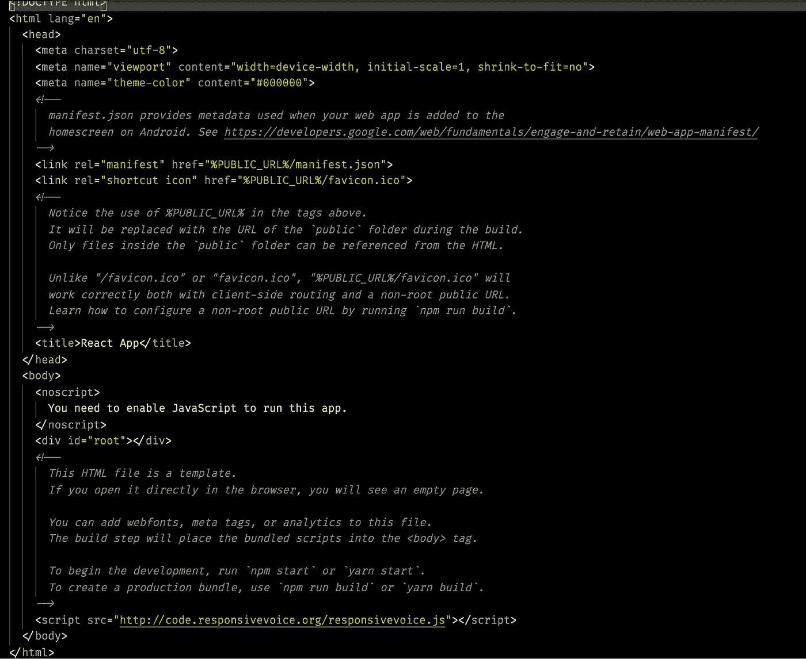
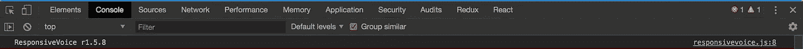
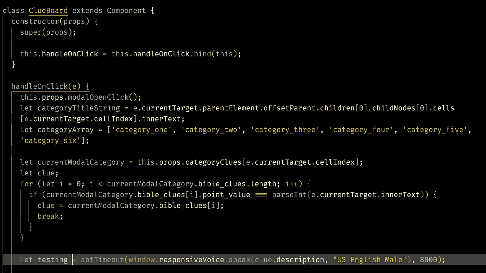

# 在 React 应用中访问 ResponsiveVoice.js，无需软件包

> 原文：<https://itnext.io/access-responsivevoice-js-in-react-app-without-a-package-a062b8d92950?source=collection_archive---------1----------------------->

在创建 Jeopardy 应用程序的过程中，我决定做更多的事情，而不仅仅是显示一个类别的书面线索。我意识到我想使用文本到语音的方式来读回显示的线索。但是在这个问题上有很多不同的选择。显而易见的选择是 IBM Watson。但是我觉得它对我的需求来说有点过于健壮了。所以我决定合并 [ResponsiveVoice.js](https://responsivevoice.org/) 。

那么下一步我如何将它合并到我的 React 项目中。所以我找到了一个响应语音包，我可能只是安装，然后就收工了。但是当我看代码时，对我来说用`var`和`require`而不是`import`有点像 ES5。我的意思是，毕竟我们正在推动 ES9 人，老实说，我只是想遵循原始的开箱即用。

那么，我该如何合并这个 CDN 托管的 JS 文件呢？

我也是这么想的

js 要求在 html 文件中包含这段代码片段``。但是在哪里？将你的 css `<link>`文件包含在你的`<head>`标签中，并将你的 js `<script>`文件包含在你的结束`</body>`标签之前，这是一个很好的做法。所以我的 html 文件看起来像这样。

我必须承认，我觉得这样包含我的 JS 文件有点脏。这不是我所习惯，但是我习惯于只处理软件包。但这无关紧要。

我不确定如何访问包含的功能。但首先，我想确保脚本被正确捆绑。所以我打开我的开发者控制台，在顶部我看到了这个，

所以我知道回应之声必须正确捆绑。最初，我试图访问我的 React 组件中包含的函数，但是我不断得到这些函数名的未定义错误。

在做了一点挖掘之后，我开始明白实际上有一个非常简单的方法来访问包含的文件函数。所有全局 JS 对象、函数和变量都自动成为 window 对象的成员。

我只包含了我的组件的一部分。但应该足以代表正在发生的事情。在我的`handleOnClick()`函数中，我用线索的措辞打开了一个`modal`。然后我运行一个`for`循环来分配`clue`值。高亮线表示通过`window`进入`responsiveVoice.speak`功能。结果是当模态打开时，`object.description`被访问并被大声读出。

旁注我知道那里有很多丑陋的代码。我还在为不同的情况写它。但是这展示了我们如何在没有包的情况下包含一个 JS 文件，并且能够在我们的项目中使用它。

好了，现在我们已经学到了一些新的东西，并将这些知识融入到一个项目中，是时候

如果有人有任何不同的建议或做事方式。我洗耳恭听。请在下方留下评论。在我写下一篇博客之前，我会离开这里。拜拜。