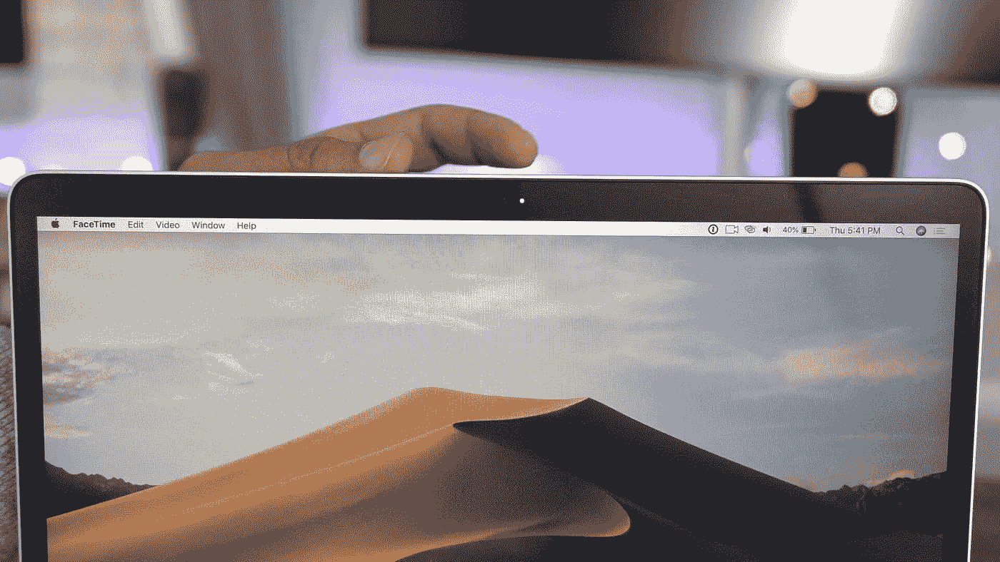
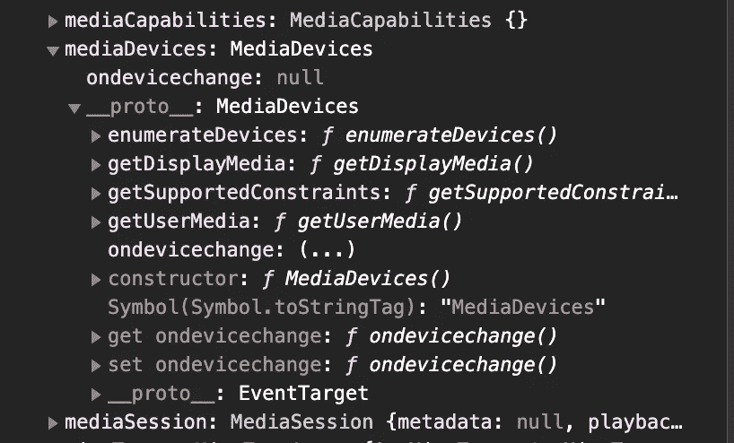
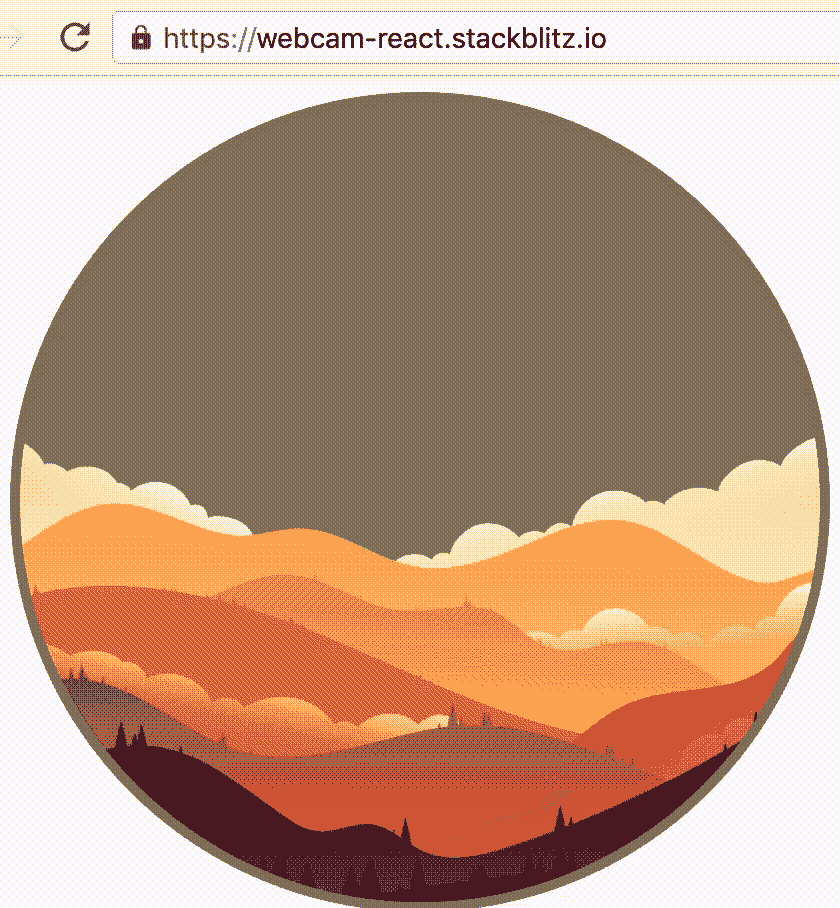

# 使用 JavaScript 和 React 访问网络摄像头

> 原文：<https://itnext.io/accessing-the-webcam-with-javascript-and-react-33cbe92f49cb?source=collection_archive---------0----------------------->

又名我不喜欢你丑陋的(恶意软件)网络摄像头软件。



当我在 2020 年秋天买了一个新的微软 LifeCam 时，我必须下载他们的官方软件才能使用它。立刻就讨厌了。我也试过其他软件，但问题是，它们都太丑了，我心想，“用 JavaScript 连接到我的网络摄像头有多难？”

其实真的很简单。您可以创建自己的浏览器应用程序来拍照、录音，甚至创建滤镜。这完全取决于你的想象力和创造力。

在本文中，我们将讨论这一点。

# 第一步

我们需要做的第一件事是创建我们的 HTML 部件。我想拍照，所以我还加了一个按钮。我们将在一分钟内设计和修改所有这些。

分解上面的代码；`button`是用来给自己拍照的。`video`是我们的网络摄像头流，画布是我们从视频中拍摄快照并显示它们的地方。

下一步是访问我们的网络摄像头。为此，我们需要使用钩子的 useRef 特性。如何做到这一点可以在下面看到，我们需要补充:

```
ref={videoRef}
```

添加到所需的 HTML 元素，并使用

```
const videoRef = useRef(null);
```

useRef 是访问 DOM 元素的反应方式。它所做的是，创建一个普通的 JavaScript 对象来保存一些属性，比如 current，它对保存任何可变的值都很有用。与纯对象的不同之处在于，它在每次渲染时都给你相同的 ref 对象。

接下来要做的是，创建一个方法来获取视频并进行流式传输，

兴趣点是关键词:`navigator` **。**

直接从 MDN 读取:

> `**Navigator**`接口代表用户代理的状态和身份。它允许脚本查询它，并注册自己进行一些活动。
> 
> 可以使用只读的`[window.navigator](https://developer.mozilla.org/en-US/docs/Web/API/Window/navigator)`属性来检索一个`Navigator`对象。

这是不言自明的。但是我觉得还是自己去看比较好，我们只需要打开 dev tools，在控制台上输入 navigator 就可以了。


仔细一看，里面有`mediaDevices`属性。如果我们展开它，我们可以看到已定义的原型， **getUserMedia，**它返回一个承诺。我们将使用它来访问我们的网络摄像头。再次直接从 MDN 复制，



## navigator.mediaDevices():

返回对一个`[MediaDevices](https://developer.mozilla.org/en-US/docs/Web/API/MediaDevices)`对象的引用，该对象可用于获取可用媒体设备(`[MediaDevices.enumerateDevices()](https://developer.mozilla.org/en-US/docs/Web/API/MediaDevices/enumerateDevices)`)的信息，并使用`[MediaDevices.getUserMedia()](https://developer.mozilla.org/en-US/docs/Web/API/MediaDevices/getUserMedia)`请求访问媒体。

在这个承诺的实现部分，我们可以将来自网络摄像头的视频分配给我们用 useRef 访问的视频标签。

```
let video = videoRef.current;        
video.srcObject = stream;        
video.play();
```

这是我们访问网络摄像头所需的全部内容。你能得到多少乐趣完全取决于你自己！创建滤镜，效果，拍照，处理图像数据…可能性是无穷无尽的！

现在，您的代码应该如下所示:

# 第二步

从我们刚刚访问的网络摄像头拍摄快照也很容易。我们需要做的就是创建一个画布，并将数据写入画布。这里最重要的事情是从网络摄像头获取快照，并将其渲染为 2D 背景。

然后，每隔 200 毫秒，我们将把 2D 的背景写入画布。

为了停止绘制，我们需要将视频源设置为空，并在视频流的轨道上使用 stop()。类似这样的事情就足够了:

在这一点上，你应该有你的网络摄像头在一边播放，一个画布随着时间间隔更新。

[](https://stackblitz.com/edit/react-webcam-step2?file=src/App.js) [## 反应-网络摄像头-步骤 2 -堆栈式

### 导出到 create-react-app CLI 的 React 应用程序的启动项目。

stackblitz.com](https://stackblitz.com/edit/react-webcam-step2?file=src/App.js) 

# `.toDataURL()`

要从我们的网络摄像头快照到画布上拍照，我们需要使用`toDataURL`

该方法返回一个数据 URI，包含由参数`type`指定的格式的图像表示。默认是 PNG。Chrome 也支持`image/webp`类型。

```
canvas.toDataURL('image/jpeg', 1.0);
```

逗号后面的部分从 0 到 1 指定照片的质量。

之后，我们唯一需要做的就是创建一个图像元素，并添加我们拍摄的图片作为来源。我还加了一个属性让我们下载。

```
link.setAttribute(“event-name”, “name-for-the-image”);
```

在进入下一步之前，下面是您的代码应该是什么样子:

[](https://stackblitz.com/edit/react-webcam-step3?file=src/App.js) [## 反应-网络摄像头-步骤 3 -堆栈式

### 导出到 create-react-app CLI 的 React 应用程序的启动项目。

stackblitz.com](https://stackblitz.com/edit/react-webcam-step3?file=src/App.js) 

# 有趣的部分

为了这篇文章，我将添加一个功能来拍照，并使用网络摄像头的 1 个像素来给我创建的小场景添加效果。这个场景的灵感来自凯西·埃文斯的这支笔

我们将从快照中获取一个像素，并操纵我创建的场景。天空会随着像素而改变。



# 现场

为了创建这个场景，我检查了 freepik，找到了一张有山的图片。这里可以找到[](https://www.freepik.com/free-vector/colorful-mountains-landscape-background_5476956.htm#page=1&query=mountain&position=16)**。**

*现在，在`paintToCanvas`函数中，我们将添加更多的行。但在此之前，我们将把这个场景添加到我们的 HTML 部分。*

*你看到`ref`的用法了吗？同样，在`useRef`的帮助下，我们将在一会儿给那个元素添加一些风格。*

*为了添加这些样式，我将从快照中获取第一个像素及其颜色值。*

*以下是最终版本:*

*感谢您的阅读！特别感谢 [Semih Onay](https://medium.com/@Semyonic) 的点评和 [CassieEvans](https://twitter.com/cassiecodes) 让我用她的笔。去看看她！*