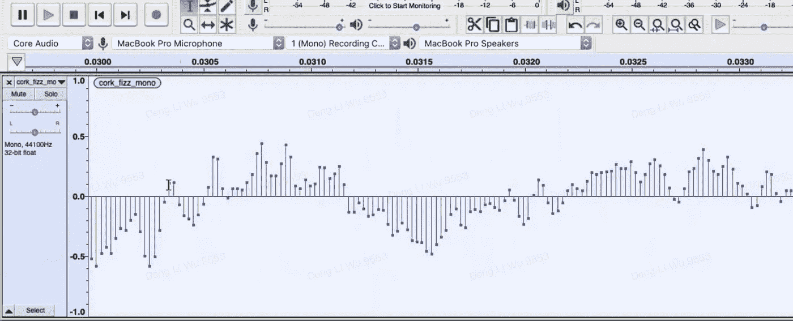
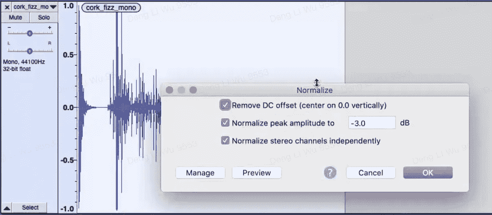
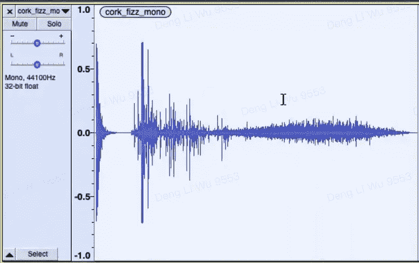
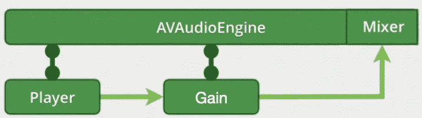

# 在 iOS 中实现自动调平

> 原文：<https://itnext.io/achieving-auto-leveling-in-ios-7f2a31890509?source=collection_archive---------8----------------------->

当我们将多个音频源混合在一起时，它们极有可能具有不同的响度。将所有这些直接组合在一起绝对会产生糟糕的原声。据我所知，音乐制作人对所有音源都在[线电平](https://www.youtube.com/watch?v=gzbiOeqbERE)上工作，然后设置响度来解决这个问题。在这里，我将演示如何分析一个音频文件，然后将其设置为目标音量。

正常说话和耳语可以设置为相同的响度

## 分析来自 PCM 缓冲器的音频

音频实际上是声波，可以用振幅数组来表示。由于所有扬声器和麦克风都支持不同的响度级别，因此将振幅值统一在[-1，1]范围内是音乐制作的解决方案。在 iOS 中，这可以通过将你的音频转换成 [AVAudioPCMBuffer](https://developer.apple.com/documentation/avfaudio/avaudiopcmbuffer) 来实现，然后读取缓冲区指针值。

幅度值在[-1，1]的范围内

## 使响度匹配

下一步是归一化我们的峰值振幅。一旦我得到了振幅数组，我想[得到与目标分贝](https://stackoverflow.com/a/6571927)相匹配的乘数，它是由音乐制作人提供的。有了这个乘数，我们就可以反算出想要传递到增益节点[的分贝数。](https://developer.apple.com/documentation/avfaudio/avaudiouniteq/1389193-globalgain)

## 使用 AVAudioEngine 应用分贝变化

用 AVAudioEngine 渲染音频是另一个话题。你可以从[这篇文章](https://www.raywenderlich.com/21672160-avaudioengine-tutorial-for-ios-getting-started)中了解更多。我正在构建的音频图相当简单，如下所示:

就是这样！现在我们有了自动调平系统。我的 Github 上有[源代码。请随意用正常的说话和耳语来试一试，效果非常好！✌️](https://github.com/ji3g4kami/AutoLeveling)