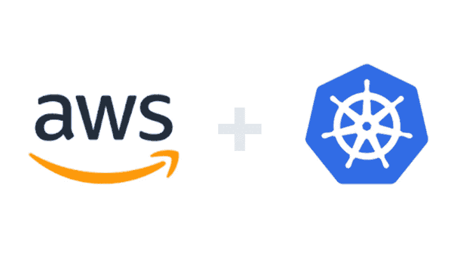
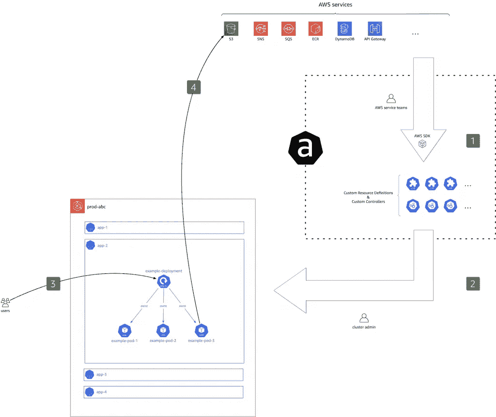

# ACK-AWS 的 IAC 给 K8s 的福音

> 原文：<https://itnext.io/ack-the-gospel-of-iac-for-k8s-5cf89b7cd66a?source=collection_archive---------2----------------------->

# TL；速度三角形定位法(dead reckoning)

对所有 AWS & Kubernetes 爱好者来说，这是一个你必须了解的项目。

这个项目被命名为 [ACK](https://aws-controllers-k8s.github.io/community/docs/community/overview/) ，虽然它是在 1.5 年前宣布的，但它还没有那么广为人知。

它允许您“修改”您的标准 IAC 工具，并允许您为您的 Kubernetes 工作负载构建一个基于 AWS 的支持环境，从而保持您的 K8s API/基于 YAML 的语法。

# 形式定义

**用于 Kubernetes 的 AWS 控制器(ACK)** 允许您直接从 Kubernetes 定义和使用 AWS 服务资源。有了 ACK，您就可以为 Kubernetes 应用程序利用 AWS 管理的服务，而无需在集群之外定义资源，也无需在集群内运行提供支持功能(如数据库或消息队列)的服务。

# 背后的主要思想和流程

1.  许多贡献者正在与 AWS SDK 一起创建定义 AWS 服务和资产行为的 CRD。
2.  作为集群管理员，我们选择一个或多个 ACK 控制器，希望提供给我们的客户，供他们在应用程序逻辑中使用，例如(S3 桶、迪纳摩 DB 表、EC2 等。)
3.  应用程序开发人员使用这些控制器直接与 AWS 环境进行交互，并纯粹在 K8s YAML 清单中相应地设计他们的应用程序。
4.  各个 ACK 控制器(在步骤[2]中安装)管理特定的 AWS 定制资源(CRD ),这些资源是 AWS 资源的基础。
    基于步骤[3]中定义的定制资源，控制器使用 AWS APIs 创建、更新或删除底层 AWS 资源。

# 好吧，那我能用它做什么呢？

简而言之，传统的云基础架构 IAC 工具可以让您做任何事情！

1.  在 AWS 领域创建服务/资产
2.  更新 AWS 资源
3.  使用 AWS 资源/将数据插入其中
4.  消除 AWS 资源

# 代码示例

这里描述了一个简单明了的 **S3 桶**资源:

S3 -简单的设计

下面描述一个简单的 **ECR 资源库**资源创建:

ECR -简单 ECR Repo 创建

这里详细描述了代表**可缩放目标**和服装自动缩放的**缩放策略**的两个清单:

ASG -可扩展目标

ASG 标度策略

这里呈现的实际“力量”是:
而不是把各种第三方工具带入“党”(像 Terraform，Pulumi 等。)为了定义应用的 AWS 基础环境的期望状态，
**ACK** 使您能够让您的开发人员专注于一个 IAC 框架/语法，它与 K8s-AWS 完全集成。

# 很高兴知道

1.  由于该项目相对较新，许多 CRD 处于预览模式。因此，在您想要开始一个项目之前，请检查此表中 CRDs 的可用性。

> [https://AWS-controllers-k8s . github . io/community/docs/community/services/](https://aws-controllers-k8s.github.io/community/docs/community/services/)

2.要了解该项目的更多信息，请进入以下链接:

> [https://AWS-controllers-k8s . github . io/community/docs/community/overview/](https://aws-controllers-k8s.github.io/community/docs/community/overview/)

3.GitHub 回购项目:

> 【https://github.com/aws-controllers-k8s/community 