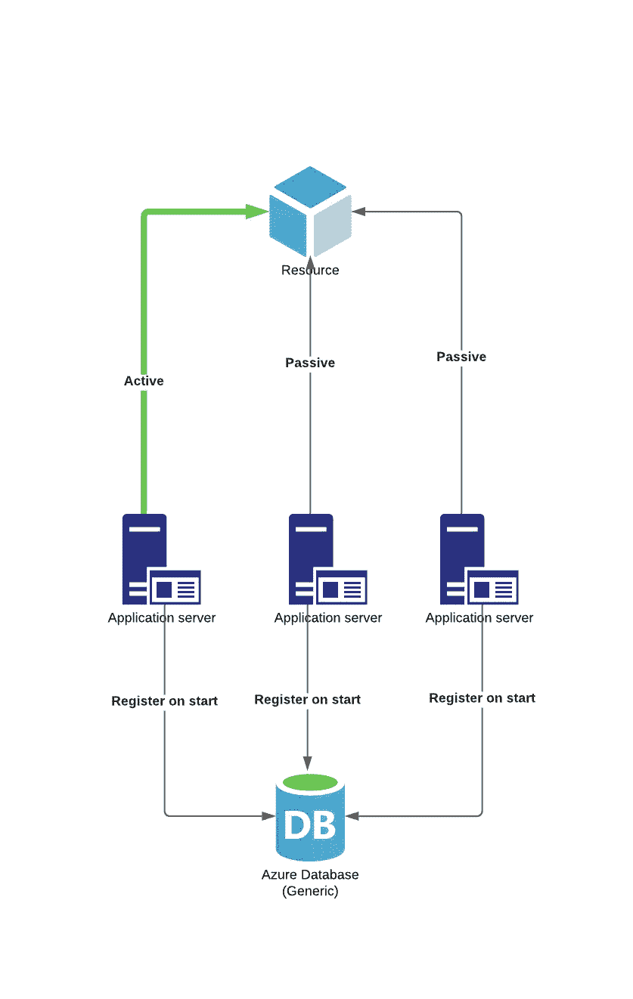
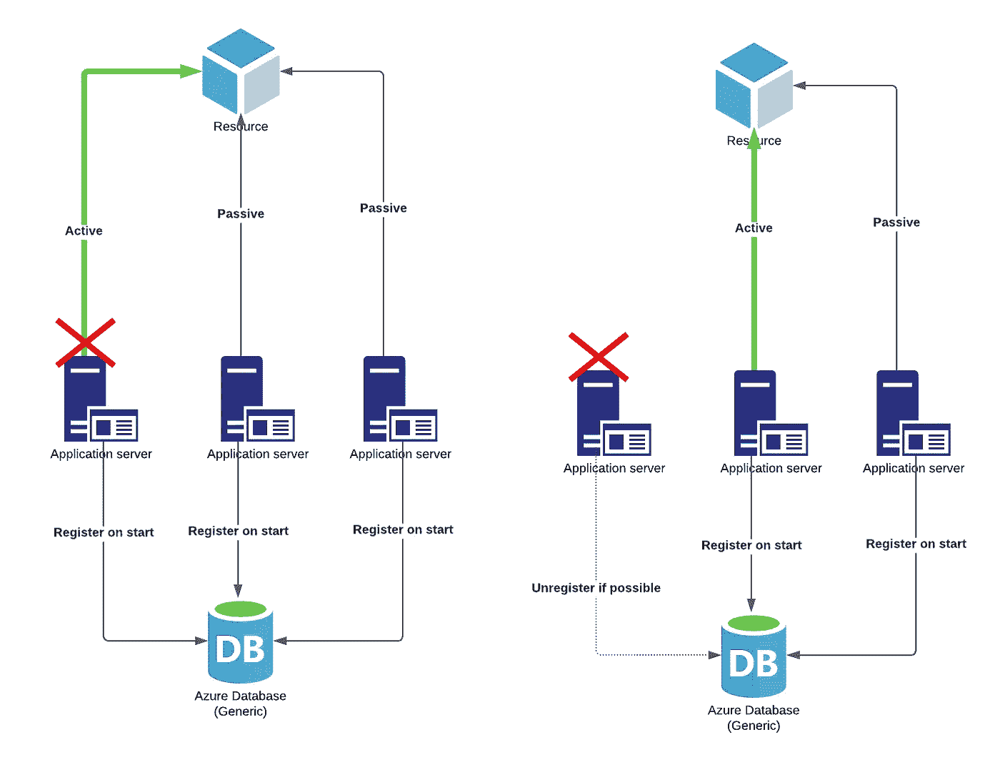
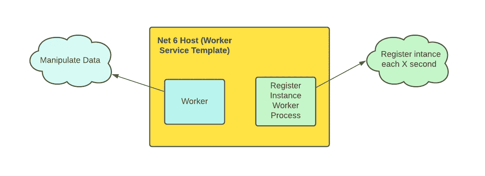

# 主动-被动后台服务。网络 6

> 原文：<https://itnext.io/active-passive-background-service-in-net-6-952f3aebd1b7?source=collection_archive---------0----------------------->

## 背景故事:

假设您有多台服务器试图在某个时间间隔(比如 1 秒或更快)内访问和操作一些数据。服务器试图操作的数据只能由一个进程同时访问。在其他情况下，它会导致一些不可预测和难以跟踪的问题。

我们应该能够在多个服务器上的同一个后台服务上运行多个实例。同时，只有一个实例应该在“活动”模式下运行，这意味着做功。其他的要以“被动”模式运行，等到“主动”的一个下去，再自动从“被动”切换到“主动”。

体系结构

如上图所示，我们将实现面向推送的服务发现功能来满足需求。每个实例将在开始时在外部数据源中注册自己(可以是任何 Azure 数据库/SQL Server/No-SQL)。所有实例都将包含一个逻辑，告诉它们应该以哪种模式工作。如果出现意外的服务器故障，我们将实现实例的自动注销逻辑。

# 要求:

## 功能要求:

*   每个后台服务都必须能够操作数据。
*   每个后台服务必须能够在“被动”模式下工作。
*   每个后台服务必须能够在“活动”模式下工作。
*   每个后台服务将在开始时注册自己。
*   每个后台服务将在 X 秒后重新注册。
*   每个后台服务将在退出时注销自己。
*   如果后台服务无法注销自身(例如，服务器崩溃)，则应该由另一个服务注销它。

## 非功能性要求:

*   NET 6 工作进程。
*   服务器对互联网的访问受到限制。
*   服务器可能会意外崩溃。

## 后台服务

NET 6 主机允许将多个托管服务注册为同一主机的一部分。在这种情况下，应用程序将包含两个并行工作的长期运行的后台服务。

# 履行

让我们从后台服务实现开始。

## RegisterInstanceWorkerProcess

在 Execute Async 方法(第 24 行)中包含了我们的整个逻辑。
因为这是工作进程，我们有一个 while 循环，每 1 秒迭代一次，并执行以下操作:

*   用唯一的实例 id 注册工作进程实例。
*   删除孤立实例
*   等待 1 秒钟，重复整个操作。

如果有任何错误，我们记录错误，停止实例并尝试取消注册它(StopAsync 方法)。StopAsync 方法只有在我们正常停止工作进程时才会触发。如果出现意外的严重故障(例如，服务器因断电而停机)，该方法将不会执行。在这个场景中，工作进程的另一个实例将注销这个实例(第 36 行的 **DeleteOprhantInstanes** 方法)。

## 工人

工作进程要简单得多——在 while 循环中，我们检查实例应该是主动的还是被动的。根据结果，我们执行相应的逻辑(DoInActive 和 DoInPassive 方法)。

## RegisterInstanceService

本文的核心是我们的 RegisterInstanceService 类。这个类包含四个方法。
我们来看看:

在第 20 行，我们有一个**注册方法**。
该方法获取所有已注册的实例，如果已注册的实例中没有当前活动的实例，我们注册一个新的实例并将其设置为活动的。如果我们的实例已经存在(因为我们每 10 秒注册一次)，我们只需更新注册日期。

**Unregister 方法**(第 36 行)只是删除我们的数据存储的一个实例。

**IsActive** (第 41 行)方法也很简单。从所有注册的实例中，我们试图找到具有当前 id 的实例，并返回活动标志。

**DeleteOrphantInstances** 比较有意思。该方法允许我们删除仍然在数据存储中但至少 1 分钟没有更新的所有实例。这种方法保证了即使一些实例在没有取消注册情况下会崩溃，我们仍然会自动将它们从数据存储中删除，从而允许其他实例接管“活动”模式。

# **总结**

有时我们不能使用专用的工具/框架来实现利益相关者所要求的功能。这一次，它是一个主动的功能。

我的 GitHub 上有完整的代码和工作解决方案。

 [## GitHub-ridikk 12/ActivePassiveWorkerProcess

### 此时您不能执行该操作。您已使用另一个标签页或窗口登录。您已在另一个选项卡中注销，或者…

github.com](https://github.com/Ridikk12/ActivePassiveWorkerProcess)