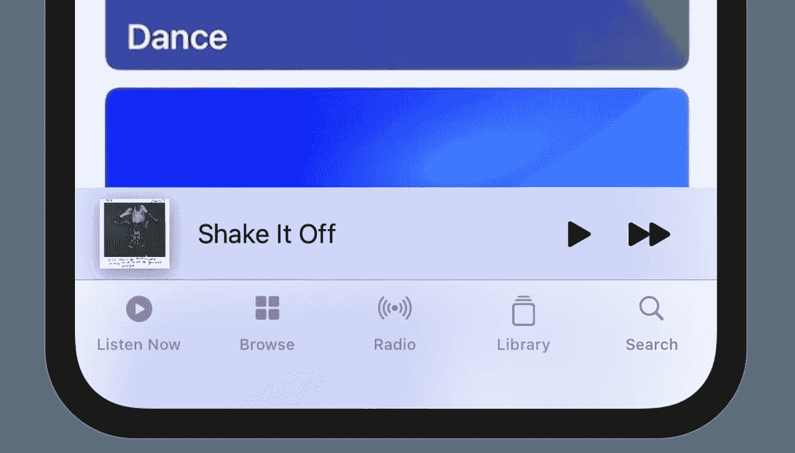
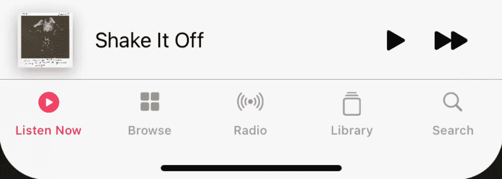
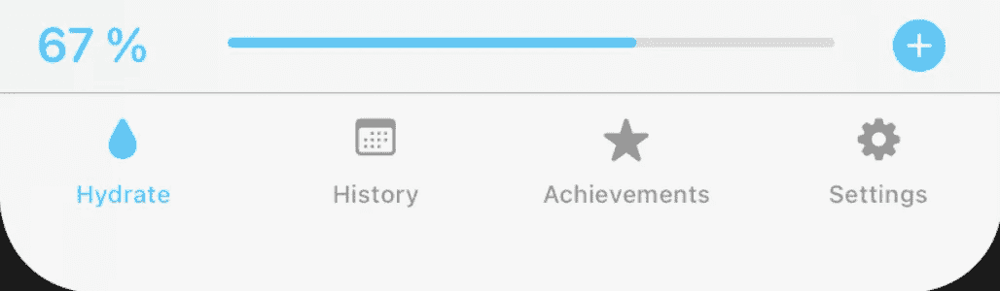
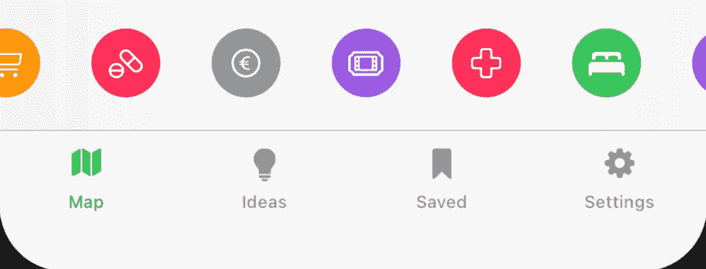
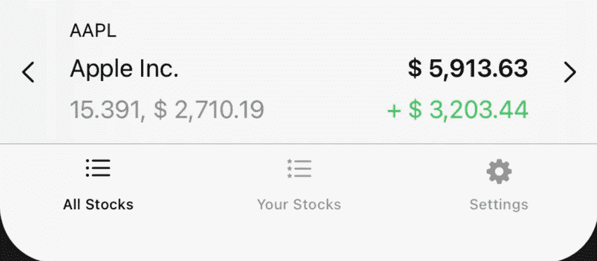
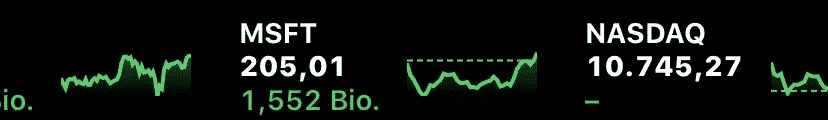

# 将带有 SwiftUI 的“正在播放栏”添加到您的应用程序中

> 原文：<https://itnext.io/add-a-now-playing-bar-with-swiftui-to-your-app-d515b03f05e3?source=collection_archive---------0----------------------->

当你有一个媒体应用程序时，你可能想要一个“正在播放栏”，就像 Spotify、Apple Music、YouTube 或播客一样。但是你不需要成为一个媒体应用程序，在底部有一个信息栏。在这篇文章中，我将展示如何添加一个“正在播放栏”和一些例子，关于如何在你的 SwiftUI 应用中实现一个信息栏。

# 为“正在播放”栏做准备

当你有一个媒体应用程序时，它可能看起来像这样:

使用这样的代码:

我们将把这个栏放在`TabView`的顶部和内容的上方。我们将使用视图作为输入，然后将 Now playing 栏放在它上面的一个`ZStack`中。

现在我们只需要在`NowPlayingBar(content: _)`中包装我们的个人视图，为这个特性做准备。

# 建立“现在玩吧”

你想如何设计酒吧完全取决于你的应用程序看起来怎么样，你的酒吧应该有什么功能。所以我展示了如何重新创建苹果音乐现在播放酒吧用户界面。

吧台的背景是一个`UIBlurEffect`。

SwiftUI 中没有原生的模糊效果，所以我们需要这个`UIViewRepresentable`。

该栏只包含一个`HStack`，其中包含专辑封面、标题、暂停按钮和前进按钮。

这看起来棒极了！要在你的应用中实现这一点，用这个`ZStack`替换`NowPlayingBar()`中的`// Now playing bar`。要添加动作，您可以在按钮上添加如下内容:

当你在 iPadOS 中使用侧边栏而不是`TabView`时，你可以把你的视图作为`NowPlayingBar(content: _)`的内容参数，也许可以修改侧边栏，在更大的屏幕上显示更多的内容。当你的应用没有`TabView`时，你也可以把它放在`.bottomBar`工具栏中。

# 添加媒体播放器视图

您可能已经注意到，封面图像、标题和`Spacer()`都被包装在一个`Button`中。此按钮应该切换承载媒体播放器详细视图的工作表。

将`@State`放入`NowPlayingView`结构的顶部，并用新的`Button`替换旧的。目前还不可能像 Apple Music 那样在 Now playing 栏和媒体播放器之间创建一个过渡。

# 例子和想法

虽然这对于媒体应用程序来说最有意义，但它们也可以用来一目了然地显示整个应用程序的信息和操作。

## 喝水 app

你可以向用户展示他的饮酒进度。还有一个记录新饮料的按钮。

## 地图应用程序

地图上方的水平`ScrollView`，用于快速选择不同的兴趣点类别。

## 股票应用程序

显示用户的股票，包含重要信息。用户可以用 v 形手动切换不同的股票，但它们也会在一段时间后自动改变。

你也可以实现一个移动股票滚动视图，就像在 iOS 股票应用程序中一样。

