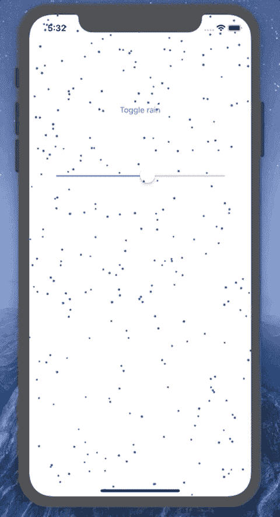
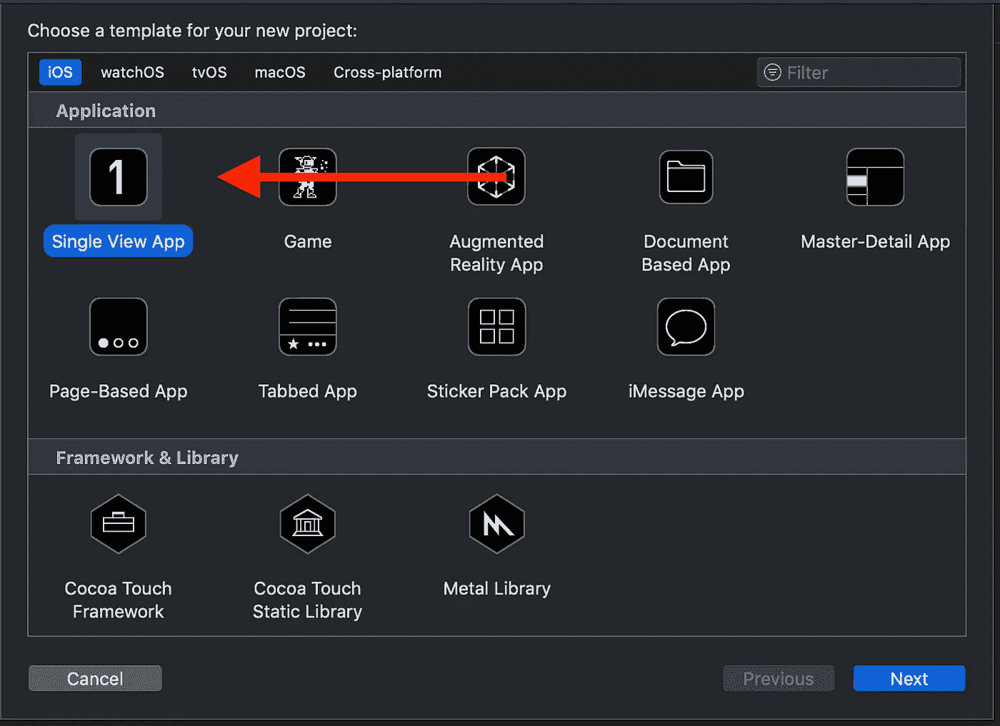
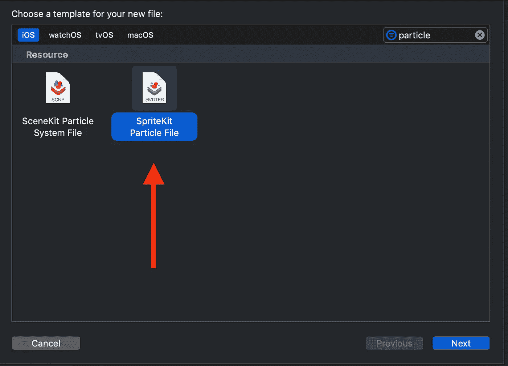
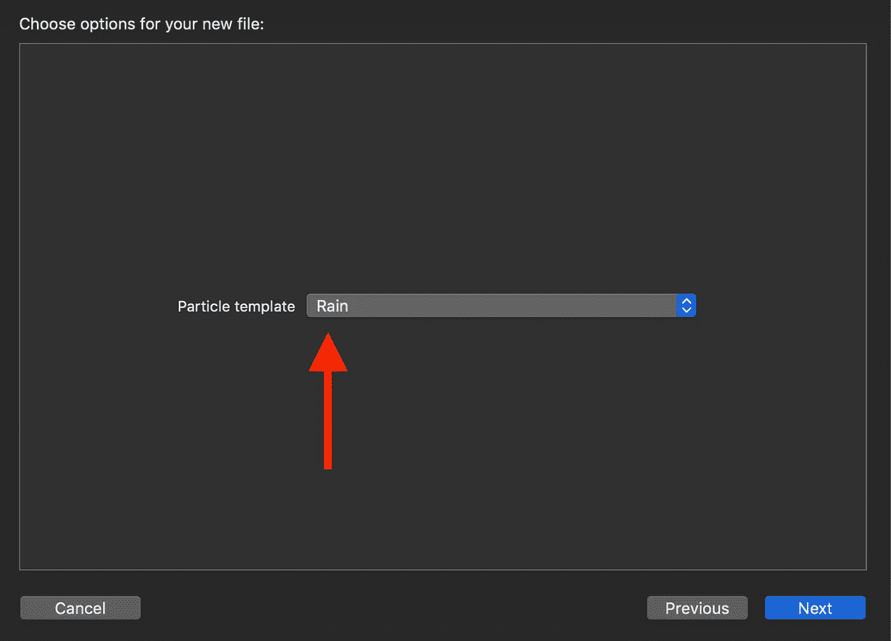
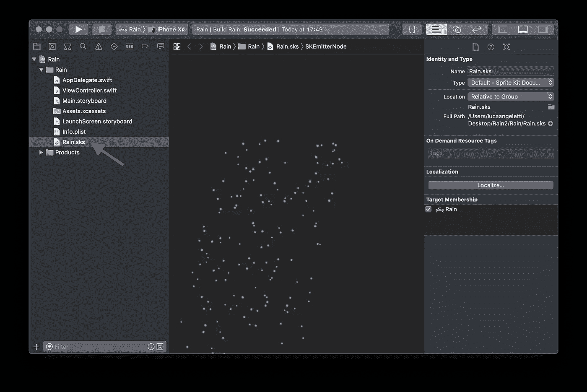
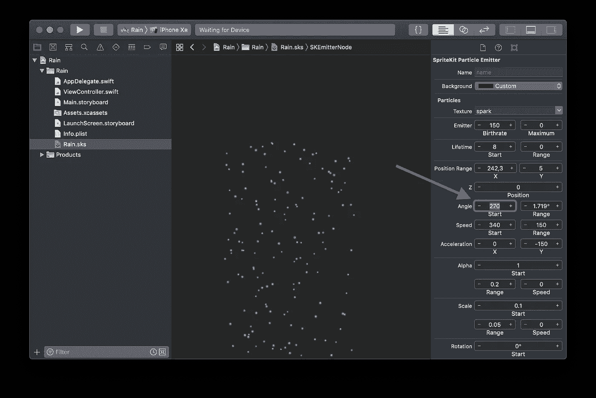
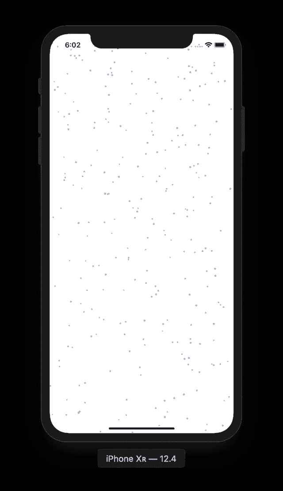

# 将雨模拟添加到您的 iOS 应用程序

> 原文：<https://itnext.io/add-a-rain-simulation-to-your-ios-app-eb596d41bf32?source=collection_archive---------8----------------------->


[https://unsplash.com/photos/1vYkQVDWXl0](https://unsplash.com/photos/1vYkQVDWXl0)

通过这篇文章，你将学习如何在你的 iOS 应用程序中添加一个**真实的雨模拟**。你将使用 **SpriteKit** :每个苹果操作系统中都包含的强大的 2D 游戏引擎。



好消息是，这是 100%的本地代码，不需要第三方库。因此，您将能够将此效果添加到您的 Swift 原生应用程序中！

# 让我们造雨吧

用 Xcode 创建一个新的空白项目。



一旦项目被创建，在 Xcode 中选择**文件** > **新建** > **文件** > **SpriteKit 粒子文件**。



接下来选择**雨**。



然后按下**下一步**，给文件分配名称 **Rain** 并保存到您的项目中。

# Xcode 粒子发射器编辑器

Xcode 提供了一个神奇的编辑器来自定粒子发射器。让我们看一看。选择 **Rain.sks** 文件打开*粒子发射器编辑器*。



然后选择右边的**属性检查器**面板。


正如你所看到的，粒子效果的预览显示在中央面板。你可以用右边的参数来玩，看看结果如何变化。

# 自定义雨效果

有一个变化，我们想应用到我们的雨效果。我们希望雨垂直落下，所以让我们把角度设置为 270 度。



如果你再看一遍预览，你应该会看到雨垂直落在✅.的地面上

# 让我们编码

现在打开文件 **ViewController.swift** ，用下面的代码替换它的内容。

```
import UIKit
import SpriteKitclass ViewController: UIViewController {

    let emitterNode = SKEmitterNode(fileNamed: "Rain.sks")!

    override func viewDidLoad() {
        super.viewDidLoad()
        addRain()
    }

    private func addRain() {
        let skView = SKView(frame: view.frame)
        skView.backgroundColor = .clear
        let scene = SKScene(size: view.frame.size)
        scene.backgroundColor = .clear
        skView.presentScene(scene)
        skView.isUserInteractionEnabled = false
        scene.anchorPoint = CGPoint(x: 0.5, y: 0.5)
        scene.addChild(emitterNode)
        emitterNode.position.y = scene.frame.maxY
        emitterNode.particlePositionRange.dx = scene.frame.width
        view.addSubview(skView)
    }}
```

然后将您的项目运行到模拟器中以检查结果。

你应该能看到下雨了👇



# 它是如何工作的？

让我们分解一下我们添加到 **ViewController.swift** 中的代码。

## 第一步

我们导入了 SpriteKit 框架来使用 **SKEmitterNode** 类和其他一些很酷的工具。

```
import SpriteKit
```

## 第二步

然后我们使用 **Rain.sks** 文件创建了一个 **SKEmitterNode** 。

```
let emitterNode = SKEmitterNode(fileNamed: "Rain.sks")!
```

## 第三步

最后，我们来看看 **addRain()** 函数。我将代码分成 4 大块，以便更准确地描述这里发生的事情。

```
private func addRain() { // 1
    let skView = SKView(frame: view.frame)
    skView.backgroundColor = .clear
    view.addSubview(skView)

    // 2
    let scene = SKScene(size: view.frame.size)
    scene.backgroundColor = .clear
    scene.anchorPoint = CGPoint(x: 0.5, y: 0.5)
    scene.addChild(emitterNode)

    // 3
    skView.presentScene(scene)
    skView.isUserInteractionEnabled = false // 4
    emitterNode.position.y = scene.frame.maxY
    emitterNode.particlePositionRange.dx = scene.frame.width}
```

1.  我们创建一个 **SKView，**一个由 SpriteKit 提供的 **UIView** 的特殊子类。
    然后我们使背景透明，我们将视图添加到 **UIViewController** 的主视图中。
2.  这里我们创建一个场景，设置其背景为透明，设置锚点为(0.5，0.5)，最后添加 EmitterNode(雨！)到现场。
3.  这里，我们将场景呈现到 SKView 中(其用户交互被禁用)。
4.  最后，我们将粒子效果的发射器放置在屏幕的顶部，并使其与当前屏幕一样大。

就是这样。

# 最后润色

如果您想更进一步，您可以使用 storyboard 向 ViewController 添加一个 **UIButton** 和一个 **UISlider** 。

然后将这两个方法添加到 **ViewController.swift** 中

```
class ViewController: UIViewController {
    .... @IBAction func didTapToggleRain(_ sender: UIButton) {
        emitterNode.isHidden.toggle()
    }

    @IBAction func didChangeSlider(_ slider: UISlider) {
        emitterNode.particleSpeed = CGFloat(slider.value)
    }}
```

最后，使用 Storyboard 将按钮的动作内的 **Touch Up 连接到第一个方法，并将 UISlider 的**值已更改的**动作连接到第二个方法。**

现在重新运行应用程序:

*   轻按按钮以显示/隐藏雨；
*   移动滑块以更改模拟的速度。

# 结论

SpriteKit 包含在 Apple 平台的以下版本中。

*   iOS 7.0 以上
*   macOS 10.9 以上
*   Mac Catalyst 13.0+Beta
*   tvOS 9.0 以上
*   watchOS 3.0+版

在 SpriteKit 中有更多可用的粒子效果，你可以按照这里描述的步骤来创建火、雪和许多其他模拟，所以请随意尝试。