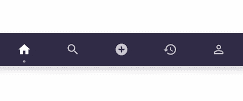

# 向您的 BottomNavigationView 添加动画指示器

> 原文：<https://itnext.io/add-an-animated-indicator-to-your-bottomnavigationview-db04c6aa738f?source=collection_archive---------2----------------------->



你是否认为标准的 BottomNavigationView 组件有点无聊，想要增加它的趣味？在这篇文章中，我将向你展示添加一个自定义指示器并让它在不同的位置之间移动是多么容易。

## 我们将会做什么

*   扩展底部导航视图
*   使用画布 API 绘制一个指示器
*   听取项目选择并相应移动指示器
*   动画运动，并添加一个放大/缩小动画

在我们开始之前，尽管您需要的所有代码都包含在下面，但您可以在我的 Github 页面上找到一个示例项目:

[](https://github.com/patrick-elmquist/Demo-BottomNavigationIndicator) [## Patrick-elmquist/Demo-BottomNavigationIndicator

### 在 GitHub 上创建一个帐户，为 Patrick-elmquist/Demo-BottomNavigationIndicator 开发做贡献。

github.com](https://github.com/patrick-elmquist/Demo-BottomNavigationIndicator) 

## 给我看看代码

所以让我们先看看我们正在实现的类，然后看看它是做什么的。

我们来分解一下。

## 动画位置

这个函数是这个类的核心，这是我们计算指示器的下一个位置并启动动画来移动它的地方。我们从取消任何运行的动画开始。接下来，我们确保可以找到给定 id 的视图。`fromCenterX`存储在动画外部，以获得用于动画更新块内部插值的起始值。

动画可以通过多种方式制作。在这个例子中，我已经决定让它在缩放值之间动画化，因为有三个缩放值(当前缩放>大>默认)，并根据`animatedFraction`插入平移，T1 是一个介于 0.0-1.0 之间的值，表示动画持续时间有多长。

代码本身非常简单，我们计算新的位置，并用它和新的刻度值一起更新指示器的边界。

`**distanceTravelled**` **vs 比例** 距离总是从视图的中心开始测量，这样比例就不会影响到它。

```
*Item1*               *Item2*
    (=x=)
  |---|                
         (===x===)
  |----------|
                 (=x=)
  |----------------|
```

**指示器边界** 边界被定义为父对象中的位置，因此我们使用移动的距离和新的宽度来定义左右值。

```
*distanceTravelled*
       |
 (=====x=====)
 |---*width*---|left  = dT - width/2
right = dT + width/2
```

**持续时间** 动画持续时间是一个计算值，取决于指示器必须移动的距离。为什么要把事情复杂化？两个相邻项目之间的动画应该比相距最远的两个项目之间的动画更快，这是有意义的，否则短运动将会感觉迟钝，或者长运动几乎不会被注意到。

这就是想法，然而实现和值是完全任意的，主要取决于你正在做的动画类型和你正在使用的插值器。在这种情况下，使用`LinearOutSlowInInterpolator`，让一半的最大持续时间由距离控制感觉像一个很好的分割。

```
*Item1*               *Item2*
  O
  |-------------------|
      *distanceToMove*base     = 300L
variable = 300L
duration = base + variable * distanceToMove / parentWidth
```

## 绘制指示器

默认情况下，`BottomNavigationView`不会调用`onDraw`，所以我们将绘制命令放在`dispatchDraw`中。这个命令很简单，用指示器的边界画一个圆角矩形，圆角半径是指示器高度的一半。这使得指示器在移动时呈药丸形状，在静止时呈圆形。

## 好了

只要在你的布局中使用这个新的类来代替`BottomNavigationView`，你就可以开始了。


这一次就到此为止，祝你愉快！