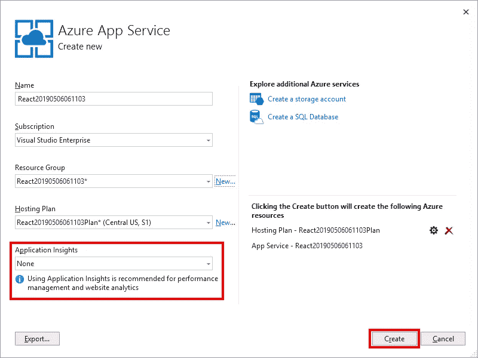
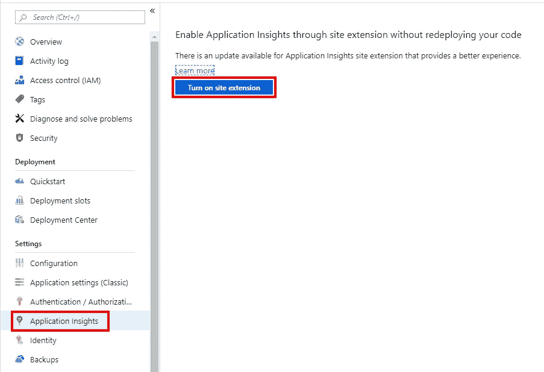
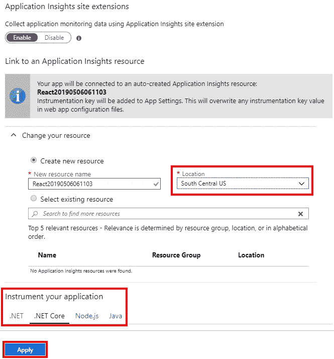
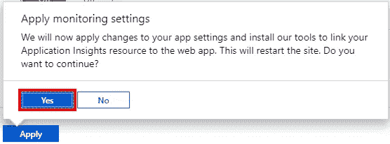
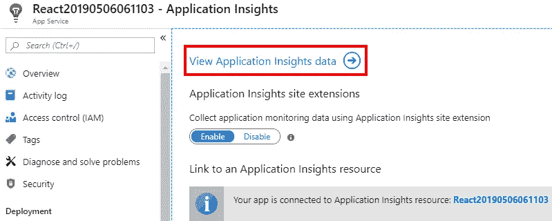
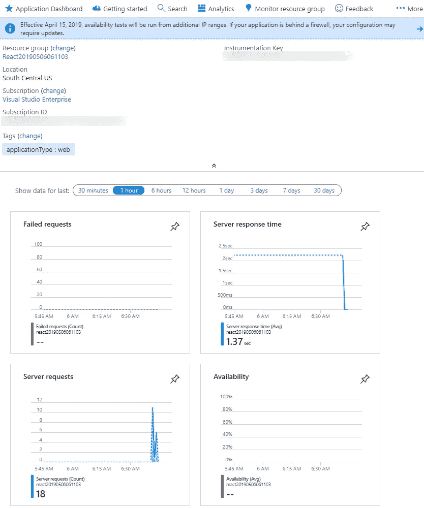

# 将应用洞察添加到现有的 ASP.NET 核心应用中

> 原文：<https://itnext.io/add-application-insights-to-an-existing-asp-net-core-application-40c4727147b8?source=collection_archive---------5----------------------->

几年来，我一直在使用 Azure 的应用服务来托管我正在玩的网络应用。该服务使托管应用程序变得简单。今天我决定试用[应用洞察](https://docs.microsoft.com/en-us/azure/azure-monitor/app/app-insights-overview)，这是 Azure 提供的应用性能管理(APM)服务，它与应用服务集成得非常好。事实上，您可以为您的应用服务应用启用应用洞察，而无需进行任何代码更改。

这篇文章将介绍如何使用现有的应用服务应用，以及如何实现应用洞察。这篇文章假设你已经有一个 Azure 账户。如果你没有，你可以注册一个[免费 Azure 账户](https://azure.microsoft.com/en-us/free/)。

## 示例应用程序和应用程序服务创建

如果你在 Azure App Service 中没有现有的应用程序，这里是我在这篇文章中使用的应用程序的快速浏览。如果您有现有的应用程序，可以跳到下一部分。

从。我使用下面的命令创建了一个 **global.json** 目标。NET Core 2.2 放在创建应用程序的目录中。你不必做这一步，但我需要它，因为我已经做了。NET Core 3 预览版，我希望这篇文章针对当前的生产版本。网芯。

```
dotnet new globaljson --sdk-version 2.2.105
```

接下来，运行以下命令，使用 React 模板创建一个新的 ASP.NET 核心应用程序。任何一个模板都可以，所以你可以随意使用不同的模板，只要它能给你一个 web 应用程序。

```
dotnet new react
```

现在在 Visual Studio 中打开新项目，右键单击项目文件，然后单击 **Publish** 。


选择**应用服务**然后点击**发布**。


下一个对话框是关于应用服务的设置。除了**资源组**之外，我在很大程度上采用了默认值，我确保仅为该应用程序创建一个资源组，以便于以后清理。选择所有选项后，点击**创建**。请注意，在这个屏幕上有一个设置应用洞察的选项，但是在这篇文章之后，我们将在 Azure 端处理这个问题。



部署完成后，您的应用程序应该在浏览器中打开。

## 从 Azure 门户添加应用洞察

现在我们有了一个运行在 Azure 应用服务中的应用程序，我们准备添加应用程序洞察。首先进入 Azure 门户，从菜单中选择**应用服务**。


从您的应用服务列表中选择您想要添加应用洞察的服务。从菜单中选择**应用洞察**。在详细信息中，点击**打开站点扩展**按钮，根据需要更新应用洞察扩展。



在下一个屏幕上，选择您希望部署应用洞察的**位置**。您可以根据构建应用程序的语言来调整要检测的内容，我只是保留了默认值。完成所有选择后，点击**应用**。



当您单击“应用”时，您将收到一条警告，提示您的站点必须重新启动。对于一个测试应用程序来说，这没什么大不了的，但是如果您正在使用一个生产应用程序，您可能希望在一个缓慢的时期这样做。点击**是**继续。



流程完成后，点击**查看应用洞察数据**链接，查看您的应用洞察概览。



该概述将通过失败请求、服务器响应时间、服务器请求和可用性的图表，为您提供应用程序运行情况的快速概述。



## 包扎

希望这将有助于您深入了解应用程序。这篇文章没有介绍 Application Insights 提供的许多功能，但是应该可以帮助您了解该服务提供的所有功能。

*原载于*[](https://elanderson.net/2019/06/add-application-insights-to-an-existing-asp-net-core-application/)**。**