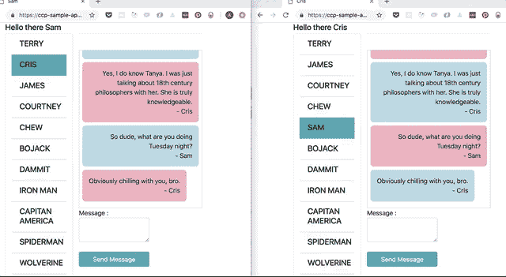
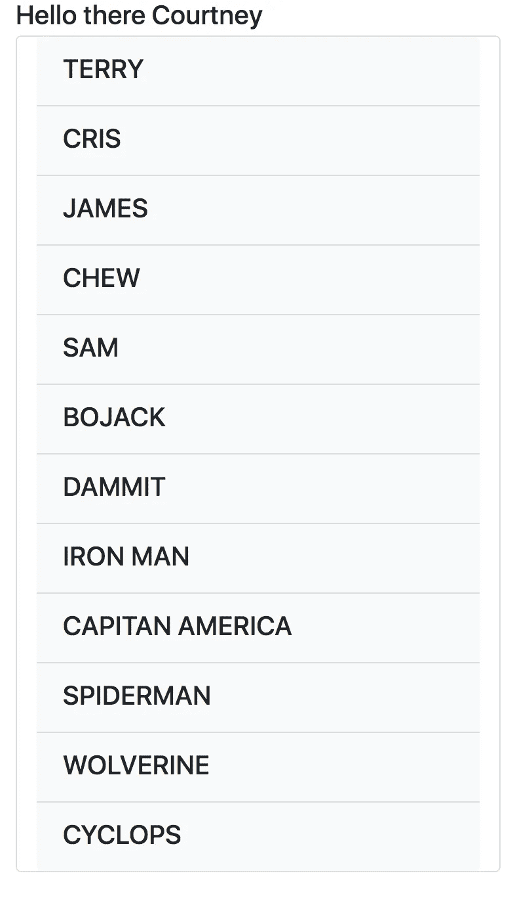

# 将聊天添加到 Ruby on Rails 应用程序中

> 原文：<https://itnext.io/add-chat-to-your-ruby-on-rails-app-8df47928bcc3?source=collection_archive---------6----------------------->

不是所有的网络应用都需要聊天，但是如果你想和你的客户交流，或者你想让他们互相交流，你很快就会遇到这个问题。CometChat Pro 是推出自己的聊天服务的绝佳选择。您将会看到，您可以轻松地将聊天插入到您的应用程序中，而不会妨碍您可能正在交付的其他内容。

# 先决条件

本教程根本没有假设太多的知识。Ruby on Rails 是一个非常容易上手的框架。如果你曾经使用过其他的网络技术，你可能会发现它非常清晰和固执己见。

CometChat Pro 本身需要在 Javascript 中运行，所以你会看到基于 Ruby 的框架和通过 Javascript 的视图操作之间的联姻。在 Rails 中有许多更复杂的方法来处理这个问题。对于本教程，我保留了基本 Javascript 和模板引擎 Rails 附带的一切:erb。Rails 爱好者将能够轻松地将这些基础工具转化为他们的专业设置。

我假设您能够运行 Rails 应用程序——这意味着您已经安装了 Ruby 和 bundler。这个应用程序使用 Ruby 2.5.3 和 Rails 5.2.2，但是对于最新版本来说，这里没有什么特别的——你可以将这些工具插入任何现代版本的 Rails 中。

# 介绍

构建聊天最困难的部分之一是处理并发性——用户需要在不刷新浏览器的情况下看到新消息。正如您将看到的，CometChat Pro 用很少的代码实现了这一点。



如果你曾经尝试过使用 Action Cable 来实现类似的结果，你会非常满意你可以如此快速地在浏览器中复制粘贴到实时更新。

你可以直接跳到 Github 上的[代码，或者带着这个家伙来一次](https://github.com/cometchat-pro-samples/ruby-on-rails-chat)[自我旋转](https://ccp-sample-app.herokuapp.com/)。让我们得到它！

# 安装

# 初始化

给自己拿一个终端，启动一个新的 Rails 应用:`rails new cometchatpro --skip-active-record -T`。为此我们不需要数据库，并且`-T`阻止 Rails 为我们创建测试文件。如果你已经有了一个应用程序，你可以跳过这一步——把这个代码放到一个现有的项目中应该很容易。

# 环境变量和 CometChat 凭证

接下来，你需要一个 API 密匙和一个来自 CometChat [Pro](https://app.cometchat.com/) 的应用 ID。登录后，进入仪表板，创建一个新的应用程序，然后生成一个 API 密钥。你需要`fullAccess`，而不仅仅是`authOnly`。拿起这些证书，把它们添加到你的`.env`文件中。您需要您的文件看起来像这样:

```
COMETCHAT_APP_ID=23n2f2n3p2y3
COMETCHAT_API_KEY=av22g24ll
```

接下来，将`dotenv-rails`添加到你的 Gemfile 和`bundle`中。现在，您的应用程序可以读取您的环境变量。这些是您的 CometChat Pro 帐户的私人凭据；**不要将此文件提交到您的版本控制中！**

# 聊天页面

接下来，我们将添加一些样板 Rails 视图和路由，以便我们可以作为一个用户与其他用户聊天。生成新的控制器:`rails generate controller Users`。这将创建一些文件，我们很快就会看到。您还需要在`config/routes.rb`中为您的新视图添加一条路线。下面是我的`routes.rb`的样子:

```
Rails.application.routes.draw do
  resources :users, only: %i[index show] root 'users#index'
end
```

如果你跳转到 [GitHub 代码](https://github.com/cometchat-pro-samples/ruby-on-rails-chat)或者跳到[托管应用](https://ccp-sample-app.herokuapp.com/)，你会看到我已经添加了用户创建。我把它留在原地，因为我已经构建了它，但是 **CometChat Pro 附带了每个帐户的示例用户**，所以你可以立即开始测试，而不需要首先设置用户创建。为了简洁起见，我在本教程中省略了对用户创建的讨论，但是您可以在 Github repo 中看到所需的代码。

您还需要创建一个`/views/users/show.html.erb`文件。我们一会儿就把它装满。

# CometChat 服务

让我们进入应用程序的核心——与 CometChat API 交互。我把与 CometChat Pro 的互动组织成一项服务。它看起来是这样的:

```
class CometChatService
  include HTTParty
  BASE_URI = 'https://api.cometchat.com/v1'.freeze def fetch_users
    response = HTTParty.get("#{BASE_URI}/users", headers: headers)
    response.dig('data')
      &.map { |user| {name: user['name'], id: user['uid']} }
  end private def headers
    {
      apikey: ENV['COMETCHAT_API_KEY'],
      appid: ENV['COMETCHAT_APP_ID']
    }
  end
end
```

CometChat Pro 做了很多事情，随着我们应用程序的增长，我们可能希望通过与他们的 API 的进一步交互来填充这项服务。在这里，我们需要做的就是获取一个可以聊天的用户列表。请注意，与 CCP 交互不需要 gem，您只需发送您喜欢的带有适当标题(来自我们的`.env`文件)的请求(我使用的是 http party ), CCP 就会发回您请求的信息。

我将来自 CCP 的 JSON 响应映射到我的应用程序需要的信息——用户名和用户 ID。

# 使用用户控制器中的服务

既然我们已经建立了与 CCP API 对话的协议，我们可以在我们的`UsersController`中使用它。这是我的样子:

```
class UsersController < ApplicationController
  def index
    @users = CometChatService.new.fetch_users
  end def show
    users = CometChatService.new.fetch_users
    @current_user = users.find { |user| user[:id] == params[:id] }
    @users = users.reject { |user| user[:id] == @user[:id] }
  end
end
```

为了简洁起见，我跳过了`index`页面，但它只是我们可以“聊天”的用户列表。你可以把它想象成最不安全、最荒谬的登录页面。在这两个视图中，我们获取注册了 CometChat Pro 应用程序的用户。我们已经在服务中映射了 JSON 响应，所以在索引和显示页面上，我们循环显示用户。在 show 页面上，我们以用户的身份聊天，所以我们不希望他出现在可能的聊天对象列表中(第 9 行)。



# 用户显示视图

让我们依次浏览用户展示页面的各个部分。一会儿，我们将讨论让它们运行所需的 Javascript。我还省略了对样式的讨论。你可以在 [GitHub](https://github.com/cometchat-pro-samples/ruby-on-rails-chat) repo 中看到完整的样式代码，当然你也可以实现自己的样式(当然要好得多)。

# 谁在说话？

为了向 CometChat 服务提供关于我们的“登录”用户(我们所在的显示页面)的信息，我们需要包含一个带有用户名和 id 的不可见 div。您可以将它放在页面的任何位置:

# 用户列表

要显示如上所示的用户列表，下面是 erb 代码:

```
&ltul class="list-group list-group-flush">
  &lt% @users.each do |user| %>
    &ltli class="list-group-item user-select bg-light" id="&lt%= user[:id] %>" name='user-select'>
      &ltdiv class="d-flex w-100 justify-content-between">
        &lth5 class="mb-1">&lt%= user[:name] %>&lt/h5>
      &lt/div>
    &lt/li>
  &lt% end %>
&lt/ul>
```

这里没有什么特别的事情发生——唯一需要注意的是，我们将用户 id 设置为 list-item 上的 id。我们稍后将需要它来引用我们正在与之对话的用户。记住，我们的`@users`来自控制器，我们从 CometChat 服务收集用户列表。

# 接收和显示消息

接下来，让我们看看如何显示收到的消息。我们的代码是这样开始的:

```
&ltdiv id="messages" class="messages">
    Messages loading...
&lt/div>
```

我们需要为 CometChat Pro 提供一个`div`来加载消息。我叫我的`messages`，但是你可以叫你的任何你喜欢的名字。

# 发送消息

我们将使用 Ruby 的表单助手来创建我们的消息表单，但是我们不让 Ruby 处理这里的任何功能:

```
&lt%= form_for :message, remote: true do |f| %>
    &ltdiv class="col-xs-9">
      Message : &lt%= f.text_area :text, class: "form-control" %>&ltbr/>
    &lt/div>
    &ltdiv class="col-xs-3 capitalize">
      &lt%= button_tag "Send Message", type: 'button', onclick: "javascript:sendMessage()", class: "btn btn-info btn-block" %>
    &lt/div>
&lt% end %>
```

当我们点击“发送消息”按钮时，我们将使用 Javascript 施展我们的魔法。Rails 表单会一直呆在那里，愉快地等待更多的输入。

# 我们应用程序的核心:Javascript 方法

CometChat Pro 服务运行在 Javascript 上，我们将使用他们清晰的示例代码来使我们的应用程序工作。

我们需要采取以下步骤:

1.初始化—建立与 CometChat 服务的连接。

2.以当前用户身份登录。

3.选择要与之聊天的用户，并获取该用户的消息历史记录。

4.添加一个事件监听器来接收来自其他人的新消息。

5.设置发送消息的操作。

# 初始化

首先，我们需要让我们的应用程序与 CometChat Pro 服务对话并登录。在`application.html.erb`中，在`<head>`标签之间添加此行:

```
&ltscript type="text/javascript" src="https://unpkg.com/@cometchat-pro/chat/CometChat.js">&lt/script>
```

把这几行加到`/views/users/show.html.erb`的底部:

```
&lt% javascript_include_tag 'show', cache: 'myfiles' %>
&ltscript type="text/javascript">
    setUserListeners();
    document.addEventListener('turbolinks:load', initializeChat);
&lt/script>
```

我们马上会看到`setUserListeners`方法。最后，我们引用了一个`show.js.erb`，我们需要创建它并添加到`app/assets/javascripts`。

这是我们的第一个 Javascript 方法:

```
const initializeChat = () => {
    CometChat.init('').then(
      hasInitialized => {
        loginUser()
      },
      error => {
        console.log("Initialization failed with error:", error);
      }
  )};
```

因为我们在`application.html.erb`中加载了 CometChat Pro Javascript，所以我们现在可以在 Javascript 文件中使用`CometChat`方法。我们将使用的第一个是`.init`，它要求我们发送我们的应用 ID 作为凭证。一旦我们的聊天被初始化，我们就调用`loginUser`方法。

# 用户登录

初始化后，我们需要登录当前用户。这个应用程序不包含任何安全措施——任何人都可以像其他人一样聊天。显然，你会希望在一个生产应用程序中有一点点更加定制化的东西。以下是我们在 CometChat Pro 上登录用户的方式:

```
const loginUser = () => {
    const userDiv = document.getElementById('user-id');
    if (!userDiv) { return true } const id = userDiv.dataset.id;
    CometChat.login(id, '').then(
        User => {
          const messageDiv = document.getElementById('messages');
          messageDiv.innerHTML = `<div class="whisper">Choose a  user to start chatting</div>`;
        },
        error => {
            console.log("Login failed with exception:", {error});
        })
}
```

还记得那个保存了我们来自`show.html.erb`的用户信息的奇怪的`tag('div')`吗？在这里，我们使用它来找出什么用户需要登录。如果 div 出了问题，我们就退出这次行动。

接下来，我们调用我们的下一个 CometChat 方法:`.login`。我们从用户 div 获取`id`,并使用我们的 API 凭证。如果 CometChat Pro 发回一个`User`，我们更新消息 div 说“选择一个用户开始聊天”。

# setUserListeners

让我们跳回到我们在视图底部调用了`setUserListeners()`的`show.html.erb`页面。为了知道我们想和谁聊天，我们需要监听用户列表上的点击。下面是这段代码的样子:

```
const setUserListeners = () => {
    const userDivs = document.getElementsByName('user-select');
    userDivs.forEach(user => user.addEventListener("click", e => {
        const id = e.target.id || e.target.offsetParent.id
        setUser(id);
        fetchMessages(id);
    }))
}
```

`userDivs`是 div 的节点列表，我们可以与之聊天的每个用户对应一个 div。我们遍历它们，并在每一个上添加事件侦听器。如果我们点击一个用户，我们想首先调用`setUser`来告诉我们的应用程序我们想和谁通话，然后调用`fetchMessages`来告诉那个用户。

# setUser 和 addMessageListener

这是我们真正获得一些魔力的地方，CometChat Pro 会为我们处理繁重的工作。一旦我们的用户登录并选择了要聊天的人，我们希望实时看到来自那个人的任何新消息。有了 CometChat Pro，我们不必担心保持任何 websockets 打开或处理刷新——消息就像你预期的那样出现。

`setUser`函数只关心使列表中的活动用户变成蓝色，所以我在这里跳过了它。但是它也调用了`addMessageListener`类，这对于接收新消息是至关重要的:

```
const addMessageListener = id => {
    CometChat.addMessageListener(
        'listener_id',
        new CometChat.MessageListener({
            onTextMessageReceived: textMessage => displayNewMessage(id, textMessage)
        })
)}
```

这几乎直接取自 CometChat [Pro 文档](https://prodocs.cometchat.com/docs)。我们调用 CometChat `addMessageListener`方法，然后使用传入的消息更新我们的消息 div。启动两个不同的浏览器来看看这是怎么回事(或者看看上面的 gif)。

# 显示新消息

当新消息进来时，我们需要更新我们的视图。代码如下:

```
const displayNewMessage = (currentChatterId, msg) => {
    const userDiv = document.getElementById('user-id');
    const id = userDiv.dataset.id;
    if (![currentChatterId, id].includes(msg.sender.uid)) { return; } const newNode = document.createElement("div")
    newNode.innerHTML = newMessage(msg, id)
    const messageDiv = document.getElementById('messages')
    messageDiv.appendChild(newNode)
    messageDiv.scrollTop = messageDiv.scrollHeight
}
```

首先，如果收到的消息不是我们的登录用户和我们正在聊天的用户之间的，我们忽略它。然后，我们需要处理新的消息——我们用消息构造一个新的 div，然后我们将它附加到`messages` div，再次滚动到底部以便我们可以看到它。

# 新消息

我们的`newMessage`方法将简单地格式化信息——这是我们聊天应用中的一个新泡泡。我们检查发送者是否具有与登录用户相同的 id，这样我们就可以将 self 类应用到 div——将“self”设为粉红色，将其他所有人设为蓝色。

```
const newMessage = (msg, id) => {
    return (
        `&ltdiv class='message ${msg.sender.uid === id && 'self'}'>
          &ltdiv class='message-text'>${msg.text}&lt/div>
          &ltdiv class='message-sender'>- ${msg.sender.name}&lt/div>
        &lt/div>`
    )
}
```

# fetch 消息

在我们开始聊天之前，我们需要查看之前收到的消息，以及当我们不与特定用户聊天时交换的任何内容。我们的`fetchMessages`方法将获取我们登录的用户和我们选择的用户之间的消息。

```
const fetchMessages = id => {
    if (!id) { return; } const limit = 30;
    const messagesRequest = new CometChat.MessagesRequestBuilder().setUID(id).setLimit(limit).build();
    messagesRequest.fetchPrevious().then(
        messages => {
            const messageDiv = document.getElementById('messages');
            messageDiv.innerHTML = messages.length > 0 ?
              messages.map(msg => newMessage(msg, id)).join('') :
              `&ltdiv class="whisper">Start of message history&lt/div>`;
            messageDiv.scrollTop = messageDiv.scrollHeight
        },
        error => {
            console.log("Message fetching failed with error:", error);
        }
    );
}
```

如果由于某种原因我们没有一个`id`，我们将返回以免出错。首先，我们构造我们的请求，设置我们想要对话的用户的 ID，以及我们想要接收的消息的限制。更复杂的应用程序会希望在用户滚动时自动获取更早的结果。

一旦我们的消息请求者设置好了，我们就可以调用`fetchPrevious`来获取消息列表。这将返回`messages`，我们可以用它来填充我们的`messages` div。每条消息都是一个 JSON 对象，带有一个`sender.uid, sender.name`和一个`text`。我们映射消息，将它们作为 HTML 对象返回，并用新的消息节点列表替换`messages`中的内容。记住把它们分开，否则你会在 div 之间看到一串逗号。如果没有消息，我们希望向用户显示这是“消息历史的开始”。

最后，我们希望滚动到 messages div 的底部，向用户显示最新的消息。

# 发送新邮件

我们登录，选择一个用户与之聊天，获取这两个用户之间的所有旧消息历史，并接收该用户发送给我们的任何新消息。最后，我们希望能够发送消息。我们是这样做的:

```
const sendMessage = () => {
    const recipient_id = document.getElementsByClassName('bg-info')[0].id;
    const message_text = document.getElementsByName('message[text]')[0].value;
    document.getElementsByName('message[text]')[0].value = '' const messageType = CometChat.MESSAGE_TYPE.TEXT;
    const receiverType = CometChat.RECEIVER_TYPE.USER;
    const textMessage = new CometChat.TextMessage(recipient_id, message_text, messageType, receiverType); CometChat.sendMessage(textMessage).then(
        message => displayNewMessage(recipient_id, message),
        error => {
            console.log("Message sending failed with error:", error);
        }
    );
}
```

首先，我们根据列表中突出显示的用户来确定正在与哪个用户聊天。接下来，我们从表单中读取消息，并清除表单以便为下一条消息做准备。

我们的`textMessage`对象将调用 [CCP 的](https://prodocs.cometchat.com/docs/js-messaging) `[TextMessage](https://prodocs.cometchat.com/docs/js-messaging)` [方法](https://prodocs.cometchat.com/docs/js-messaging)，根据登录用户、接收者 id、消息文本、消息类型和接收者构造要发送的消息。然后我们用我们的`textMessage`对象`sendMessage`，等待一个`message`响应，并以我们处理来自另一个用户的传入消息的相同方式呈现消息。

朋友们，这就是我们在 Rails 应用程序中安装 chat 所需的一切！

# 结论

如果您一直在跟进，那么现在您的项目中已经有了一个全功能的一对一聊天应用程序。您可以开始探索 CometChat Pro 提供的其他功能，或者使用 jQuery、Slim 或其他您希望用来减少代码的工具开始重构。希望在普通 Javascript 中看到的一切能清楚地表明我们正在完成什么，即使您希望在自己的应用程序中有更高效的代码。

祝您在自己的应用程序中安装聊天工具时好运，祝您玩得开心！

# 链接

*   [Github 仓库](https://github.com/cometchat-pro-samples/ruby-on-rails-chat)用这段代码+用户创建
*   [Heroku 部署](https://ccp-sample-app.herokuapp.com/)所以你可以看到它快速运行。试试两个浏览器！
*   CometChat [Pro 文档](https://prodocs.cometchat.com/docs)
*   [http 党宝石](https://github.com/jnunemaker/httparty)