# 使用 EasyAuth 将 Google 登录添加到 FastAPI 应用程序

> 原文：<https://itnext.io/add-google-login-to-a-fastapi-app-with-easyauth-c8c3e926ad0a?source=collection_archive---------0----------------------->


用 [FastAPI](https://fastapi.tiangolo.com/) 创建 API 很容易！在我的上一篇[文章](https://medium.com/analytics-vidhya/creating-secure-apis-with-easyauth-fastapi-6996a5e42d07)中，我讨论了 EasyAuth 如何让认证/授权变得更简单。

EasyAuth 还旨在让通过谷歌等提供商添加第三方认证变得更容易。

在我们开始之前，让我们创建一个非常基本的“Hello World”API。我们稍后将添加身份验证。

```
$ uvicorn --host 0.0.0.0 --port 8450 basic:app
INFO:     Started server process [997908]
INFO:     Waiting for application startup.
INFO:     Application startup complete.
INFO:     Uvicorn running on [http://0.0.0.0:8450](http://0.0.0.0:8450) (Press CTRL+C to quit)
INFO:     127.0.0.1:54704 - "GET / HTTP/1.1" 200 OK
```

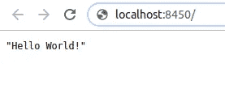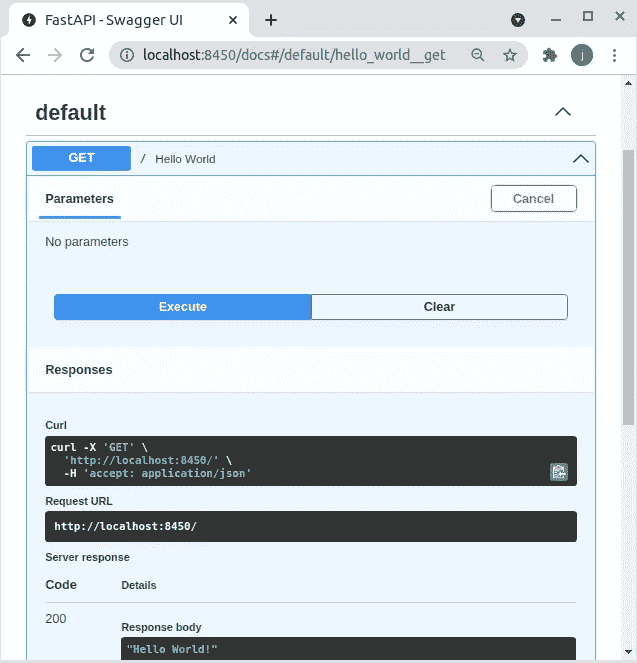

# **安装 EasyAuth**

```
pip install easy-auth[server]
```

## **向我们的应用添加 easy auth**

首先创建一个 JSON 文件，其中包含 easyauth 所需的环境变量。

接下来，让我们将 easyauth 添加到我们的基本应用程序中。

```
$ uvicorn --host 0.0.0.0 --port 8450 basic:app
.
...
06-12 00:33 EasyAuthServer ERROR    detected new EasyAuth server, created admin user with password: hmhjdfvg
INFO:     Application startup complete.
06-12 00:34 uvicorn.error INFO     Application startup complete.
INFO:     Uvicorn running on [http://0.0.0.0:8450](http://0.0.0.0:8450) (Press CTRL+C to quit)
```

访问同一个端点，注意所需的身份验证，输入 admin / pw 进行访问。

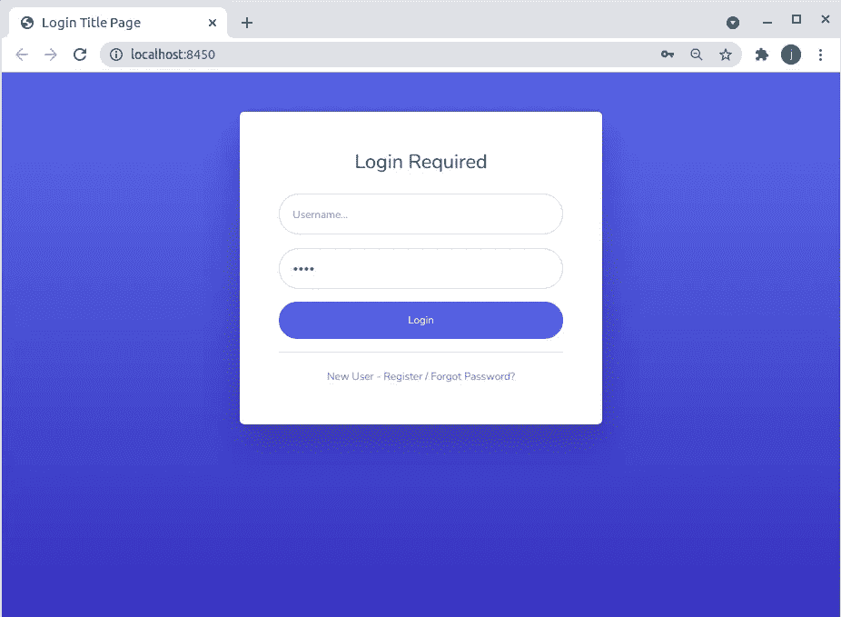

再次查看/docs 页面来查看 API，注意新的锁图标，表示身份验证要求。

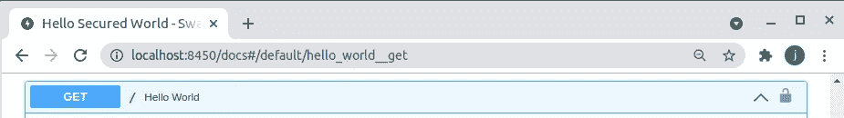

除了位于/login 的登录页面之外，默认端点也位于/register，允许创建新用户。

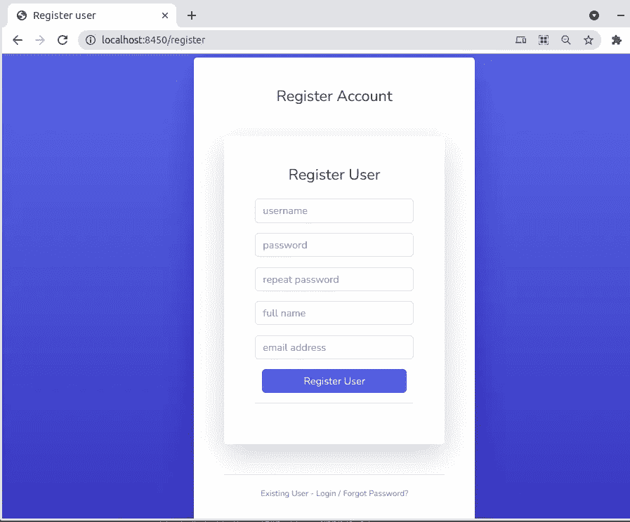

## **管理图形用户界面**

在/admin 中有一个管理 GUI，提供基本的用户管理任务，并允许额外的配置:电子邮件/ google 身份验证。


在身份提供者中，google 认证可以与 **default_groups** (分配给新注册用户的组)一起配置。

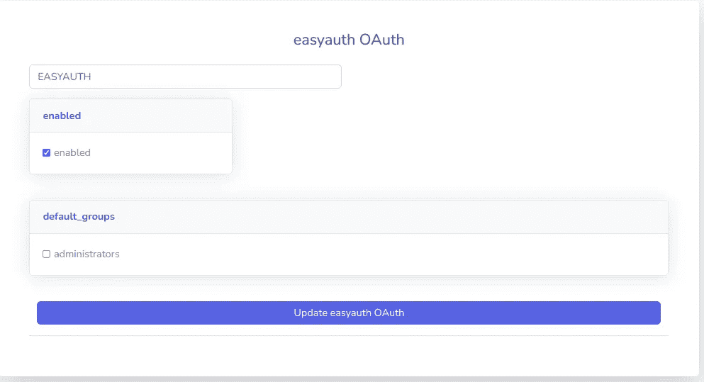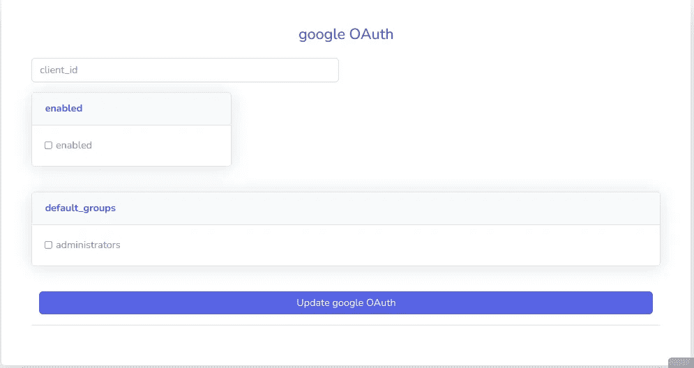

## **配置谷歌认证**

google client_id 应该与在[https://console.cloud.google.com/apis/credentials](https://console.cloud.google.com/apis/credentials)配置的凭证相对应

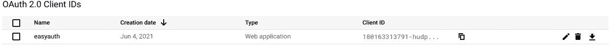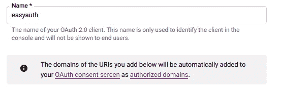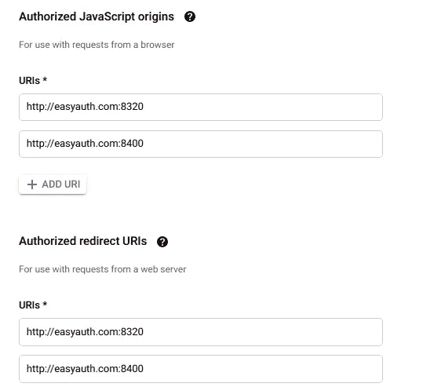

对于生产用途，URIs 应与外部世界拥有并可访问的域名相对应。

对于测试，客户端可以简单地将其/etc/hosts 中的本地 DNS 重定向到 127.0.0.1。

```
$ cat /etc/hosts
127.0.0.1 localhost easyauth.com
```

有了创建的凭证和 client_id，就可以配置 google 了

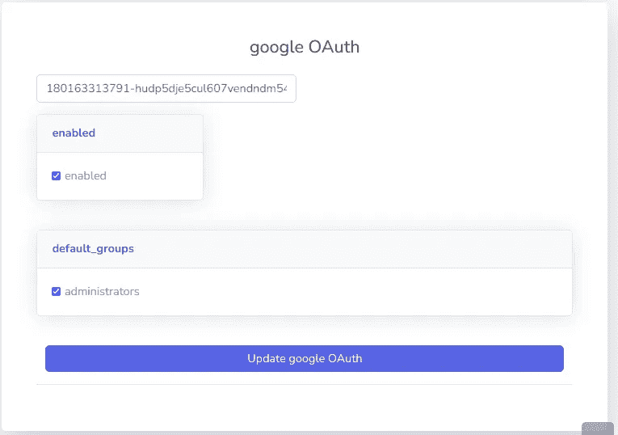

导航到[http://easyauth.com:8320/login](http://easyauth.com:8320/login)并观察登录选项的变化

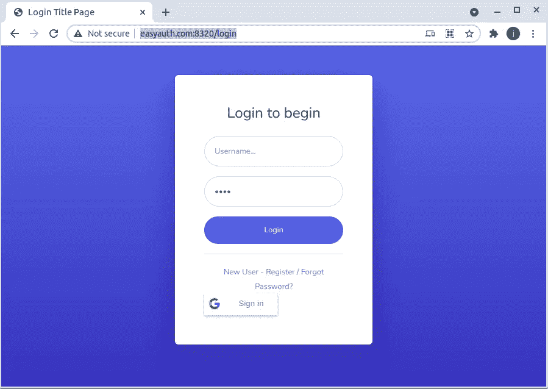

立即尝试使用 google 帐户登录:

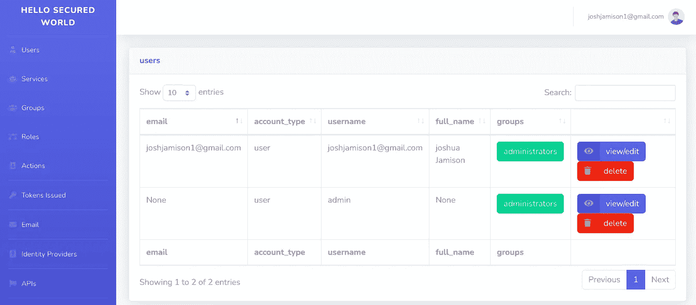

请注意，创建了一个与 google 帐户匹配的新用户，以及身份提供者中的 **default_groups** 。

使用 Google Sign In 登录后，只要 easyauth 令牌过期，浏览器就会被重定向到/login，并且会自动创建一个新令牌(登录时)。这种行为会一直发生，直到注销:


为了避免阻止每个新用户成为管理员，创建一些新的组、角色、动作并调整身份提供者中的 **default_groups** 。

**文件**:【https://easyauth.readthedocs.io/en/latest/ 

Github:[https://github.com/codemation/easyauth](https://github.com/codemation/easyauth)