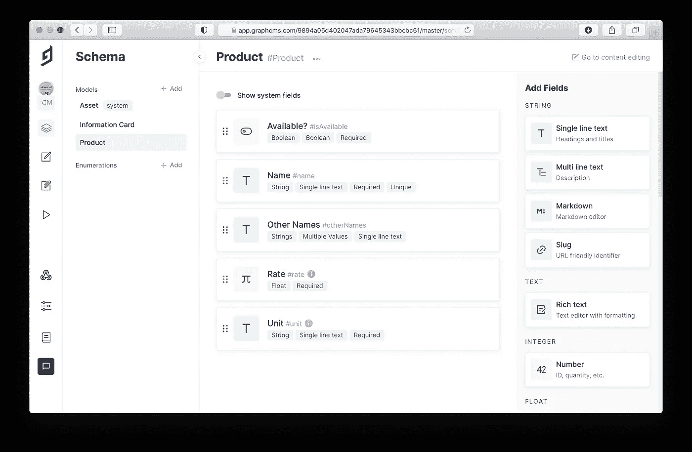
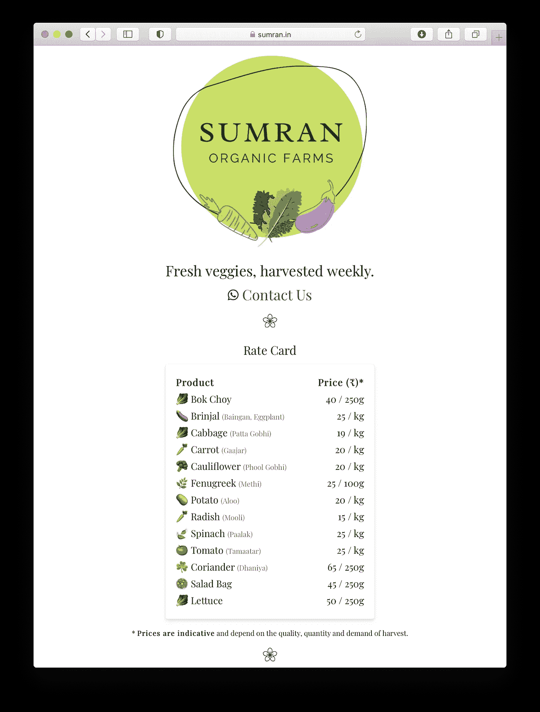

# 将 GraphCMS 添加到您的 Web 应用程序

> 原文：<https://itnext.io/add-graphcms-to-your-web-app-2d5a2930070a?source=collection_archive---------5----------------------->

> 我谈到了 graph CMS——一个无头的 CMS 以及如何将其添加到您的 web 应用程序中。



[GraphCMS](https://graphcms.com) 模式管理 [Sumran](https://sumran.in)

## 介绍

内容往往需要维护。通过集成像 [GraphCMS](https://graphcms.com) 这样的无头 CMS，你可以卸载内容管理，专注于**交付**内容。

GraphCMS 有一些很棒的特性，您会喜欢的:

*   它是基于 GraphQL 的，所以它解决了欠取和过取的问题
*   它将您的内容缓存到全球 190 多个位置，以实现更快的交付
*   它支持角色，所以你可以选择给队友完全或有限的控制权
*   它允许您在抓取过程中转换图像内容，以优化交付
*   它有一个交互式的 API 操场来测试你的查询和变化
*   它有一个慷慨的、永远免费的层级

## 装置

在 GraphCMS 中创建完项目和模式后，转到项目的“Settings > API Access”页面，为“Content API Access”生成一个新的令牌。将此文件和“端点 URL”复制到您的 web 应用程序的环境文件中。Next.js 示例:

```
// .env.localGRAPHCMS_ENDPOINT=[https://api-xxx.graphcms.com/v2/x](https://api-eu-central-1.graphcms.com/v2/ckless3iher0u01yy02aodwnk/master)xx
GRAPHCMS_TOKEN=xxx.xxx.xxx
```

Angular CLI 项目示例:

```
// src/environments/environment.tsexport const environment = {
  graphcmsEndpoint: '[https://api-xxx.graphcms.com/v2/x](https://api-eu-central-1.graphcms.com/v2/ckless3iher0u01yy02aodwnk/master)xx',
  graphcmsToken: 'xxx.xxx.xxx'
};
```

注意:不要忘记将这些环境变量添加到您的部署系统中(Vercel / Netlify /别处)。

要发送 GraphQL 查询和变化，您可以选择使用一个库，而不是自己形成这些请求。graphql-request 是一个很好的轻量级选项。

```
// Commandnpm i graphql-request graphql
```

设置`graphql-request`在每个请求的`authorization`头中包含 GraphCMS 令牌:

```
// Anywhereimport { GraphQLClient } from 'graphql-request';const **graphcmsEndpoint**: string= ENVIRONMENT.GRAPHCMS_ENDPOINT;
const **graphcmsToken:** string = ENVIRONMENT.GRAPHCMS_TOKEN;const **headers** = { authorization: `Bearer ${graphcmsToken}` };
const **graphqlClient** = new GraphQLClient(graphcmsEndpoint, { headers });
```

一旦你在 GraphCMS 的交互式游戏中测试了一个查询，你就可以把它粘贴到你的 web 应用程序中并发出请求:

```
// Anywhereimport { gql, GraphQLClient } from 'graphql-request';let products: Product[] = [];const **getProductsQuery** = gql`{
  products(where: { isAvailable: true }) {
    rate
    name
  }
}`;try {const getProductsResponse: { products: Product[] } = await graphqlClient.request<{ products: Product[] }>(getProductsQuery);
  products = getProductsResponse.products;} catch { products = []; }
```

要转换图像内容，向查询中添加必要的转换，如下所示:

```
// Anywhereimport { gql } from 'graphql-request';let informationCards: InformationCard[] = [];const **getInformationCardsQuery**: string = gql`{
  informationCards {
    id
    image {
      url (
        transformation: {
          image: { resize: { fit: crop, height: 800, width: 800 } }
        }
      )
    }
  }
}`;
```

就是这样！你可以在我做的一个简单的农产品定价 web 应用上看到 GraphCMS 的运行，这个应用叫做 sum ran:[https://sum ran . in](https://sumran.in)。因为我使用 Next.js 来预呈现内容，所以您不会看到客户端发出的请求。来源公开:[https://github.com/karmasakshi/sumran](https://github.com/karmasakshi/sumran/)。



Sumran 显示来自 GraphCMS 的动态内容

干杯！