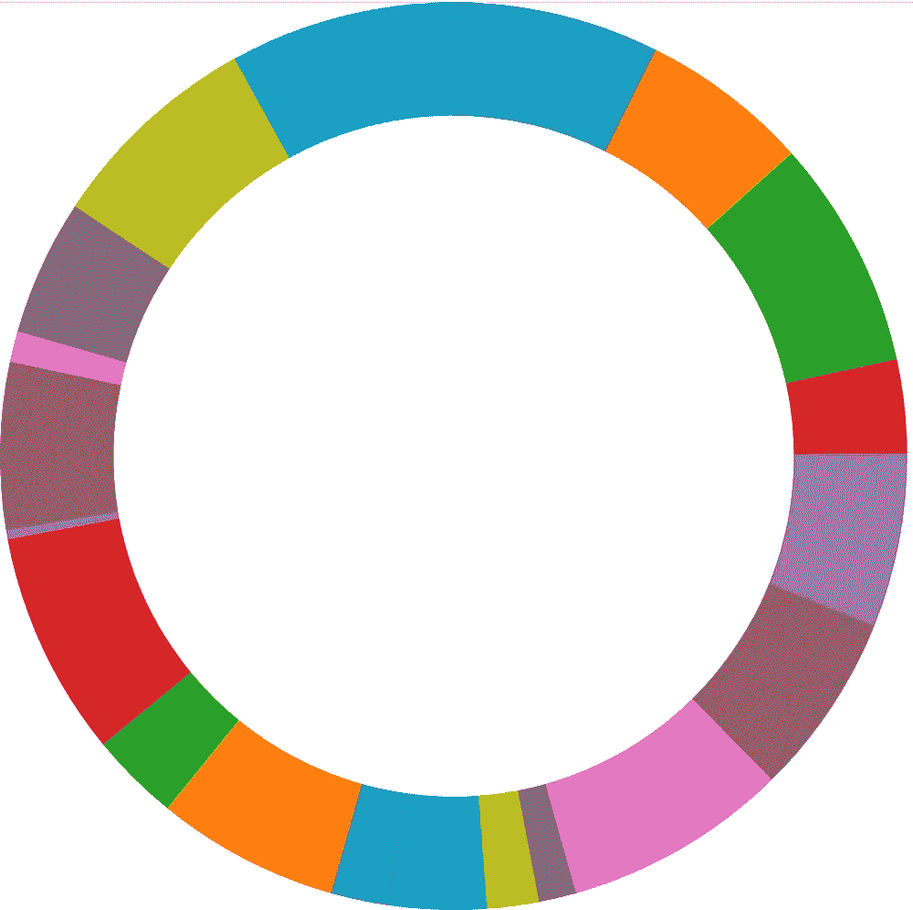
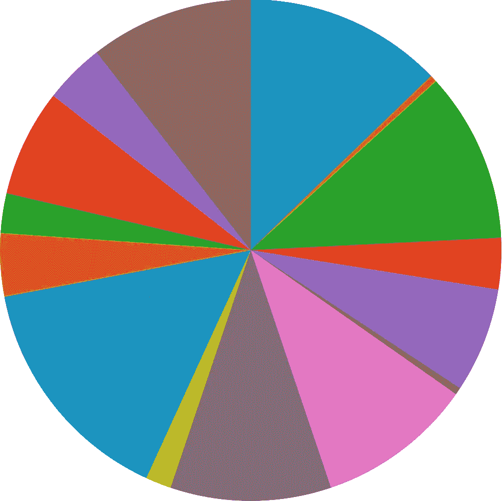
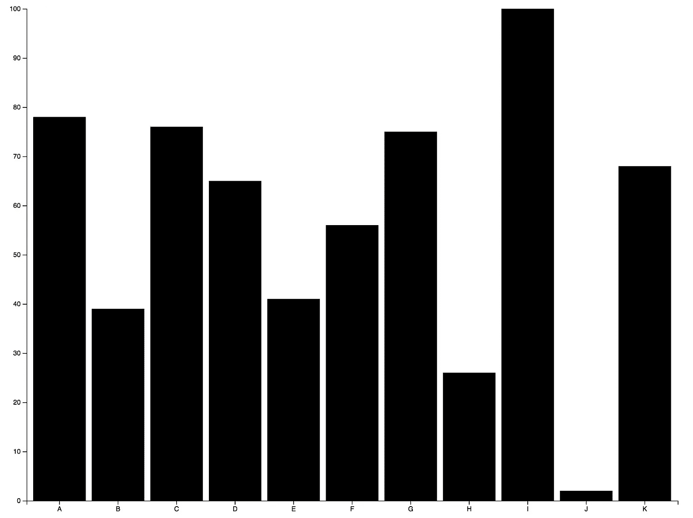
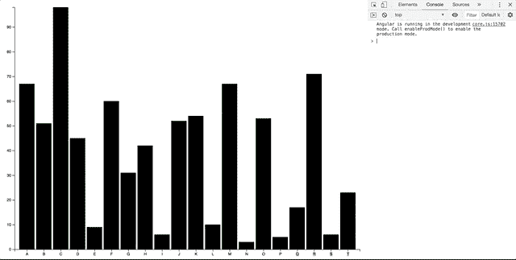
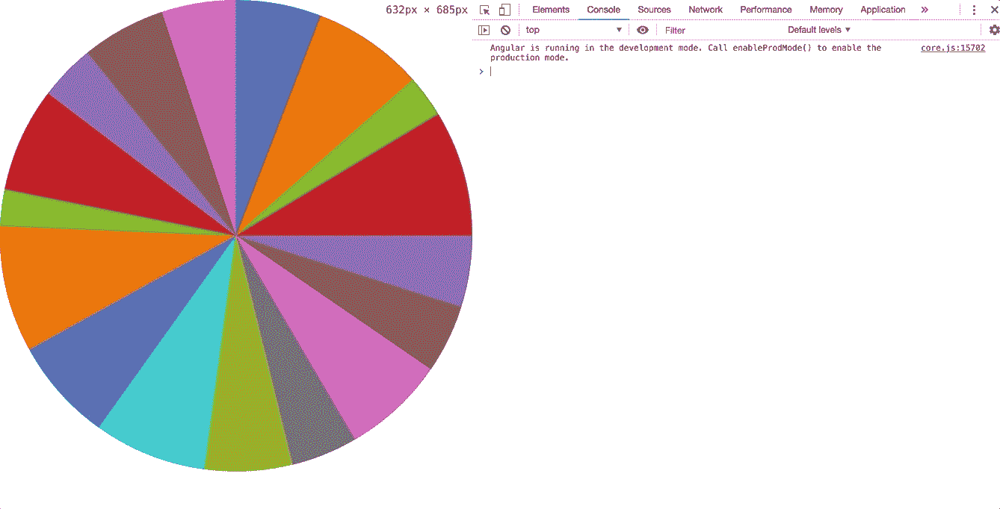
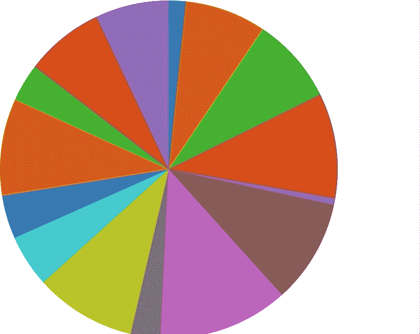
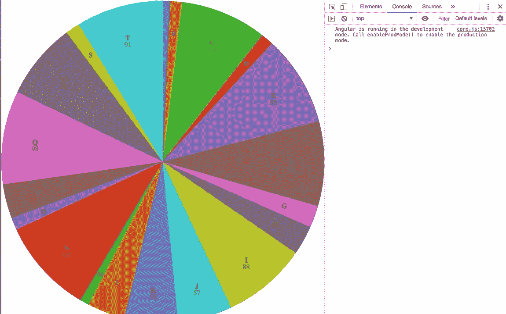
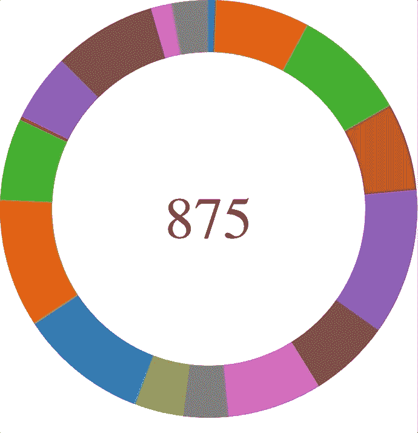
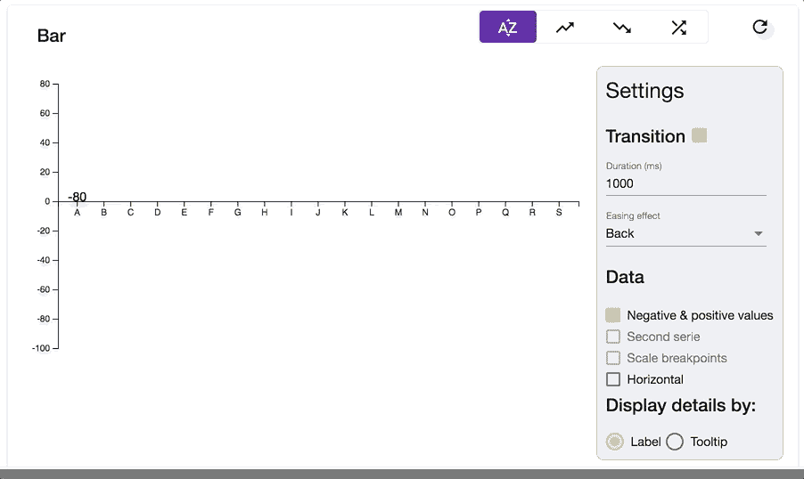

# 使用 d3.js 为 Angular 应用程序中的图表添加交互性

> 原文：<https://itnext.io/add-interactivity-to-your-charts-in-angular-2-applications-with-d3-js-78fd3718e6fb?source=collection_archive---------3----------------------->

## 用 d3.js 的魔力增强你的图表…


照片由 [rawpixel](https://unsplash.com/@rawpixel?utm_source=medium&utm_medium=referral) 在 [Unsplash](https://unsplash.com?utm_source=medium&utm_medium=referral) 上拍摄

有时在你的项目中，你需要添加一些精彩的图表和视觉元素来显示数据，帮助决策，…

幸运的是，Javascript 社区中存在大量选项来实现您的目标。

[d3.js](https://d3js.org/) (代表**D**ATA-**D**riven**D**documents)是你能找到的主要库之一。它给了你很大的自由来绘制符合你需要的图表。画廊里有很多令人印象深刻的例子。

**注意:**因为 d3 使用 HTML、SVG 和 CSS，所以您需要了解这种编程语言和数据格式的基本知识。在这篇文章中，我不会涉及 d3.js 的基础知识，你有很多教程。我更喜欢展示一些新奇的选项来提高他们的交互性。

# 准备操场


马库斯·斯皮斯克在 [Unsplash](https://unsplash.com?utm_source=medium&utm_medium=referral) 上拍摄的照片

## 属国

当然，我们将使用以下依赖关系:

*   *angular/cli:* 导入所有角度从属关系
*   *d3* :所有的 d3.js 库

假设您的计算机上已经安装了 Node，使用以下命令安装前面提到的依赖项:

```
npm i -g @angular/cli
ng new d3ChartsTutorial 
cd d3ChartsTutorial
npm i d3
npm i -D @types/d3
```

> **快速说明:**
> `-g` *表示全局安装依赖项*
> `-D` *表示安装为* devDependency *(不用于生产模式)*
> @types/d3 *包含 d3 对象对应的 TypeScript 类。*

## 数据服务

移动到 app 文件夹(`cd src/app`，运行`ng g s Data`，创建一个名为 *DataService* 的服务文件。给它喂食:

> **关于角度 CLI 的快速说明:** `*g*` *是*`*generate*``*s*`*是* `*service*` *的快捷方式(其他选项可用，* [*参考*](https://github.com/angular/angular-cli/wiki/generate) *)*

## HTML/CSS 清理

*   删除*app.component.html*中的内容
*   将此文件添加到 *style.scss* (或 *style.css* 取决于您的 css 扩展文件):

```
html,body {
  width: 100%;
  height: 100%;
  margin: 0 !important; // override user agent stylesheet
  padding: 0 !important; // override user agent stylesheet
}
```

让我们来点魔法吧！

# 绘制图表

## 饼图/圆环图

(仍在`src/app`目录中)

生成一个新组件`ng g c PieChart`。多亏了这个组件，我们将能够绘制一个馅饼或一个甜甜圈，因为甜甜圈是一个特殊的馅饼。

这段代码看起来非常冗长，但它是不言自明的，所以我让您仔细阅读它。

以这种方式拆分代码是有目的的，特别是为了图表的响应性，稍后会有更多的细节。

如果你更喜欢画饼图，设置`innerRadius(0)`(第 48 行)。

预览:



## 条形图

(仍在`src/app`目录中)

生成一个新组件`ng g c BarChart`。尽可能简单，它包含 X 和 Y 轴以及横条。

同样，代码是不言自明的，您可以看到它呈现了什么:



## 响应能力如何？

让图表有反应是非常容易的。它包括两个步骤。

首先，添加一个窗口监听器来捕捉 resize 事件(在 *ngOnInit* 方法中)。其次，创建相应的`resize`方法:

制作响应性饼图…



弹性十足！

如您所知，我们更新了 svg 维度，然后更新了图表配置(饼图/圆环图的弧线，条形图的轴刻度),最后，我们重新绘制了所有图表，这意味着饼图/圆环图的切片或条形图以及条形图的轴。

## 交互性

添加一些很酷的东西可能会很有趣，比如一个会跟随鼠标移动的工具提示。或者如果您喜欢在条形或切片附近放置一些标签。让我们把一些动态与过渡(缓解功能和延迟)也。

**工具提示**

添加工具提示只需要很少的修改。首先向组件添加一个 CSS 规则:

```
styles: [
  `div.tooltip {
    position: absolute;
    text-align: center;
    width: 80px;
    height: 40px;
    padding: 5px;
    font: 12px sans-serif;
    background: black;
    color: white;
    border: 0px;
    border-radius: 8px;
    pointer-events: none;
    vertical-align: middle;
    z-index: 10;
  }`
]
```

您可以注意到 *mousemove 回调*参数数据结构在饼图和条形图之间的变化。这来自于我们提供的数据:

```
this.slices.data(this.pie(this.dataSource)); // For pie chart
this.bars.data(this.dataSource); // For bar chart
```



流畅的工具提示耶！

**标签**

*条形图*

以下是相应的标签 CSS 规则:

```
svg text.label {
  fill: black;
  font: 15px;
  font-weight: 400;
  text-anchor: middle;
}
```

要适应的代码

*饼状图*

对于饼图，我们将显示高于 5%的每个切片的名称，以及高于 25%的切片的值。代码如下:



*甜甜圈图*

不要忘记更新代码，将您的饼图转换为圆环图:

```
private setArcs() {
  const thickness = .75; // Or any value you want
  this.arc = d3.arc()
  .outerRadius(this.radius)
  .innerRadius(this.radius * thickness);
}
```

然后，为总计和悬停项指定标签属性。

它呈现如下:



当然，我也可以使用 css 类，但是我更喜欢以编程方式管理样式，以避免大量的文件。

**转场(动画)**

d3.js 中的过渡非常容易管理。

3 种应用在 d3 对象上的方法，比如条或片，给你的图表增加一些活力。

```
this.bars
  .transition()
  .ease(d3.easeBounce) // or any other ease function (optional)
  .duration(150)
```

你甚至可以用`.delay((d, i) => i*80)`加上一个延迟来增加一个很酷的效果。下面是一些演示 d3 动画功能的例子:



要在悬停饼图/甜甜圈切片时添加动画，您必须在图表中添加填充(您可以在条形图中找到)并使用两条弧线(一条在鼠标悬停时，另一条在鼠标离开时)。现在，因为你熟悉 d3，我猜你可以自己动手做；)

您还可以使用`.attrTween()`方法来处理同步动画。我让你在[文档](https://github.com/d3/d3-transition#transition_attrTween)上检查一下。

# d3.js，一个有争议的库？

为什么会有争议？正如我们所看到的，它非常方便、完整和直接！

第一个缺点是它的学习曲线非常陡峭。文档很密集，但是您很容易迷失在细节中。为了提高您的技能，您必须从示例跳到代码示例，以获取一些信息。

最后，d3 使用 SVG 和 HTML，而 Canvas 似乎提供了更好的性能。

更多细节，我推荐你 [*为什么我不再用 D3.js*](https://medium.com/@PepsRyuu/why-i-no-longer-use-d3-js-b8288f306c9a) 作者[保罗·斯威尼](https://medium.com/u/e0982f40a196?source=post_page-----78fd3718e6fb--------------------------------)和 [*作者*](https://medium.com/dailyjs/the-trouble-with-d3-4a84f7de011f)*[伊恩·约翰逊](https://medium.com/u/f682ddbdedde?source=post_page-----78fd3718e6fb--------------------------------)的《D3 的麻烦》。*

# 结论

作为结论，我想说 d3.js 是一个令人印象深刻的库。它允许绘制惊人的图表，甚至疯狂的动画([烟花](http://www.decembercafe.org/demo/firework/))。

虽然学习掌握 d3 似乎很难，但我认为它是在 Angular 应用程序中维护图表和视觉元素的最佳开源选项。其庞大的社区(Github 上超过 80k 颗星星)和众多的例子有助于维护你的代码。

## 寻找创意？

可以在以下两个网站上找到许多示例和代码样本:

 [## 热门街区-bl.ocks.org

bl.ocks.org](https://bl.ocks.org/) [](https://beta.observablehq.com/) [## 可观察量

### 借助用于数据分析、可视化的交互式笔记本电脑，更快地发现见解，更有效地进行交流

beta.observablehq.com](https://beta.observablehq.com/) 

你可以在我的 GitHub 上找到所有代码:

[](https://github.com/AvocadoVenom/d3ChartsTutorial) [## AvocadoVenom/d3ChartsTutorial

### d3.js 图表在 Angular 应用程序中的实现

github.com](https://github.com/AvocadoVenom/d3ChartsTutorial) 

*Nota Bene:我完全知道代码片段是密集而“简洁”的。一些代码示例可能会被省略，请在评论中询问更多的精确度:)*