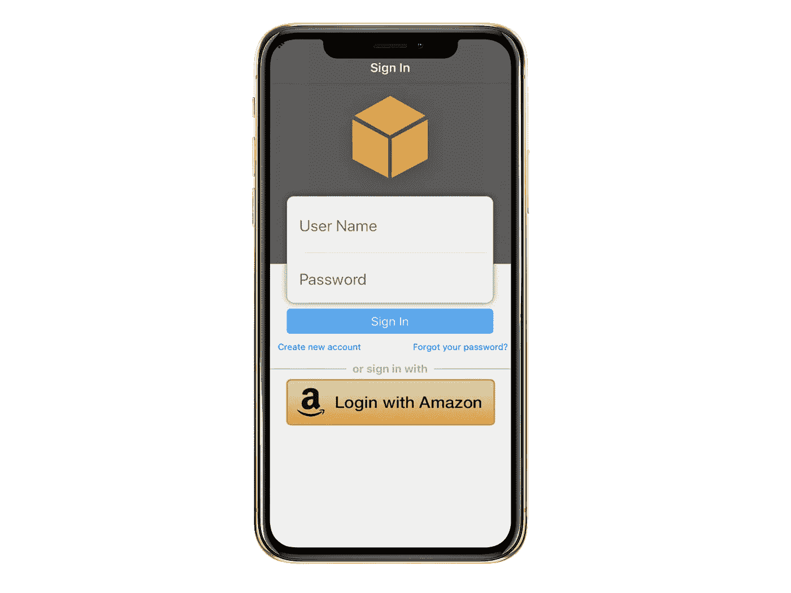
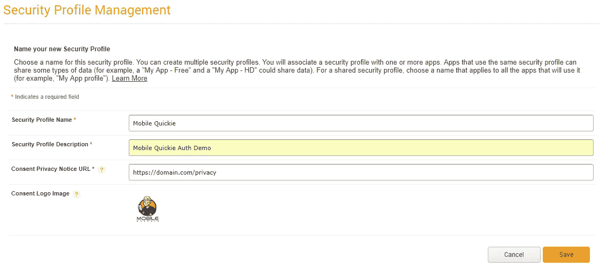
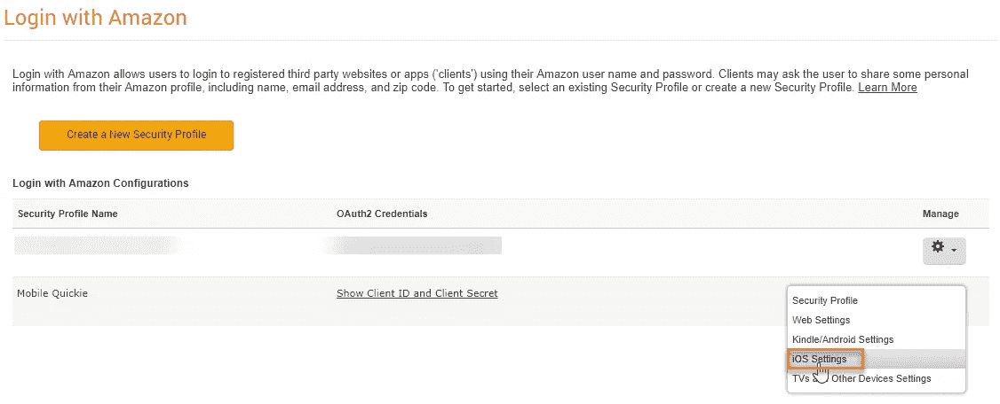
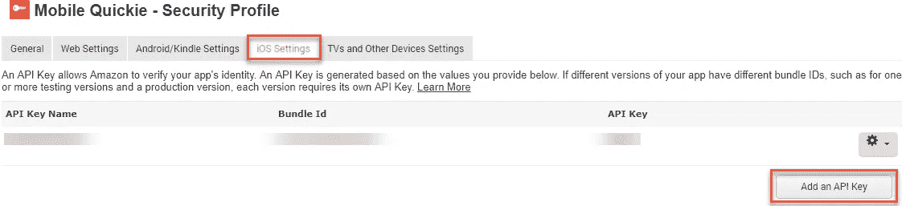
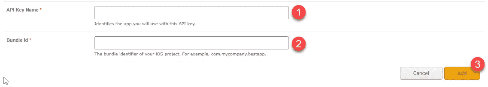
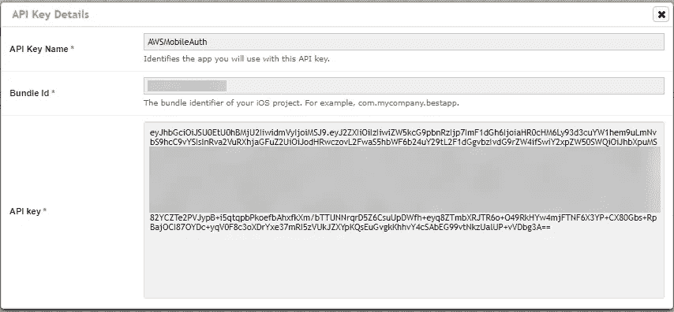
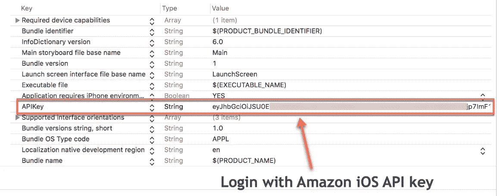
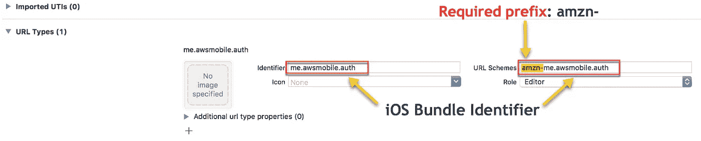
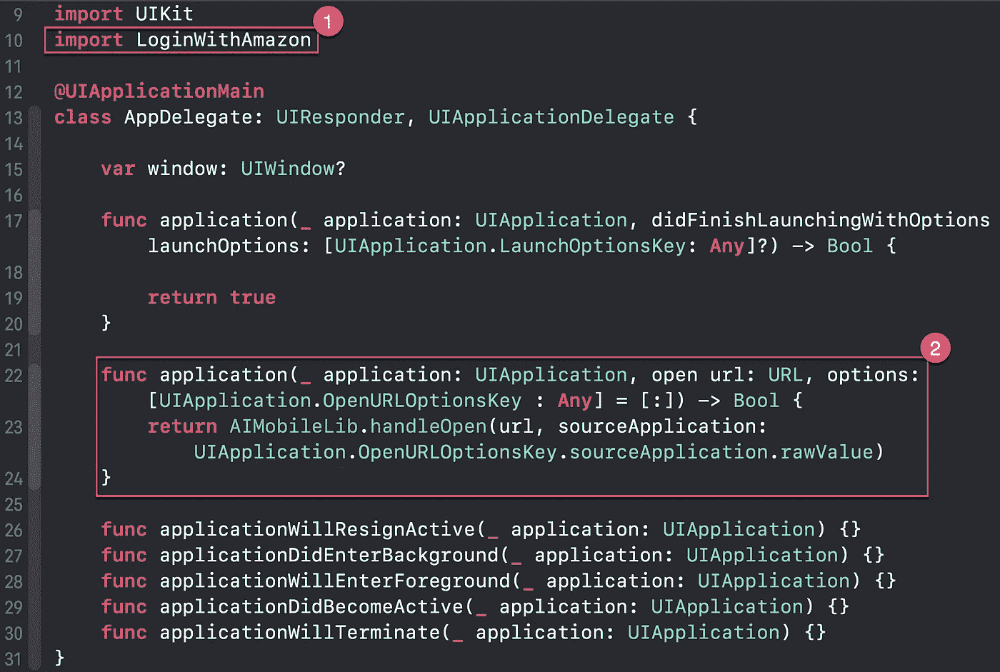

# 为 iOS 添加 Amazon 登录

> 原文：<https://itnext.io/add-login-with-amazon-to-your-ios-swift-app-d1b07655d31a?source=collection_archive---------3----------------------->


我们通过将亚马逊(LWA)登录添加到我们的 iOS Swift 应用程序中，继续进行身份验证。在这个由两部分组成的系列中，我们将把 LWA 添加到 iOS 应用程序中，允许您的用户使用他们的亚马逊帐户进行身份验证。作为一名开发者，LWA 是一种非常强大的体验，因为你正在利用一个品牌 2 亿客户的信任，同时获得一些东西，如他们的姓名、电子邮件地址和邮政编码，以构建更个性化的体验。


> 收集用户信息，如姓名、电子邮件、电话号码或年龄，是移动开发者在应用中添加社交登录或第三方登录提供商的主要原因之一。

当开发者收集关于他们的用户的信息时，他们可以开始与这些用户互动。这是一个双赢的局面，用户可以通过已知的提供商和凭证快速轻松地登录，而你可以收集一些关于他们的信息😊。

将此与**不登录**的用户进行比较。除了他们的应用活动和基本的人口统计数据，你对他们个人一无所知。

所以，这是**在你的 iOS 应用**中添加亚马逊登录的第 1 部分。这第一篇文章将着重于注册和创建一个 LWA 项目，然后下载和实施 LWA SDK 到一个 iOS Swift 应用程序中。第 2 部分将重点关注联合 LWA 和 Amazon Cognito 来为应用程序用户获取临时凭证，以便安全地访问您的 AWS 资源。第 2 部分类似于我们如何处理社交登录提供者，然而，LWA 并不是由 AWS Mobile SDK*AWSMobileClient*提供的本地支持，而 AWS Mobile SDK 在实现脸书和谷歌时为我们完成了所有繁重的工作。

在我之前的[谷歌登录](/google-sign-in-using-aws-amplify-and-amazon-cognito-69cc3bf219ad)和[脸书登录](/facebook-login-using-aws-amplify-and-amazon-cognito-4acf74875a04)集成文章中，用户只需在你的应用中选择*使用谷歌登录*或*继续使用脸书*按钮，并分别使用他们的谷歌或脸书凭证进行认证，同时保持在你的应用流中。*登录亚马逊*从用户角度来看也是同样的交互。



注意:您的应用程序可以支持脸书登录，谷歌唱歌，并与亚马逊同时登录。你不局限于只有一个供应商。

我们开始吧！

# 第一部分——亚马逊开发者和 LWA 设置

向亚马逊注册登录

1.登录亚马逊开发者门户:[https://developer.amazon.com/login-with-amazon](https://developer.amazon.com/login-with-amazon)

2.点击**注册一个开发者账户**在开始下。或者点击[这里](https://developer.amazon.com/login-with-amazon?)。

3.点击**创建新的安全配置文件。**


4.通过提供如下所示的**安全档案名称**和**安全档案描述**，完成安全档案管理表。

*仅供参考:安全配置文件名称是显示在向移动用户显示的同意屏幕中的名称。*



## 将你的 iOS 应用标识符添加到 LWA 安全配置文件

5.点击安全配置文件的齿轮，然后**选择 iOS 设置**



6.在 iOS 设置选项卡下，选择**添加 API 键按钮。**



7.提供一个 **API 键名**和**包 Id** 。捆绑包 Id 需要与您的 iOS 项目捆绑包标识符相匹配。例如 *com.domain.appname*



8.选择 API key 下的 **Show** 来显示巨大的 API Key 以及 API Key 名称和 Bundle Id。**复制 API 密钥**并保存以备后用。几分钟后，我们将在我们的 iOS 项目 *Info.plist* 文件中使用它。



# 第二部分— iOS 应用程序

用亚马逊 iOS starter 项目克隆这个[登录。这是一个与亚马逊 SDK 登录的基础项目，已经添加了一个与 Objective-C SDK 交互的基本 Swift 代理。](https://github.com/mobilequickie/LoginWithAmazoniOSSwift)

```
git clone [https://github.com/mobilequickie/LoginWithAmazoniOSSwift.git](https://github.com/mobilequickie/LoginWithAmazoniOSSwift.git)
```

## 将您的 LWA iOS API 密钥添加到 Info.plist

1.复制上面第 8 步中的 API 密钥。如果您忘记复制并需要再次引用它，请单击此处的并选择显示客户端 ID 和客户端密码作为您的安全配置文件名。

2.在您的 Xcode 项目中，选择 *Info.plist*

3.添加一个名为 **APIKey** 的 String 类型的新键，并将 iOS API 键中的**粘贴到所示的值中。**



## 将 URL 方案添加到您的 Info.plist

1.  在 Xcode 项目中，选择目标项目> Info，然后展开 URL 类型(0)
2.  单击“+”创建新的 URL 类型
3.  在“标识符”栏中，键入您的 iOS 应用程序标识符
4.  在 URL Schemes 字段中，输入您的应用程序标识符，但要确保添加了 amzn 前缀。例如，amzn- **您的应用标识符**



添加登录 Amazon 的 URL 方案

# 在 AppDelegate 中初始化 LWA 库

在 AppDelegate.swift 文件中，我们执行了以下操作:

添加导入 **LoginWithAmazon**
添加打开网址功能



[https://gist . github . com/mobile quickie/ba f1 CD 3a 2 C4 a6 e 04 FD 0d 1756 f 9543d 67](https://gist.github.com/mobilequickie/baf1cd3a2c4a6e04fd0d1756f9543d67)

我们将 LoginWithAmazonProxy.swift 类添加到 Xcode 项目中。

LoginWithAmazonProxy.swift 要点代码

**我们覆盖了默认的 ViewController。Swift 与以下:**

修改 ViewController.swift 文件以实现 AIAuthenticationDelegate，并添加所需的函数 requestDidSucceed、requestDidFail 和登录按钮活动。

用 Amazon auth flow 处理登录的主视图控制器

**运行 App，测试签到流程**

使用单点登录流程登录 Amazon 的典型用户体验流程:

第一步:用户点击亚马逊按钮**登录**

步骤 2:Amazon 登录屏幕(用户使用 Amazon 凭证进行身份验证)

步骤 3:同意屏幕(如果您不需要任何用户详细信息，可以跳过此屏幕，但这有什么意思呢？)

客户完成登录和同意流程后，他们会被自动重定向回您的 iOS 应用程序。在 Amazon.com 用户通过身份验证后，您可以随时检索他们的个人资料(姓名、电子邮件和邮政编码)。

# 最后的想法

拥有超过 2 亿个亚马逊帐户，使用亚马逊登录是为您的用户提供的另一个伟大的第三方登录提供商。请记住，第三方登录提供商集成对开发人员的最大好处是能够收集用户信息。另一个好处是用户不需要记住另一个用户名/密码。

既然我们已经通过登录亚马逊(LWA)验证了我们的用户，我们现在可以将 LWA 与亚马逊 Cognito 集成，为我们的移动用户提供临时、有限的 AWS 凭据来调用我们的 AWS 资源。请继续关注第 2 部分，我们将继续使用 LWA，使用 AWS Amplify 实现我们的应用程序，并使用 Amazon Cognito 添加联合登录。