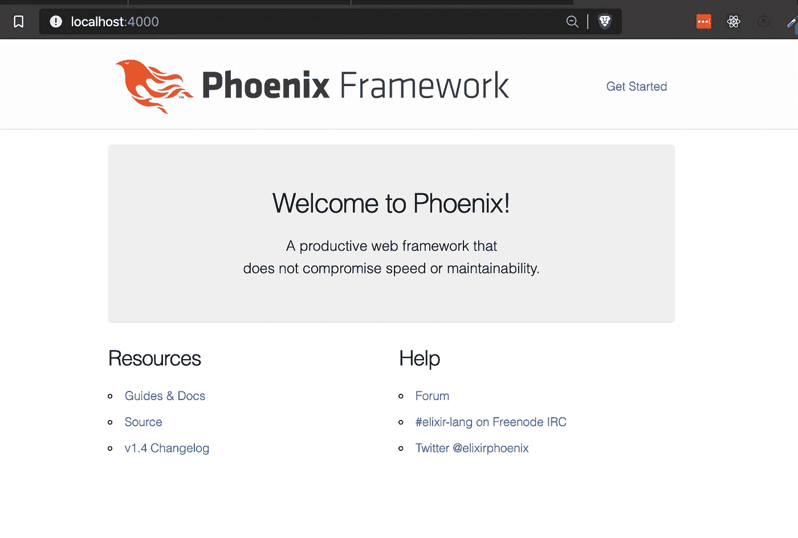
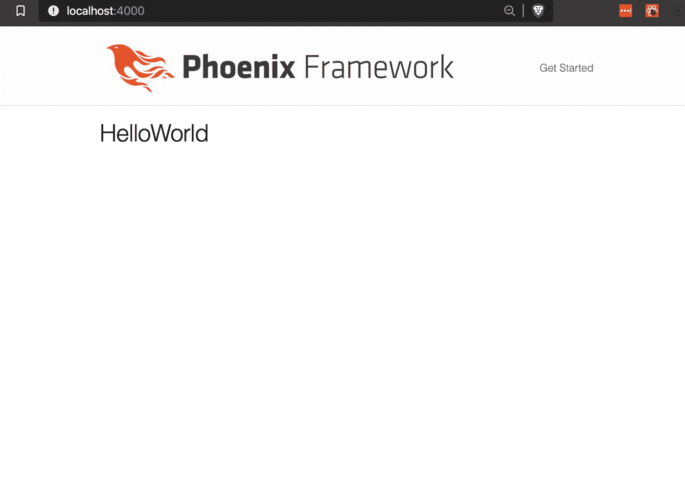

# 将 React 添加到凤凰城

> 原文：<https://itnext.io/add-react-to-phoenix-92c590fbbc7f?source=collection_archive---------1----------------------->


关于如何添加 React 的教程。JS 到你的仙丹凤凰 app。

我将在这里展示如何添加 React。JS 转换为 phoenix 应用程序中的特定模板。就像`react-rails`的工作原理一样。

你有一个模板，你可以在里面渲染一个 react 组件，还可以传递一些道具！本教程不需要任何 webpack 配置！

为了保持同步，我使用了以下版本:

```
elixir "~> 1.5"
phoenix "~> 1.4.6"
```

让我们从头开始创建一个 phoenix 项目:

```
$ mix phx.new yourproject
$ cd yourproject
$ mix deps.get
$ mix ecto.setup
$ mix phx.server
```

有了这些，访问`localhost:4000`然后我们就有了一个运行的凤凰 app。



# 添加 React

添加 React 的方法有很多种。JS 但是正如我前面所说，这种方法是为了将 react 组件添加到 phoenix 应用程序的特定模板中。我们将使用一个名为 [remount.js](https://github.com/rstacruz/remount) 的不可思议的 javascript 库来安装模板中的组件。

## 1.安装 React

进入 assets 文件夹，手动安装 react.js:

```
$ cd assets
$ yarn add react react-dom [@babel/preset-react](http://twitter.com/babel/preset-react)
```

让我们先将`@babel/preset-react`添加到我们的`.babelrc`配置中:

```
# edit /assets.babelrc
# change it to this{
  "presets": [
    "@babel/preset-env",
    "@babel/preset-react"    <------- ADD HERE
  ]
}
```

之后，在 assets 的 js 目录中创建一个测试组件。这个只是一个呈现消息的哑组件。

```
$ mkdir js/react/src/components/Test.js# edit assets/js/react/src/components/Test.jsimport React from 'react'const Test = () => (
 <h1> Hello World </h1>
)export default Test
```

## 2.添加重新装载

Remount 可以将 HTML 中的任何 react 组件挂载为自定义元素。让我们首先安装 remount:

```
yarn add remount
```

在 assets 的 js 目录中为 react 创建一个条目文件

```
# Create an entry file for your react
$ mkdir js/react/src/app.js# This is the important part, where
# Remount will mount your component as a custom html element
# And you wil simply use this custom element in your template htmlimport { define } from 'remount'
import Test from './components/Test'define({ 'x-anynameyouwant': Test })
```

我们不要忘记，我们需要将这个 react 条目文件导入到 Phoenix 主 js 文件中。在底部添加:

```
# edit /assets/js/app.js// We need to import the CSS so that webpack will load it.
// The MiniCssExtractPlugin is used to separate it out into
// its own CSS file.
import css from "../css/app.css"// webpack automatically bundles all modules in your
// entry points. Those entry points can be configured
// in "webpack.config.js".
//
// Import dependencies
//
import "phoenix_html"import "./react/src/app.js"// Import local files
//
// Local files can be imported directly using relative paths, for example:
// import socket from "./socket"import "./react/src/app.js" <---------------------- ADD HERE
```

## 是时候渲染我们的 react 组件了

打开任何模板`html.eex`文件。对于本教程，我将编辑`templates/page/index.html.eex`:

```
# Inside /templates/page/index.html.eex
# Replace the whole content with your react element that was defined via remount<x-anynameyouwant></x-anynameyouwant>
```

检查您的 phoenix 应用程序，应该会使用我们添加的 react 组件进行更新:



## 奖金:

您还可以将道具传递给自定义元素:

```
<x-anynameyouwant props-json={{"name": "John"}} ></x-anynameyouwant>
```

在这里阅读更多重装上阵的特色:[https://github.com/rstacruz/remount](https://github.com/rstacruz/remount)

就这么简单！现在，您可以在控制器中进行查询，将其传递给模板，然后作为道具传递给自定义元素，以便 react 组件可以接收它！

> 谢谢！如果有帮助，请鼓掌。对乐意帮忙的问题进行评论