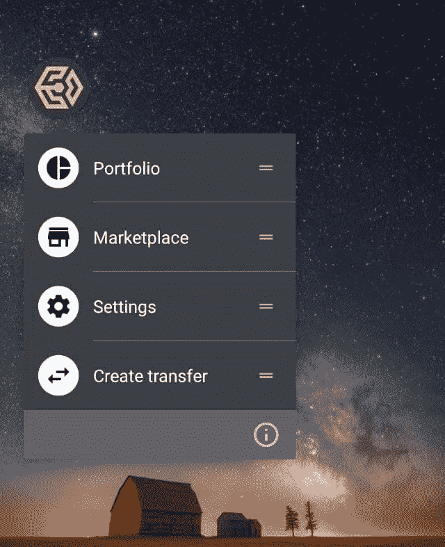

# 向您的 PWA 添加快捷方式

> 原文：<https://itnext.io/add-shortcuts-to-your-pwa-c182963a90ff?source=collection_archive---------2----------------------->

虽然 PWAs 的终结已经有一段时间了，但是[渐进式网络应用](https://web.dev/progressive-web-apps/)一直在变得更好。

不仅处理器一直在快速改进，而且
[V8 也在每一次迭代中变得越来越好](https://nodesource.com/blog/why-the-new-v8-is-so-damn-fast/)。

因此，如果你没有时间用 [React Native](https://reactnative.dev/) 、 [Flutter](https://flutter.dev/) 或者用 [Swift](https://www.apple.com/swift/) 或 [Kotlin](https://kotlinlang.org/) 构建你的移动应用，PWA 仍然是一个不错的低门槛选择。

添加了[可屏蔽图标](https://web.dev/maskable-icon/)让你的应用程序终于有了一个更吸引人的图标，如果你决定`install`它，它将会出现在你的手机屏幕上。

如果您想尝试可屏蔽图标，请查看[可屏蔽
应用](https://maskable.app/)——它允许您轻松地为您的应用创建可屏蔽图标。

什么能让你的应用程序更吸引人，让它看起来更像是`native`的快捷方式。

快捷方式可以通过在手机上长按和在桌面上右击来实现。当用户长按时，他会看到一个上下文菜单，里面有你的应用程序的某些动作的链接。

让我们假设你开发了一个银行应用程序，你希望你的用户能够快速访问`https://my-shiny-bank.io/send-money`下的**转账**屏幕

为了将这个快捷方式添加到您的 PWA 中，您必须将`shortcuts`
部分添加到您的`manifest.json`文件中:

一旦您添加了快捷方式部分(您希望在上下文菜单中看到的图标)并重新部署了您的应用程序，您应该会得到类似于以下内容的结果:

应用快捷方式

如果你的应用功能隐藏在认证之后，不要忘记在成功认证后添加到快捷方式`"url": "/send-money"`的重定向。

好的设计应该是可预测的——所以，如果你的`shortcuts`代表你的应用程序的菜单点，那么你应该在你的快捷方式和菜单中使用相同的图标。

如果你正在为你的产品使用材料设计库，你可以下载
材料设计图标:[https://github.com/material-icons/material-icons-png](https://github.com/material-icons/material-icons-png)或[https://www.materialpalette.com/icons](https://www.materialpalette.com/icons)

如果你使用[字体牛逼](https://fontawesome.com/)你可以使用这个字体[牛逼 2 PNG](https://fa2png.app/) 转换器。

*最初发表于 2021 年 4 月 17 日*[*igorkosta*](https://igorkosta.github.io/blog/pwa-shortcuts)