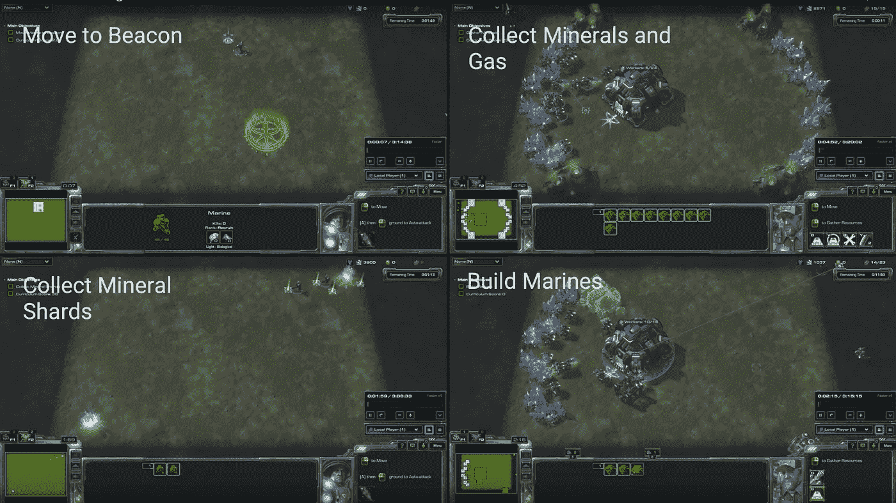
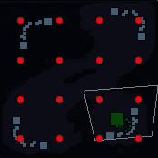
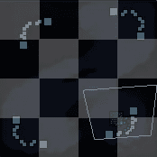

# 给你的 PySC2 代理添加智能攻击

> 原文：<https://itnext.io/add-smart-attacking-to-your-pysc2-agent-17fd5caad578?source=collection_archive---------1----------------------->



在我的上一个教程中，我们给我们的 PySC2 代理添加了一个 Q-Learning 表，但是攻击坐标是预先编程的，这意味着代理实际上只在 Simple64 地图上工作，并且当敌人单位或建筑一旦到达攻击坐标就在单位的攻击半径之外时，很容易陷入僵局。

在本教程中，我们将为代理添加智能攻击，这样它可以根据探测到的敌人单位或建筑的位置来学习攻击哪里。

请注意，本教程是从上一个教程停止的地方开始的。为了遵循这些步骤，您应该从教程中复制最终代码。

*致暴雪/深度思维 AI 工作坊* *的朋友们，这是第一个涵盖我演讲细节的教程。*

# 1.建立

首先，让我们对现有代码进行一些调整，我们将在本教程的剩余部分使用这些代码。

首先，让我们添加一个常数:

接下来，让我们重命名我们的类:

不要忘记父`step`方法调用:

如果您遵循了我以前教程的一些早期版本，似乎有些人在未定义的属性方面有问题，所以让我们将我们的 init 方法级联到父类(这在以前的教程中已经解决了):

我们还将使用小地图做一些有趣的事情，所以让我们将现有的`transformLocation`方法重命名为`transformDistance`，并添加一个新的`transformLocation`方法，如下所示:

新的`transformLocation`方法将基于你的基地的位置，而不仅仅是距离，来转换绝对的 *x* 和 *y* 值。

既然我们已经将我们的`transformLocation`方法重命名为`transformDistance`，我们应该更新使用旧`transformLocation`方法的动作:

现在，我们可以开始添加智能攻击功能。

# 2.改变攻击动作

以前我们只有一个单一的“攻击”动作，我们要用几个动作来代替那个动作，这样我们的机器人就可以攻击小地图上几个点中的一个。

用以下内容替换现有的`smart_actions`定义:

您的`smart_actions`变量现在包含一个攻击小地图上每个单独的 *x* 和 *y* 坐标组合的动作。

既然机器人可以从可能的动作列表中选择攻击动作，我们需要确保它正确地执行攻击。

在整个 IF 条件段之前插入以下代码:

我们在这里做的是检测 smart_action 变量中下划线的存在，因为没有其他包含下划线的操作，我们可以假设它是一个小地图攻击操作。接下来，我们拆分智能动作以获得 *x* 和 *y* 坐标。

现在我们可以更新攻击条件如下:

注意，我们将 x 和 y 值转换为整数，因为它们仍然是来自`split`命令的字符串。

现在是测试它的好时机，看看它的表现如何:

```
python -m pysc2.bin.agent \
--map Simple64 \
--agent attack_agent.AttackAgent \
--agent_race T \
--max_agent_steps 0 \
--norender
```

看起来你的机器人好像什么都没做，因为在某种程度上它就是这样！由于可能的行动非常多，大多数时候它会试图攻击一个地点，即使它没有选择一个单位。我们将在下一步处理这个问题。

# 3.简化动作

虽然我们的小地图是 64x64 的网格，但海军陆战队的攻击半径足够大，你只需要一个 4x4 的网格就可以有效地覆盖所有的 Simple64 地图，所以我们将减少我们的攻击点如下:



减少简单 64 地图的攻击点

这可以使用以下代码将您的攻击操作减少到 16 种组合:

现在每个方块实际上覆盖了一个 16x16 的子方块网格，我们通过将每个轴上的值移动 8 来移动较大方块中间的攻击坐标。这比贴在每个方块的左上角提供了更好的地图覆盖。

试运行一下，看看你的机器人发现建造补给站和兵营的速度有多快。

# 4.添加敌人的位置

过一会儿，你的机器人可能会认为它应该攻击敌人基地的一般区域，但是如果地图上没有单位，它也可以学习在那个区域攻击，不管那里是否有敌人单位。这是因为你的奖励与位置有关，而不是与敌人单位的存在有关。

我们可以通过将小地图中的敌人位置添加到`current_state`变量中来改善这一点。

现在你可以再次运行代理程序，通过足够多的游戏，它将开始学习攻击包含敌人单位或建筑的坐标。

# 5.简化状态

这么多敌人坐标的一个问题是你的机器人会花很长时间去探索所有可能的选项。正如我们的小地图可以减少到 16 个方块的攻击空间，我们也可以减少到 16 个方块的状态空间，从而减少探索时间:



简单 64 地图的敌人位置网格

为了做到这一点，我们检查每个方块内的每个坐标，如果任何坐标包含一个敌人单位，整个方块被标记为“热点”。

现在运行你的代码，你会发现你的机器人的攻击组件更加智能了！

# 6.SCV 攻击作弊

有一件事可能会让你对你现在的机器人感到沮丧，那就是它仍然会花很多时间派 scv 去攻击敌人。在未来的教程中，我们将会介绍一个更完善的奖励系统，它可以阻止这种行为，但是现在你可以简单地通过替换这段代码来欺骗和禁止 scv 攻击的能力:

有了这个:

一旦这个代码到位，我发现我的代理能够在很少的游戏中击败敌人。

本教程的所有代码都可以在[这里](https://github.com/skjb/pysc2-tutorial/tree/master/Building%20an%20Attack%20Agent)获得。

在[我的下一个教程](https://medium.com/@skjb/build-a-sparse-reward-pysc2-agent-a44e94ba5255)中，你会发现如何使用稀疏奖励来训练你的代理。

如果你喜欢这个教程，请在[上支持我。也请和我一起上](https://www.patreon.com/skjb) [Discord](https://discord.gg/qTZ65sh) ，或者关注我上 [Twitch](https://www.twitch.tv/skjb) 、 [Medium](https://medium.com/@skjb) 、 [GitHub](https://github.com/skjb) 、 [Twitter](https://twitter.com/theskjb) 和 [YouTube](https://www.youtube.com/channel/UCZcEvhpV4_6llcrWrWQ2wsg) 。