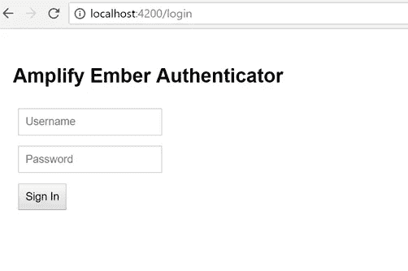
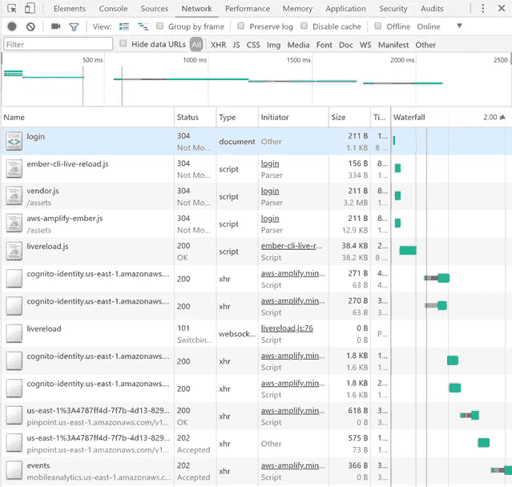

# 向 Ember.js 应用程序添加 AWS Amplify

> 原文：<https://itnext.io/adding-aws-amplify-to-an-ember-js-application-72683167c476?source=collection_archive---------3----------------------->

**更新(2018 年 9 月):**现在包括 ember-cli 插件，用于引导您的 Amplify 应用程序和 Amplify CLI，

[AWS Amplify](https://aws.github.io/aws-amplify) 跨不同类别的云操作提供了一个声明式且易于使用的接口。AWS Amplify 可以很好地与任何基于 JavaScript 的前端工作流兼容，并为移动开发者提供本地反应。AWS 放大器在 GitHub 上[开源可用。](https://github.com/aws/aws-amplify)

默认实现适用于 Amazon Web Services (AWS ),但 AWS Amplify 被设计为开放的，可以“插入”任何定制的后端或服务。

默认实现允许开发人员立即集成 AWS 服务，如用于用户身份验证的亚马逊 Cognito、用于云存储和私人用户文件的亚马逊 S3。AWS Amplify 还为 Amazon API Gateway 提供了开箱即用的支持，包括自动签名版本 4 请求签名以及处理 GraphQL 查询的能力。

Ember.js 是一个依赖注入 JavaScript 框架。它允许您在 JavaScript 应用程序中使用 handlebars 模板和组件以及 MVC 类型接口。它还具有生成组件、服务、路由以及在本地构建和服务您的应用程序的良好 CLI 体验。

通常，使用 AWS JavaScript SDK，配置认证、分析和利用其他 AWS 服务可能会[困难和复杂](https://aws.amazon.com/blogs/developer/creating-and-deploying-a-serverless-web-application-with-cloudformation-and-ember-js/)。AWS Amplify CLI [通过使用 AWS CloudFormation 自动化您的 AWS 后端配置，并向您的客户端应用程序提供 JavaScript 配置文件(aws-exports.js)以供使用，来帮助编排这个](https://aws.amazon.com/blogs/mobile/deploying-an-emberjs-mobile-web-application-mobile-hub/)。

AWS Amplify 在使用 JavaScript 的云服务时极大地简化了客户端编程。它为与云服务交互提供了声明性语法和分类结构。

`import Amplify, { Auth, Analytics } from 'aws-amplify'`

这在支持 ECMAScript 2015 和 node_modules 的框架中非常有效。对于不支持 web 组件或普通脚本标签的框架来说，包含 babel 或类似内容以移植到兼容的浏览器代码可能是一个挑战。在这篇文章中，我将描述如何在 Ember.js 应用程序中使用 AWS Amplify(当包含在普通 html 页面的

**要求:**

*   [Node.js LTS](https://nodejs.org)
*   [ember . js](https://emberjs.org)
    *本帖使用 3.0
*   [member-CLI-amplify](https://github.com/grimbonious/ember-cli-amplify)
*   AWS Amplify CLI

安装并配置上述要求，然后引导您的 Ember 应用程序:

```
$ ember new myAwsAmplifyApp
$ cd myAwsAmplifyApp
$ ember s
```

在这之后，您应该会在您的浏览器中看到默认的 Ember welcome 组件。该组件默认安装，渲染在`app/templates/application.hbs`中。接下来，我们将使用 Amplify CLI 配置我们的项目(确保您已经根据存储库中概述的说明安装并配置了它)。

从应用程序的根目录中:

```
$ amplify init
```

更改默认选项:

*   **源代码目录:** app
*   **构建目录** : dist
*   **开始命令**:余烬 s
*   **构建命令** : ember b

这将创建一个`aws-exports.js`文件，将其放在您的应用程序/目录中。完成后，添加 Amazon Cognito 认证:

```
$ amplify add auth
$ amplify push
```

现在，我们可以在 Ember 应用程序中使用 Amazon Cognito 的身份验证功能，我们的配置文件也用适当的值进行了更新。

接下来，从`node_modules` 文件夹导入 aws-amplify 库。Ember 可以很好地从`bower_components` 或`vendor/`文件夹中的文件导入脚本。但是，它不容易从 node_modules 文件夹中导入 es 模块。

安装`ember-cli-amplify` [插件](https://www.npmjs.com/package/ember-cli-amplify):

`ember install ember-cli-amplify`

接受所有问题的默认值。您现在可以通过带有依赖注入的 Ember 组件访问 AWS 放大器类别。

生成余烬组件:

`$ ember g component amplify-authenticator`

编辑`app/components/amplify-authenticator.js`文件:

```
import Component from '[@ember/component](http://twitter.com/ember/component)';
import { inject as service } from '[@ember/service](http://twitter.com/ember/service)';export default Component.extend({
  amplify:service(),
  username: null,
  password: null,
  message: null,
  error: null,
  actions: {
   signIn() {
      const auth   = this.get('amplify').Auth;
      const username  = this.get('username');
      const password  = this.get('password');
      const that   = this; auth.signIn(username, password)
         .then((result) => {
              that.set('error', null);
              that.set('message', result);
         })
         .catch((error) => {
              if (error.message) {
                  that.set('error', error.message);
              } else {
                  that.set('error', error);
              }
         });
   }
  }
});
```

接下来，编辑`app/templates/components/amplify-authenticator.hbs`文件:

```
<section class="amplify-authenticator">

 <h2>Amplify Ember Authenticator</h2>

 <div>
   {{input type="text" placeholder="Username" value=username}}
 </div>

 <div>
   {{input type="password" placeholder="Password" value=password}}
 </div>

 <div>
   <button onclick={{ action "signIn" }}>Sign In</button>
 </div>{{#if message}}
  <div class="amplify-message">
   {{message}}
  </div>
 {{/if}}{{#if error}}
  <div class="amplify-error">
   {{error}}
  </div>
 {{/if}}

 {{yield}}</section>
```

添加一些样式，编辑`app/styles/app.css`文件:

```
* {
 font-family: Arial;
 }.amplify-authenticator {
 padding: 1em;
 }.amplify-authenticator input {
 margin: 0.5em;
 padding: 0.5em;
 }.amplify-authenticator button {
 margin: 0.5em;
 padding: 0.5em;
 }.amplify-message {
 margin: 0.5em;
 padding: 0.5em;
 color: green;
 }.amplify-error {
 margin: 0.5em;
 padding: 0.5em;
 color: red;
 }
```

最后，生成一条路线:

`$ ember g route login`

这将生成一个/login HTTP 路由和一个 handlebars 模板视图文件。

编辑`templates/application.hbs`文件并删除欢迎页面组件。该文件现在应该只包含:

```
{{outlet}}
```

编辑`app/templates/login.hbs`文件:

```
{{outlet}}
{{amplify-authenticator}}
```

提供应用程序并访问登录页面:

`$ ember s`

将地址栏改为指向`/login`，您应该会看到登录表单:



在浏览器中打开开发者检查器，并切换到“网络”标签。您还应该在 inspector 中看到从 AWS 检索匿名访客凭证的网络请求。您还应该看到针对您的会话向 Amazon Pinpoint 发送的分析请求:



如果您尝试登录，您应该会看到来自 Amazon Cognito 的错误消息，例如，“用户不存在”。您可以将一个用户添加到您的 Amazon Cognito 用户池中，然后您应该能够从该表单中使用该用户登录。你现在也可以用同样的方式建立一个注册表单，创建用户，并在你的 Ember 服务中使用 AWS Amplify 的所有功能。您还可以从 CLI 启用更多 AWS 服务。访问 [AWS Amplify 文档](https://aws-amplify.github.io/amplify-js),了解如何利用 Ember 应用中的其他类别。

后续步骤:

*   使用 MFA 添加注册表单
*   初始化初始化器中的配置
*   使用初始值设定项检查已登录的用户会话
*   在实例初始化器中填充服务
*   使用 AWS Mobile CLI 构建并部署到亚马逊 S3