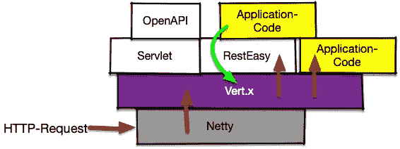

# 向垂直方向添加数据。来自 Quarkus 应用程序的 X web 层

> 原文：<https://itnext.io/adding-data-to-the-vert-x-web-layer-from-your-quarkus-application-da817e328a5f?source=collection_archive---------3----------------------->

我在我的 [Quarkus](https://quarkus.io/) [应用](https://github.com/RedHatInsights/policies-ui-backend)中创建了一个访问日志过滤器，作为 Vert.x web 路由器层的一个处理程序。现在，我需要将数据从 JAX-RS 层的业务逻辑传递到这个访问日志。这篇文章展示了一个可能的解决方案。


由[让-保罗·詹德利](https://pixabay.com/de/users/Amigos3D-2257343/?utm_source=link-attribution&utm_medium=referral&utm_campaign=image&utm_content=2059775)在[皮克斯拜](https://pixabay.com/de/?utm_source=link-attribution&utm_medium=referral&utm_campaign=image&utm_content=2059775)连接管道

在我的前两篇文章( [1](/how-to-mangle-http-headers-in-quarkus-d91a904adea7) 、 [2](/how-to-rewrite-http-request-paths-in-quarkus-aa85c3400d95) )中，我谈到了如何在 Vert.x web 路由器层修改 HTTP-requests，这对于上层是透明的。



我的代码的请求流(红色)和数据流(绿色)

这次我需要向下传输数据(上图中的绿色箭头)。我可以将它添加到 HTTP 响应的头中，但是由于这些数据不应该发送到客户端，所以这不是一个选项。

我的业务代码位于 JAX-RS [容器请求过滤器](https://github.com/RedHatInsights/policies-ui-backend/blob/master/src/main/java/com/redhat/cloud/policies/app/auth/IncomingRequestFilter.java)中，在对一个头字段进行一些处理后，从传入的请求中提取 accountId:

```
@PreMatching
@Provider
public class MyFilter implements **ContainerRequestFilter** { @Override
  public void filter(ContainerRequestContext **requestContext**) 
         throws IOException {

    String xrhid_header = **requestContext** .getHeaderString("x-rh-identity"); String accountId = getAccountId(xrhid_header); // see below
```

但是我现在如何将它转发给我在 Vert.x 层的日志处理程序呢？

## CDI 拥有一切

Quarkus 在 CDI 中提供了大量资源，随时可以注入到您的代码中。其中一个资源是当前 HTTP 请求的 Vert.x *RoutingContext* 。这个上下文有一个方法 *put(key，value)* 来沿着处理程序和 RouteFilters 链转发任意内容。我们可以通过这个助手获得上下文:

```
CurrentVertxRequest **request()** {
  if (currentVertxRequest == null) {
    currentVertxRequest = CDI.*current*()
          .select(CurrentVertxRequest.class).get();
  }
  return currentVertxRequest;
}
```

然后在我们的容器请求过滤器中使用它:

```
RoutingContext routingContext = **request()**.getCurrent();
routingContext.put("x-rh-account", accountId);
```

之后，我们可以在我们的[日志处理程序](https://github.com/RedHatInsights/policies-ui-backend/blob/master/src/main/java/com/redhat/cloud/policies/app/JsonAccessLoggerHandler.java)中再次从路由上下文中检索数据:

```
void log(RoutingContext **context**, ...  {
    String acctId = **context**.get("x-rh-account");
```

## 结论

上述代码位于代码库中的几个不同位置。上面是一个缩略版本，你可以在 GitHub 的链接类中看到完整的代码。您仍然可以看到如何从 Quarkus 代码中更高的更面向业务的层访问 Vert.x web 路由层，并使业务数据对 Vert.x web 层可用。