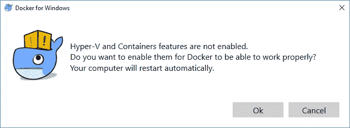
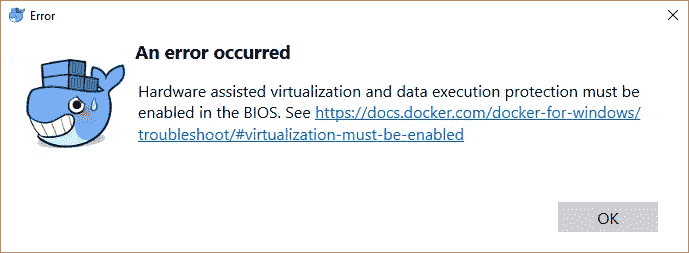
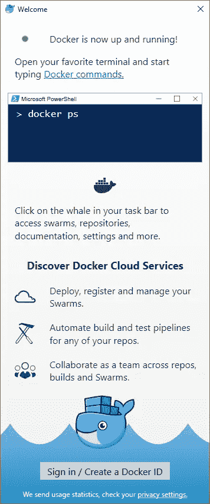
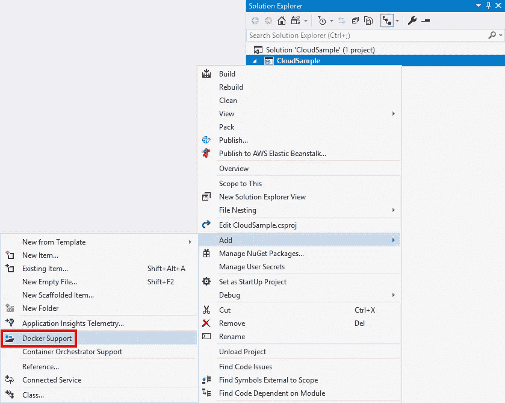
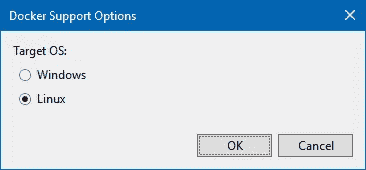
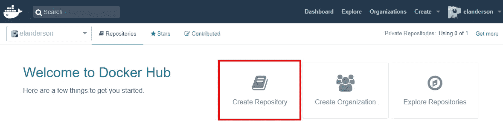
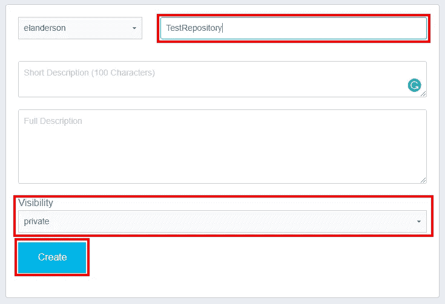
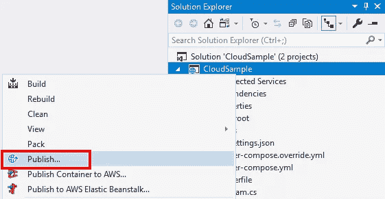
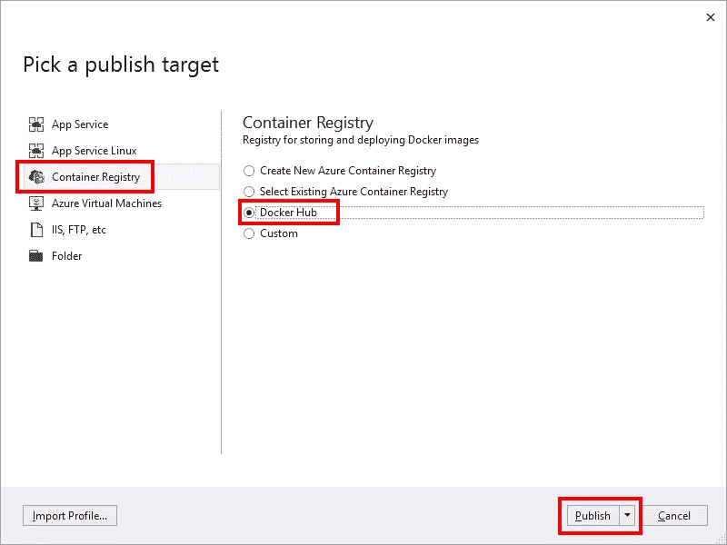
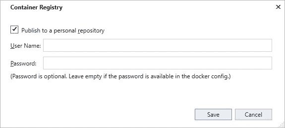

# 向 ASP.NET 核心应用程序添加 Docker

> 原文：<https://itnext.io/adding-docker-to-an-asp-net-core-application-61850327b3c9?source=collection_archive---------3----------------------->

我有一系列关于将 ASP.NET 核心应用部署到不同云提供商的帖子，这些云提供商提供支持 ASP.NET 核心的服务。如果你感兴趣的话，以下是这方面的所有帖子。

[谷歌云平台](https://elanderson.net/2018/06/deploying-an-asp-net-core-application-to-google-cloud-platform/)
[亚马逊网络服务](https://elanderson.net/2018/06/deploying-an-asp-net-core-application-to-amazon-web-services/)
[微软 Azure](https://elanderson.net/2018/07/deploying-an-asp-net-core-application-to-microsoft-azure/)

有人问我是否要写一篇关于部署到数字海洋的文章。虽然不在我最初的计划中，但这是个好主意。事实是，DigitalOcean 没有支持 ASP.NET 核心的服务，但他们支持 Docker，所以这篇文章将介绍如何在一个示例 ASP.NET 核心应用程序中添加 Docker 支持。寻找关于如何部署到数字海洋的未来帖子。

## 码头工人

Docker 是什么？引用维基百科[的话](https://en.wikipedia.org/wiki/Docker_(software)):

> **Docker** 是一个[计算机程序](https://en.wikipedia.org/wiki/Computer_program)，它执行[操作系统级虚拟化](https://en.wikipedia.org/wiki/Operating-system-level_virtualization)，也称为[容器化](https://en.wikipedia.org/wiki/Operating-system-level_virtualization)。它于 2013 年首次发布，由 [Docker 公司](https://en.wikipedia.org/wiki/Docker,_Inc.)开发
> 
> Docker 用于运行被称为“容器”的软件包。在一个典型的示例用例中，一个容器运行 web 服务器和 web 应用程序，而另一个容器运行 web 应用程序使用的数据库服务器。容器相互隔离，使用自己的一套工具和[库](https://en.wikipedia.org/wiki/Library_(computing))；他们可以通过明确的渠道进行交流。所有容器都使用相同的[内核](https://en.wikipedia.org/wiki/Kernel_(operating_system))，因此比[虚拟机](https://en.wikipedia.org/wiki/Virtual_machine)更加轻量级。容器是由“图像”创建的，这些图像指定了它们的精确内容。通常通过组合和修改从存储库下载的标准图像来创建图像。

安装 Docker

转到[这个](https://store.docker.com/editions/community/docker-ce-desktop-windows)链接，点击 Get Docker 链接下载安装程序。安装完成后，您必须注销并重新登录。当我重新登录时，我收到一条关于 Hyper-V 未启用的消息。



重新登录后，我收到以下关于硬件辅助虚拟化未启用的消息。



在调整了我的 BIOS 设置并重新登录后，Docker 的欢迎界面向我打来了招呼。



打开命令提示符并运行以下命令。

```
docker run hello-world
```

如果您的安装正在运行，您应该输出以下面开头的内容。

> Docker 的你好！
> 此消息显示您的安装似乎工作正常。

## 示例应用程序

这与云系列中的相同，但我把它包括在内，以防你错过了那篇文章。我们将要部署的示例应用程序是使用。NET CLI。以下命令是我用来创建应用程序、创建解决方案以及将项目添加到解决方案中的命令。我在 CloudSample 目录中运行了所有这些命令。

```
dotnet new razor --no-https
dotnet new sln
dotnet sln add CloudSample.csproj
```

## 添加 Docker 支持

在 Visual Studio 中打开上面创建的解决方案，右键单击项目并选择 **Add > Docker Support** 。



接下来，您将让选择您想要定位的操作系统。



这将把以下四个文件添加到您的项目中。

```
docker-compose.dcproj
docker-compose.override.yml
docker-compose.yml
Dockerfile
```

当您在 Visual Studio 中点击 run from 时，该过程还会将您的项目更改为在 Docker 中启动。


## 出版

为了发布，我们需要一个我们想发布到的注册帐户。有多种选择，但我将使用 [Docker Hub](https://hub.docker.com/) 。去 Docker Hub 注册一个账户。在您登录到您的**存储库**选项卡后，点击**创建存储库**。



在下一页中，输入存储库的名称，选择是私有还是公共，然后单击 **Create** 。我使用名称 TestRepository 并使其成为私有的。



现在我们有了一个 Docker Hub 帐户，希望回到 Visual Studio，右键单击您的项目并选择 **Publish** 。



在接下来的对话框中，选择**集装箱登记**选项，然后选择**对接机中枢**。然后点击**发布**按钮。



在下一个对话框中，输入 Docker Hub 的用户名和密码，然后点击**保存**。



保存后，Visual Studio 将构建应用程序并将其发布到 Docker Hub。

问题

如果你运气好的话，上述方法会对你有用。我碰到了几个问题，使得上面的失败。下面是我得到的第一个错误。

> 错误:无法构建服务“cloudsample ”:命令“/bin/sh-c dot net restore/cloud sample . csproj”返回了非零代码:1

经过一番挖掘，我发现了这个 GitHub 的问题。修复的要点是更改**docker 文件**中的以下内容。

```
Before:
RUN dotnet restore /CloudSample.csproj

After:
RUN dotnet restore -nowarn:msb3202,nu1503 -p:RestoreUseSkipNonexistentTargets=false
```

以上修复了发布模式下的构建，但是当工具试图标记图像时，发布仍然失败，并出现以下错误。

> 系统。异常:运行 docker.exe 标记命令失败。在微软。visual studio . web . azure . publish . containerregistryprofilevision . docker tag(ProcessStartInfo startInfo，String serverUrlString)
> 位于 Microsoft . visual studio . web . azure . publish . containerregistyprofilevisive .<postpublish async>d _ _ 24。MoveNext()
> --从抛出异常的前一个位置开始的堆栈跟踪的结尾--系统中的
> 。runtime . compiler services . taskawaiter . throwfornonsuccess(Task Task)
> at System。位于 Microsoft . visual studio . application capabilities . publish . viewmodel . profileselectorviewmodel .<runpublishtask async>d _ _ 116。MoveNext()

我还没有找到解决这个问题的方法。我最终使用 Docker CLI 来推送我的图像。这需要几个步骤。首先，使用以下命令登录。

```
docker login
```

接下来，使用 docker images 命令找到您尝试推送的图像。在我的例子中，它是 ID 为 f83e5adab340 的图像。当 ID 确定后，我们现在可以使用下面的命令来标记图像。

```
docker tag f83e5adab340 elanderson/testrepository
```

很重要的一点是，图像被标记上它将被推送到的存储库的名称。最后，运行下面的命令将带有指定标记的图像推送到存储库中。

```
docker push elanderson/testrepository
```

## 包扎

微软的团队已经使向现有项目添加 Docker 支持变得非常简单。Docker 是我已经有一段时间的表面意识，我期待着尝试一个实际的部署，看看它如何与 DigitalOcean 一起工作。

*原载于*[](https://elanderson.net/2018/08/adding-docker-to-an-asp-net-core-application/)**。**