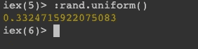
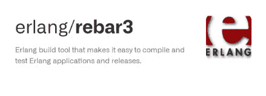
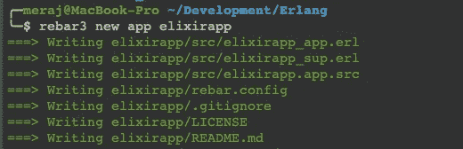
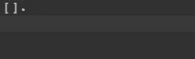
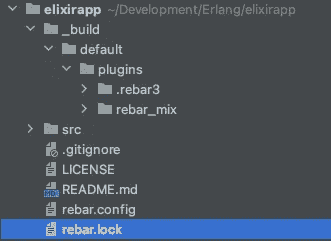
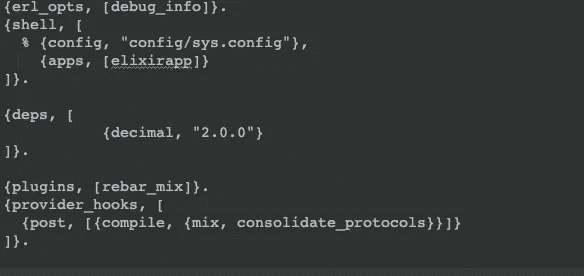
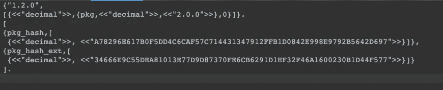
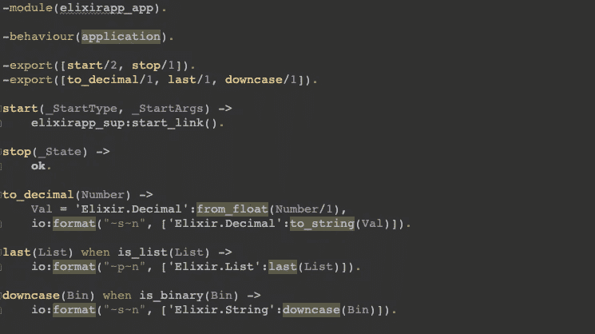
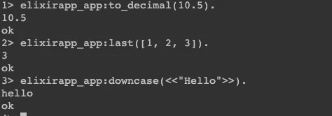

# 通过 Rebar3 向 Erlang 添加酏剂

> 原文：<https://itnext.io/adding-elixir-to-erlang-via-rebar3-2ad83476b627?source=collection_archive---------1----------------------->

E lixir 和 Erlang 都是运行在 BEAM 虚拟机上的函数式编程语言。两种语言的程序都被编译成字节码。可以从 Erlang 调用 Elixir 代码，反之亦然。因为 Erlang 模块由原子表示，所以可以很容易地从 Elixir 中调用 Erlang 库函数，如下所示



在这里，我从 Elixir 控制台调用 Erlang 的 **rand** 模块的**制服**函数。然而，本文的重点是反过来的——我们不想在 [rebar3](https://github.com/erlang/rebar3) 托管的 Erlang 应用程序中从 Erlang 代码访问 Elixir 函数。



## rebar3 是什么？

正如 rebar3 的 github 提到的—

> Rebar3 是一个 Erlang 工具，它使得以可重复的方式创建、开发和发布 Erlang 库、应用程序和系统变得非常容易

我假设您已经对 rebar3 有所了解，并且已经将它与 Elixir 和 Erlang 一起安装在您的系统上。如果你不熟悉 rebar3，[这篇](https://medium.com/erlang-central/building-your-first-erlang-app-using-rebar3-25f40b109aad)文章会很好的介绍。

## 创建 rebar3 项目

我使用 rebar3 命令创建了一个示例项目，如下所示



在创建新的应用程序后， **rebar.config** 将如下所示


还没有一个 **rebar.lock** 文件，但是运行`rebar3 get-deps`会生成一个如下所示的文件



这几乎是空的，因为还没有外部依赖。让我们改变这一点。

## 安装钢筋混合

我在这个项目中使用[**rebar _ mix**](https://github.com/Supersonido/rebar_mix)**安装并配置了 elixir 依赖项。**正如 github page 所说 **rebar_mix** 是— *“一个 rebar 插件，用于构建与 mix 的药剂依赖关系。”*

我在项目中添加了这个插件，在 **rebar.config** 中添加了下面几行

```
{plugins, [rebar_mix]}.
{provider_hooks, [
  {post, [{compile, {mix, consolidate_protocols}}]}
]}.
```

做一个`rebar3 get-deps`现在会在 **_build** 文件夹下创建一个**插件**目录，里面有 **rebar_mix**



## 添加酏剂依赖性

接下来，我通过在 **deps** 部分添加以下内容，在 **rebar.config** 中添加了一个药剂十六进制包 [decimal](https://hex.pm/packages/decimal)

```
{deps, [
           {decimal, "2.0.0"}
]}.
```

完整的 **rebar.config** 现在应该看起来如下—



执行`rebar3 get-deps`将获取新的依赖关系。此时 **rebar.lock** 文件应该如下所示



## 应用代码

现在我可以添加一些应用程序代码来从 app 访问 Elixir 库。编辑 **elixirapp_app.erl** 后，应该如下图所示



从 rebar3 shell ( **命令:rebar3 shell** )运行的一个示例显示，这些新添加的 3 个函数可以访问 Elixir 库。



所有酏剂模块都以前缀**酏剂**开头，后跟常规模块名。在这里，我从标准库中访问 Elixir 的**字符串**和**列表**模块，从新添加的**十进制**包中访问**十进制**模块。

## 结论

在本文中，我展示了如何在 rebar3 托管的 Erlang 应用程序中添加 elixir hex 包依赖项，以便从 Erlang 代码中访问 elixir 库。这款应用的完整源代码在这里——[https://github . com/imeraj/Erlang _ playground/tree/main/elixirapp](https://github.com/imeraj/erlang_playground/tree/main/elixirapp)

*更多详细和深入的未来技术帖子请关注我这里或* [*推特*](https://twitter.com/meraj_enigma) *。*

## 参考

*   [https://github.com/erlang/rebar3](https://github.com/erlang/rebar3)
*   [https://github.com/Supersonido/rebar_mix](https://github.com/Supersonido/rebar_mix)
*   [https://hex.pm/packages/decimal](https://hex.pm/packages/decimal)
*   [https://rebar 3 . org/docs/configuration/plugins/# elixir-dependencies](https://rebar3.org/docs/configuration/plugins/#elixir-dependencies)
*   [https://medium . com/Erlang-central/building-your-first-Erlang-app-using-rebar 3-25f 40 b 109 aad](https://medium.com/erlang-central/building-your-first-erlang-app-using-rebar3-25f40b109aad)