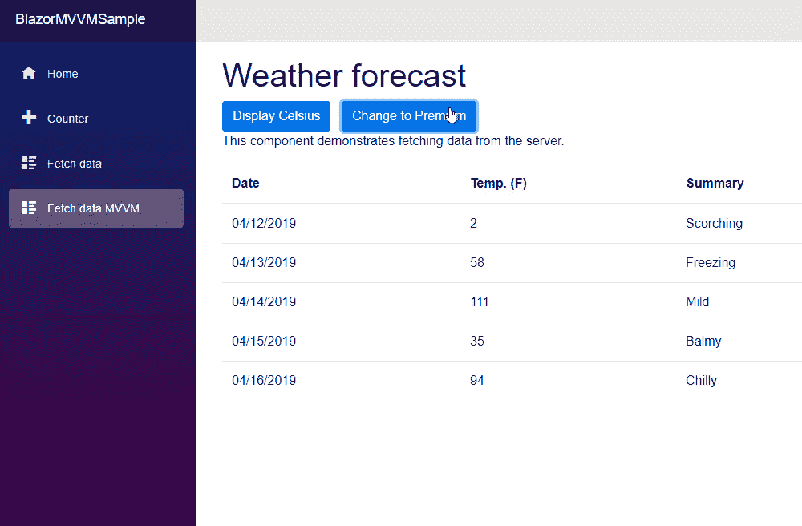
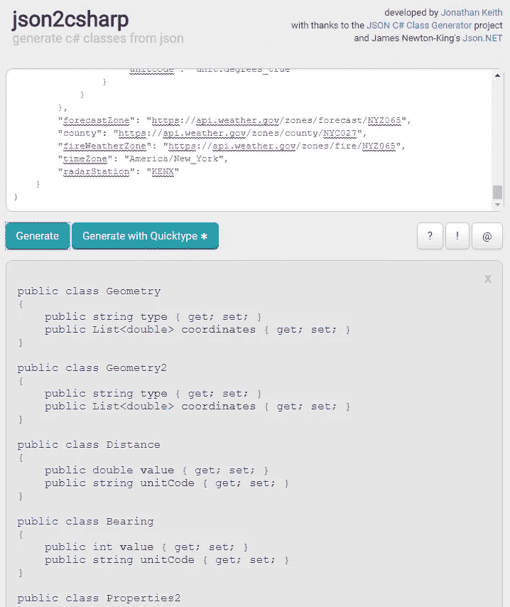
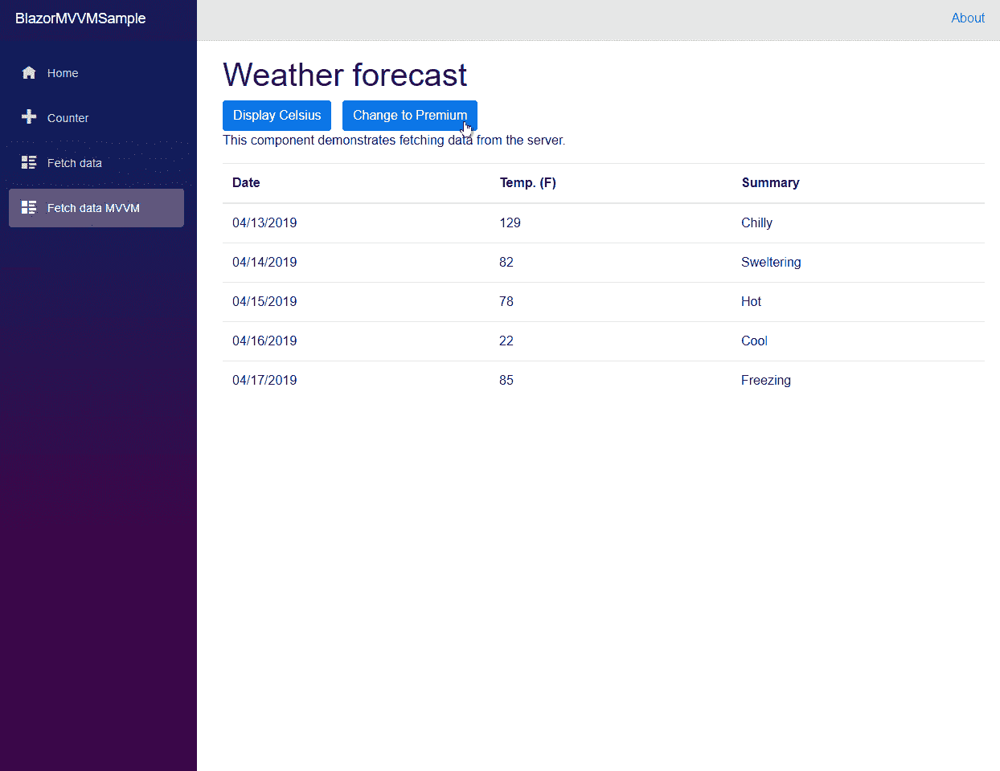
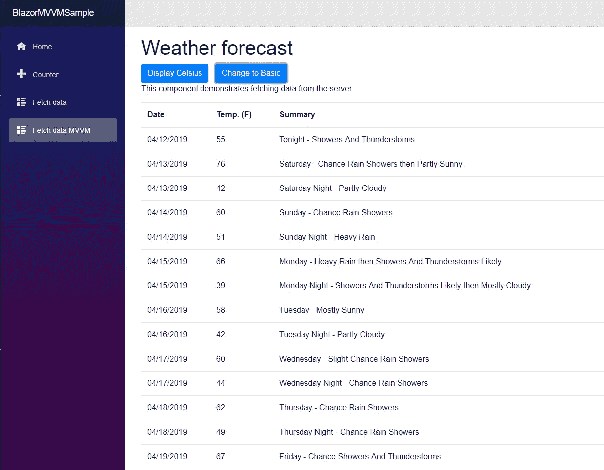
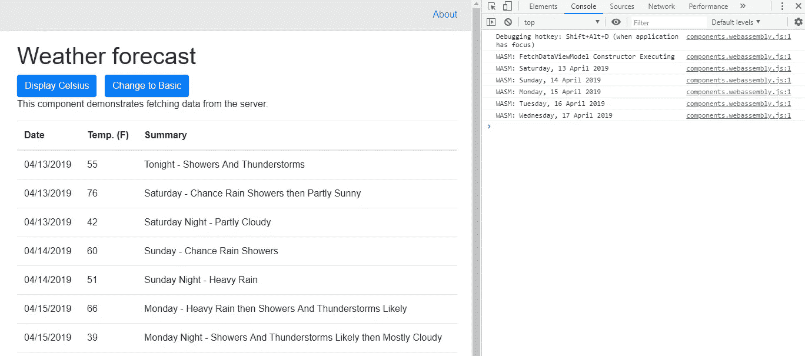
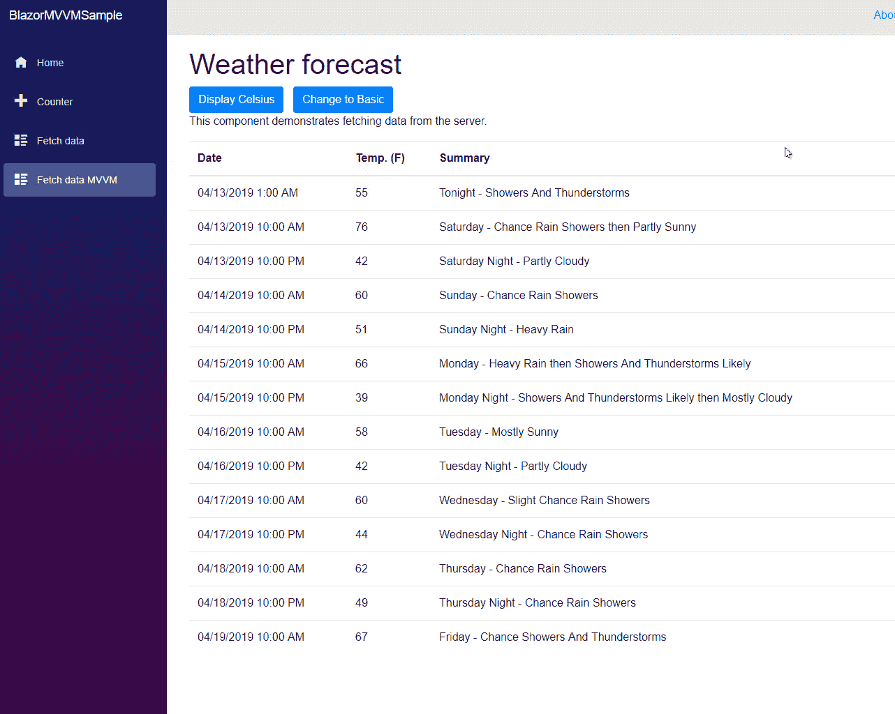
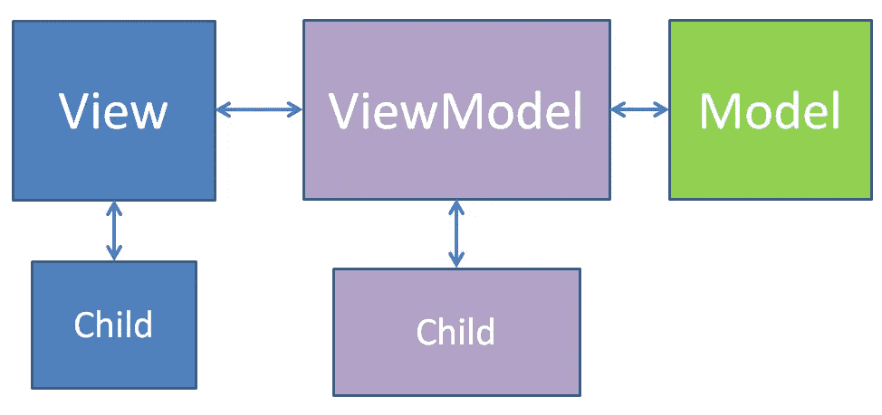

# 用 composition 为一个简单的 Blazor MVVM 客户端添加特性

> 原文：<https://itnext.io/adding-features-to-a-simple-blazor-mvvm-client-with-composition-f31bfb01e20a?source=collection_archive---------4----------------------->

这是详细介绍在客户端 Blazor 中实现 MVVM 模式的一种方法的系列文章的第三篇。如果您想从头开始阅读本系列，第一篇文章位于此处:

[](/a-simple-mvvm-implementation-in-client-side-blazor-8c875c365435) [## 客户端 Blazor 中一个简单的 MVVM 实现。

### 如前所述，我正致力于将我的生产 Silverlight 应用程序迁移到一个新的平台上。我的…

itnext.io](/a-simple-mvvm-implementation-in-client-side-blazor-8c875c365435) 

本文的所有代码都可以在 GitHub 存储库中找到。本文的起点包含在 AricleTwo 分支以及 4.2 版本中。本文末尾的代码是 ArticleThree 和 4.3 版本。

[](https://github.com/lchendricks/BlazorMVVM) [## lchendrick s/blazormvm

### 一个客户端 Blazor MVVM 实现。通过在…上创建帐户，为 lchendricks/BlazorMVVM 的开发做出贡献

github.com](https://github.com/lchendricks/BlazorMVVM) 

# 应用程序的新要求

上次我们添加了一些新功能，这些功能是由我们虚构的雇主发送给我们的。这一次我们也将执行当权者发给我们的一些新要求。我们将增加以下功能:

*   向应用程序添加高级帐户设置
*   将新的增强型天气服务集成到应用程序中
*   为基本用户显示当前预测
*   为高级用户显示增强的每小时预测

我们将在努力保持代码相对干净的同时完成所有这些工作。在我们看来，我们将增加组件，使其更加模块化。在 ViewModel 中，我们将添加 ViewModel 子视图，这将有助于我们保持有序。我们还将使用带有依赖注入的 IEnumerable 集合来帮助我们选择接口的正确实现。

# 在视图中使用组件

我们实际上已经在使用组件了；Blazor 中的任何 UI，包括页面，都是一个组件。我们现在要创建的组件只是一些 UI 片段，我们将用标签将它们添加到页面中。对于满足我们要求的第一个新组件，我们将把视图中的表移到一个单独的组件中。

在客户端项目中创建一个新文件夹，并将其命名为 Components。在这个文件夹中添加一个新的 Razor 视图，并将其命名为 BasicForecast.razor。从 else{}块中的视图中剪切所有内容，从开始到

结束，并将其粘贴到新组件中，替换那里的所有默认内容。为了使组件在父组件中使用时工作，我们需要在组件的顶部添加这个 using 语句

组件底部的这个功能块

该参数告诉组件，当使用它时，它将接受 IFetchDataViewModel 的实例，并使该实例在组件内部作为命名对象 ViewModel 本地可用。一旦完成，我们就可以用 ViewModel 替换粘贴到组件中的对 fetchDataViewModel 的三个引用。新组件现在看起来像这样:

为了使用这个组件，我们返回到视图，在 else{}块中输入这一行代码，我们之前在这里剪切了所有的内容。

这告诉视图在页面上的这个位置插入 BasicForecast 组件，并将我们的 ViewModel 的当前实例传入该组件。我们还需要为 BlazorMVVM 添加一个@using 语句。Client.Components 文件夹添加到视图中。添加完这些行后，更新后的视图如下所示:

如果我们现在启动应用程序，我们可以看到它的工作方式与启动时完全一样。我们现在已经给视图添加了一点合成。

# 重构视图模型

我们现在需要对视图模型进行修改。我们需要围绕高级帐户进行一些交互，所以我们需要添加属性和方法。我们也不应该将整个 ViewModel 传递给页面的子组件，组件应该只获取它需要的东西。就像我们给视图一个子视图一样，我们现在要创建一个子视图模型。

在客户端项目的 ViewModels 文件夹中，添加一个名为 BasicForecastViewModel.cs 的新 C#类。我们将把子组件所需的属性和方法迁移到这个子 ViewModel，并在主 ViewModel 中添加对它的引用。新的子接口和类现在看起来像这样:

ViewModel 将从构造函数注入中接收这个子对象的实例，因此我们需要将它添加到 Startup.cs 中。我们返回 ConfigureServices()并添加现在将成为我们的第三个条目的内容:

有了它，我们可以将它作为一个新的私有变量添加到我们的视图模型中

通过新公共属性向视图公开视图模型

将该属性添加到视图模型接口

并更新我们的构造函数来注入它并赋值。

我们的重构还需要做一些清理工作。在 RetrieveForecastsAsync()中，我们为 _weatherForecasts 赋值，现在我们需要将它赋值给子视图模型，如下所示:

我们还需要确保当我们在 ViewModel 上更改温标时，我们也在子 ViewModel 中更改温标，如下所示:

重构完成后，我们的 ViewModel 接口和类现在看起来像这样

重构视图模型后，我们现在可以更新视图，将子视图模型传递给子视图。更新 if{} else{}块以进行适当的检查并传入正确的参数。这部分代码现在看起来像这样:

最后，我们需要更新 BasicForecast 视图，以便它接受 BasicForecastViewModel。我们将更新子视图中的函数块，如下所示:

再一次，如果我们现在启动应用程序，我们将看到预测显示为开始时的样子。我们现在已经重构了我们的视图和视图模型，我们的应用程序仍然工作。

# 添加高级帐户

实际的应用程序会有某种身份提供者来让它知道用户的信息。对于本文，我们将添加另一个切换按钮，让我们在基本和高级之间切换，这样我们就可以专注于 MVVM 模式。

我们将实现这个开关，就像我们实现温度显示开关一样。在 FetchDataViewModel 中，我们将添加另一个私有变量

在构造函数中将该变量设置为 false

添加公共切换方法

然后将该方法放到接口上。

我们希望切换按钮告诉我们当我们单击它时它将做什么，所以我们将添加一个属性，该属性将成为按钮的文本

并把它放到界面上。

现在我们已经添加了所有这些，我们可以返回到父视图并添加我们的新按钮

如果我们此时运行应用程序，我们将看到我们的按钮，单击它将切换高级状态和按钮标签。



# 集成增强型气象服务

对于我们的“增强型”天气服务，我们将调用国家气象局的 API Web 服务。该文件位于[https://www.weather.gov/documentation/services-web-api](https://www.weather.gov/documentation/services-web-api)。为了不让这篇文章太长，我们将简单地检索一个位置的预测。我们将对 FetchDataModel 进行更改，以从 API 中检索预测并存储返回的数据。我们还需要一个类来反序列化由 weather.gov API 返回的 JSON。为了获得我们需要的类，我们可以在浏览器中调出将要调用的端点，这样我们就可以看到 API 返回的原始 JSON。我们可以在浏览器中访问 https://api.weather.gov/gridpoints/ALY/59,14/forecast 的[来获取原始的 JSON。然后，我们可以将 JSON 复制并粘贴到 http://json2csharp.com](https://api.weather.gov/gridpoints/ALY/59,14/forecast)[的表单中，并单击 Generate 按钮。这将生成我们可以在应用程序中使用的类。界面看起来像这样:](http://json2chasrp.com)



我们将在共享项目中创建名为 WeatherDotGovForecast 的新类，并将所有代码粘贴到该类中。

有了这个类，我们就可以对模型进行必要的修改了。在 FetchDataModel 中添加一个私有变量来保存我们的新预测

```
private WeatherDotGovForecast _realWeatherForecast;
```

并添加一个公共属性以允许访问数据

```
public WeatherDotGovForecast RealWeatherForecast { get => _realWeatherForecast; private set => _realWeatherForecast = value; }
```

我们将把它放到界面上。

```
WeatherDotGovForecast RealWeatherForecast { get; }
```

有了这些，我们可以向我们的模型添加一个新方法(它已经将我们选择的预测位置作为呼叫的一部分)

如果我们将新方法放到接口上

```
Task RetrieveRealForecastAsync();
```

我们现在可以给新的天气服务打电话了。此时，我们模型的接口和类将如下所示:

# 为高级会员提供增强的预测

为了向高级会员提供增强的预测，我们将进入 FetchDataViewModel 并对 RetrieveForecastsAsync()进行一些更新。首先，让我们抓住填充 newForecasts 的 foreach 循环，并使用 Visual Studio 快速操作将其提取到一个单独的方法中。我们将调用 PopulateStandardForecastData()方法。我们还将把对 RetrieveForecastsAsync()的调用移到新方法中，这将需要使新方法异步，并使用 await 关键字来调用它。

现在，我们可以创建一个名为 PopulateEnchancedForecastData()的新私有方法，并对其进行编码，使其具有相同的行为，只是从增强的预测中提取数据。该方法将遍历来自新服务的列表<period>，并使用该数据来填充我们的 IWeatherForecast[]。它还会将华氏温度转换为摄氏温度，以保持我们的用户体验一致。新方法的代码如下:</period>

最后一步是用 if-then 块更新 RetrieveForecastsAsync()，以调用基于高级成员资格的标准或增强预测。当所有这些更改都就绪后，更新后的方法如下所示:

我们现在可以访问我们的原始预测以及我们添加到系统中的增强预测。为了用基本会员或高级会员的正确预测来更新我们的显示，我们将在每次单击按钮更改会员状态时调用 RetrieveForecastsAsync()。这将要求我们将一些同步调用改为异步调用。首先，我们将 TogglePremiumMembership()更改为 async，并添加对的调用，以检索该方法的正确数据

```
public async Task TogglePremiumMembership()
{
   _isPremiumMember = !_isPremiumMember;
   await RetrieveForecastsAsync();
}
```

并更改该方法的接口以返回任务。

```
Task TogglePremiumMembership();
```

接下来，我们可以转到 FetchDataView 并更改高级切换按钮的 onclick 方法，以进行异步调用。

```
onclick=@(async () => await fetchDataViewModel.TogglePremiumMembership())
```

有了这些变化，我们可以再次启动我们的应用程序，并看到我们增强的预测。



我们可以看到，增强预测每天有两个条目。查看期间数据，我们可以看到每天都有一个白天预报和一个夜间预报。让我们回到视图模型，将增强的预测摘要代码更改为:

```
newForecast.Summary = forecast.name + " - " + forecast.shortForecast;
```

如果我们再次启动该应用程序，将会为我们的高级会员提供更多信息。



# 高级用户的每小时预测

国家气象局对每小时的天气预报使用与每日天气预报相同的 JSON 格式。这将允许 FetchDataModel 只需几行新代码就可以检索和存储它。我们将添加一个私有变量来保存每小时的预测

```
private WeatherDotGovForecast _hourlyWeatherForecast;
```

通过公共属性暴露它

```
public WeatherDotGovForecast HourlyWeatherForecast { get => _hourlyWeatherForecast; private set => _hourlyWeatherForecast = value; }
```

以及调用和存储数据的方法。

```
public async Task RetrieveHourlyForecastAsync(){_hourlyWeatherForecast = await _http.GetJsonAsync<WeatherDotGovForecast>("https://api.weather.gov/gridpoints/ALY/59,14/forecast/hourly");}
```

之后，我们需要将这两个成员都拉到接口上。

```
Task RetrieveHourlyForecastAsync();
WeatherDotGovForecast HourlyWeatherForecast { get; }
```

有了这些更改，ViewModel 现在可以通过模型完全访问每小时的预测。接口和类现在看起来像这样:

为了在不太长时间的情况下总结这一功能，我们将更新增强的预测，以便如果高级会员单击预测，我们将显示当天的每小时预测。如果该成员再次点击预测，它将切换回每日预测。

为了帮助用户选择每日预测，我们将在预测表中启用悬停突出显示。为此，我们只需更新 BasicForecast 视图的表定义。

```
<table class="table table-hover">
```

# 让子视图模型负责代理

接下来，我们将连接 BasicForecast 视图和 BasicForecastViewModel，以便在用户单击预测表中的某一行时向父视图模型发出警报。我们将通过在 BasicForecastViewModel 中创建一个委托并让父视图模型为该委托分配一个方法来实现这一点。如果你不熟悉使用委托，它们基本上是一个变量，包含一个指向方法的指针。当您调用委托时，您调用的是已经分配给它的方法。这是一种让子对象向父对象传递数据并在父对象中启动操作的有用方法。我们需要做的第一件事是定义我们的代表。在接口和类之外，我们将在命名空间中声明下面的委托。请注意，该委托返回了一个任务，因为我们将再次进行异步调用。

```
public delegate Task ToggleDelegate(DateTime selectedDay);
```

使用这个定义，我们将把这个委托实现为 BasicForecastViewModel 类的公共属性

```
public ToggleDelegate ToggleForecastDelegate { get; set; }
```

我们会将该属性拖到接口上。

```
ToggleDelegate ToggleForecastDelegate { get; set; }
```

现在我们将在类中声明一个调用这个委托的方法

```
public async Task ToggleForecast(DateTime selectedDate)
{
   await ToggleForecastDelegate(selectedDate);
}
```

并将该方法放到接口上。

```
Task ToggleForecast(DateTime selectedDate);
```

在我们的方法中，我们不检查委托是否为空，因为一旦在父 ViewModel 的构造函数中创建了委托，我们就会给它分配一个方法。有了这些变化，我们的委托、接口和类看起来像这样

为了调用我们的新委托，我们将为子视图中的数据表中的行添加一个 onclick 事件。该事件将从选定的行传回日期时间。对行定义的这一更改将对我们新的 ViewModel 方法进行异步调用。

```
<tr onclick="@(async () => await ViewModel.ToggleForecast(forecast.Date))">
```

现在我们有了要调用的委托集，并向它传递了所需的数据。最后一步是给委托分配一个方法。我们将进入 FetchDataViewModel 并创建一个带有匹配签名的异步方法。为了测试一切是否按预期运行，我们将从一个控制台开始。WriteLine()来看看事情是否正常。

```
private async Task ToggleForecast(DateTime selectedDate)
{
   if (_isPremiumMember)
   {
      Console.WriteLine(selectedDate.ToLongDateString());
   }
}
```

一旦我们准备好了，我们就可以进入构造函数并添加一行代码来将新方法分配给子视图模型中的委托。

```
basicForecastViewModel.ToggleForecastDelegate = ToggleForecast;
```

如果我们在此时运行应用程序，并按 F12 打开调试控制台，我们将看到，当我们将鼠标悬停在 forecase datatable 行上时，这些行会突出显示，当我们单击 premium 版本的 forecast(仅 premium 版本)时，所选的日期时间会打印到控制台。



# 总结每小时的预报

我们现在需要更新我们的 ParentViewModel，以采取适当的措施在 premium 成员的每日和每小时预测之间切换。我们将再次需要跟踪我们所处的状态，所以我们将向我们的视图模型添加另一个私有 bool

```
private bool _isDailyForecast;
```

并在构造函数中将其设置为 true

```
_isDailyForecast = true;
```

我们需要 PopulateEnhancedForecastData()方法来获取每日或每小时的预测，因此我们将对该方法进行一些修改。首先，我们必须放入一个条件块，以便我们调用 API 上的正确端点来获得我们想要的预测。接下来，我们必须有条件地填充我们的摘要字段，因为在数据的每小时预测中，forecast.name 为空。这是我们重新设计的方法:

我们现在可以通过在 ToggleForecast()中完成所需的更改来完成我们的视图模型更新。我们将更换控制台。WriteLine()语句，其中几行代码切换 _isDailyForecast 的值，创建列表<iweatherforecast>，并使用来自 API 的正确预测填充它。最后，如果预测是每小时一次，我们将过滤列表中与我们选择的日期匹配的条目，否则获取所有预测。过滤需要引用系统。因此还需要添加一个 using 语句。这是我们完成所有工作所需的代码:</iweatherforecast>

我们今天最后的细节是让子视图模型格式化日期，以一种对我们的高级用户有意义的方式显示日期和时间。我们将最后一次进入 BasicForecast，并将显示日期的元素更改为现在使用的格式字符串:

```
<td>@forecast.Date.ToString("MM/dd/yyyy h:mm tt")</td>
```

有了这个最终的变化，我们可以启动我们的应用程序，并作为高级会员从每天预测改为每小时预测。



# 包扎

今天，我们在示例项目中添加了更多的功能，并扩展了我们在前两篇文章中构建的 MVVM 架构。预测页面中的对象关系现在如下所示:



Out View 和 ViewModel 都有子对象，但是我们仍然保持系统的清晰分离。除了视图模型之外，没有对象知道我们的模型和它调用的服务，我们的子视图甚至不知道它从哪个子视图模型接收数据。由于父视图模型负责协调页面上的一切，它可以通过视图中的参数传递其子视图模型。我们还能够让子视图中的用户操作使用委托调用 ViewModel 中的方法，同时再次保持子视图不知道 ViewModel。

我们还可以做更多的事情来改进我们的应用程序。在国家气象局的 API 中，有更多我们没有展示给用户的数据。我们可以定制用户体验，并通过一些额外的重构使我们的应用程序架构更好。本系列的第四篇文章可以通过下面的链接阅读:

[](/refactoring-the-simple-blazor-mvvm-client-adventures-in-dependency-injection-e9866d194ee9) [## 重构简单的 Blazor MVVM 客户端:依赖注入的冒险

### 本文是关于在 ASP.Net 客户端实现模型视图视图模型的系列文章的第四篇…

itnext.io](/refactoring-the-simple-blazor-mvvm-client-adventures-in-dependency-injection-e9866d194ee9)