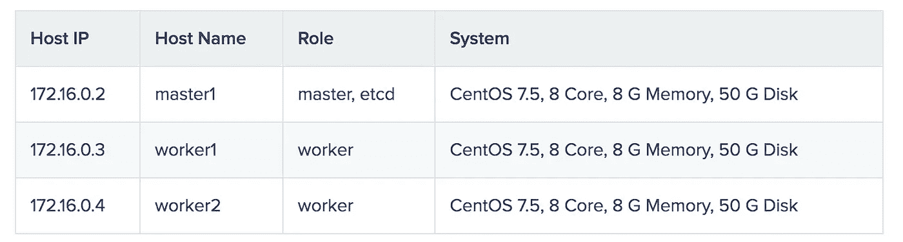
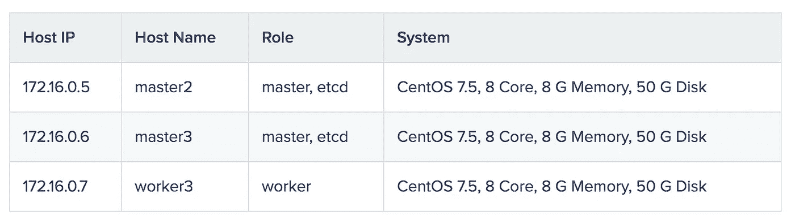
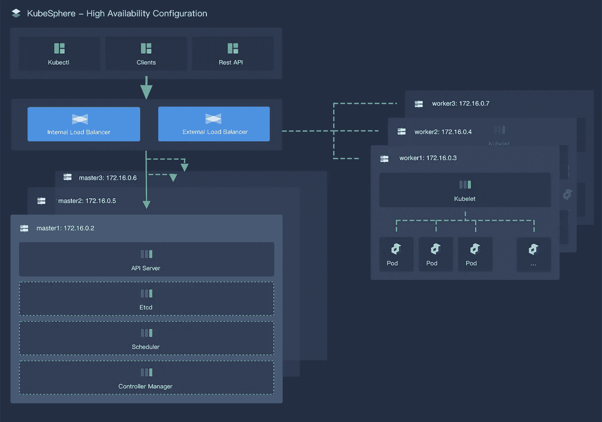

# 添加主节点实现 HA:使用 KubeKey 的最佳实践之一

> 原文：<https://itnext.io/adding-master-nodes-to-achieve-ha-one-of-the-best-practices-for-using-kubekey-6207e94b0bdd?source=collection_archive---------2----------------------->

正如在我的上一篇文章中所展示的，您可以使用 KubeKey 轻松地伸缩您的集群。因为在示例中我只有一个主节点，所以集群不具备高可用性。在本文中，我将继续演示如何向外扩展您的集群，同时通过添加主节点来实现高可用性。

这些步骤如下所示:

1.  下载 KubeKey。
2.  使用 KubeKey 通过自动创建的配置文件来检索集群信息。
3.  在文件中添加节点和负载平衡器信息，并应用配置。

# 准备主机

这是我的现有 Kubernetes 集群的节点信息。



```
$ kubectl get nodes
NAME      STATUS   ROLES    AGE     VERSION
master1   Ready    master   2m15s   v1.17.9
worker1   Ready    worker   86s     v1.17.9
worker2   Ready    worker   86s     v1.17.9
```

以下是将添加到群集以实现高可用性的节点。请注意，您的 etcd 节点总数必须是奇数。



关于节点、网络和依赖项需求的更多信息，请参见本文。

# 准备负载平衡器

您可以使用任何云负载平衡器或硬件负载平衡器(例如 F5)。此外，Keepalived 和 [HAproxy](https://www.haproxy.com/) 或 Nginx 也是创建高可用性集群的一个备选方案。在这个例子中，我有一个内部负载平衡器和一个外部负载平衡器，前者带有一个监听端口`6443` ( `api-server`)的监听器，后者带有一个监听 Kubernetes 仪表板端口的监听器。

# 下载 KubeKey

1.  从其 [GitHub 发布页面](https://github.com/kubesphere/kubekey/releases)下载 KubeKey，或者使用以下命令下载 KubeKey 版本 1.0.1。你只需要将 KubeKey 下载到你的一台机器上，作为**任务盒**进行缩放。

`curl -sfL https://get-kk.kubesphere.io | VERSION=v1.0.1 sh -`

2.上面的命令下载 KubeKey 并解压文件。您的文件夹现在包含一个名为`kk`的文件。使其可执行:

`chmod +x kk`

# 添加主节点

1.  使用 KubeKey 创建一个配置文件。如果您的集群是通过 KubeKey 安装的，那么您的机器上可能仍然有那个配置文件。这种情况下可以直接编辑。否则，执行以下命令来检索集群信息。

`./kk create config --from-cluster`

2.上面的命令创建了一个配置文件，默认为`sample.yaml`。打开文件，您可以看到一些字段已经预先填充了值。将新节点和负载平衡器的信息添加到文件中。

`vi sample.yaml`

这是我的配置，供你参考:

```
apiVersion: kubekey.kubesphere.io/v1alpha1
kind: Cluster
metadata:
  name: sample
spec:
  hosts:
  # You should complete the ssh information of the hosts
  - {name: master1, address: 172.16.0.2, internalAddress: 172.16.0.2, user: root, password: Testing123}
  - {name: master2, address: 172.16.0.5, internalAddress: 172.16.0.5, user: root, password: Testing123}
  - {name: master3, address: 172.16.0.6, internalAddress: 172.16.0.6, user: root, password: Testing123}
  - {name: worker1, address: 172.16.0.3, internalAddress: 172.16.0.3, user: root, password: Testing123}
  - {name: worker2, address: 172.16.0.4, internalAddress: 172.16.0.4, user: root, password: Testing123}
  - {name: worker3, address: 172.16.0.7, internalAddress: 172.16.0.7, user: root, password: Testing123}
  roleGroups:
    etcd:
    - master1
    - master2
    - master3
    master:
    - master1
    - master2
    - master3
    worker:
    - worker1
    - worker2
    - worker3
  controlPlaneEndpoint:
    # If loadbalancer is used, 'address' should be set to loadbalancer's ip.
    domain: lb.kubesphere.local
    address: 172.16.0.253
    port: 6443
  kubernetes:
    version: v1.17.9
    imageRepo: kubesphere
    clusterName: cluster.local
    proxyMode: ipvs
    masqueradeAll: false
    maxPods: 110
    nodeCidrMaskSize: 24
  network:
    plugin: calico
    kubePodsCIDR: 10.233.64.0/18
    kubeServiceCIDR: 10.233.0.0/18
  registry:
    privateRegistry: ""
```

*注*

*   *增加新节点时，不允许修改已有节点的主机名(如* `*master1*` *)。*
*   *关于配置文件中不同参数的更多信息，参见* [*本文*](https://kubesphere.io/blogs/install-kubernetes-using-kubekey/#install-kubernetes) *。*

3.注意上面例子中的`controlPlaneEndpoint`字段。

```
controlPlaneEndpoint:
    # If loadbalancer is used, 'address' should be set to loadbalancer's ip.
    domain: lb.kubesphere.local
    address: 172.16.0.253
    port: 6443
```

*   负载均衡器的域名默认为`lb.kubesphere.local`，供内部访问。你可以根据你的需要来改变它。
*   在大多数情况下，您需要为字段`address`提供负载平衡器的**私有 IP 地址**。然而，不同的云提供商可能有不同的负载平衡器配置。例如，如果你在阿里云上配置了一个服务器负载均衡器(SLB)，平台会给 SLB 分配一个公共 IP 地址，这意味着你需要为字段`address`指定公共 IP 地址。
*   字段`port`表示`api-server`的端口。

4.保存文件并执行以下命令来应用配置:

`./kk add nodes -f sample.yaml`

5.缩放完成后，您可以看到如下输出。

`Congratulations! Scaling cluster is successful.`

6.执行以下命令来检查名称空间的状态。

`kubectl get pod --all-namespaces`

```
NAMESPACE     NAME                 READY   STATUS    RESTARTS   AGE
kube-system   calico-kube
             -controllers
             -59d85c5c84-tnk8s   1/1     Running   0          36m
kube-system   calico-node
             -87gtw              1/1     Running   0          75s
kube-system   calico-node
             -8dj8n              1/1     Running   0          76s
kube-system   calico-node
             -k2bjr              1/1     Running   0          35m
kube-system   calico-node
             -lpl78              1/1     Running   0          36m
kube-system   calico-node
             -scfld              1/1     Running   0          75s
kube-system   calico-node
             -t27vn              1/1     Running   0          35m
kube-system   coredns
             -74d59cc5c6-87qkr   1/1     Running   0          36m
kube-system   coredns
             -74d59cc5c6-qm7kb   1/1     Running   0          36m
kube-system   kube-apiserver
             -master1            1/1     Running   0          36m
kube-system   kube-apiserver
             -master2            1/1     Running   0          73s
kube-system   kube-apiserver
             -master3            1/1     Running   0          74s
kube-system   kube-controller
             -manager-master1    1/1     Running   0          36m
kube-system   kube-controller
             -manager-master2    1/1     Running   0          74s
kube-system   kube-controller
             -manager-master3    1/1     Running   0          74s
kube-system   kube-proxy-48h9q   1/1     Running   0          35m
kube-system   kube-proxy-72cv7   1/1     Running   0          76s
kube-system   kube-proxy-gjzk2   1/1     Running   0          36m
kube-system   kube-proxy-nkkv8   1/1     Running   0          75s
kube-system   kube-proxy-swh67   1/1     Running   0          35m
kube-system   kube-proxy-xn7g9   1/1     Running   0          75s
kube-system   kube-scheduler
             -master1            1/1     Running   0          36m
kube-system   kube-scheduler
             -master2            1/1     Running   0          73s
kube-system   kube-scheduler
             -master3            1/1     Running   0          74s
kube-system   nodelocaldns
             -47bgw              1/1     Running   0          35m
kube-system   nodelocaldns
             -4bp5b              1/1     Running   0          75s
kube-system   nodelocaldns
             -5f9g8              1/1     Running   0          36m
kube-system   nodelocaldns
             -h4xzk              1/1     Running   0          35m
kube-system   nodelocaldns
             -jz86j              1/1     Running   0          75s
kube-system   nodelocaldns
             -xcjt6              1/1     Running   0          76s
```

7.执行以下命令检查您的节点。

`kubectl get nodes`

```
NAME      STATUS   ROLES    AGE     VERSION
master1   Ready    master   37m     v1.17.9
master2   Ready    master   2m17s   v1.17.9
master3   Ready    master   2m17s   v1.17.9
worker1   Ready    worker   36m     v1.17.9
worker2   Ready    worker   36m     v1.17.9
worker3   Ready    worker   2m18s   v1.17.9
```

正如您在上面看到的，所有节点都已启动并运行。

# 摘要

添加更多主节点以使您的集群高度可用的步骤与我在[上一篇文章](https://kubesphere.io/blogs/scale-kubernetes-cluster-using-kubekey/)中演示的步骤基本相同。主要区别在于您必须正确配置负载平衡器。

# 参考

[KubeKey](https://github.com/kubesphere/kubekey)

[多节点安装](https://kubesphere.io/docs/installing-on-linux/introduction/multioverview/)

[kube key:Kubernetes 和云原生插件的轻量级安装程序](https://kubesphere.io/blogs/install-kubernetes-using-kubekey/)

[扩展 Kubernetes 集群:使用 KubeKey 的最佳实践之一](https://kubesphere.io/blogs/scale-kubernetes-cluster-using-kubekey/)