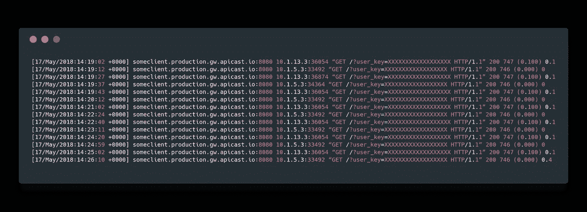
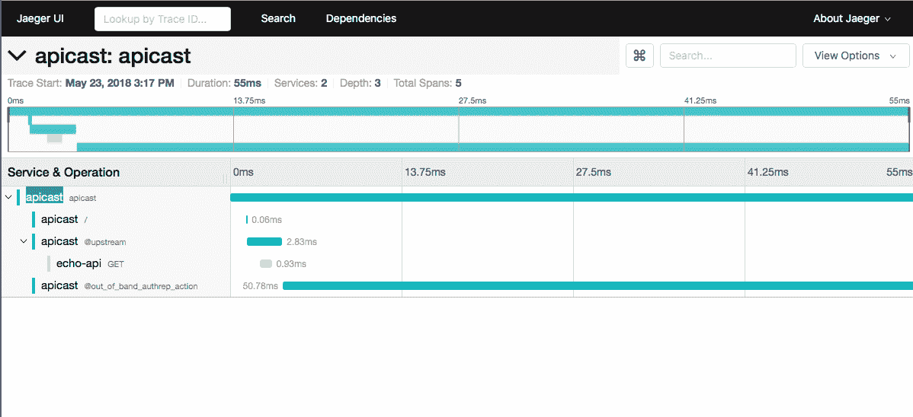
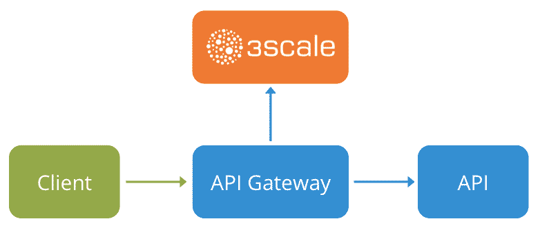
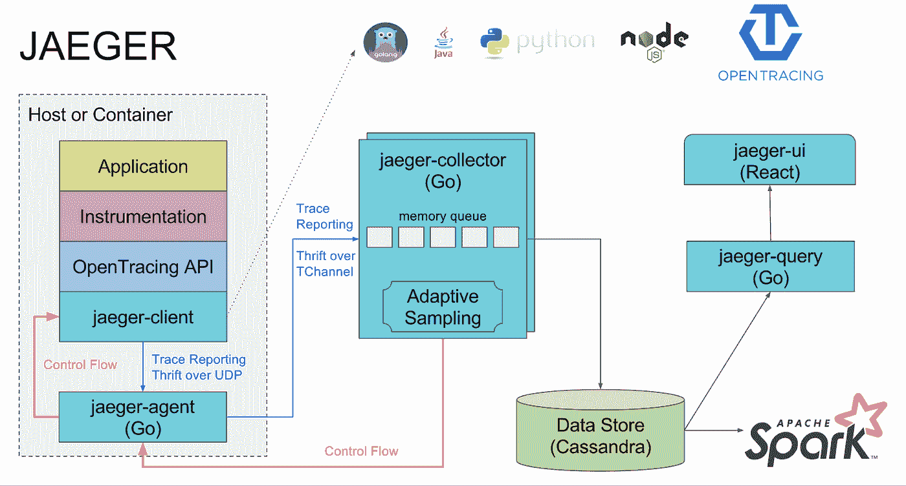
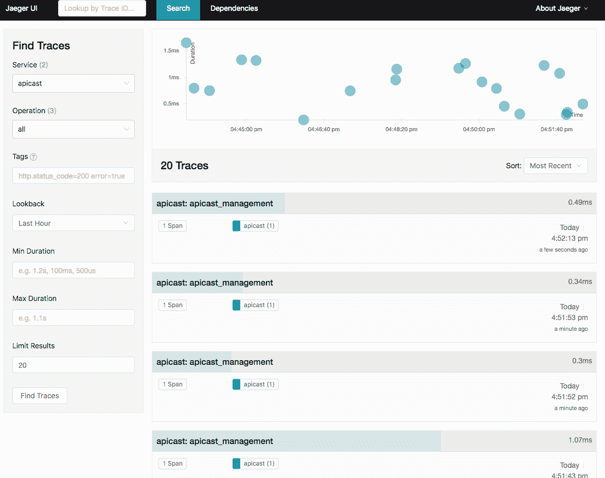
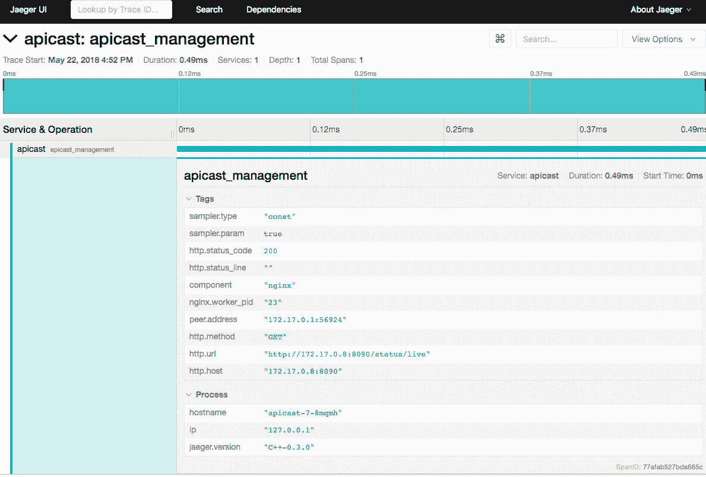
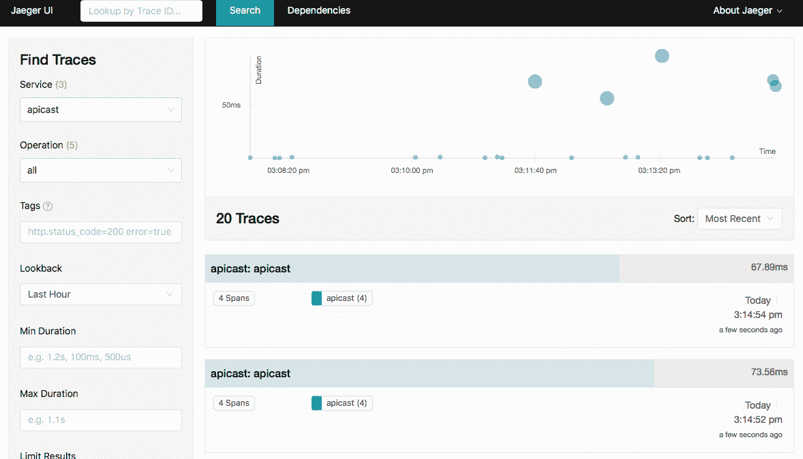
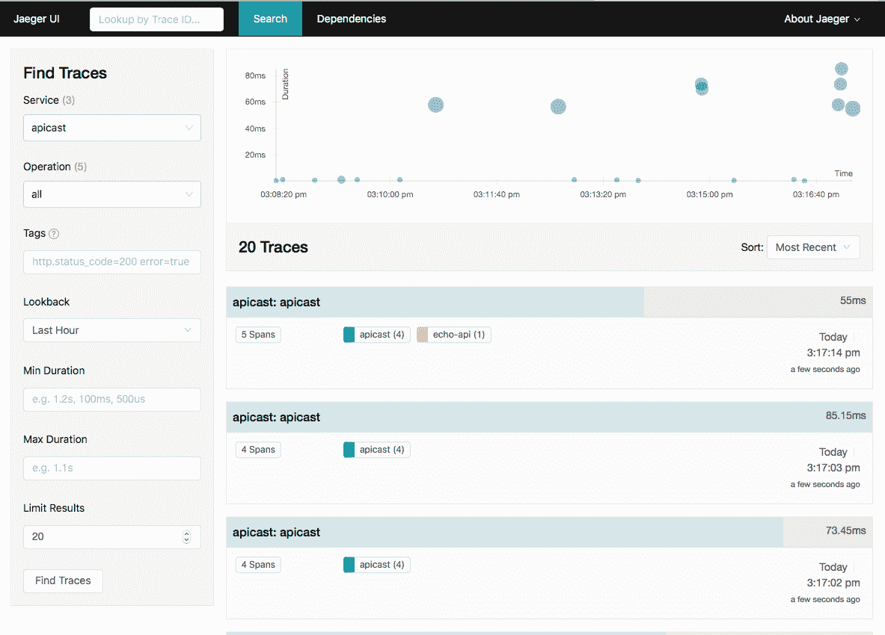

# 向 APIcast API 网关添加 OpenTracing 支持

> 原文：<https://itnext.io/adding-opentracing-support-to-apicast-api-gateway-a8e0a38347d2?source=collection_archive---------6----------------------->

在这篇博文中，我将解释最近为 API 网关 APIcast 添加 OpenTracing 和 Jaeger 支持的经验和成果。这将使 APIcast 易于集成到使用 OpenTracing 的环境中，并允许用户获得对其系统的更多可见性。

以前我们只有这样的日志:



APIcast 原始日志

现在，您可以通过 APIcast 查看您的 API 请求:



Jaeger 用户界面显示来自不同服务的多条痕迹

这使得调试问题变得容易，例如，大的延迟峰值，以及理解 API 请求的整个周期和所有相关的服务。

# APIcast 和可观测性

API cast([https://github.com/3scale/apicast](https://github.com/3scale/apicast))是一个开源 API 网关，其主要关注领域是高性能和可扩展性。它是 Redhat 3scale API 管理解决方案的一部分，被全球数百家公司用来以安全和可控的方式公开他们的 API。

它基于 Openresty，这是一个成熟的 web 平台，将标准的 Nginx 核心、LuaJIT 和 Lua 库与第三方 Nginx 模块集成在一起。因此，我们通过使用 LUA，将 NGINX 的性能和健壮性与扩展/更改其功能的简单方法结合起来。

APIcast 部署在多种场景中，例如基本和通用部署，其中 APIcast 是 API 的入口点，所有请求都要经过它:



但是，我们的用户越来越多地将 APIcast 部署为大型复杂微服务部署的 API 网关，无论是在前端还是在特定服务之间。

可以想象，我们正在谈论数百个相互交互的微服务，每个外部请求最终都会在服务之间创建几个请求。这提出了新的挑战，其中之一就是“可观察性”

*   为什么这个请求这么慢？
*   哪项服务造成了这些延迟峰值？
*   当用户点击这个端点时，哪些服务正在交互？
*   为什么请求失败了？
*   是谁提出这个请求的？
*   …

现在，回答这些问题既慢又复杂，因为用户开始通过日志调试，并试图关联一切。

我们需要开始研究如何监控微服务，分布式跟踪作为一种模式出现，有助于我们深入了解系统内部的情况。

向我们的微服务部署添加分布式跟踪需要什么？

*   每个外部请求都应该附有一个**唯一请求 ID** ，通常是通过 HTTP 头
*   每个服务应该**将请求 ID** 转发给其他服务
*   每个服务应该**在日志**中输出请求 ID
*   每个服务应该**记录附加信息**，比如请求的开始和结束时间。
*   **日志需要在某处聚集**，并提供一种通过 HTTP 请求 ID 进行解析的方法。

对于 APIcast，这很简单，附加一个惟一的 ID 作为 HTTP 头，我们就完成了…

但是，用户需要定义所有服务的日志格式、要存储在日志中的参数、要使用的 http 头、如何捕获每个请求的开始/结束时间…关联它们，检查如何在第三方应用程序中执行这些操作，尝试修改这些…

所以我们问自己，*难道不应该有一个“标准”的方法来做这件事吗？*

这就是 OpenTracing 的用武之地。

# OpenTracing

Open tracing([http://Open tracing . io](http://opentracing.io/))提供了一致的、厂商中立的 API、开源库和文档，供开发人员在他们的应用程序中插入和添加不同的跟踪实现。

目前，OpenTracing 项目提供了以下语言的库:

*   去
*   计算机编程语言
*   java 描述语言
*   Java 语言(一种计算机语言，尤用于创建网站)
*   C#
*   目标-C
*   C++
*   红宝石
*   服务器端编程语言（Professional Hypertext Preprocessor 的缩写）

而且有一个巨大的社区在推动新的贡献，请看:[https://github.com/opentracing-contrib](https://github.com/opentracing-contrib)。

一旦您通过添加 OpenTracing 库对您的应用程序进行了检测，您将需要选择跟踪实现，这些是支持的实现:

*   贼鸥
*   Appdash
*   轻盈的步伐
*   霍克拉尔
*   (…)

我们决定选择 Jaeger，因为它是 CNF 的一部分，有 Openshift-ready 部署[https://github.com/jaegertracing/jaeger-openshift](https://github.com/jaegertracing/jaeger-openshift)，Red Hat 也在为此做出贡献。

# 追踪:耶格

Jaeger 是由优步技术公司开发的分布式追踪系统，灵感来自 Dapper 和 Openzipkin。它支持多个存储后端，是 OpenTracing 原生的，包括一个现代的 web UI，它是为性能而设计的。



如图所示，主要组件包括:

*   **积家客户端:**通过 UDP 向积家代理发送跟踪信息。
*   **积家代理:**从积家客户端向积家收集器报告踪迹。
*   **Jaeger-collector:** 集中 jaeger-agents 的踪迹，并将它们保存到存储后端。
*   **Jaeger-query:** 从数据存储中检索踪迹
*   **Jaeger-ui:** Jaeger UI，使用 jaeger-query 获取检索痕迹。

Jaeger 支持自适应采样，这意味着我们可以通过选择合适的采样器来调整采样的轨迹数量:

*   **恒:**一切痕迹。
*   **概率:**可以从 0%调整到 100%
*   **速率限制:**每秒多少道，例如:2.0(每秒只有 2 道。)
*   **远程:**与 jaeger 代理一起检查该服务使用哪个取样器。

想了解更多关于 Jaeger 的信息，请访问:[https://www . jaegertracing . io](https://www.jaegertracing.io/)

# 在 APIcast 中启用 OpenTracing 和 Jaeger

我们打包了所有的 OpenTracing 库，并将 Jaeger Tracer 库打包在 APIcast 的基础容器映像中， [s2i-openresty](https://github.com/3scale/s2i-openresty) 。这个图像是[“源到图像”](https://github.com/openshift/source-to-image)启用的，所以你可以使用它作为你自己项目的基础。

我们将使用 [OpenShift](https://www.openshift.com/) 和 APIcast 的容器映像([https://quay.io/repository/3scale/apicast](https://quay.io/repository/3scale/apicast))，因此我们假设您已经在 OpenShift 上部署了 APIcast 并创建了您的 3scale 帐户，如果不是这样，这里有一个惊人的指南来帮助您立即开始运行&:[在 Red Hat OpenShift 上使用 3scale API 网关](https://github.com/3scale/apicast/blob/master/doc/openshift-guide.md)

使用 ENV 变量启用/禁用 APIcast OpenTracing 支持:

*   **OPENTRACING_TRACER** :使用哪个 TRACER 实现，目前只有 Jaeger 可用。
*   **OPENTRACING_CONFIG** :每个 tracer 都有一个默认的配置文件，这里可以看到一个例子: [jaeger.example.json](https://github.com/3scale/apicast/blob/master/gateway/conf.d/opentracing/jaeger.example.json)
*   **OPENTRACING _ HEADER _ FORWARD:**默认情况下，使用 uber-trace-id，如果你的 open tracing 有不同的配置，你将需要更改这个值，如果没有，忽略它。

首先，让我们部署 Jager All-In-One 模板，这并不真正意味着生产环境，但对于演示目的来说，这就足够了。

*   在当前名称空间中安装 Jaeger 一体机:

```
oc process -f [https://raw.githubusercontent.com/jaegertracing/jaeger-openshift/master/all-in-one/jaeger-all-in-one-template.yml](https://raw.githubusercontent.com/jaegertracing/jaeger-openshift/master/all-in-one/jaeger-all-in-one-template.yml) | oc create -f -
```

有关在生产环境中部署 jaeger 的更多信息:[https://github . com/jaegertracing/jaeger-open shift # production-setup](https://github.com/jaegertracing/jaeger-openshift#production-setup)

*   访问积家界面:

```
*> oc get route**(…)* ***jaeger-query-myproject.127.0.0.1.nip.io***
```

在我的例子中，网址是[https://jaeger-query-my project . 127 . 0 . 0 . 1 . nip . io](https://jaeger-query-myproject.127.0.0.1.nip.io/)

迎接你的应该是这只看起来很危险的地鼠:


*   现在，让我们创建自己的 Jaeger 配置文件:

```
cat <<EOF >jaeger_config.json
  {
    "service_name": "apicast",
    "disabled": false,
    "sampler": {
      "type": "const",
      "param": 1
    },
    "reporter": {
      "queueSize": 100,
      "bufferFlushInterval": 10,
      "logSpans": false,
      "localAgentHostPort": "jaeger-agent:6831"
    },
    "headers": {
      "jaegerDebugHeader": "debug-id",
      "jaegerBaggageHeader": "baggage",
      "TraceContextHeaderName": "uber-trace-id",
      "traceBaggageHeaderPrefix": "testctx-"
    },
    "baggage_restrictions": {
        "denyBaggageOnInitializationFailure": false,
        "hostPort": "127.0.0.1:5778",
        "refreshInterval": 60
    }
 }
EOF
```

这将创建一个新文件: *jaeger_config.json*

*   让我们回顾一下重要的部分:

**取样器配置:**

```
"sampler": {
      "type": "const",
      "param": 1
}
```

这将采样器定义为[const]ant，参数为“1”，这意味着它将对所有请求进行采样。

**记者:**

```
"reporter": {
      "queueSize": 100,
      "bufferFlushInterval": 10,
      "logSpans": false,
      "localAgentHostPort": "jaeger-agent:6831"
}
```

最大队列为 100 个请求，刷新间隔为 10 秒，我们不会将跨度输出到日志中，代理主机预计将在“jaeger-agent:6831”上运行。

如果您的服务在不到 10 秒的时间内处理 100 个以上的请求，那么您需要调整这些值，要么增加 queueSize，要么减少 bufferFlushInterval。

**标题**:

```
"headers": {
      "jaegerDebugHeader": "debug-id",
      "jaegerBaggageHeader": "baggage",
      "TraceContextHeaderName": "uber-trace-id",
      "traceBaggageHeaderPrefix": "testctx-"
}
```

目前最重要的是 *TraceContextHeaderName* ，我们将使用默认值 *uber-trace-id* 。这是我们需要在所有服务中转发的 HTTP 头，以传播 span 信息并能够将它们关联起来。

*   现在我们应该从 jaeger 配置文件中创建一个 ConfigMap，这样我们就可以在 APIcast 中挂载它了:

```
oc create configmap jaeger-config --from-file=jaeger_config.json
```

*   将配置映射装入 APIcast。

```
oc volume dc/apicast --add -m /tmp/jaeger/ --configmap-name jaeger-config
```

这将触发 APIcast 的重新部署，现在所有的吊舱都将有我们的新配置，可在/tmp/jaeger/jaeger_config.json 获得。

*   让我们使用自定义配置启用 OpenTracing 和 Jaeger:

```
oc env deploymentConfig/apicast OPENTRACING_TRACER=jaeger OPENTRACING_CONFIG=/tmp/jaeger/jaeger_config.json
```

这将触发 APIcast 的重新部署，我们应该会看到新数据被填充到我们的 Jaeger UI 中:



在 jaeger UI 中显示的 APIcasts 轨迹

不错！现在，您可以看到一些来自 Openshift 运行状况检查的痕迹，让我们单击其中一个:



APIcast 跟踪的详细信息

*   好了，APIcast 现在正在向 Jaeger 报告踪迹，让我们做一个请求:

```
curl -kv "[https://apicast.127.0.0.1.nip.io:443/?user_key=](https://apicast.127.0.0.1.nip.io/?user_key=)...."
```

让我们看看 Jaeger 用户界面:



jaeger-ui 中的 APIcast 痕迹

正如你所看到的，我们跟踪 APIcast 的不同动作，但是我们的后端服务“echo-API”([https://github.com/3scale/echo-api](https://github.com/3scale/echo-api))没有向 Jaeger 报告任何事情。

我们需要给它添加 OpenTracing 和 Jaeger 支持，这再简单不过了:[https://github.com/3scale/echo-api/pull/40/files](https://github.com/3scale/echo-api/pull/40/files)

*   现在，让我们重复一下…



APIcast 和 echo-api 跟踪

如您所见，现在有两个与这些跟踪相关的服务，如果我们单击它…


APIcast 和 echo-api 详细跟踪

我们可以看到每个服务何时介入以及需要多长时间。

# 当前的限制

如你所知，Openresty 是 Nginx + luaJIT，目前，我们只获得它的“Nginx”部分的 OpenTracing 信息，没有任何针对 lua 的 OpenTracing 库。

我们正致力于能够使用 OpenTracing C++库，这样我们可以直接从 LUA 创建跟踪，并获得对 APIcast 内部的更多可见性。例如，如果您刚刚安装的自定义策略导致速度变慢，这将有助于调试。

# 结论

*   APIcast 现在可以位于启用 OpenTracing 的服务之前或之间，它将转发现有的或添加额外的跟踪。
*   这允许您轻松地识别 API 中的瓶颈、延迟或错误。
*   OpenTracing 和 jaeger 集成已经在上游项目中可用:[https://github.com/3scale/apicast](https://github.com/3scale/apicast)
*   这些更改将在未来添加到 3scale API 管理产品中。

# 想要帮助/贡献

如果你对此类项目感兴趣，我们一直在寻找新的贡献者！或者更好，新员工，[我们正在招聘！](https://www.3scale.net/about/jobs/):)