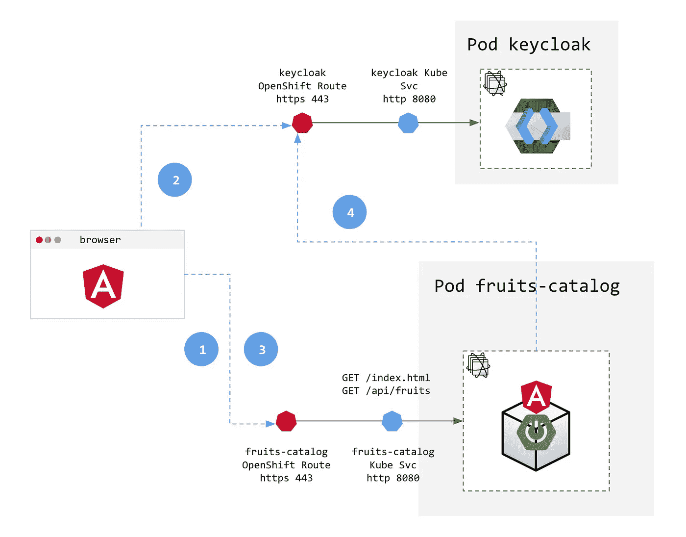
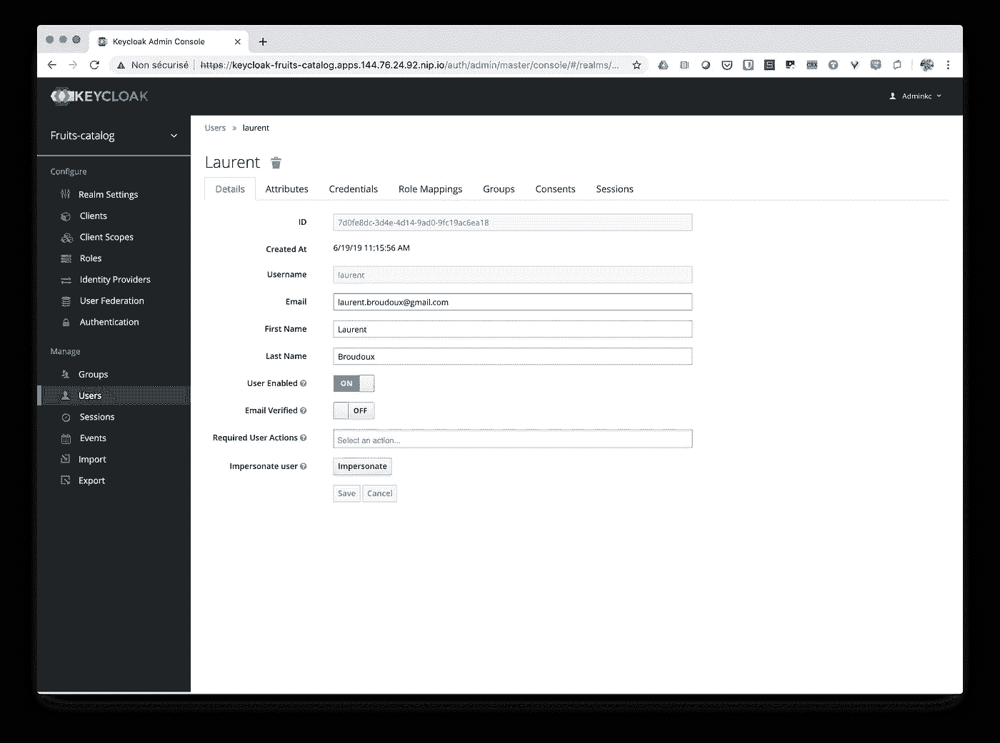
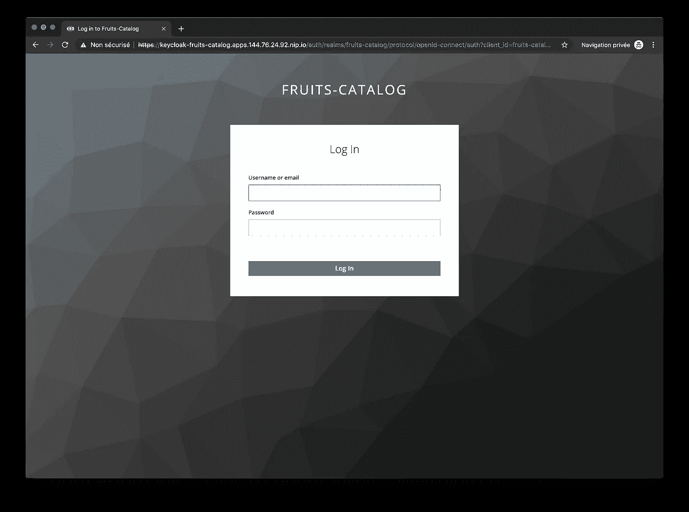
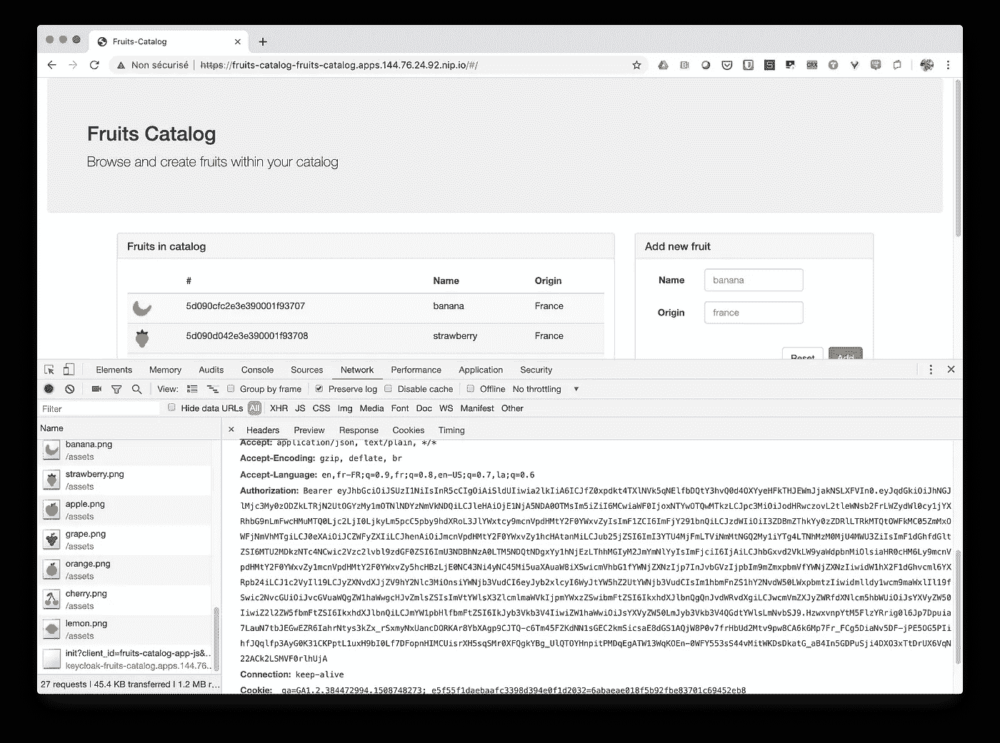
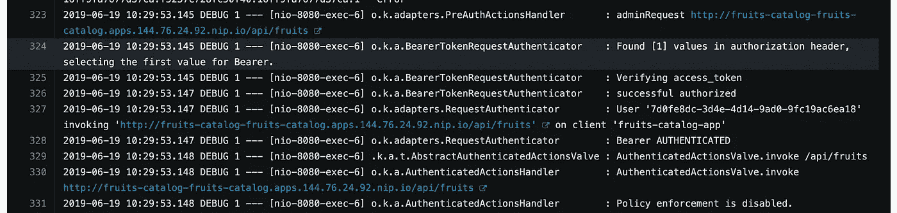

# 在 OpenShift 上为您的应用程序添加安全层—第 2 部分:使用 Keycloak 进行身份验证和授权

> 原文：<https://itnext.io/adding-security-layers-to-your-app-on-openshift-part-2-8320018bcdd1?source=collection_archive---------0----------------------->

今天，保护你的应用程序是必须的，但是如果你没有在一开始就考虑它，那么在不修改代码的情况下引入它是很困难的。幸运的是，像 [Kubernetes](http://kubernetes.io) 这样的容器和平台带来的新的云原生模式提供了简单的方法来解决安全问题，而无需大量接触代码。

这一部分是关于添加明显的身份验证和授权安全层。为此，我们将使用[键盘锁](http://www.keycloak.org)和我们的`fruits-catalog`。Keycloak 提供了这些层，以最少的麻烦保护应用程序的 UI 部分和 API 部分。它提供了管理用户和角色的所有基本功能，以及用户联盟、身份代理和社交登录等高级功能。


第 2 部分—使用 Keycloak 进行身份验证和授权

*这篇文章是一个更大的系列文章的一部分，讲述了如何给现有的应用增加安全层。目前公布的其他部分有:*

*   [*第 1 部分—部署和 TLS 入口*](https://medium.com/@lbroudoux/adding-security-layers-to-your-app-on-openshift-part-1-deployment-and-tls-ingress-9ef752835599)
*   *第 2 部分—使用 Keycloak 进行身份验证和授权(本文)*
*   [*第三部分——金库秘密管理*](https://medium.com/@lbroudoux/adding-security-layers-to-your-app-on-openshift-part-3-secret-management-with-vault-8efd4ec29ec4)
*   [*第四部分——带保险库的动态秘密*](https://medium.com/@lbroudoux/adding-security-layers-to-your-app-on-openshift-part-4-dynamic-secrets-with-vault-b5fe1fc7709b)
*   [*第 5 部分——与 Istio 的相互 TLS*](https://medium.com/@lbroudoux/adding-security-layers-to-your-app-on-openshift-part-5-mutual-tls-with-istio-a8800c2e4df4)
*   [*第 6 部分— PKI 即服务，带保险库和证书管理器*](https://medium.com/@lbroudoux/adding-security-layers-to-your-app-on-openshift-part-6-pki-as-a-service-with-vault-and-cert-e6dbbe7028c7)

# 我们想在这部分实现什么？

向应用程序添加适当的身份验证可能很麻烦，因为正确实现标准和可互操作的身份验证流(如 OpenId Connect)确实是一项艰巨的任务。奇克洛来拯救我们了！

在这一部分，我们将:

*   在我们的 [OpenShift](http://www.openshift.com/) Kubernetes 发行版上部署并配置一个 Keycloak 实例，就在我们在第 1 部分中部署的`fruits-catalog`和`mongodb`pod 旁边，
*   通过在客户端强制身份验证以及将安全上下文传播到服务器端来保护我们现有的应用程序。这里我们将配置 Keycloak 实例和我们的应用程序来实现 [OpenId Connect 认证流](https://openid.net/specs/openid-connect-core-1_0.html#Authentication)。

最后，我们希望获得以下架构，其中身份验证请求在浏览器中的 Angular 应用程序、Spring Boot 后端和 Keycloak 实例之间流动:



配置的身份验证流程的简化视图如下所示:

1.  浏览器加载并访问 Angular 应用程序，由于当前会话未经认证，用户被重定向到由 Keycloak 管理的登录表单，
2.  对 Keycloak 配置的身份提供程序进行身份验证；这可以是本地的(嵌入到 Keycloak 自己的数据库中)，也可以是远程的，比如社交网络(GitHub，Google 等等)，或者来自你的企业环境(LDAP，ADFS 女士等等)，
3.  在认证发生并且交换了一些`access_code`和`authorization_code`之后，我们浏览器中的 Angular 应用程序现在有了一个`token`，当访问 API 端点时，它应该与对我们应用程序后端的每一个请求相集成。
4.  当在后端调用 API 时，配置的 Keycloak 拦截器将决定何时挑战令牌的真实性。这个挑战是通过使用 Keycloak OpenId API 实现的。最后，如果应该授予一些特定的角色来访问 API，拦截器在让请求流向应用程序之前，会根据这些角色来评估当前用户。

# 如何应用？

如果您已经阅读了本系列的第一部分，那么您可能已经克隆了包含所有资源和资产的 [my GitHub repository](https://github.com/lbroudoux/secured-fruits-catalog-k8s) 。如果没有，我敦促你这样做；-)从笔记本电脑上的克隆中，切换到`keycloak`分支:

```
$ git checkout keycloak
```

现在，给定您的 OpenShift 集群和我们在第 1 部分中创建的`fruits-catalog`项目，让我们为我们的应用程序部署一个嵌入设置的 Keycloak 实例。您可以从克隆的根目录使用以下命令轻松完成此操作:

```
$ export ROUTE=$(oc get route/fruits-catalog -n fruits-catalog | grep fruits-catalog | awk '{print $2}')
$ sed -i '' 's=https://fruits-catalog=https://'"$ROUTE"'=' k8s/keycloak-deployment.yml
$ oc apply -f k8s/keycloak-deployment.yml -n fruits-catalog
```

在 Keycloak 部署几分钟后，我们可以通过控制项目中运行的 pod 数量来进行检查:

```
$ oc get pods -n fruits-catalog                                                                                         NAME                                   READY     STATUS      RESTARTS   AGE
fruits-catalog-1-xx7nd                 1/1       Running     0          2h
fruits-catalog-s2i-1-build             0/1       Completed   0          2h
mongodb-1-t85wm                        1/1       Running     0          2h
keycloak-649b794bf-x9xp9               1/1       Running     0         1h
keycloak-postgresql-865c47755d-2khkv   1/1       Running     0     1h
```

现在，我们已经在我们的项目中部署了另外两个 pod:`keycloak-*`是运行 Keycloak 服务的 pod，由运行在它自己的 pod 中的`keycloak-postgresql-*`数据库支持。我们还应该有一个新的`Route`，允许我们连接到 Keycloak 的管理控制台。

```
$ oc get route keycloak                                                                                        NAME       HOST/PORT                                          PATH      SERVICES   PORT       TERMINATION   WILDCARD
keycloak   keycloak-fruits-catalog.apps.x.x.x.x.nip.io             keycloak   keycloak   edge          None
```

从这个控制台，您现在必须配置`fruits-catalog`安全领域来添加新用户。在现实世界的 Keycloak 设置中，我们建议设置[身份代理](https://www.keycloak.org/docs/latest/server_admin/index.html#_identity_broker)部分，以便您能够重用一些来自身份识别和身份验证的现有资源。由于这是一个演示设置，我们将只为我们的应用程序完成新用户的[创建](https://www.keycloak.org/docs/latest/server_admin/index.html#_create-new-user)。确保您创建的用户分配有一个领域角色:`user`、`manager`或`admin`。



现在我们已经完成了基础设施部分的设置，我们必须处理应用程序部分。还记得这个博客系列的承诺吗？添加安全层，没有或极少触及源代码！我们在这里处理极简的部分，没有其他部分需要感人的代码。

首先，我们必须在应用程序中添加 Keycloak 依赖项。这在角度前端组件的`[package.json](https://github.com/lbroudoux/secured-fruits-catalog-k8s/blob/keycloak/src/main/webapp/package.json#L33)`文件和 Spring Boot 后端组件的`[pom.xml](https://github.com/lbroudoux/secured-fruits-catalog-k8s/blob/keycloak/pom.xml#L93-L97)`文件中完成。这是简单的声明部分。

在前端代码中，我们必须修改应用程序加载逻辑，强制它在启动时加载 Keycloak 客户端，使用一个关于如何连接到安全领域的配置。如果您正在部署演示，请看一下`[keycloak-config.json](https://github.com/lbroudoux/secured-fruits-catalog-k8s/blob/keycloak/src/main/webapp/src/assets/keycloak-config.json#L4)`并使其适应您的环境。下面是你的 Angular `[main.ts](https://github.com/lbroudoux/secured-fruits-catalog-k8s/blob/keycloak/src/main/webapp/src/main.ts)`文件需要的修改。我们注释掉了引导模块的默认方式，并添加了一个“已验证”的条件。这个逻辑将负责将未经验证的用户重定向到由 Keycloak 管理的登录屏幕。

既然我们已经在客户端对用户进行了身份验证，那么我们需要一种方法来将每个 API 调用产生的 JWT 令牌传播到服务器端。我们将简单地在 Angular 模块中添加一个 Http 拦截器。这个拦截器将负责将`Authorization: Bearer <jwt_token>`添加到每个已处理的请求中，如下面的代码所示:

最后，在服务器端——在我们的 Spring Boot 组件中——我们只需为 Keycloak Java 拦截器配置安全设置。像前面解释的那样添加依赖项自动启用了拦截器，我们只需提供一个`application.properties`配置文件来配置 Keycloak 和我们的安全约束的连接细节:

注意，我们将依赖一个名为`KEYCLOAK_URL`的新环境变量来获得实际的 Keycloak 端点。现在，我们只需要将我们的应用程序配置并重新部署到 OpenShift，以应用所有内容:

```
$ export KEYCLOAK_ROUTE=$(oc get route/keycloak -n fruits-catalog | grep keycloak | awk '{print $2}')$ sed -i '' 's=keycloak-fruits-catalog.apps.144.76.24.92.nip.io='"$KEYCLOAK_ROUTE"'=' src/main/webapp/src/assets/keycloak-config.json$ mvn clean fabric8:deploy -Popenshift
[...]$ oc rollout cancel dc/fruits-catalog
$ oc set env dc/fruits-catalog KEYCLOAK_URL=https://$KEYCLOAK_ROUTE/auth -n fruits-catalog
$ oc rollout latest dc/fruits-catalog
```

我们首先检索 Keycloak 的入口路径，然后在使用 [Fabric8 Maven](https://maven.fabric8.io/) 插件重新打包和重新部署所有内容之前，修改客户端配置文件。最后，我们取消正在进行的部署，因为我们必须添加新的环境变量。完成后，我们可以将其恢复到最新版本。

> 特别注意将`$KEYCLOAK_URL`环境变量添加到部署中的最后一步。否则我们的努力将得不到回报；-)

# 检查它是否按预期工作

使用应用程序路由的 URL 打开一个浏览器窗口，看到我们被重定向到一个管理身份验证流的 Keycloak 屏幕。



一旦我们成功地作为一个已知用户认证到 Keycloak 身份提供者，我们就被重定向到我们的应用程序，现在可以完全加载了。在客户端，我们现在得到了一个 JWT 令牌，它可以在每次 API 调用时与服务器端后端交换。为了检查您是否可以简单地打开您的浏览器开发工具来检查网络跟踪并检查请求中是否存在`Authorization`报头:



最后，当检查您的`fruits-catalog`容器日志时——使用`oc logs`命令或通过 web 控制台——您应该看到一些来自 Keycloak Java 适配器的日志，并解释它正在做的检查。



# 结论和下一步

在第二部分中，我们已经看到了如何通过最少的添加或修改在应用程序中添加身份验证和授权。在部署和配置了 Keycloak 实例之后，过程非常简单:

*   包括对客户端和服务器端组件的键盘锁依赖性，
*   在应用程序加载之前，配置客户端 Javascript 适配器以加载配置和身份验证。然后确保使用拦截器在每个请求中包含身份验证令牌。这些增加不需要改变你的 Angular 应用程序的代码！
*   配置服务端 Java 适配器来加载配置，它将自动拦截传入的 REST API 调用，以信任给定的令牌，并确保用户通过身份验证并有权访问 REST 资源。

相当简单！在保护现有应用或新的微服务时，Keycloak 非常有用。它提供了一堆[支持的平台](https://www.keycloak.org/docs/latest/securing_apps/index.html#supported-platforms)，可以很容易地配置和扩展，以满足您的需求。

本系列的这一步是我们进行代码修改最多的一步。在接下来的步骤中，我们将了解如何更改应用程序部署的配置，以增强对数据库凭证机密的管理。