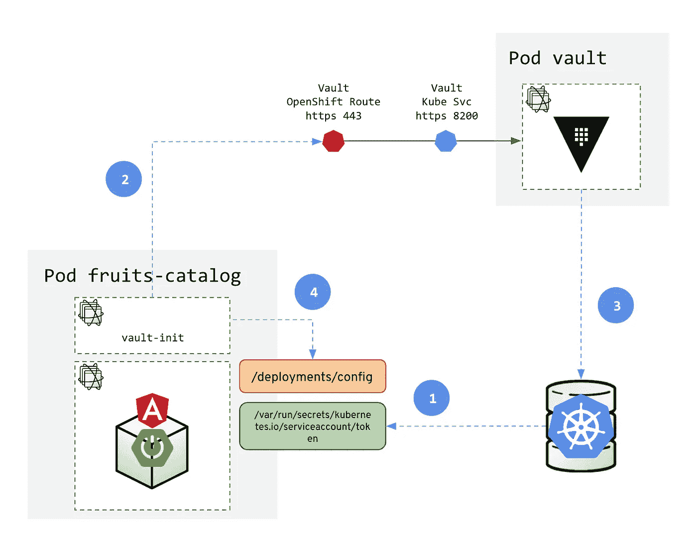
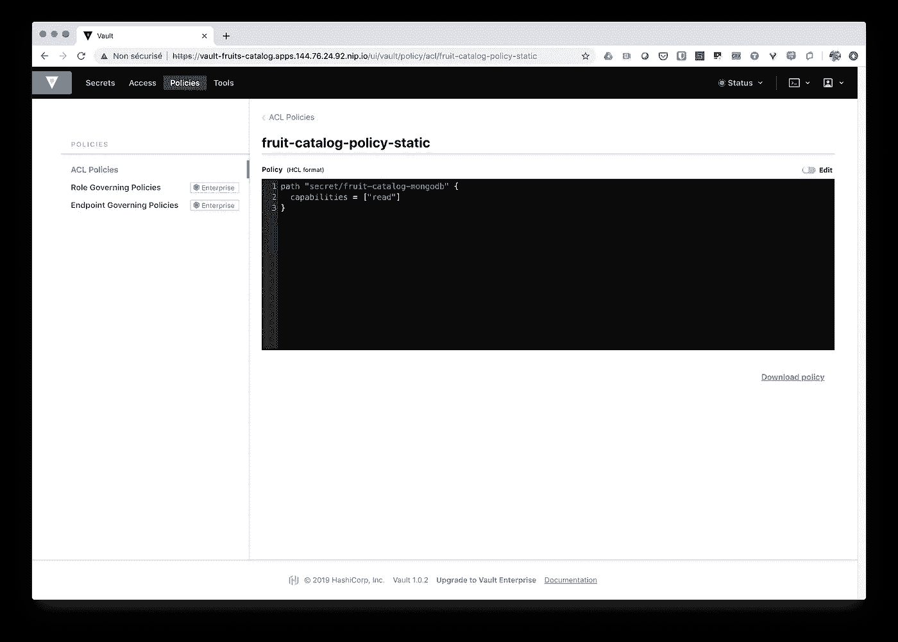

# 在 OpenShift 上向您的应用添加安全层—第 3 部分:使用 Vault 进行秘密管理

> 原文：<https://itnext.io/adding-security-layers-to-your-app-on-openshift-part-3-secret-management-with-vault-8efd4ec29ec4?source=collection_archive---------5----------------------->

今天，保护你的应用程序是必须的，但是如果你没有在一开始就考虑它，那么在不修改代码的情况下引入它是很困难的。幸运的是，像 [Kubernetes](http://kubernetes.io) 这样的容器和平台带来的新的云原生模式提供了简单的方法来解决安全问题，而无需接触代码。

谈到安全，人们大多会想到两个话题:信息和通信管理。他们自然不会想到机密管理部分——通常会最大程度地减少敏感数据向组织中不同应用程序和人员的蔓延或泄露。他们倾向于认为秘密管理不是一个问题；然而，他们远不知道如何有效地创建、存储、更新和撤销它们。

接下来的两个部分是关于增强我们传统的在应用程序中管理秘密的方式。我们将了解如何配置我们的应用程序部署，以使用外部秘密管理解决方案，如 [Hashicorp Vault](http://vaultproject.io) 。


第 3 部分—添加用于秘密管理的保险库

*这篇文章是一个更大的系列文章的一部分，讲述如何给现有的应用程序增加安全层。目前公布的其他部分有:*

*   [*第 1 部分—部署和 TLS 入口*](https://medium.com/@lbroudoux/adding-security-layers-to-your-app-on-openshift-part-1-deployment-and-tls-ingress-9ef752835599)
*   [*第二部分——使用 Keycloak*](https://medium.com/@lbroudoux/adding-security-layers-to-your-app-on-openshift-part-2-8320018bcdd1) 进行认证和授权
*   *第三部分——金库的秘密管理(本帖)*
*   [*第 4 部分——带保险库的动态秘密*](https://medium.com/@lbroudoux/adding-security-layers-to-your-app-on-openshift-part-4-dynamic-secrets-with-vault-b5fe1fc7709b)
*   [*第 5 部分—与 Istio 的相互 TLS*](https://medium.com/@lbroudoux/adding-security-layers-to-your-app-on-openshift-part-5-mutual-tls-with-istio-a8800c2e4df4)
*   [*第 6 部分— PKI 即服务，带保险库和证书管理器*](https://medium.com/@lbroudoux/adding-security-layers-to-your-app-on-openshift-part-6-pki-as-a-service-with-vault-and-cert-e6dbbe7028c7)

# 我们想在这部分实现什么？

Hashicorp Vault 是用于保护敏感数据和管理机密的开源解决方案。在组织中使用 Vault 可以有多种用途。它可以用于:将应用程序机密存储到密钥/值存储、API 密钥或基础设施令牌以及 AWS IAM 凭证、数据库凭证等凭证中……它还可以用作 [PKI](https://en.wikipedia.org/wiki/Public_key_infrastructure) 即服务。

在这一部分中，我们将看到如何使用 Vault 来存储秘密，比如我们之前在连接 MongoDB 的`fruits-catalog`应用程序中使用的凭证。虽然 Kubernetes 提供了秘密管理功能，但社区倾向于认为 Vault 是一个增强的解决方案，因为它提供了:

*   在 Kubernetes 集群和传统应用程序之间管理秘密的中心位置，
*   更好的加密选项和认证选项来访问秘密。

Vault 提供了许多集成方法——从 API 到 CLI，使用另一种哈希公司的技术[Consul Template](https://github.com/hashicorp/consul-template)——以及许多身份验证方法。

在本文中，我们将使用它的 API 将 Vault 集成到我们的架构中。然而，我们将通过使用 Kubernetes 身份验证方法来验证我们的 API 调用，从而以适当的方式做到这一点。因此，我们将在我们的容器平台上部署 Vault，并使它们集成应用程序启动流程，如下所述:



这一部分的目标是转变我们的架构，以便我们获得相关要点:

1.  我们将获得一个由 Kubernetes 颁发的特定令牌——以及相关的证书——在启动时注入到我们的应用程序 Pod 中，
2.  从一个名为`vault-init`的 [Init 容器](https://kubernetes.io/docs/concepts/workloads/pods/init-containers/)中，也运行在我们的 Pod 中，我们将使用这个特定的令牌对 Vault 进行身份验证调用，
3.  Vault 将能够根据 Kubernetes APIs 检查这个调用的有效性。如果成功，Vault 将允许应用程序访问存储在 Vault 中的机密，
4.  最后，从 Vault 中检索到的秘密将通过一个共享文件系统提供给我们的主 Spring Boot 容器:一个配置文件将在`/deployment/config`上创建，这样在这个文件中找到的值将覆盖来自部署配置的值。

轻松点。？好吧，让我们看看如何实现这一点…

# 如何应用？

如果您已经阅读了本系列的第一部分，那么您可能已经克隆了包含所有资源和资产的 [my GitHub repository](https://github.com/lbroudoux/secured-fruits-catalog-k8s) 。如果没有，我敦促你这样做；-)从笔记本电脑上的克隆中，切换到`master`分支。

转换的第一步是在我们的 Kubernetes/ OpenShift 项目中部署一个 Vault 实例。我们将使用存储库的`/k8s`文件夹中的资源来完成这项工作。

```
# First allow anyuid for vault container
$ oc adm policy add-scc-to-user anyuid -z vault-sa -n fruits-catalog$ oc apply -f k8s/vault-deployment.yml -n fruits-catalog
serviceaccount "vault-sa" created
configmap "vault-config" created
persistentvolumeclaim "vault-file-backend" created
deployment "vault" created
service "vault" created$ oc create route passthrough vault --port=8200 --service=vault -n fruits-catalog
route "vault" created
```

几分钟后，一个新的`vault`分离舱将会启动并运行。出于演示目的，我们使用一个简单的 Vault 文件后端。一个更加复杂的生产就绪的设置将引入[consult](https://www.consul.io/)作为后端。

现在我们有了一个到保险库的路由，我们必须用它来初始化保险库。初始化为我们提供了一个解封密钥和一个 root 登录，我们可以用它来使我们的应用程序可以使用这个保险库。为此，您需要从[这里](https://www.vaultproject.io/downloads.html)下载的`vault` CLI 工具。

```
$ export VAULT_ADDR=https://`oc get route -n fruits-catalog | grep -m1 vault | awk '{print $2}'`$ vault operator init -tls-skip-verify -key-shares=1 -key-threshold=1Unseal Key 1: R4gbzVocDqIVgKbnW4dbVUWy64uOoOjYCmTeGlpTAoM=Initial Root Token: s.7JTtKLlFzOwfJ7xdbX6qhNpxVault initialized with 1 key shares and a key threshold of 1\. Please securely distribute the key shares printed above. When the Vault is re-sealed, restarted, or stopped, you must supply at least 1 of these keys to unseal it before it can start servicing requests.Vault does not store the generated master key. Without at least 1 key to reconstruct the master key, Vault will remain permanently sealed!It is possible to generate new unseal keys, provided you have a quorum of existing unseal keys shares. See "vault operator rekey" for more information.$ vault operator unseal -tls-skip-verify R4gbzVocDqIVgKbnW4dbVUWy64uOoOjYCmTeGlpTAoM= Key             Value
---             -----
Seal Type       shamir
Initialized     true
Sealed          false
Total Shares    1
Threshold       1
Version         1.0.2
Cluster Name    vault-cluster-5f2dcac0
Cluster ID      2faea050-2fb7-fbfc-a9be-980e185d7344
HA Enabled      false$ vault login -tls-skip-verify s.7JTtKLlFzOwfJ7xdbX6qhNpxSuccess! You are now authenticated. The token information displayed below is already stored in the token helper. You do NOT need to run "vault login" again. Future Vault requests will automatically use this token.Key                  Value
---                  -----
token                s.7JTtKLlFzOwfJ7xdbX6qhNpx
token_accessor       rEstTDjmcS4404EC0onzeLwT
token_duration       ∞
token_renewable      false
token_policies       ["root"]
identity_policies    []
policies             ["root"]
```

保险库现在准备接收新的秘密。默认的`secret`后端仅在开发模式下可用，我们需要启用它。然后，您可以开始将 MongoDB 秘密放入新的密钥中。可以使用路径或树形组织来指定保险库密码，这里我们创建的是`secret/fruit-catalog-mongodb`密码:

```
$ vault secrets enable -tls-skip-verify -version=1 -path=secret/ kv
Success! Enabled the kv secrets engine at: secret/$ vault kv put -tls-skip-verify secret/fruit-catalog-mongodb user=$(oc get secret/mongodb -o jsonpath="{.data.database-user}" | base64 -D)$ vault kv put -tls-skip-verify secret/fruit-catalog-mongodb password=$(oc get secret/mongodb -o jsonpath="{.data.database-password}" | base64 -D)
```

你可以通过再读一遍这个秘密来检查所有的东西是否到位。

```
$ vault kv get -tls-skip-verify secret/fruit-catalog-mongodb
====== Data ======
Key         Value
---         -----
password    wwsPHR4gDorXgQ2a
user        userEVY
```

现在在 OpenShift 端，我们将创建一个新的`ServiceAccount`，它将负责执行`fruits-catalog` pod。对于这个服务帐户，我们必须添加使用 Kubernetes 进行身份验证的能力。这意味着我们应该应用`system:auth-delegator`集群角色。

```
$ oc create sa fruits-catalog-vault -n fruits-catalog
$ oc adm policy add-cluster-role-to-user system:auth-delegator -z fruits-catalog-vault -n fruits-catalog
```

我们把所有重要的部分都准备好了！现在，我们必须检索服务帐户的不同部分，以便在 vault 上配置 Kubernetes 身份验证方法:

```
$ export SA_TOKEN=$(oc get sa/fruits-catalog-vault -o yaml | grep fruits-catalog-vault-token | awk '{print $3}')$ export SA_JWT_TOKEN=$(oc get secret $SA_TOKEN -o jsonpath="{.data.token}" | base64 --decode; echo)
$ export SA_CA_CRT=$(oc get secret $SA_TOKEN -o jsonpath="{.data['ca\.crt']}" | base64 --decode; echo)$ vault auth enable -tls-skip-verify kubernetes
Success! Enabled kubernetes auth method at: kubernetes/$ vault write -tls-skip-verify auth/kubernetes/config \
  token_reviewer_jwt="$SA_JWT_TOKEN" \
  kubernetes_host="$(oc whoami --show-server)" \
  kubernetes_ca_cert="$SA_CA_CRT"
Success! Data written to: auth/kubernetes/config
```

我们还需要在 Vault 中创建一个策略，允许读取包含我们的 MongoDB 凭证的秘密。现在，我们以管理员身份登录，但我们的服务帐户并非如此。然后，这个策略需要关联到服务帐户和 Kubernetes 名称空间。这就是以下两个命令的意义所在:

```
$ vault policy write -tls-skip-verify fruit-catalog-policy-static ./k8s/fruit-catalog-policy-static.hcl
Success! Uploaded policy: fruit-catalog-policy-static$ vault write -tls-skip-verify auth/kubernetes/role/fruits-catalog \
  bound_service_account_names=fruits-catalog-vault \
  bound_service_account_namespaces=fruits-catalog \
  policies=fruit-catalog-policy-static \
  ttl=24h
Success! Data written to: auth/kubernetes/role/fruits-catalog
```

最后，只需用包含`vault-init` Init 容器的新容器替换 OpenShift 中现有的`Deployment`。我们一会儿会谈到这个容器的确切作用。只是不要忘记在那之前用你的值替换我的值，使用一些垃圾的`sed`命令；-)

```
$ export VAULT_ROUTE=$(oc get route/vault -n fruits-catalog | grep vault | awk '{print $2}')
$ export KEYCLOAK_ROUTE=$(oc get route/keycloak -n fruits-catalog | grep keycloak | awk '{print $2}')$ sed -i '' 's=vault-fruits-catalog.apps.144.76.24.92.nip.io='"$VAULT_ROUTE"'=' k8s/fruits-catalog-static-secret-deployment.yml
$ sed -i '' 's=keycloak-fruits-catalog.apps.144.76.24.92.nip.io='"$KEYCLOAK_ROUTE"'=' k8s/fruits-catalog-static-secret-deployment.yml$ oc replace -f k8s/fruits-catalog-static-secret-deployment.yml
```

> 我们在这里配置部署的方式很难理解——一切都是“手动”进行的。虽然检查以了解细节很有趣，但现在有一种更简单的方法可以做到这一点。我使用新的 Vault Agent Injector 发布了对那个的[更新。](https://medium.com/@lbroudoux/adding-security-layers-to-your-app-on-openshift-update-welcome-vault-agent-injector-46cab161c366)

# 检查它是否按预期工作

当然，您可以使用`fruits-catalog`路线的 URL 打开一个浏览器窗口，并检查应用程序是否按预期运行——即。您可以查看您之前创建的成果。但是，对配置的某些部分进行检查和/或故障排除会很有用。

首先，我们可以验证是否能够回读我们之前存储在保险库中的秘密值:

```
$ vault read secret/fruit-catalog-mongodb
Key                 Value
---                 -----
refresh_interval    168h
password            wwsPHR4gDorXgQ2a
user                userEVY
```

一旦使用设置期间提供的初始根令牌登录，我们还应该能够通过 Vault UI 检查一切是否就绪。



还记得在架构演示中，我们谈到了`vault-init` Init 容器吗？你可能想看看我们之前申请的`[Deployment](https://github.com/lbroudoux/secured-fruits-catalog-k8s/blob/master/k8s/fruits-catalog-static-secret-deployment.yml)`。你会看到这个容器使用了一个极简的[Red Hat Universal Base Image](https://www.redhat.com/en/blog/introducing-red-hat-universal-base-image)，它刚刚用 [jq](https://stedolan.github.io/jq/) 工具进行了增强。你可以在我的一个 GitHubrepo 上找到这个图像定义。

最后，查看并尝试在主容器上重放这个 Init 容器正在做什么可能是有用的。因此，您可以使用 SSH 通过以下命令登录到容器:

```
$ oc rsh -c spring-boot $(oc get pods | grep fruits-catalog | grep Running | awk '{print $1}')
```

然后尝试`vault-init`容器发出的不同命令，使用服务帐户令牌连接到 Vault，检索 Vault 令牌，查询`secret/fruit-catalog-mongodb`机密，然后使其可用于应用程序:

```
OCP_TOKEN=$(cat /var/run/secrets/kubernetes.io/serviceaccount/token);curl -k --request POST --data '{"jwt": "'"$OCP_TOKEN"'", "role": "fruits-catalog"}' https://vault-fruits-catalog.apps.x.x.x.x.nip.io/v1/auth/kubernetes/login | jq -j '.auth.client_token' > /etc/vault/token;X_VAULT_TOKEN=$(cat /etc/vault/token);curl -k --header "X-Vault-Token: $X_VAULT_TOKEN" https://vault-fruits-catalog.apps.x.x.x.x.nip.io/v1/secret/fruit-catalog-mongodb > /etc/app/creds.json;echo "spring.data.mongodb.uri=mongodb://$(jq -j '.data.user' /etc/app/creds.json):$(jq -j '.data.password' /etc/app/creds.json)@mongodb/sampledb" > /etc/app/application.properties;cp /etc/app/application.properties /deployments/config/application.properties
```

# 结论和下一步

在第三部分中，我们看到了如何使用云原生模式(如 Init 容器、Kubernetes 服务帐户认证和容器间的卷共享)来集成外部系统(如 Hashicorp Vault)。此外，这种集成是在不修改应用程序源代码的情况下完成的。

在考虑保护您的应用程序时，秘密管理应该是一个真正的问题。凭证泄漏和传播肯定会导致安全问题和数据泄漏，但它肯定会带来关于治理策略实施的不确定性，以及当人们想要更新或撤销访问规则时的恐惧。

我们已经看到，Vault 是一个强大的工具，可以集中管理敏感数据。它还可以很容易地部署到 Kubernetes / OpenShift 上，并为验证部署在平台上的应用程序提供本地集成。我们已经看到，Vault 可以用于数据库凭据，但同样的机制也可以应用于任何敏感数据。

在本系列的下一部分中，我们将了解 Vault 与一些数据库技术(如 MongoDB)的高级集成，并了解如何使用它来动态生成我们的凭证。